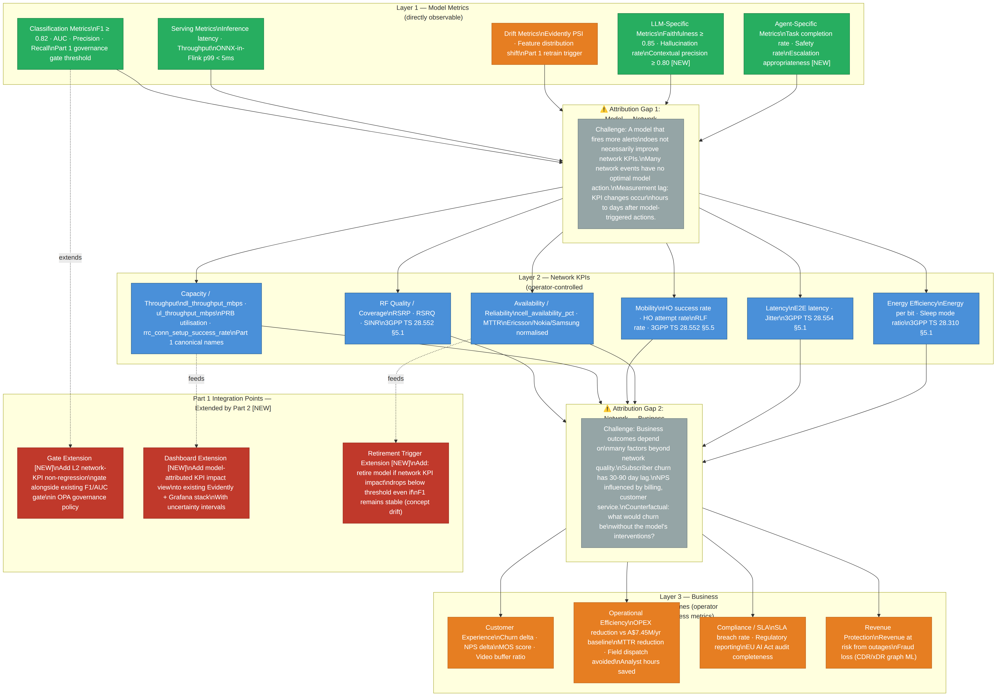
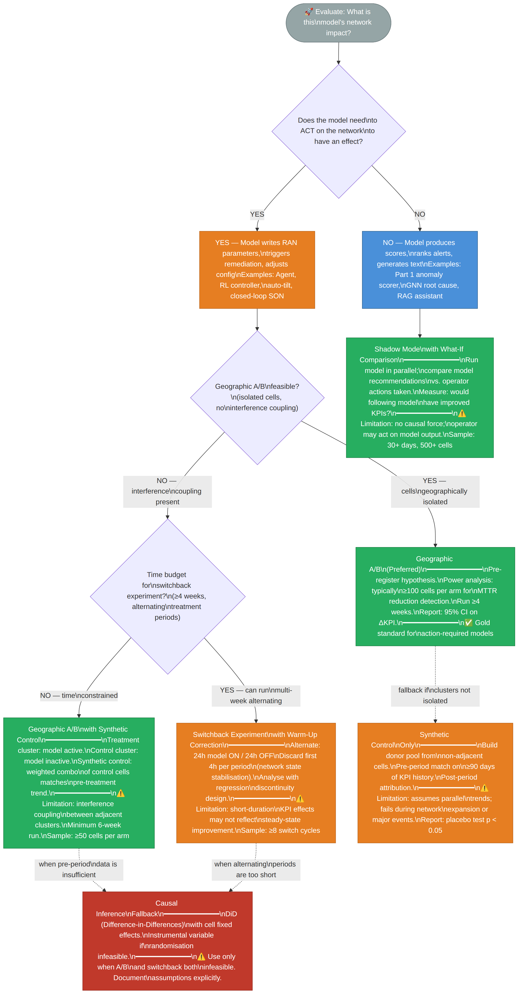
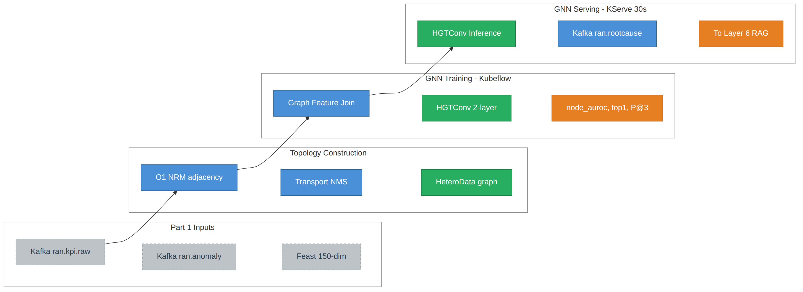
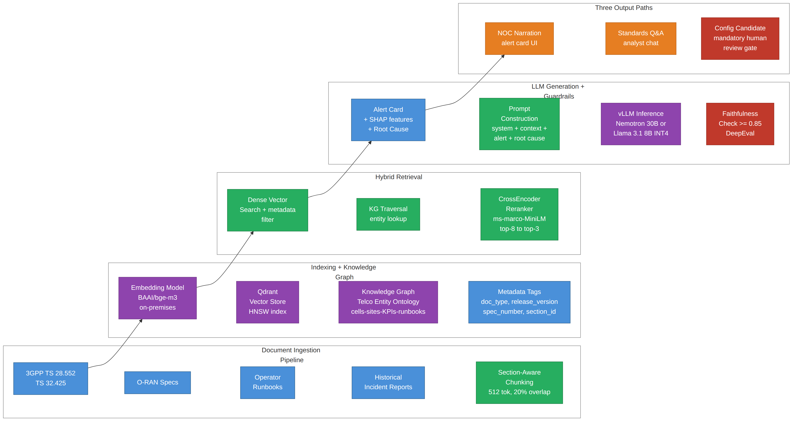
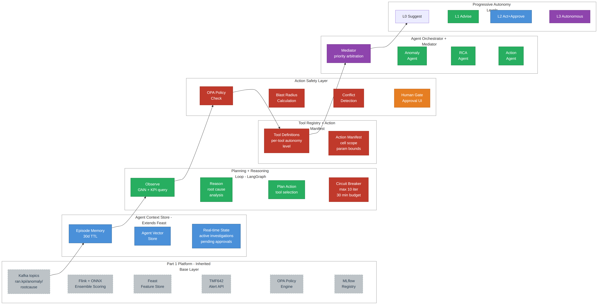
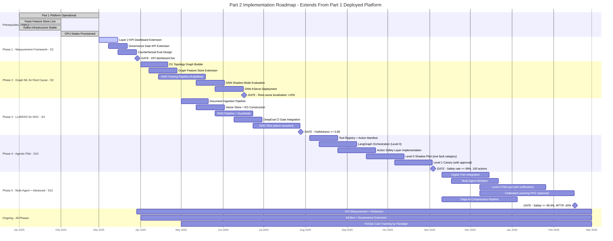

# Telco MLOps Reference Architecture — Part 2: Extending the Architecture to Graph ML, LLMs, Agentic Systems, and Beyond

**Author:** Chirag Shinde — chirag.m.shinde@gmail.com

---

## Executive Summary

Part 1 [1] and the RAN paper [1a] established a production ML architecture for RAN operations and demonstrated its value: approximately A$5.21M/year in false alarm investigation savings at a 10,000-cell operator, paying back its A$173K/year operating cost within months of deployment. That architecture — and the operational trust it earns — is the foundation for three questions operators are now ready to answer: Which upstream node caused five cells to degrade simultaneously? What does this anomaly mean in plain English for the on-call engineer? And can the system initiate the first remediation step while a human reviews?

Part 2 (this paper) adds four capabilities above Part 1's detection output: spatial root cause attribution (a graph neural network that identifies the upstream failure node rather than listing degraded cells), contextual narration (a retrieval-augmented LLM that translates machine outputs into operator-readable runbook guidance), autonomous remediation (an agentic orchestrator with explicit human approval gates for all network-state-modifying actions), and pre-flight action validation (a digital twin that tests proposed fixes before they touch the live network). These four capabilities are integrated as additive layers above Part 1's existing Kafka, Flink, Feast, MLflow, and OPA infrastructure — nothing is replaced.

The foundational contribution of this paper — applicable immediately, before any new model is deployed — is a three-tier network performance measurement framework connecting model metrics to network KPIs to business outcomes. This framework extends Part 1's model-centric evaluation into a full operational impact methodology, and it is the deployment gate through which every new capability in this paper must pass. It can be implemented in two weeks and immediately improves the rigour of Part 1's operational impact reporting.

No operator has deployed fully autonomous closed-loop RAN remediation in production. The Omdia 2024 survey of 61 operators places most at TM Forum Level 2, transitioning to Level 3. This paper positions agentic systems as a disciplined progression toward autonomy, not a shortcut to it. Section 16 provides a phased 18-month implementation roadmap with explicit promotion gates at each phase boundary, including a GNN label bootstrapping protocol that delivers value at every stage of the multi-year evaluation data accumulation.

---

## 1. Business Case: Why a Multi-Paradigm ML Architecture

### From Detection to Resolution: Extending the Architecture's Value

As established in the RAN paper §1, a 10,000-cell operator running static threshold alerting spends approximately A$7.45M/year on false alarm investigation, and the RAN paper's anomaly detection architecture recovers approximately A$5.21M/year of that cost at a 70% false alarm reduction rate. That saving is well-documented and the arithmetic is reproduced in full in the RAN paper's sensitivity table.

Detection starts the clock; resolution stops it. A confirmed RAN anomaly initiates three downstream activities, each with measurable cost: root cause analysis (identifying which network element caused the degradation), operational interpretation (translating the technical finding into an action a shift engineer can execute), and remediation (either dispatching a field team or reconfiguring network parameters). These three activities account for the majority of the Mean Time to Repair (MTTR) clock — not the detection step that Part 1 addresses. Part 2 extends the architecture's value into these post-detection stages.

The following estimates extend Part 1's cost model — stated assumptions, worked arithmetic, sensitivity ranges — to three post-detection activities that Part 2 brings into scope. All figures are in AUD (A$1 ≈ US$0.65 per the convention established in the RAN paper §1).

---

**Business case at a glance.** The detailed breakdowns follow in subsequent subsections. This summary provides the headline numbers for readers deciding whether to read further.

**At 10,000 cells (single metro or mid-size national operator):**

| | Conservative | Midpoint | Optimistic |
|---|---|---|---|
| RAN paper detection savings | A$3.7M | A$5.2M | A$6.8M |
| Part 2 — GNN root cause attribution | A$68K | A$204K | A$544K |
| Part 2 — LLM narration | A$93K | A$233K | A$466K |
| Part 2 — agentic dispatch avoidance | A$270K | A$675K | A$1,350K |
| **Combined internal efficiency** | **A$4.1M** | **A$6.3M** | **A$9.2M** |
| *External exposure avoidance (risk-dependent, see §2 worked examples)* | | | |
| Enterprise SLA penalty avoidance | A$7K | A$14K | A$29K |
| Wholesale rebate reduction | A$36K | A$90K | A$144K |
| **Combined incl. external exposure** | **A$4.2M** | **A$6.4M** | **A$9.3M** |

> *Scenario assumptions:* Conservative = 50 incidents/month, 40% RCA time reduction, 40% automation rate, 50% false alarm reduction. Midpoint = 100 incidents/month, 60% RCA reduction, 50% automation, 70% false alarm reduction. Optimistic = 200+ incidents/month, 80% RCA reduction, higher automation rate, 80% false alarm reduction. See §2 for the full derivation of each cell. Enterprise SLA avoidance assumes one affected contract per incident — operators with denser enterprise coverage (multiple SLA contracts per cell cluster) should multiply by their average affected-contracts-per-incident (see §2 scaling methodology). Wholesale rebate avoidance assumes the same breach-avoidance fraction as enterprise SLAs (60% at midpoint). Subscriber churn impact and regulatory fine exposure are excluded — they are real but not attributable to a single architecture capability.

**What it costs to operate:**

- Part 1 + RAN pipeline: A$173K/year (unchanged from RAN paper §9)
- Part 2 incremental (base, single-instance): A$57K/year
- Part 2 incremental (production-grade with HA and headroom): A$171K/year
- Combined production-grade: A$344K/year — a **cost-to-benefit** ratio of approximately **1:18** at midpoint on internal efficiency alone, or **1:19** including external exposure avoidance

**What it costs when things go wrong (not captured in the efficiency figures above):**

- *Subscriber churn:* a 1-percentage-point increase in monthly churn at 5M subscribers / A$45 ARPU = **A$2.7M/month** in lost recurring revenue.
- *Regulatory fines:* ACCC penalties of **A$15M–A$18M** per enforcement action; Ofcom right-to-exit clauses permitting contract termination without penalty; EU EECC Article 102 creating contractual baselines for QoS enforcement.
- *Enterprise SLA penalties:* a single multi-cell backhaul failure breaching 12 enterprise SLAs at A$8K MRC and 15% rebate costs A$14.4K per incident. At 20 such incidents/year, exposure is **A$288K/year**.
- *Wholesale rebates:* NBN wholesale fault rectification rebates are A$20/service/business day for the first five days, A$30/day thereafter (capped at A$1,150/service). A backhaul failure affecting 100 wholesale services for 3 business days costs A$6K–9K per incident. At 20 such incidents/year, exposure is **A$120K–A$180K/year**.

**At 100,000 cells (large national operator or multi-country group):**

Internal efficiency benefits scale approximately linearly with cell count (more cells = more incidents = more analyst time saved, more dispatches avoided):

| | Conservative | Midpoint | Optimistic |
|---|---|---|---|
| RAN paper detection savings | A$37M | A$52M | A$68M |
| Part 2 — GNN root cause attribution | A$0.7M | A$2.0M | A$5.4M |
| Part 2 — LLM narration | A$0.9M | A$2.3M | A$4.7M |
| Part 2 — agentic dispatch avoidance | A$2.7M | A$6.8M | A$13.5M |
| **Combined internal efficiency** | **A$41M** | **A$63M** | **A$92M** |
| *External exposure avoidance (risk-dependent)* | | | |
| Enterprise SLA penalty avoidance | A$0.7M | A$1.7M | A$2.4M |
| Wholesale rebate reduction | A$0.4M | A$0.5M | A$0.7M |
| **Combined incl. external exposure** | **A$42M** | **A$65M** | **A$95M** |

> *Scaling notes:* Internal efficiency figures are approximately 10× the 10K-cell estimates. **However, cost scaling is sub-linear:** the multi-paradigm platform infrastructure scales at approximately 2–3× for 10× the cells (see infrastructure cost line below), not 10×. This means the realistic cost-to-benefit ratio at 100K cells is approximately 1:80–1:130 at midpoint when accounting for infrastructure sub-linearity, substantially better than a naïve 10× extrapolation of the 10K-cell ratio. External exposure scales super-linearly — a 100K-cell operator has more enterprise contracts per failure (5,000 vs 500), higher-MRC portfolios, and backhaul failures that affect 500–2,000 wholesale services simultaneously (vs 100 at 10K cells). Enterprise SLA avoidance assumes 10× the contract density at the same breach-avoidance fraction (60% at midpoint). Wholesale avoidance derived from A$30K–45K per incident × 20 incidents × 60% avoidance.

**What it costs to operate at 100K cells:**

- Infrastructure cost: A$500K–800K/year (scales sub-linearly — Kafka/Flink clusters and GPU nodes serve 100K cells with 2–3× the 10K infrastructure, not 10×)
- **Cost-to-benefit** ratio: approximately **1:80** or better at midpoint

**What it costs when things go wrong (100K-cell scale):**

- *Subscriber churn:* a 100K-cell operator typically serves 20–50M subscribers. At A$45 ARPU, a 1-percentage-point increase in monthly churn = **A$9M–A$22.5M/month** in lost recurring revenue. The architecture removes one of the contributing factors.
- *Regulatory exposure:* per-enforcement-action, not per-cell — but larger operators face higher scrutiny. ACCC penalties of **A$15M–A$18M** per enforcement action; Ofcom right-to-exit clauses across a larger subscriber base; EU EECC Article 102 across all markets served.

> The next section derives these numbers with stated assumptions, worked arithmetic, and sensitivity ranges.

---

**This Paper is For:** ML platform engineers, RAN data scientists, NOC automation leads, and CTOs at mobile operators who have deployed — or are actively deploying — the Part 1 tabular and time-series anomaly detection architecture, and need to extend it to graph-native, generative, and agentic workloads without rebuilding from scratch

**Tags:** `NET_ASSURANCE` | `NET_RAN` | `OPEN_RAN` | `OSS_BSS` | `CX_CARE` | `GRAPH_ML` | `RAG` | `AGENTS` | `LLM_EVAL` | `STREAMING` | `EDGE` | `SIMULATION` | `MLOPS` | `GOVERNANCE_PRIVACY` | `FINOPS` | `REFERENCE_ARCH` | `IMPLEMENTATION`

**Prior paper:** [Telco MLOps Reference Architecture — Part 1](https://github.com/cs-cmyk/telco-mlops-reference-arch/blob/main/whitepaper.md)

---

## 2. Business Case — Worked Estimates and Sensitivity Analysis

### Incremental Value by Capability

**Graph ML root cause analysis — MTTR reduction.**

After a confirmed anomaly alert, a NOC analyst must determine whether the degraded cell is the root cause of the fault or a symptom of an upstream failure. When three to eight cells degrade simultaneously because they share a backhaul router, a co-located baseband unit, or a common interference source, NOC analysts must manually correlate per-cell alarm histories, topology maps, and change logs to find the shared cause. At a Tier-1 operator, this root cause analysis step accounts for an estimated 15–25 minutes of MTTR per correlated multi-cell incident.

*Incident volume assumption.* The critical input to this estimate is the monthly rate of confirmed multi-cell correlated incidents at a 10,000-cell operator. No standardised industry benchmark for this specific metric exists. Published operator data points span a wide range:

- **Digital Nasional Berhad** (Ericsson case study, 2024): 500% alarm count reduction through AI-based auto-analysis and correlation, implying roughly 50–150 multi-cell correlated incidents per month at 10,000-cell scale after Part 1's alert aggregation.
- **TM Forum Autonomous Networks Benchmark Report** (2023): median of 8–15 major incidents per 1,000 cells per month for Tier-1 operators with mature alarm management — yielding 80–150 at 10,000-cell scale.

Operators with less mature alarm management or higher-density urban deployments will see higher rates; operators in stable suburban/rural networks will see lower. This paper uses a range of **50–300 multi-cell correlated incidents per month** depending on network maturity, geographic density, and alarm management sophistication, with **100 incidents/month as the midpoint** for a Tier-1 operator with Part 1 operational.

*Estimate (derived):* At the midpoint assumption of 100 confirmed multi-cell incidents per month, 20 minutes of manual root cause analysis per incident, and a fully loaded analyst rate of A$85/hour (consistent with Analysys Mason's 2023 NOC staffing benchmarks for Australian Tier-1 operators):

> 100 incidents/month × 12 months × 20 min × (A$85/hr ÷ 60 min) ≈ **A$340,000/year** (manual RCA cost)

A Graph Attention Network layer that attributes root cause spatially — identifying the upstream node rather than listing the symptom cells — can reduce this analysis time to under 5 minutes for well-characterised fault patterns. The 60% RCA time reduction assumption is derived from two data points: DOCOMO's production deployment achieved 15-second failure isolation for characterised fault types (representing a near-100% reduction for the subset of faults with clean graph signatures), and BiAn's 357-incident evaluation showed a 20.5% reduction in time to root-causing across all incident types (55.2% for high-risk incidents). A 60% reduction on the correlated-fault subset (which by definition has spatial structure the GNN can exploit) is a reasonable interpolation between these bounds, but it applies only to the fraction of correlated incidents that match the GNN's trained fault taxonomy — not to all incidents.

> A$340,000/year × 60% reduction ≈ **A$204,000/year** (midpoint saving)

**Sensitivity table — GNN RCA saving by incident volume and RCA time reduction:**

| Monthly Incidents | Annual Manual RCA Cost | At 40% RCA Reduction | At 60% RCA Reduction | At 80% RCA Reduction |
|---|---|---|---|---|
| 50 (low — mature network, rural) | A$170,000 | A$68,000 | **A$102,000** | A$136,000 |
| 100 (midpoint — Tier-1, Part 1 operational) | A$340,000 | A$136,000 | **A$204,000** | A$272,000 |
| 200 (high — dense urban, immature alarm mgmt) | A$680,000 | A$272,000 | **A$408,000** | A$544,000 |
| 300 (very high — greenfield 5G, high churn topology) | A$1,020,000 | A$408,000 | **A$612,000** | A$816,000 |

The midpoint estimate of **A$204,000/year** is used in the combined business case below. Operators should locate themselves in this table using their own incident volume data — specifically, the count of ServiceNow (or equivalent) tickets per month where the root cause investigation involved correlating degradation across two or more cell sectors sharing infrastructure. The DOCOMO production deployment's 15-second failure isolation latency for characterised fault types represents the capability upper bound; the BiAn 20.5% time-to-root-causing reduction represents a realistic floor for a mixed-maturity fault portfolio (noting that BiAn's results reflect cloud network infrastructure operations and may not transfer directly to RAN NOC contexts).

> **How to baseline your multi-cell correlated incident count.** Most operators do not have "multi-cell correlated incident" as a formal ticket category. To approximate, query your incident management system for tickets where:
>
> 1. Multiple cell-sector alarm events were linked under a single parent incident.
> 2. The parent incident was closed with a site-level or transport-level root cause designation.
> 3. The incident was not caused by a planned maintenance event.
>
> This query provides a lower bound — it undercounts incidents where the correlation was never identified and separate tickets were closed independently. Operators without parent-child ticket linkage should instrument this practice as part of Phase 2 readiness assessment (§16) before relying on the GNN RCA business case estimate.

**LLM alarm triage narration — analyst productivity.**

LLM narration eliminates the translation step between machine-readable anomaly signals and actionable investigation plans. The RAN paper's alert cards include machine-readable SHAP feature contributions — "DL throughput 47% below peer-group average" — but translating these into an actionable investigation plan still requires engineering judgment. For junior NOC analysts, this translation step adds 8–12 minutes per confirmed alert. A RAG-based narration layer that converts SHAP outputs into plain-English runbook references — "CQI decline pattern consistent with antenna tilt drift; recommended action: schedule physical inspection within 48 hours per Runbook RAN-042" — eliminates this translation step.

*Estimate (derived):* The RAN paper §8's operating point B reduces the NOC queue to approximately 18 total alerts per shift, of which approximately 15 are confirmed real and 3 are false positives. The 10-minute narration saving applies to confirmed alerts — these are the alerts where an analyst must translate SHAP attributions into an investigation plan. False positives benefit from narration (faster dismissal when the narration identifies a pattern consistent with normal diurnal variation), but the saving is smaller (~2 minutes). Using 15 confirmed alerts per shift:

> 15 confirmed alerts/shift × 3 shifts × 365 days × 10 min × (A$85/hr ÷ 60 min) ≈ **A$233,000/year**

| Confirmed alerts/shift | Min saved/alert | Annual saving |
|---|---|---|
| 10 | 8 | A$124K |
| 15 (RAN paper operating point B) | 10 | **A$233K** |
| 15 | 12 | A$279K |
| 20 | 10 | A$310K |

The estimate is sensitive to both the alert volume reaching the analyst and the time saving per alert. Operators should validate the 10-minute assumption by timing analyst workflows during the Phase 3 shadow deployment (§16.3) before committing to this projection.

**Agentic self-healing — field dispatch avoidance.**

A self-healing agent that executes remote parameter corrections — antenna tilt adjustments, handover parameter tuning — for well-characterised fault categories eliminates field dispatch for any fault correctable without physical intervention. Field dispatch at a Tier-1 operator costs approximately A$1,200–A$2,500 per truck roll (travel, labour, and opportunity cost), based on industry benchmarks cited in Analysys Mason's *Network Operations Automation* report (2023).

*Estimate (derived):* If 15% of confirmed anomalies have a software-correctable root cause (conservative; industry estimates consistent with publicly reported results from parameter-based self-healing deployments — Nokia Operations Engine, Ericsson AI/Automation Platform, Amdocs Network Experience Platform — though specific deployment data is proprietary), and a 10,000-cell operator generates approximately 500 confirmed anomaly-to-incident escalations per month, then approximately 75 incidents/month are candidates for remote remediation. At A$1,500/dispatch avoided and a conservative 50% automation rate for in-scope fault categories:

> 75 incidents/month × 50% automation × 12 months × A$1,500 ≈ **A$675,000/year**

**SLA penalty avoidance, regulatory exposure reduction, and churn mitigation.**

The three value categories above quantify internal efficiency gains — analyst time, narration effort, and dispatch costs. They do not capture the external financial exposure that sustained network degradation creates: enterprise SLA penalties, wholesale service-level rebates, regulatory fines for service quality misrepresentation, and subscriber churn from prolonged poor experience. These exposures are directly reduced by faster MTTR, which is exactly what the GNN root cause attribution and agentic remediation layers deliver. Multi-cell correlated failures are the highest-exposure category because they simultaneously affect more subscribers, more enterprise sites, and more wholesale services than single-cell faults — and they are precisely the failure mode the GNN layer is designed to resolve faster.

**Enterprise SLA penalties.** Tier-1 operators typically offer enterprise customers (managed WAN, mobile fleet, dedicated connectivity) availability SLAs of 99.9% or higher, with tiered service credit rebates when the threshold is breached.

*Downtime allowances:*

- 99.9% monthly SLA: approximately 43 minutes of downtime
- 99.95% monthly SLA: approximately 22 minutes

*Common rebate structures:* 5–10% of the monthly recurring charge (MRC) for each 0.1% below the SLA threshold, capped at 100% of MRC for the billing period. Enterprise MRCs range from A$2,000–A$15,000/month depending on service complexity.

*Worked example:* A multi-cell backhaul failure affecting an enterprise campus with a 99.9% SLA and A$10,000/month MRC:

- MTTR exceeds 43 minutes → 10% rebate → **A$1,000**
- MTTR exceeds 2 hours → 30% rebate → **A$3,000**

Every hour of MTTR reduction has direct financial value.

*Worked example — annual SLA penalty avoidance:* A 10,000-cell operator with 500 enterprise managed WAN contracts (average MRC A$8,000). These contracts carry a 4-hour fault repair SLA (standard for managed WAN/MPLS services — distinct from the 99.9% monthly availability SLA above). The current MTTR distribution for multi-cell correlated failures spans 1.5 hours (best case, simple root cause) to 8+ hours (worst case, complex multi-domain fault), with a mean of 3.5 hours. Most multi-cell correlated failures either do not affect cells serving enterprise sites or are resolved within the 4-hour threshold by existing manual NOC processes — the architecture targets the residual. Approximately 20 multi-cell failures per year breach at least one enterprise 4-hour repair SLA, triggering an average 15% MRC rebate per affected contract per breach.

> With the GNN layer reducing mean MTTR from 3.5 hours to 1.5 hours, the distribution shifts such that 12 of those 20 incidents are resolved within the 4-hour repair threshold:
>
> 12 avoided breaches × A$8,000 MRC × 15% average rebate ≈ **A$14,400/year** in avoided enterprise SLA penalties

This assumes one affected enterprise contract per incident on average. Operators with denser enterprise coverage (enterprise sites served by the same cell clusters) will see higher per-incident exposure — multiply by your average affected-contracts-per-multi-cell-incident. This is conservative — it also excludes the reduction in penalty tier for the 8 incidents that still breach, and excludes contract termination risk from repeated breaches (enterprise contracts typically include termination-without-penalty clauses after 3+ SLA breaches in a rolling 12-month period).

**Wholesale service-level rebates.** In regulated wholesale markets — including Australia's NBN wholesale broadband agreement, EU regulated access obligations, and wholesale MVNO arrangements — fault repair timeframe SLAs carry per-service-per-day rebate obligations.

*NBN wholesale framework (example):*

- First 5 business days: A$20 per service per day
- Day 6 onwards: A$30 per service per day
- Cap: A$1,150 per service

*Exposure at scale:* When a multi-cell backhaul failure affects 50–200 wholesale services simultaneously, rebate exposure scales linearly with affected services × outage duration. A 3-day outage affecting 100 services costs A$6K–9K in rebates per incident. At 20 such incidents per year, annual wholesale rebate exposure is approximately **A$120K–A$180K** for a 10,000-cell operator.

The architecture's ability to attribute root cause to the shared upstream node — rather than investigating 200 individual service degradation reports sequentially — directly compresses the repair timeframe.

**Regulatory fines and service quality enforcement.** Regulators increasingly enforce service quality representations with material penalties.

*Australia (ACCC):* A$15M in penalties against Telstra (November 2022) and a further A$18M (October 2025) for misleading broadband speed representations — penalties arising not from deliberate misconduct but from failure to detect and communicate service quality changes to affected subscribers.

*UK (Ofcom):* The Voluntary Codes of Practice on Broadband Speeds (revised 2022) require signatories to provide minimum guaranteed speeds at point of sale and grant subscribers the right to exit contracts without penalty if speeds consistently fall below the guarantee — a direct revenue exposure for operators who cannot detect and remediate sustained degradation before subscribers invoke the exit right.

*EU (EECC):* Article 102 requires operators to include QoS parameters in contract summaries, creating a contractual baseline against which sustained degradation can be measured.

These regulatory frameworks create a financial incentive structure where the cost of *not detecting* sustained degradation is measured in regulatory penalties, forced contract exits, and remediation payments. The architecture compresses the interval between onset and resolution: the GNN layer identifies the upstream cause, the LLM layer generates the remediation guidance, and the agentic layer can initiate the fix — all within minutes rather than the hours or days that manual investigation requires.

**Subscriber churn from sustained degradation.** Prolonged degradation events — particularly those affecting throughput and latency rather than availability — may not trigger SLA breach notifications but do drive subscriber churn. Industry benchmarks (Analysys Mason, 2023) estimate that a 1-percentage-point increase in monthly churn rate at a Tier-1 operator with 5 million subscribers and A$45/month ARPU represents approximately A$2.7M/month in lost recurring revenue. While the architecture cannot claim a direct churn reduction percentage (churn is driven by many factors beyond network quality), faster detection and remediation of sustained degradation removes one of the contributing factors.

> **Methodology note for operators.** To estimate your own SLA penalty exposure:
>
> 1. Query your enterprise contract management system for contracts with availability SLAs and their MRC values.
> 2. Cross-reference with your incident management system to identify multi-cell correlated failures that breached at least one enterprise SLA in the past 12 months.
> 3. Calculate the total rebate paid or credited.
> 4. Estimate the fraction of those incidents where a 2-hour MTTR reduction (the midpoint GNN benefit) would have avoided the breach.
>
> For wholesale rebates, the same methodology applies using your wholesale agreement's fault repair timeframe SLAs. For regulatory exposure, consult your regulatory affairs team — the relevant framework depends on jurisdiction (ACCC Broadband Speed Claims guidance in Australia, Ofcom Voluntary Codes in the UK, EECC Article 102 in the EU).

### The Cost of Not Extending: Architecture Fragmentation

Building separate platforms for each new capability — a standalone GNN service, a separate LLM deployment, an independent agent runtime — carries a quantifiable cost beyond duplicated infrastructure. Inconsistent governance across platforms creates regulatory exposure: the EU AI Act's Article 9 risk management requirements apply to the overall system, not individual components, and a fragmented architecture makes it structurally impossible to demonstrate end-to-end audit trails for autonomous actions. Duplicated monitoring stacks mean model drift in one paradigm can go undetected while another paradigm's alerts are treated as authoritative. The unified architecture approach in this paper is not a design preference; it is a governance requirement for operators deploying agentic systems in regulated markets.
> **Key takeaway:**
>
> **RAN paper baseline:** approximately A$5.21M/year in false alarm investigation savings.
>
> **Part 2 incremental (internal efficiency):** approximately A$1.11M/year under midpoint assumptions:
> - A$204K — GNN root cause attribution
> - A$233K — LLM narration
> - A$675K — agentic dispatch avoidance
>
> **Part 2 incremental (external exposure reduction):** enterprise SLA penalty avoidance, wholesale rebate reduction, and regulatory risk mitigation. The worked example above estimates A$14.4K/year in avoided enterprise SLA penalties alone, but exposure varies by orders of magnitude depending on enterprise contract portfolio and wholesale obligations.
>
> **Combined benefit summary:**
>
> | Scenario | Assumptions | Internal Efficiency | External Exposure Avoidance | Combined |
> |---|---|---|---|---|
> | Conservative | 50 incidents/month, 40% RCA reduction, 40% automation | **A$4.1M/year** | ~A$43K/year | **A$4.2M/year** |
> | Midpoint | 100 incidents/month, 60% RCA reduction, 50% automation | **A$6.3M/year** | ~A$104K/year | **A$6.4M/year** |
> | Optimistic | 200+ incidents/month, 80% RCA reduction, higher automation | **A$9.2M/year** | ~A$173K/year | **A$9.3M/year** |
>
> The A$6.3M midpoint requires all three layers deployed and performing at stated efficiency targets. Part 2 incremental benefits are contingent on Part 1 being operational. External exposure avoidance (SLA penalties, wholesale rebates) depends on enterprise contract portfolio and wholesale obligations — the figures above assume one affected contract per incident and 20 multi-cell incidents per year (see worked examples above). The sensitivity table above allows operators to locate their specific position in the estimate range.

---


**Topics Covered:**
1. How to extend Part 1's architecture to support Graph ML, LLM/RAG, and agentic workloads as layered additions — not replacements — with a precise architecture delta for each paradigm. The specific technologies used are Kafka, Flink, Feast, and ONNX
2. How to build and govern a three-tier network performance measurement framework that connects model metrics to network KPIs to business outcomes, extending Part 1's model-centric evaluation into a full operational impact methodology
3. How to implement a progressive autonomy framework — from anomaly score to NOC narrative to autonomous remediation — that transfers Part 1's shadow→canary→production deployment discipline to agentic systems

**Companion Code:** [github.com/cs-cmyk/telco-mlops-reference-arch/code](https://github.com/cs-cmyk/telco-mlops-reference-arch/tree/main/code)

> **Reading guide:** Sections 4–12 can be consumed independently by teams adopting specific capabilities. Section 10 (Evaluation), Section 11 (Production Lifecycle), and Section 15 (Limitations) apply cross-cutting assessment criteria to the full stack. Teams beginning a greenfield Part 2 deployment should read Section 16 (Getting Started) before any individual capability section.
>
> **Minimum reading paths by reader role:**
> - *Technical practitioner (network engineer, ML engineer, architect):* §1 (Business Case) → §3 (Measurement Framework) → §4 (Data Requirements) → §5 (Background — including §5.2 for O-RAN rApp/xApp deployment context) → §6 (Proposed Approach) → §7 (System Design) → §8 (Implementation — cherry-pick by interest: §8.1 GNN, §8.2 RAG, §8.4 Edge AI, §8.5 Digital Twin) → §10 (Evaluation) → §16 (Getting Started)
> - *Programme sponsor or technology executive:* §1 (Business Case) → §2 (Worked Estimates) → §5 (Background — skim §5.1 architecture recap and §5.2 O-RAN context; skip §5.3–§5.7 literature survey unless evaluating specific paradigms) → §7 (System Design) → §10.2 (Operational Impact) → §15 (Limitations)
> - *New to this series (not read Part 1):* Start with the Executive Summary, then §1 (Business Case), then the "Relationship to Part 1" section (between §2 and §3) for architecture context, then follow the path for your role above.

---

## Relationship to Part 1

> **Two prior papers are referenced throughout.** "Part 1" refers to the *Telco MLOps Reference Architecture* [1] — the foundational MLOps patterns (streaming ingestion, feature management, model governance, policy enforcement, deployment discipline). "The RAN paper" refers to the companion *Real-Time RAN KPI Anomaly Detection* paper [1a] — the specific per-cell anomaly detection implementation (three-model ensemble, SHAP attribution, DBSCAN peer-group normalisation, TMF642 NOC integration, A$5.21M/year business case). Where the distinction matters, both are cited explicitly; where a reference applies to both (e.g., infrastructure that carries the RAN pipeline), "Part 1" is used as shorthand for the combined body of prior work.

**What Part 1 established.** The foundational MLOps architecture: Kafka/Flink streaming ingestion, Feast feature management, MLflow model governance, OPA policy enforcement, and shadow-to-canary-to-production deployment discipline.

**What the RAN paper instantiated on that architecture.** Per-cell anomaly detection at 10,000-cell scale: Flink feature engineering, ONNX ensemble scoring (IF → RF → LSTM-AE), SHAP attribution, DBSCAN peer-group normalisation, and TMF642 NOC integration.

**What this paper adds.** Part 2 extends that architecture — without replacing it — to four new capability layers (Graph ML, LLM/RAG, agentic orchestration, digital twin) plus deep anomaly detection upgrades, edge AI, optimisation hybrids, and the unified governance and FinOps patterns required when all paradigms share the same infrastructure.

> **Part 2 new contributions at a glance:**
> - **Three-tier measurement framework** (§3): A structured evaluation methodology extending Part 1's model-centric evaluation, covering operational, analytical, and business value tiers.
> - **Extended data requirements and KPIs** (§4): Adds `active_ue_count`, `cell_availability_pct`, and `dl_volume_gb` to the canonical feature set, with 3GPP TS 28.552 references.
> - **Graph ML for spatial root cause attribution** (§7 / §8.1): HGTConv-based heterogeneous GNN (`RootCauseGNN`) operating over a RAN topology graph with `rev_same_site` and `rev_shares_transport` reverse edge types.
> - **LLM/RAG pipeline for NOC intelligence** (§7 / §8.2): BAAI/bge-m3 embeddings, Qdrant vector store, vLLM serving, and `MatchAny`-filtered retrieval with configurable faithfulness evaluation.
> - **Agentic autonomous remediation** (§12): LangGraph-orchestrated agent loop aligned to TM Forum Autonomous Networks L0–L5 autonomy levels, submitting A1 Policies to the near-RT RIC whose xApps interpret policy goals and determine the appropriate O-RAN E2SM-RC procedures.
> - **Edge AI deployment pattern** (§8): INT8-quantised ONNX export of the RAN paper's RF model with a binary F1 ≥ 0.82 (anomaly class) governance gate before promotion.
> - **FinOps and production lifecycle** (§11): Authoritative incremental infrastructure cost of A$56.7K/year, with Figure 15's A$171K figure explicitly reconciled to include capacity headroom and HA redundancy.
> - **Progressive autonomy framework** (§12 / §13): TM Forum Autonomous Networks L0–L5 progression with an implementation-specific loop state machine (DISABLED / SUSPENDED / ENABLED). State names are this paper's implementation-specific terms, not standardised 3GPP values; they adapt SON enable/disable concepts from 3GPP SA5 (TS 28.627/28.628, TS 32.522) — see §5.7 for the full disclaimer.

**Do you need to read Part 1 first?** §1 through §3 of this paper are self-contained. From §4 onward, familiarity with Part 1's core architecture is assumed. Part 1 §1–§6 describe the base architecture this paper builds on.

> **Acronyms and terminology.** All acronyms are expanded on first use in the body text (§1 onwards) and listed alphabetically in the **Appendix: Key Terms and Acronyms** at the end of the paper. Readers entering the paper at a section other than §1 can consult the appendix for any unfamiliar abbreviation. The **Appendix: Notation and Conventions** provides a complete section map (§N → title) and other structural conventions.

---

## 3. Network Performance Measurement

**What Part 1 Established — and What It Makes Possible.**

Part 1 solves a well-defined problem: for each cell sector at each 15-minute reporting interval, it determines whether the observed KPI pattern is anomalous relative to the cell's peer group and its own history. It does this reliably, at scale, with explainable outputs and a principled deployment playbook. That architectural foundation — the Kafka/Flink streaming pipeline, the Feast feature store, the SHAP-attributed anomaly scores, and the MLflow governance discipline — is precisely what makes the following three capabilities practical to build.

**Spatial attribution.** The RAN paper scores each cell independently. When five cells in the same cluster simultaneously show elevated anomaly scores, it correctly raises five alerts. The natural next question: do these degradations share a single upstream cause — a backhaul router, a co-located O-DU, a power feed, or an interference source — or are they independent events? This distinction is the difference between one NOC action and five, between a 15-minute fix and a 90-minute investigation.

DBSCAN peer-group clustering (RAN paper §6) groups cells by behavioural similarity, not by topological connectivity — it correctly captures that these cells are similar, but not that their similarity is caused by shared infrastructure. A graph-structured model operating on the cell adjacency topology, consuming per-cell anomaly scores as node features, is the appropriate technical response.

**Contextual interpretation.** The RAN paper's SHAP outputs are machine-readable feature attributions. "peer_zscore_dl_throughput: −3.4, peer_zscore_avg_cqi: −2.9" is precise and actionable for a senior RF engineer who knows what those z-scores imply for each fault category. For a junior NOC analyst at 3 AM making a triage decision in under two minutes, it is not. Bridging SHAP explanations to runbook recommendations requires either senior engineering judgment or a system that can do it. Large language models, grounded in operator-specific runbooks and 3GPP documentation, are the appropriate technical response — and the RAN paper's structured alert cards provide the input format they need.

**Closed-loop remediation.** The RAN paper's scope was detection and explanation — as RAN paper §10 states: "This system detects and explains anomalies; it does not automatically reconfigure network parameters." That boundary was appropriate for an architecture establishing operational trust. But operators who have run Part 1 for 12–18 months, accumulated SHAP-explained incident histories, and validated the system against their fault taxonomy are now asking: for the well-characterised, low-blast-radius fault categories, can the system take the first remediation step while the analyst reviews the recommendation? Agentic systems with explicit human-in-the-loop gates — built on Part 1's OPA policy engine and audit infrastructure — are the appropriate technical response.

**Building on Part 1's Reference Architecture.**

Part 1 defined the foundational MLOps patterns that any operator needs before deploying ML into network operations: streaming ingestion via Kafka/Flink, centralised feature management via Feast, model governance via MLflow, policy enforcement via OPA, and a shadow-to-canary-to-production deployment discipline.

Per-cell anomaly detection was the first capability instantiated on that architecture — and its successful deployment at 10,000-cell scale validated the architecture's production readiness.

The architecture was designed to carry more than one workload. The same streaming backbone, feature store, model registry, and policy engine that serve tabular anomaly detection can serve graph inference, LLM-grounded narration, agentic orchestration, digital twin simulation, and edge scoring — provided each new paradigm is integrated with the governance and deployment discipline the reference architecture prescribes.

Part 2 extends the reference architecture with five foundational capabilities: graph reasoning over network topology, LLM-grounded operational narration, agentic orchestration with progressive autonomy, digital twin simulation, and edge inference. Each is an architectural building block, not a point solution:

- **Graph reasoning** — the worked example is RAN root cause attribution across shared infrastructure, but the same topology graph and message-passing architecture supports energy optimisation, capacity planning, and transport fault correlation.
- **LLM narration** — the worked example is NOC alarm triage grounded in 3GPP documentation, but the same retrieval and faithfulness infrastructure supports configuration audit, compliance reporting, and vendor interoperability analysis.
- **Agentic orchestration** — the worked example is antenna tilt correction with safety gates, but the same observe-plan-validate-execute loop applies to load balancing, carrier aggregation tuning, and spectrum refarming.

The paper walks through these specific worked examples because a reference architecture earns adoption through concrete, reproducible implementations, not through abstract block diagrams. The architecture generalises across the operator's automation portfolio; the worked examples show how.

Each of these capabilities rests on a specific element of the broader ecosystem.

**Production-grade GNN inference.** PyTorch Geometric (PyG) 2.6's HeteroData and HGTConv layers support heterogeneous graph training on topology graphs with 100K+ nodes, with multiple validated production serving paths (see §7.3 for ONNX limitations and recommended alternatives). The O-RAN Software Community's RAN topology data structures, expressed as O1 managed objects, provide a clean construction source for cell adjacency graphs without requiring additional interfaces.

**Telco-specific LLM evaluation infrastructure.** The TeleQnA benchmark (Maatouk et al., 2024) provides 10,000 Q&A pairs across 3GPP standards, enabling rigorous pre-deployment evaluation of LLM outputs in telco contexts. DeepEval and RAGAS provide production monitoring for faithfulness and contextual precision — extending the PSI drift monitoring that governs Part 1's tabular models with metrics appropriate for generative outputs.

**Standards-grounded autonomy frameworks.** Three standards bodies provide the governance scaffolding that makes progressive autonomy deployable without requiring operators to invent their own safety frameworks.

*3GPP SA5* — TS 28.627 (SON Policy NRM IRP requirements — defines the NRM structure for SON policy management, not a specific loop state machine), TS 28.628 (SON Policy NRM IRP definitions — in some releases combined with TS 28.627), and TS 32.522 (SON management IRP Information Service — specifies function activation and deactivation lifecycle operations, not a named state taxonomy). These collectively establish the enable/disable principles that Part 2's loop state machine builds on. Part 2's DISABLED/SUSPENDED/ENABLED state names are not defined in any single 3GPP specification; they synthesise the activation/deactivation principles from these specifications into an implementation-specific runtime mechanism.

*TM Forum* — The Autonomous Networks white paper series defines the L0–L5 autonomy maturity model. IG1230 provides the AI/ML lifecycle management framework that operationalises it.

*O-RAN WG3* — Specifies conflict mitigation protocols for concurrent xApp actions in O-RAN.WG3.RICARCH-v04.00 (the near-RT RIC Architecture specification).

The scope of Part 2 — including what is in scope (Graph ML, LLM/RAG, agentic systems, digital twins, edge AI, optimisation hybrids) and what is out of scope (UE-level anomaly detection, core network analytics, computer vision) — is defined in the "Part 2 new contributions at a glance" callout in the front matter. This section focuses on the measurement framework applicable to all paradigms within that scope.

---

### 3.1 The Three-Tier Measurement Framework

Effective closed-loop automation depends on a shared, precise definition of what "network performance" means at each stage of the decision stack. This subsection establishes that definition as the single authoritative reference for the remainder of the paper.

> **Naming convention.** The measurement framework uses **Tiers 1–3** (Tier 1: Raw KPI Monitoring, Tier 2: Anomaly Detection, Tier 3: Root Cause Analysis and Action). The pipeline architecture in §6 uses **Layers 1–8** (Layers 1–4: Part 1 pipeline stages, Layers 5–8: Part 2 additions). These are different taxonomies — "Tier" always refers to the §3 measurement framework; "Layer" always refers to the §6 pipeline architecture. To connect them: **Tier 1 (raw KPI monitoring) corresponds to Layers 1–2 of the pipeline; Tier 2 (anomaly detection) corresponds to Layers 3–4; Tier 3 (root cause and action) corresponds to Layers 5–8.** Cross-references between the two are explicit.

Network performance measurement in this architecture is structured as three successive tiers, each consuming the outputs of the tier below and producing artefacts that feed the tier above. The tiers are not organisational boundaries — they are signal-transformation stages, and all three must be operational before any autonomous action loop is enabled.



*Figure 1: Three-Tier Measurement Framework*

**Tier 1 — Raw KPI Monitoring.** The foundation tier ingests PM counter exports from every cell-sector at the configured collection granularity — fifteen-minute intervals for batch paths, sub-minute for streaming paths (§7). Raw counters are normalised into the canonical KPI schema (§4) and written to the feature store. No inference occurs at this tier; its sole responsibility is completeness, timeliness, and schema conformance. Tier 1 health targets: data availability ≥ 99.5% of cell-intervals per day; schema-validation pass rate 100%. Any cell-sector that fails to report for two consecutive intervals is flagged `DATA_ABSENT` and excluded from downstream anomaly scoring until data resumes. This exclusion prevents false anomaly signals from propagating upward through Tiers 2 and 3.

**Tier 2 — Anomaly Detection.** The middle tier applies the three-model ensemble to the feature-engineered KPI vectors produced by `part2_02_feature_engineering.py` and scored by `part2_03_model_training.py` (training) or `part2_05_production_patterns.py` (serving):

- Isolation Forest (weight 0.20)
- Random Forest (weight 0.50)
- LSTM Autoencoder (weight 0.30)

The ensemble computes a composite anomaly score in [0, 1] per cell-sector per interval — `w₁×IF + w₂×RF + w₃×LSTMAE` — and sets a binary alert flag at a configurable threshold (default 0.65). This tier is responsible for surface-level pattern recognition: identifying that something is wrong, and with what statistical confidence, without yet attributing a cause.

> Note: the Heterogeneous Graph Neural Network operates at Tier 3 (§3.3), consuming Tier 2's per-cell scores as node features — it is not a Tier 2 component.

*Tier 2 health metrics:* precision and recall against the held-out labelled fault log (targets in §10), mean detection latency from fault onset to flag, and false-positive rate over rolling 7-day windows.

*Energy efficiency* per 3GPP TS 28.552 energy efficiency measurement definitions (§6.1.1.3 in v18.x; section numbering varies across releases) is included in the Tier 2 KPI taxonomy (§3.2) for operators with sustainability reporting obligations, though it requires operator-specific EE counter mapping not available in the companion synthetic dataset (see §3.2 note). `[SUSTAINABILITY]`

**Tier 3 — Root Cause Analysis and Action.** The top tier receives flagged cell-sector anomalies from Tier 2 and applies two complementary techniques:

- The **GNN-based root cause classifier** attributes the anomaly to one or more causal hypotheses: radio, backhaul, configuration, neighbour interference, or load.
- The **RAG reasoning chain** translates the attribution into operational context.

Candidate remediation actions are evaluated against the counterfactual decision tree (§3.3). If the autonomy gate permits, a parameter change request is dispatched via the rApp/A1 path to the near-RT RIC, which executes the corresponding E2SM-RC procedure toward the O-DU/O-CU.

Subscriber-level impact attribution — connecting cell-sector degradation to affected customer cohorts — also occurs here, bridging the RAN performance domain to the customer experience domain. `[CX_CARE]`

*Tier 3 health metrics:* root cause classification accuracy, mean time to remediation (MTTR) for automated actions, and rollback rate (fraction of automated changes reversed within 30 minutes by the safety supervisor).

The three tiers form a dependency chain: Tier 3 inherits the quality limitations of Tier 2, which inherits those of Tier 1. A failure at Tier 1 degrades every downstream signal. This cascade motivates the data-quality gates in §4 and the shadow-mode discipline described in §11: autonomy is earned through demonstrated performance at every tier, not assumed from deployment day.

### 3.2 KPI Taxonomy

The following table defines the canonical KPIs used throughout this paper. Column names match the feature store schema produced by `part2_01_synthetic_data.py` and consumed by `part2_02_feature_engineering.py`. Where a KPI is derived rather than read directly from a PM counter, the derivation function is noted. The 3GPP counter mappings in the Extension column reflect the primary source counter; operators using vendor-specific counter names should apply the mapping table in §4.2 to align their exports to this schema.

| KPI Name (Column) | Measurement Tier | Domain | Description | 3GPP Source Counter (Extension) |
|---|---|---|---|---|
| `dl_prb_usage_rate` | Tier 1 | Radio | Fraction of downlink Physical Resource Blocks scheduled in the interval, range [0, 1] | `RRU.PrbUsedDl` (NR) / `RRU.PrbAvailDl` |
| `rrc_conn_setup_success_rate` | Tier 1 | Radio | Fraction of RRC connection setup attempts that succeed | `RRC.ConnEstabSucc` / `RRC.ConnEstabAtt` |
| `handover_success_rate` | Tier 1 | Mobility | Fraction of intra-/inter-frequency handover attempts that complete successfully | `HO.ExeSucc` / `HO.ExeAtt` |
| `avg_cqi` | Tier 1 | Radio | Mean Channel Quality Indicator reported by UEs in the interval, range [0, 15] | `L1M.CQI.Avg` (vendor-mapped) |
| `ul_prb_usage_rate` | Tier 1 | Radio | Fraction of uplink PRBs scheduled, range [0, 1] | `RRU.PrbUsedUl` / `RRU.PrbAvailUl` |
| `dl_volume_gb` (5G SA) | Tier 1 | Traffic | Total downlink PDCP PDU volume transferred in the interval, gigabytes. **Use this counter for 5G Standalone cells only.** Note: `_Filter` suffix indicates a filtered measurement requiring active QoS flow filter configuration and network slicing to be configured; in non-sliced 5G SA deployments, this counter may not be populated. If filters are not configured, use `QosFlow.PdcpPduVolumeDl` (unfiltered aggregate) as the primary counter. Subject to the same k-anonymity suppression gate as `active_ue_count` in low-occupancy cells (see §4). | `QosFlow.PdcpPduVolumeDl_Filter` |
| `dl_volume_gb` (5G NSA) | Tier 1 | Traffic | Total downlink PDCP SDU volume transferred in the interval, gigabytes. **Use this counter for 5G Non-Standalone (EN-DC / NE-DC dual-connectivity) cells.** In NSA, bearer routing determines where volume is measured: for MCG bearers (user-plane via master eNB), use `DRB.PdcpSduVolumeDl` on the master eNB; for SCG bearers (user-plane via secondary gNB), the gNB secondary node measurement may not be populated at the master eNB's O1 interface — use `DRB.PdcpSduVolumeDl` on the secondary gNB if available; for split bearers, aggregate both. In Option 3x (the most common EN-DC configuration), S1-U terminates at the master eNB but the gNB can have direct X2-U bearers. Verify your vendor's bearer configuration and O1 counter attribution before selecting the source counter. Same suppression gate applies. | `DRB.PdcpSduVolumeDl` (bearer-dependent; see description) |
| `dl_volume_gb` (LTE) | Tier 1 | Traffic | Total downlink PDCP SDU volume transferred in the interval, gigabytes. **Use this counter for LTE cells.** Same suppression gate applies. Do not use `DRB.UEThpDl` — it measures per-UE throughput, not volume. | `DRB.PdcpSduVolumeDl` |
| `energy_efficiency` | Tier 1 | Sustainability | Data volume delivered per unit energy consumed, per TS 28.552 energy efficiency measurement definitions (§6.1.1.3 in v18.x; section numbering varies across releases). **Not included in the companion synthetic dataset** — requires operator-specific EE counter mapping (see note below). | `EE.DataVolume` / `EE.EnergyConsumption` |
| `COL_DL_UL_RATIO` | Tier 2 | Traffic | Derived: ratio of DL to UL PRB usage; asymmetry indicator | `compute_derived_kpis()` in part2_02 |
| `COL_PRB_EFF` | Tier 2 | Radio | Derived: throughput volume per PRB unit consumed; spectral productivity | `compute_derived_kpis()` in part2_02 |
| `COL_CQI_TPUT_RATIO` | Tier 2 | Radio | Derived: normalised throughput relative to channel quality; detects interference-throughput decoupling | `compute_derived_kpis()` in part2_02 |
| `COL_RSRQ_RSRP_SPREAD` | Tier 2 | Radio | Derived: spread between RSRQ and RSRP z-scores; indicative of interference vs. coverage degradation | `compute_derived_kpis()` in part2_02 |
| `COL_HOP_INDEX` | Tier 2 | Mobility | Derived: handover ping-pong index; elevated values indicate neighbour relation misconfiguration | `compute_derived_kpis()` in part2_02 |

Tier 1 KPIs are sourced directly from PM counter exports and require no model inference. Tier 2 KPIs are computed in `part2_02_feature_engineering.py` and depend on Tier 1 data being available and schema-valid. Operators extending this taxonomy should register new columns in the `CORE_KPIS` list using the named constants defined in part2_02 rather than hardcoded string literals; this ensures that any future column rename propagates consistently across all scripts.

> **Note — `energy_efficiency` counter availability.**
>
> This KPI is included in the taxonomy (defined in TS 28.552 §6.1.1.3 in v18.x; section numbering varies across releases) because §9's optimisation hybrids reference it as a constraint, and operators with sustainability reporting obligations need it. However, it is **not generated by `part2_01_synthetic_data.py`** and is not consumed by any companion scripts.
>
> **Why not included:** Vendor implementations of the `EE.DataVolume` and `EE.EnergyConsumption` counter families differ in three ways:
>
> - Measurement granularity (cell vs. site vs. baseband unit)
> - Reporting periodicity
> - Counter naming (diverges significantly from standardised identifiers)
>
> **How to add it:**
>
> 1. Apply the KPI semantic normalisation layer from the RAN paper §3 to map vendor-specific energy counter names to the canonical `energy_efficiency` column.
> 2. Add `energy_efficiency` to part2_01's `KPI_RANGES` dictionary and part2_02's `CORE_KPIS` list, following the same pattern as existing KPIs.
>
> The pipelines operate correctly on the remaining KPIs without it.

> **⚠️ `DRB.UEThpDl` must not be used for volume derivation** — it measures per-UE throughput (bits/second), not aggregate volume. See §4 for the full warning and correct counter mappings.

> **⚠️ Unit conversion required for `DRB.PdcpSduVolumeDl` and `QosFlow.PdcpPduVolumeDl_Filter`** — vendor reporting units vary by release and product line. See §4 for the full vendor-specific guidance.

### 3.3 Counterfactual Evaluation Decision Tree

Before any automated remediation action is dispatched, the Tier 3 reasoning chain must answer a prior question: would the observed KPI degradation have resolved without intervention? Attributing an improvement to a model-driven action when the network would have self-recovered is a measurement failure that inflates perceived system value and distorts retraining signals. `[CAUSAL_UPLIFT]`

The counterfactual evaluation decision tree below governs this determination. It is applied by the evaluation harness in `part2_04_evaluation.py` and is referenced in §10 when computing the adjusted uplift metrics.



*Figure 2: Counterfactual Evaluation Decision Tree*

The decision tree traverses the following branches in order:

**Branch A — Randomised Control Available?** If the network operator has configured a cell-sector holdout group through the experimentation framework (§10.3), a direct A/B comparison is available. Uplift is measured as the difference in KPI recovery rate between treated and control cells matched on pre-intervention KPI trajectory, load profile, and site type. This is the highest-confidence evaluation path and should be used whenever the holdout fraction and traffic volume are sufficient to achieve the target statistical power (minimum detectable effect 5 %, power 0.80, α 0.05). If a randomised control is available, proceed to metric computation; no further branch traversal is required.

**Branch B — Synthetic Control Feasible?** If no randomised holdout is configured, the evaluator tests whether a synthetic control can be constructed from donor cell-sectors that did not receive the intervention and that satisfy the pre-intervention parallel-trends criterion (maximum RMSE of 0.08 on a rolling 14-day KPI window). If sufficient donors exist (minimum 10 cells per treated cell, configurable), a synthetic control series is fitted and the counterfactual trajectory is extrapolated through the intervention window. Uplift is the area between the observed post-intervention trajectory and the synthetic counterfactual.

**Branch C — Interrupted Time-Series.** If neither a randomised control nor a synthetic control is feasible — typically because the anomaly affected a high fraction of the network simultaneously — the evaluator applies an interrupted time-series (ITS) regression using the pre-intervention KPI history as the baseline trend. The ITS model fits a segmented linear regression with a change-point at the intervention timestamp and reports the level change and slope change attributable to the intervention. ITS estimates carry wider confidence intervals than Branches A or B and must be annotated as `EVAL_METHOD: ITS_ONLY` in the evaluation artefact, which triggers a flag in the governance dashboard indicating that the uplift figure requires additional review before being used in model retraining reward signals.

**Branch D — No Evaluation Possible.** If the pre-intervention data window is shorter than the minimum required (default 7 days), or if the cell-sector was in `DATA_ABSENT` state for more than 20 % of the pre-intervention window, no counterfactual evaluation is attempted. The action is logged as `EVAL_STATUS: INSUFFICIENT_DATA` and excluded from all performance reporting for the current model version. Repeated `INSUFFICIENT_DATA` outcomes for a given cell cluster should be escalated to the data engineering team as a Tier 1 health issue.

The decision tree encodes the principle that measurement rigour must be proportional to the autonomy level of the action being evaluated. A Level 0 observation-only recommendation requires only that an action was logged. A Level 3 autonomous parameter change that affected a production cell-sector requires at minimum a Branch C evaluation before its outcome contributes to the model's performance record. This coupling between autonomy level and evaluation rigour is enforced by the production lifecycle controller described in §11.

> **Key takeaway:** The three-tier measurement framework is the evaluation backbone for every capability in this paper. Implementing it requires two engineers, two weeks, and no new ML models. It can be deployed immediately to improve Part 1's operational reporting — and it should precede every Phase 2–5 capability deployment, because no new layer can demonstrate its value without a baseline to measure against.


---

## 4. Data Requirements: What Part 2 Adds Beyond Part 1

### Inherited Data Infrastructure

Part 2 inherits Part 1's complete data foundation unchanged. The nine-KPI core set (seven Tier-1, two Tier-2) defined in the RAN paper §3, ingested via O1 PM delivery (3GPP TS 32.435 XML file transfer for LTE, or 3GPP TS 28.532 VES events / O-RAN WG10 O1 file upload for 5G NR) and E2SM-KPM v03.00 streaming, forms the input to every new capability in this paper. The Kafka topics `ran.kpi.raw` and `ran.anomaly.scores`, the Feast feature store with its 150-dimensional feature vectors, and the canonical KPI naming convention (`dl_throughput_mbps`, `rrc_conn_setup_success_rate`, etc.) are all reference points throughout Part 2. Readers should treat the RAN paper §3's data requirements table as the baseline; this section documents only the incremental data requirements that Part 2 introduces. (see E2SM-KPM version note, §14)


### Part 2 Extension KPIs

The following KPIs extend the Part 1 canonical set. KPIs marked **New in Part 2** are introduced for the first time; those marked **Inherited** were present in Part 1 and are listed here for completeness of the 3GPP counter mapping.

| KPI Name | 3GPP TS 28.552 Counter | Description | Unit |
|---|---|---|---|
| `active_ue_count` (**New in Part 2**) | `RRC.ConnMean` | Mean number of RRC-connected UEs per cell per ROP; used as a graph node feature and agent context signal. Subject to the mandatory UE-count suppression gate (RAN paper §9.5). | Count |
| `cell_availability_pct` (**New in Part 2**) | `CARR.AvailDl` | Percentage of the ROP during which the cell downlink carrier was available; primary input to the GNN root-cause attribution layer. Note: `CARR.AvailDl` measures DL carrier availability, which may not capture UL-only degradation. Vendor counter naming varies by software release — apply the KPI semantic normalisation layer from the RAN paper §3.2 to map vendor-specific availability counters (e.g., Ericsson ENM catalog, Nokia NetAct `L.Avail.Time` (LTE) or `NR.Avail.Time` (NR) — verify against your installed software release's PM counter dictionary, Samsung OMC-R dictionary) to this canonical column. | % |

> **Note:** `CARR.AvailUl` (UL carrier availability) is not included in the canonical feature set but should be added by operators monitoring UL-intensive enterprise or IoT deployments (video surveillance, industrial IoT, fixed wireless upload). UL-only degradation is operationally significant and will not be captured by `CARR.AvailDl` alone.
| `dl_volume_gb` (**New in Part 2**) | Single canonical column in the feature store, sourced from technology-specific counters via the KPI semantic normalisation layer (RAN paper §3.2). Source counters: `QosFlow.PdcpPduVolumeDl_Filter` (5G SA), `DRB.PdcpSduVolumeDl` bearer-dependent for 5G NSA — in EN-DC Option 3x, bearer routing determines counter attribution: MCG bearers report on master eNB, SCG bearers on secondary gNB; for split bearers aggregate both; verify vendor O1 counter attribution, `DRB.PdcpSduVolumeDl` (LTE). Do not use `DRB.UEThpDl` (per-UE throughput, not volume — see §14 notes). Aggregate downlink data volume delivered across all DRBs per cell per ROP; used as a raw Tier 1 KPI in the LLM/RAG narrative generation layer and in agent action outcome measurement (Tier 3 business attribution). **Note:** `dl_volume_gb` does not receive rolling/delta/z-score feature engineering treatment in the companion code — its primary consumers are the narration and evaluation layers, not the anomaly detection ensemble. Operators wishing to use volume as an anomaly detection feature should add it to `CORE_KPIS` in `part2_02_feature_engineering.py`. At fine temporal granularity (15-minute ROPs), `dl_volume_gb` may correlate with individual UE behaviour in low-occupancy cells — apply the same k-anonymity suppression gate used for `active_ue_count` (RAN paper §9.5) when fewer than k UEs are active in a cell-ROP. | GB |
| `dl_prb_usage_rate` (**Inherited from Part 1**) | `RRU.PrbUsedDl` | Mean fraction of downlink PRBs scheduled; Part 1 Tier-1 KPI, referenced unchanged in Part 2 graph features. | % |
| `avg_cqi` (**Inherited from Part 1**) | `Derived from DRB.UECqiDistr.Bin0–Bin15 (weighted mean; see the RAN paper §3)` | Mean CQI across scheduled UEs; Part 1 Tier-1 KPI, referenced unchanged in Part 2 graph features. Weighted mean formula: `Σ(bin_index × bin_count) / Σ(bin_count)` where `bin_index ∈ {0, …, 15}`. Vendor counter names for each bin vary: Ericsson uses `pmCqiDistr00–pmCqiDistr15`; Nokia uses `DRB.UECqiDistr.Bin0–Bin15` (close to 3GPP standard); Samsung varies by release — apply the KPI semantic normalisation layer from RAN paper §3.2. | Index |
| `handover_success_rate` (**Inherited from Part 1**) | `HO.ExeSucc / HO.ExeAtt` | Ratio of successful to attempted handovers; Part 1 Tier-1 KPI, used as an edge-level feature in the cell graph. | % |


> **Note:** `active_ue_count`, `cell_availability_pct`, and `dl_volume_gb` are first introduced in Part 2 and require the 3GPP TS 28.552 counter mappings listed above to be registered in the operator's PM counter dictionary before ingestion. The three inherited KPIs retain their Part 1 counter mappings and column names exactly; no renaming is required.

> **Warning — `DRB.UEThpDl` must not be used for volume derivation.** `DRB.UEThpDl` captures per-UE downlink throughput (bits/second), not aggregate data volume. Populating `dl_volume_gb` from this counter will produce values that scale with session duration rather than traffic volume, corrupting both the anomaly detection baseline and the Tier 3 business outcome attribution. The correct counters are `QosFlow.PdcpPduVolumeDl_Filter` for 5G SA, `DRB.PdcpSduVolumeDl` (Master Node) for 5G NSA (EN-DC/NE-DC), and `DRB.PdcpSduVolumeDl` for LTE, as specified in the table above.

> **Warning — `DRB.PdcpSduVolumeDl` and `QosFlow.PdcpPduVolumeDl_Filter` unit conversion required (applies to 5G SA, 5G NSA, and LTE counters).** TS 32.425 and TS 28.552 specify these counters but do not enforce a single reporting unit. Vendor implementations differ and vary by software release and product line: Nokia commonly reports in bytes; Ericsson ENM commonly reports in kilobytes for current software releases (the reporting unit has changed across Ericsson software generations — some legacy releases reported in bits); Samsung reporting units vary by product line and software release. The `dl_volume_gb` column in the feature store must be in gigabytes. Apply the appropriate vendor-specific conversion factor in the feature engineering pipeline (`part2_02_feature_engineering.py`) before writing to the canonical column — an incorrect conversion by three orders of magnitude will corrupt all downstream anomaly scoring and business outcome attribution. The only authoritative source for reporting units is your vendor's PM counter dictionary for your installed software version (typically shipped with each software release), not the 3GPP specification alone.

### Network Topology Data (Required for Graph ML, Layer 5)

The Graph ML layer requires a structured representation of the RAN topology — which cells are neighbours, which cells share physical infrastructure, and which transport nodes serve which sites. Neighbour relations and site-level groupings are available from O1 managed objects. Transport/backhaul topology typically requires a separate extraction from the operator's transport NMS or CMDB (detailed below).

**Neighbour Relation Table (NRT).** Available from O1 via the `NRCellRelation` managed object (3GPP TS 28.541), the NRT provides the static adjacency list used to construct the cell graph's primary edge set. Each record specifies a source cell, a target cell, and relation attributes (intra-frequency, inter-frequency, inter-RAT). For a 10,000-cell network, the NRT typically contains 80,000–200,000 directed edges. NRT data is updated by ANR (Automatic Neighbour Relation) functions in real time; topology change events must be consumed to maintain graph freshness — a direct extension of the RAN paper's topology-change-aware retraining trigger taxonomy (RAN paper §9).

**Site and Transport Topology.** Shared infrastructure relationships — which cells share an O-DU, which sites share a backhaul router, which sectors share a power feed — are represented in the 3GPP NRM schema (TS 28.622), which defines transport-domain managed objects alongside radio-domain objects.

However, while TS 28.622 defines these objects, they are **not reliably exposed by current vendor O1 implementations**:

- *What works via O1:* Nokia's NetAct, Ericsson's ENM, and Samsung's O1-compliant network management systems all expose radio-domain NRM objects (`NRCellDU`, `GNBDUFunction`, `NRCellRelation`, site groupings).
- *What requires separate integration:* Router-to-site mappings require transport NMS APIs or CMDB exports — these are not available via O1 at most operators.

The O-RAN Alliance WG10 has identified this transport topology gap as an open issue. Operators should not assume O1 alone is sufficient for transport topology and should plan for separate integration work.

Operators should plan for a **one-time inventory extraction** from their transport NMS or CMDB to populate the `backhaul_node` and `shares_transport` edge sets, followed by a **periodic reconciliation** (daily or weekly, depending on the rate of transport topology change) to keep the graph current.

**Effort estimate** depends heavily on organisational maturity, not just API availability:

- *Lower end (8–16 weeks):* operators with a mature, continuously-updated CMDB with stable cross-domain joins between backhaul node IDs and cell site IDs AND documented REST APIs on both transport NMS and RAN NMS (e.g., Nokia NetAct REST, Ericsson ENM northbound). This is rare — even operators with API access face a specific challenge: the cross-domain join between backhaul node IDs (IP/MPLS or OSS-specific identifiers) and cell site IDs (O1 ManagedElement identifiers) is typically 30–90 days stale due to CMDB backlog maintenance on actively changing networks. Nokia's NSP and Ciena's MCP use completely different identity schemas, further complicating the join.
- *Mid range (4–8 months):* operators with API access but requiring CMDB reconciliation work. Most Tier-1 operators fall here.
- *Upper end (8–18 months):* operators without cross-domain topology integration. At most Tier-1 operators, four factors compound the timeline:

  1. **Identity schema mismatch** — the transport NMS (e.g., Nokia NSP, Ciena MCP) uses entirely different identity schemas from the RAN NMS. Backhaul node IDs have no stable relationship to cell site IDs without a CMDB join.
  2. **CMDB staleness** — the CMDB may be the system of record but is often not current. Network changes in the radio domain frequently aren't reflected in CMDB for 2–6 weeks.
  3. **Organisational silos** — transport and RAN teams typically sit in different organisations with different data access policies. Establishing a continuously reconciled cross-domain feed may require a formal programme between radio and transport organisations.
  4. **Disaggregated transport** — operators using wavelength services from a wholesale provider may not have backhaul topology visibility at all.

> **Before committing to the full three-node-type graph** (`cell_sector` + `site` + `backhaul_node`), conduct a topology data availability audit. Query your CMDB: can you reliably join backhaul router IDs to cell site IDs, and how often is this data refreshed? If the answer is "no" or "we don't know," start with the two-node-type graph (`cell_sector` + `site`) and plan the transport integration as a separate programme.

**Extraction steps** (once data access is established): query the transport NMS for router-to-site associations, map these to the cell inventory via site identifiers, and produce the `nrm_records` DataFrame consumed by `build_ran_topology_graph()` in `part2_03_model_training.py`.

The `same_site` edge type is more reliably available: the grouping of cells under a common `ManagedElement` or `GNBDUFunction` in the O1 NRM provides site co-location data that most vendors expose correctly. Operators without accessible backhaul topology can deploy the GNN with `cell_sector` and `site` node types only (using `is_neighbour_of` and `same_site` edges), omitting the `backhaul_node` type. This reduces the GNN's ability to attribute faults to shared transport infrastructure but preserves its ability to detect site-level correlated failures — which account for the majority of multi-cell incidents in most networks.

> **5G SA vs NSA topology note.** The `GNBDUFunction` → `NRCellDU` grouping described above is reliably available in 5G SA (Standalone) deployments. For 5G NSA (Non-Standalone) deployments — which represent the majority of deployed networks globally as of 2025 — the limitation is more significant than a missing managed object: in NSA with split RAN architecture, the Secondary Node's per-sector PM counters may be reported under the Master Node's O1 instance rather than as independent O1 endpoints. The gNB Secondary Node is managed via X2/Xn interface between the master eNB and the secondary gNB, and O1 is typically only the management interface of the primary (master) node. Consult your vendor's O1 NRM export documentation — in many NSA deployments, topology granularity available via O1 is at the site level (`MeContext`), not at the individual gNB sector level. In this case, the GNN graph can only be built with `cell_sector` nodes representing LTE sectors, with NR contribution aggregated at the `MeContext` level. A full per-NR-sector graph requires direct integration with the vendor's element management system (EMS) via proprietary northbound API. Verify with your vendor before assuming per-gNB-sector O1 visibility in NSA deployments.

These relationships construct the heterogeneous edge types (`shares_transport`, `same_site`, `same_o_du`) that enable the GNN to attribute multi-cell failures to shared upstream nodes.

**Volume estimate.** At 10,000 cells, the topology graph comprises approximately 10,000 `cell_sector` nodes, 3,500 `site` nodes, and 500 `backhaul_node` nodes, with approximately 200,000 edges across all types. Graph snapshots are taken every 15 minutes, matching the O1 ROP cycle, with incremental updates triggered by NRT change events. Daily topology delta records are small — typically fewer than 500 edge modifications per day under normal network evolution.

**Minimisation of Drive Tests (MDT) — Optional Supplementary Source.** MDT (3GPP TS 37.320) provides optional UE-level spatial measurement data (per-UE RSRP, RSRQ, geographic location) that enriches the GNN's node feature space with ground-truth coverage measurements not available from cell-level PM counters. The GNN architecture does not require MDT data and degrades gracefully to cell-level features in its absence. When available, MDT is particularly valuable for distinguishing coverage-driven degradations from load- or hardware-driven root causes.

> **MDT consent, operational limits, and integration requirements.** Three factors constrain MDT deployments.
>
> **Consent and legal basis** differ by mode, but both modes produce personal data under GDPR Article 4(1). MDT measurement records contain per-UE geographic location data attached to IMSI/IMEI identifiers — this is unambiguously "location data" concerning an identifiable natural person, regardless of how the data is collected.
>
> **⚠ EU operators: treat MDT location data as requiring explicit consent (Article 6(1)(a)) as the default position** unless your DPO has conducted and documented a jurisdiction-specific balancing test under Article 6(1)(f). Multiple EU DPAs have taken this position: CNIL (France) and BfDI (Germany) have both held that passive location data collection requires consent regardless of collection mechanism. A DPIA under Article 35 is mandatory in all EU jurisdictions for both MDT modes. Complete the legal basis determination with your DPO *before* enabling MDT ingestion.
>
> **Germany-specific restriction:** German operators must additionally comply with TKG 2021 §§96–100 (*Verkehrsdatenspeicherung und -verwendung* — traffic data storage and use) and §§25–26 TTDSG (terminal equipment data processing), and assess whether MDT analytics falls within or outside the permitted purposes. Obtain TKG/TTDSG-specific legal advice before deployment — TKG restrictions on traffic data processing may preclude Logged MDT for analytics purposes regardless of GDPR legal basis.
>
> *Immediate MDT* requires per-UE consent signalling per 3GPP TS 37.320 RRC procedures — this is a network capability exchange, not a legal consent instrument under GDPR. Operators must separately determine the appropriate GDPR legal basis for processing Immediate MDT data; the 3GPP signalling does not establish or record GDPR consent. If Article 6(1)(a) consent is required (as is likely given the DPA positions above), a separate consent management system must propagate consent state and revocations from the subscriber management layer through to the ML pipeline — this is not provided by the 3GPP mechanism.
>
> *Logged MDT* does not use per-UE NAS consent signalling, which makes the legal basis question more acute, not less — the absence of a technical consent mechanism does not remove the obligation to establish a legal basis for processing the resulting location data. Article 6(1)(f) (legitimate interests) has been proposed as a basis, but given the CNIL and BfDI positions on passive location data, operators should not rely on Article 6(1)(f) without a formal, documented balancing test reviewed by their DPO and, where applicable, submitted to the relevant supervisory authority for prior consultation.
>
> **Activation rates** are typically single-digit percentages for Immediate MDT. Logged MDT achieves higher density but only from RRC_IDLE/INACTIVE UEs, with low sample rates in rural areas.
>
> **UE chipset variability** introduces quantisation artefacts and reporting delays that degrade spatial accuracy. Operators should conduct a measurement availability audit before committing engineering effort.
>
> **Integration dependency:** Logged MDT measurement area configuration requires E2SM-KPM subscription setup through the near-RT RIC and O1 configuration — scope this as part of the Phase 2 infrastructure build.
>
> **Jurisdictional scope.** The GDPR framework detailed above applies to EU operators. Regulatory frameworks for MDT data processing vary significantly by jurisdiction — do not apply the EU GDPR framework as a universal baseline. **Australia:** consult the Privacy Act 1988 (as amended by the Privacy and Other Legislation Amendment Act 2024), specifically the Australian Privacy Principles (APP 3) rules on sensitive information collection — location data may constitute sensitive information depending on the circumstances, triggering higher consent thresholds than general personal information. **United Kingdom:** consult the UK GDPR and ICO guidance on location data; the UK has diverged from EU GDPR in some areas post-Brexit, particularly on legitimate interests balancing under the Data Protection and Digital Information Act. **Other jurisdictions (US, APAC, MEA):** conduct jurisdiction-specific legal analysis with local counsel before deploying MDT data ingestion. Privacy obligations for location data attached to subscriber identifiers vary materially across jurisdictions — assumptions based on EU GDPR may result in either over-compliance (unnecessary constraints on network optimisation) or under-compliance (insufficient consent mechanisms for your jurisdiction).

---

**Data requirements for Layers 6–7 (forward-looking).** The following two subsections describe data requirements for the LLM/RAG narration layer (§7.4 / §8.2) and the agentic orchestration layer (§7.5 / §12). Readers who have not yet encountered these systems may skip to §4's "Data Quality Considerations" and return here after reading §7. These subsections are placed in §4 rather than §7 to maintain a single authoritative data requirements inventory.

### Unstructured Document Corpus (Required for LLM/RAG, Layer 6)

The RAG layer requires a curated document corpus from which to retrieve grounding context. This is new infrastructure with no equivalent in Part 1.

**Corpus components:** 3GPP TS 28.552 v18.x (PM measurements — the same specification that governs Part 1's KPI definitions), 3GPP TS 28.622 (NRM), O-RAN WG3 E2SM-KPM v03.00, operator-specific PM counter dictionaries (per-vendor, release-tagged), NOC runbooks and Method of Procedure (MoP) documents in Markdown or PDF format, historical incident reports (PII-scrubbed per the RAN paper §9.5 privacy controls), and the fault taxonomy established during the RAN paper's Phase 2 labelling pipeline.

**Chunking challenge.** 3GPP specifications are structurally complex — dense cross-references, numbered clause hierarchies, and counter definitions that span multiple sections. Flat text chunking destroys these cross-references; a chunk containing `DRB.UEThpDl` may be meaningful only in the context of the measurement semantics clause three sections earlier. The KG-RAG architecture in Section 8.2 of this paper addresses this by augmenting vector retrieval with a knowledge graph that preserves entity relationships across document boundaries.

**Volume estimate.** A typical telco RAG corpus comprises 50–200 documents totalling 5–20 million tokens. At a 512-token chunk size with 20% overlap, this produces 50,000–200,000 indexed chunks. Vector store storage at 1,536-dimensional embeddings (OpenAI ada-002 equivalent) requires approximately 1–4 GB for the index plus metadata. This is operationally trivial relative to the PM counter data volumes Part 1 already manages.

### Agent Context and Memory (Required for Agentic Systems, Layer 7)

Agentic systems require two data artefacts with no equivalent in Part 1's architecture.

**Action history log.** Every action proposed or executed by an agent must be recorded immutably with: action type, affected network element(s), autonomy level at time of action, human approval record (if required), action outcome, and network KPI delta measured post-action. This log is the primary audit trail for EU AI Act compliance and the primary training signal for agent evaluation. It feeds the three-tier measurement framework in Section 3 of this paper.

**Agent context store.** Agents require access to the current investigation context — which cells are degraded, what the GNN attributed as root cause, what the RAG layer retrieved, what actions have already been attempted in the current incident. This context is ephemeral per incident (typically 30–120 minutes) and distinct from the feature store's persistent KPI history. It is implemented as an extension to the Feast feature store — a new feature service with a short TTL, not a replacement for the existing tabular feature views.

> **Note:** Part 2 does not introduce any new raw data sources at the RAN interface layer. All new data requirements are either derived from O1/E2SM-KPM data already flowing through Part 1's pipeline (topology data, anomaly scores), sourced from the operator's existing OSS and document management systems (NRM, runbooks), or generated by the new architecture components themselves (action logs, agent context). The data sovereignty and privacy controls established in the RAN paper §9.5 apply equally to all new data categories; specifically, the mandatory UE-count suppression gate must be applied before any PM-derived data enters the graph feature pipeline.

### Data Quality Considerations
Graph ML introduces a new class of data quality issue absent from tabular ML: **topology staleness**. A graph trained on Monday's NRT that scores Tuesday's anomalies using Monday's adjacency matrix will misattribute root causes if a cell was added, removed, or reconfigured between Monday and Tuesday. the RAN paper's topology-change-aware retraining trigger (RAN paper §9, topology event taxonomy) fires on NRT changes to trigger model retraining — but the GNN's graph schema itself changes when nodes are added or removed, not just its feature distributions. Section 8 of this paper specifies the temporal graph join protocol required to handle this correctly.

---


## 5. Background and Related Work

### 5.1 Part 1 Architecture Recap

Readers who have completed Part 1 §1–§6 can skip this subsection. For readers arriving directly at Part 2, this recap provides the minimum architectural context required to follow the extension patterns in §6 onward. It is not a substitute for Part 1 — it covers only the components that Part 2 builds on.

The RAN paper addresses a single, well-defined problem: determining, for each cell sector at each 15-minute reporting period, whether the observed KPI pattern is anomalous relative to the cell's peer group and its own history.

The solution is a four-stage pipeline.

**Stage 1 (Feature Engineering)** ingests raw PM counter exports via O1 PM delivery (3GPP TS 32.435 XML file transfer for LTE; 3GPP TS 28.532 VES events or O-RAN WG10 O1 file upload for 5G NR) or E2SM-KPM v03.00 streaming into a Kafka topic (`ran.kpi.raw`), then computes a 150-dimensional feature vector per cell per interval in Apache Flink. Features include:

- Raw KPIs: `dl_prb_usage_rate`, `avg_cqi`, `handover_success_rate`, and others defined in the RAN paper §3
- Rolling statistics: 4-hour and 24-hour windows
- Peer-group z-scores: normalised against DBSCAN-derived behavioural clusters
- Temporal encodings: hour-of-day, day-of-week

These features are materialised in Feast — Redis for sub-100ms online retrieval, Parquet on S3 for offline training.

**Stage 2 (Ensemble Scoring)** applies three models in sequence via ONNX Runtime embedded in the Flink job graph. An Isolation Forest filters candidate anomalies (high recall, moderate precision). A Random Forest refines the classification (high precision on the filtered candidates). An LSTM Autoencoder catches distributional drift patterns that tree-based models underweight. The ensemble output is a composite anomaly score written to the `ran.anomaly.scores` Kafka topic — the critical handoff point that every Part 2 extension consumes.

**Stage 3 (SHAP Attribution)** computes per-feature Shapley contributions for each anomaly, producing machine-readable explanations: "dl_throughput 47% below peer-group average" or "handover_success_rate declining at 0.3%/hour." These attributions are included in the alert card and consumed by Part 2's RAG narration layer (§8.2).

**Stage 4 (Alert Aggregation)** applies hierarchical grouping — cell → site → cluster — and severity classification before dispatching alerts via the TMF642 Alarm Management API to ServiceNow or the NOC dashboard. Part 1's progressive deployment discipline (shadow → canary → production) governs every model promotion, enforced by OPA policy gates in the MLflow model registry.

The entire pipeline runs on CPU-only Kubernetes infrastructure. Model artefacts are ONNX-formatted and versioned in MLflow. Evidently monitors feature drift via Population Stability Index (PSI). The architecture operates at 10,000-cell scale with sub-2-minute end-to-end latency from PM counter ingestion to scored alert output.

Part 2 inherits all of this unchanged. The Flink job graph is not modified. The Kafka topics, Feast feature store, MLflow registry, OPA policy engine, and Evidently monitoring stack continue operating exactly as Part 1 specifies. Every new capability in Part 2 enters as an additive consumer of `ran.anomaly.scores` or as a new service registered alongside Part 1's existing infrastructure.

### 5.2 O-RAN Architecture Context

Part 2 places every new component at a specific position within the O-RAN Alliance's functional architecture. Readers unfamiliar with O-RAN should understand four structural elements before proceeding.

**The RAN Intelligent Controller (RIC) exists at two timescales.** The **near-Real-Time RIC (near-RT RIC)** hosts applications requiring control loop latency between 10 ms and 1 second — fast enough for per-UE scheduling decisions and rapid parameter adjustments. Applications deployed here are called **xApps**. The **non-Real-Time RIC (non-RT RIC)**, part of the broader Service Management and Orchestration (SMO) layer, hosts applications operating on timescales greater than 1 second — policy guidance, analytics, model training, and long-horizon optimisation. Applications deployed here are called **rApps**. The timescale boundary determines where each Part 2 component is deployed: the GNN root cause service (30-second batch) and the agentic orchestrator (human-in-the-loop latency) are rApps; the edge AI inference node requires xApp placement for sub-second E2SM-KPM data access, but operates as a read-only scoring function — its anomaly scores flow back through the rApp-layer safety framework for any network-modifying action.

**Three O-RAN interfaces carry the data and control signals this paper depends on.**

**O1 interface** (3GPP TS 28.541 / 28.622, delivered via NETCONF/YANG or HTTP VES events) provides both PM counter exports and the Network Resource Model (NRM) topology data — cell inventory, neighbour relations, and site metadata — that Part 2's graph construction service consumes. The NRM schema (TS 28.622) also defines transport topology objects, but these are not reliably implemented in current vendor O1 deployments — operators should treat backhaul topology as requiring separate transport NMS or CMDB extraction (see §4).

**E2 interface** connects the near-RT RIC to the CU/DU and carries two service models critical to Part 2. **E2SM-KPM** (Key Performance Measurement, O-RAN WG3) streams PM counters at sub-second granularity — the data source for Part 1's real-time scoring path. **E2SM-RC** (RAN Control, per O-RAN.WG3.E2SM-RC-v04.00; see E2SM-RC version note, §14) enables parameter modifications through two deployable procedure types and one specification-only type:

- **RIC Control** — immediate parameter modification (e.g., antenna tilt adjustment). Production-validated across major RAN vendors.
- **RIC Policy** — setting policy-based parameter constraints that the E2 Node enforces autonomously within bounds. Production-validated.
- **RIC Insert** — intercepts and potentially modifies a pending E2 Node procedure (call-admission, scheduling override scenarios). **Not implemented in Nokia, Ericsson, or Samsung** commercial near-RT RIC deployments as of 2025; some disaggregated O-RAN deployments (e.g., Rakuten Symphony, Dish/EchoStar) and research RIC implementations (OSC RIC, SD-RAN) have partial implementations. Verify with your specific RIC vendor before including in design. Note: RIC Insert has been de-emphasized in recent WG3 working group discussions, with some vendors and operators questioning whether the use case is better addressed via A1 Policy + RIC Policy combinations. Do not build architectural dependencies on RIC Insert availability.

This architecture uses RIC Control and RIC Policy only.

> **Note for operators using 5G network slicing:** E2SM-SC (Slice Control) is under development in O-RAN WG3 as of 2025 and addresses slice-level parameter management. This architecture uses E2SM-RC for RAN parameter control; integrate E2SM-SC when it reaches production maturity in your vendor's RIC implementation. Do not use E2SM-RC for slice lifecycle management operations — E2SM-SC is the intended service model for that scope.

**A1 interface** (O-RAN WG2, per O-RAN.WG2.A1AP-v04.00 and O-RAN.WG2.A1TD-v04.00; see A1 interface note, §14) connects the non-RT RIC to the near-RT RIC. A1 carries **A1 Policies** — high-level policy goals (resource usage objectives, performance targets for a cell cluster) rather than specific parameter values. The near-RT RIC's internal xApp logic interprets these policy goals and determines the appropriate E2SM-RC action. The rApp does not specify E2SM-RC parameters directly.

This indirection is the architectural mechanism through which Part 2's rApp-based agentic orchestrator influences RAN behaviour without touching the E2 control plane. An rApp submits an A1 Policy expressing a performance objective; the near-RT RIC determines which E2SM-RC procedure and parameter values to execute toward the O-DU/O-CU. Agents never invoke E2SM-RC procedures directly — A1 provides the abstraction layer that keeps rApps separated from near-RT control.

> **⚠ A1 Implementation Maturity (2025).** A1 as an abstraction layer for rApp-to-E2 control is architecturally correct per O-RAN specifications but **not uniformly implemented** in commercial near-RT RIC products. Nokia's NRSRAN near-RT RIC and Ericsson's Intelligent Automation Platform both expose A1 interfaces, but the interpretation of A1 policy goals into E2SM-RC parameter actions is vendor-specific and requires bespoke xApp development — there is no standardised A1-to-E2SM-RC translation layer. Samsung's near-RT RIC A1 implementation is less mature. Budget **4–8 months for custom xApp development per RIC vendor** to implement the A1 policy interpretation logic. The '15-second failure isolation' result from DOCOMO (§5.3) likely relies on proprietary APIs alongside or instead of A1 — the paper cites this as the best available benchmark while noting its vendor-publication channel. This is a first-class architectural constraint, not a footnote.

**The SMO layer hosts non-time-critical platform services.** The RAG/NOC intelligence service, the digital twin, and the ML training pipelines are all SMO-layer applications. They access the network state via O1 but have no direct radio interface exposure.

This deployment taxonomy is not incidental — it is the primary mechanism by which Part 2 ensures that new analytical and agentic capabilities cannot interfere with the latency-sensitive radio control path. A GNN inference that takes 2 seconds on CPU cannot be deployed as an xApp without violating the near-RT RIC's latency contract; classifying it as an rApp is an architectural safety decision, not merely a deployment convenience. The Component Deployment Positions table in §7 maps every Part 2 component to its O-RAN tier with explicit latency rationale.

### 5.3 Graph ML for Network Operations

Cell sectors are not independent entities — they share backhaul links, interfere with each other's signals, share physical infrastructure, and propagate failures laterally through the network. These topological dependencies are precisely what graph-structured models capture. The RAN paper's tabular ensemble treats each cell as an independent time series, which is the correct abstraction for per-cell anomaly detection; graph models add the spatial reasoning layer that connects those per-cell scores through the network topology. DBSCAN peer-group clustering (RAN paper §6) captures behavioural similarity between cells but not topological connectivity; it correctly groups an urban macro with its behavioural peers but cannot determine whether their shared anomaly pattern reflects a shared upstream failure.

Graph Neural Networks address this gap by learning node representations that aggregate KPI signals from topologically connected neighbours — enabling a model to determine whether five simultaneously degraded cells share a single upstream failure or represent independent faults. Hamilton, Ying, and Leskovec's GraphSAGE (NeurIPS 2017) demonstrated inductive graph learning — a GNN trained on one topology generalises to unseen nodes. This property is essential in RAN deployments where new sites appear continuously, and it drives Part 2's choice of HGTConv over transductive models.

Hasan et al. (2023), cited in the RAN paper §13, demonstrated GNN-based anomaly detection and root cause analysis in cellular networks with 20–50 ms inference latency on smaller homogeneous graphs (homogeneous GCN, single node type). **Note:** these figures are not comparable to Part 2's HGTConv architecture — HGTConv on a heterogeneous 10K-cell graph with three node types and five edge types requires 2–8 s on CPU or 200 ms–1.5 s on GPU (see §7.3 for planning estimates and the architectural rationale for warm-path deployment with 30-second batch cycles). Do not use the 20–50 ms figure for SLA planning against an HGTConv deployment. Part 1 identified GNN-based RCA as a natural extension of the architecture, and Part 2 provides the concrete architecture for integrating it. The Simba model (Hasan et al., arXiv:2406.15638, 2024) is more architecturally relevant for Part 2's design: it introduces a Graph Learning module that derives the effective adjacency matrix from KPI correlation patterns rather than relying solely on the static O1 neighbour relation table. This addresses a fundamental limitation of fixed-adjacency GNNs — the NRT captures radio planning neighbourhoods, not KPI influence propagation pathways — and motivates Part 2's use of learned edge weights alongside the static NRT edges.

For production evidence at MNO scale, the AWS/NTT DOCOMO architecture presented at re:Invent 2024 provides the strongest available benchmark: a graph-plus-agentic system achieving 15-second failure isolation latency in production. The evaluation methodology (what constitutes "failure isolation") is not fully published — Part 2 cites this as the best available production benchmark while noting the vendor-publication channel.

> **⚠ O-RAN Software Community (SC) — reference code, not production-ready.** The O-RAN SC (`software.o-ran-sc.org`) provides community reference implementations that are **not O-RAN Alliance TIFG-certified**. They are valuable for architectural understanding and prototyping but cannot be used directly as the starting point for a commercial near-RT RIC deployment on Nokia, Ericsson, Samsung, or Mavenir RICs. Each vendor's RIC requires its own SDK, onboarding process, and certification. Budget 3–6 months for vendor-specific integration even if you have O-RAN SC prototype code. All O-RAN SC references in this paper (including `ric-app-ad` and the RAN topology data structures) should be read as architectural references, not deployment guides.

The O-RAN Software Community's canonical AD xApp (`ric-app-ad`), referenced in the RAN paper §4, uses Isolation Forest as its reference implementation at the near-RT RIC. (Note: `ric-app-ad` is an architectural reference; commercial near-RT RIC deployments require vendor-specific integration — see §7.2 for onboarding timeline.) The O-RAN SC currently has no canonical GNN-based RCA application; Part 2's architecture fills this gap as an rApp (non-RT RIC / SMO layer), not an xApp, because GNN inference latency on a full 10,000-cell graph with warm-path 30-second batching is incompatible with the near-RT RIC's sub-second control loop.

**Graph ML beyond infrastructure topology — subscriber fraud ring detection.** A second commercially important Graph ML use case operates on a fundamentally different graph: the subscriber interaction graph derived from Call Detail Records (CDRs) and extended Data Records (xDRs — the collective term for CDRs, IP data records (IPDRs), SMS messaging records, and VoLTE event records).

*Scale comparison:*

- Topology graph (§8.1): ~10K cell-sector nodes, ~200K infrastructure edges, KPI features
- Subscriber fraud graph: millions of subscriber nodes, communication and transaction edges, behavioural features (call patterns, top-up velocity, device change frequency)

The graph structure captures coordinated fraud patterns — SIM-swap rings, International Revenue Share Fraud (IRSF) calling cascades, and subscription fraud clusters — that are invisible to per-subscriber tabular models because the fraud signal is in the *relationship pattern*, not in any individual subscriber's features.

The `HeteroData` graph construction pattern and `HGTConv` model architecture from §8.1 transfer directly to this domain. What differs:

- **Data pipeline:** CDR/xDR ingestion rather than PM counter ingestion
- **Privacy controls:** subscriber PII under GDPR Article 6 rather than aggregate cell-sector data
- **Evaluation methodology:** precision-oriented fraud detection rather than recall-oriented fault detection

§8.6 provides the implementation (see also `part2_09_fraud_detection.py`).

### 5.4 LLMs and Foundation Models in Telecommunications

The application of large language models to telecommunications operations has moved from research to limited production deployment faster than most in the industry anticipated. The key published evidence as of 2025:

**Accuracy on telco-specific tasks.** Standard frontier models perform poorly on 3GPP standards reasoning without retrieval augmentation. GSMA Open-Telco LLM Benchmarks 2.0 (2024) show GPT-4 scoring below 40% on 3GPP standards classification tasks — a result that would be alarming to any operator considering LLM-based configuration generation without retrieval grounding. The TeleQnA benchmark (Maatouk et al., 2024), comprising 10,000 Q&A pairs across 3GPP Release 15–17, provides a standardised evaluation protocol that Part 2 adopts as a deployment gate.

Retrieval augmentation materially improves performance. The TSpec-LLM study (peer-reviewed, 2024) demonstrated that naive RAG over 3GPP specifications lifts accuracy from 44–51% to approximately 75% on standards Q&A tasks — directly informing Part 2's corpus curation and chunking strategy in §8.2.

Knowledge Graph–augmented RAG (KG-RAG) delivers a further improvement on cross-document reasoning tasks — the kind of queries where an answer requires connecting a counter definition in TS 28.552 to a measurement procedure in TS 32.435 and a fault threshold in an operator runbook.

*Caveat:* a single research group's benchmark attributes the KG-RAG improvement over plain RAG; independent replication is required before treating this as a production specification. Part 2 adopts KG-RAG on architectural grounds — the cross-document reference structure of 3GPP specifications motivates entity-graph augmentation regardless of the exact accuracy uplift.

**Production deployments.** The BiAn system (ACM SIGCOMM 2025) is the strongest published evidence of LLM-based network failure localisation in a real NOC, evaluated on 357 non-trivial incidents, and its structured-output pattern is adopted in §12's agentic action narration. Nokia's TeleRoBERTa achieves 94% accuracy on 3GPP QA tasks using substantially fewer parameters than frontier models — an important finding for operators with data sovereignty constraints who cannot send operational data to external APIs, and the embedding model class used for Part 2's vector store. The Tech Mahindra/NVIDIA NeMo fine-tuning pipeline demonstrates a jump from approximately 20% to 60% accuracy on incident summary and root-cause resolution tasks, validating the inference-serving architecture pattern in §7, though this is a narrow evaluation on specific incident types from a single pipeline.

**The hallucination risk.** Part 2's governance framework draws a hard line between LLM outputs that inform human decisions — NOC narration, standards Q&A — and LLM outputs that directly produce network configuration. The first risk is an analyst acting on incorrect advice; the second is a network outage. Part 2 treats these as categorically different output types requiring different governance gates. An LLM-generated antenna tilt recommendation reviewed by a NOC engineer carries acceptable risk; an LLM-generated YANG configuration applied without human review does not.

**Comparative summary of key related systems.**

| System | Approach | Domain | Key Finding | Relevance to This Work |
|---|---|---|---|---|
| **TeleQnA** (Maatouk et al., 2024) | 10,000 Q&A benchmark spanning 3GPP Release 15–17 | Evaluation framework for telco LLM capability | Establishes a standardised protocol exposing large capability gaps in unaugmented frontier models on standards reasoning | Adopted as Part 2's deployment gate for RAG pipeline qualification; drives the retrieval-grounding requirement |
| **GSMA Open-Telco LLM Benchmarks 2.0** (2024) | Multi-task benchmark suite covering standards classification, configuration generation, and fault reasoning | Evaluation framework for operator-facing LLM deployments | GPT-4 scores below 40% on 3GPP standards classification without retrieval augmentation | Quantifies the baseline gap that motivates the TSpec-LLM corpus and RAG architecture in §8 |
| **TSpec-LLM** (peer-reviewed, 2024) | RAG over curated 3GPP specification corpus with naive chunking baseline and KG-augmented variant | Standards Q&A and cross-document reasoning | Naive RAG lifts accuracy from 44–51% to ~75%; KG-RAG adds further gains on cross-document queries | Corpus curation strategy and chunking approach directly inform the 3GPP document set construction in §8.2 |
| **Nokia TeleRoBERTa** | RoBERTa-architecture model pre-trained on 3GPP specifications and Nokia internal technical documents | 3GPP QA and telco NLU tasks | 94% accuracy on 3GPP QA with far fewer parameters than frontier models; viable under data sovereignty constraints | Embedding model class used for the Part 2 vector store; validates on-premises deployment without external API calls |
| **BiAn** (Alibaba Cloud / ACM SIGCOMM 2025) | End-to-end LLM-based framework with hierarchical reasoning over monitoring logs; structured output with error device rankings and explanations | Automated failure localisation in a production cloud network | 20.5% reduction in time to root-causing (55.2% for high-risk incidents) across 357 non-trivial incidents over 10 months | Strongest production evidence for the structured-reasoning-to-RCA pipeline; hierarchical reasoning pattern adopted in §12 agentic action narration. |
| **Tech Mahindra / NVIDIA (TechM AI Studio)** (2024) | NVIDIA NIM microservices with operator fine-tuned adapters on TechM network assurance platform | NOC automation: alarm correlation, RCA narration, customer impact summarisation | Sub-2-second narration latency at NOC scale; accuracy jump from ~20% to ~60% on incident summary tasks post fine-tuning | Validates the inference-serving architecture pattern in §7. |

### 5.5 Digital Twins and Network Simulation

Digital twins for telecommunications networks have a longer lineage than the current AI wave suggests. The core idea — maintaining a software replica of the live network state to enable what-if analysis before committing changes — has been practiced informally by RF planning teams using propagation models and link budgets for decades. What has changed is the fidelity of the simulation engines and the availability of streaming telemetry data to keep the twin synchronised.

Two simulation frameworks are relevant to Part 2's architecture.

**ns-3** (Network Simulator 3) — open-source discrete-event network simulator with a mature NR (5G New Radio) module maintained by CTTC-LENA.

- *Strengths:* detailed PHY-layer modelling, large community, extensive validation against field measurements.
- *Limitations:* computational cost (a 200-cell simulation at per-subframe granularity can require hours of wall-clock time) and the absence of a differentiable channel model, which prevents gradient-based calibration against live RSRP measurements.

**Simu5G** — built on the OMNeT++/INET4 framework.

- *Strengths:* more complete end-to-end 5GC integration than ns-3, including N4/PFCP interface simulation and slice-aware traffic steering.
- *Limitations:* less mature PHY-layer modelling than ns-3.

Simu5G is the preferred choice when the digital twin must model end-to-end slice behaviour rather than RAN-only propagation. ns-3 is preferred when PHY-layer fidelity (interference modelling, beam management) is the priority. Operators using COTS RAN equipment should evaluate their vendor's proprietary simulation environment (e.g., Ericsson's RAN simulation environment, Nokia's network digital twin) before committing to either open-source framework — vendor-provided simulators may offer pre-calibrated PHY models aligned with deployed equipment that open-source frameworks cannot replicate without extensive field calibration.

NVIDIA Sionna's differentiable ray-tracing engine represents a potential step change: its channel model supports backpropagation, enabling gradient-based twin calibration that could close the sim-to-real gap more principally than iterative parameter tuning. This is a research-stage capability as of 2025, not a production recommendation, but operators with GPU infrastructure should monitor its maturity.

The sim-to-real transfer gap remains the central unsolved problem. Policies trained in simulation and deployed to live networks consistently underperform their simulated benchmarks. Three sources of gap are well-documented in the literature: model drift (traffic patterns shift faster than calibration cycles), calibration error (newly commissioned cells lack sufficient history for accurate behavioural modelling), and edge-case underrepresentation (uncommon interference configurations are systematically absent from training data). Part 2's digital twin architecture (§8.5) addresses these through conservative blast radius limits and mandatory shadow-mode validation rather than attempting to eliminate the gap entirely.

### 5.6 Edge AI and Model Compression for Network Equipment

Deploying ML models at the network edge — on DU-site compute modules, small cell controllers, or near-RT RIC hardware with constrained CPU, memory, and power budgets — requires model compression techniques that reduce inference cost while preserving classification accuracy above an operationally meaningful threshold.

The standard compression toolkit includes post-training quantisation (reducing weight precision from FP32 to INT8 or INT4), operator fusion (combining adjacent operations to reduce kernel dispatch overhead), knowledge distillation (training a smaller student model to mimic a larger teacher), and structured pruning (removing entire filters or attention heads). For tree-based models like the RAN paper's Random Forest, post-training INT8 static quantisation via the ONNX Runtime quantisation API is the most straightforward path, typically achieving 3–4× inference speedup with less than 2 percentage points of F1 degradation on well-calibrated models.

The governance challenge is specific to edge deployment: a model that passes the centralised evaluation gate on a representative held-out test set may still degrade at a specific edge site whose traffic profile was underrepresented in the calibration dataset. Part 2's edge AI pipeline (§8.4) addresses this through a two-gate approach — an offline F1 ≥ 0.82 governance gate at compression time, reinforced by runtime shadow validation at each edge site before activation — and a four-stage OTA update lifecycle that ensures deployed models can be updated and rolled back without manual intervention.

### 5.7 Agentic Systems for Network Operations

The convergence of five independent vendor architectures — Cisco Crosswork, AWS/NTT DOCOMO, Google Autonomous Network Operations, Ericsson Telco Agentic AI Studio, and NVIDIA AI Blueprints — on a nearly identical supervisor-plus-specialist-worker pattern is the strongest available signal that this architecture is converging on an industry standard. All five architectures share: a planning loop with state machine orchestration, explicit tool registries constraining what actions an agent can invoke, and mandatory human-in-the-loop gates for network-state-modifying actions.

Confirmed production deployments operate at the copilot level (TM Forum L2–L3), not autonomous closed-loop (L4–L5). Bell Canada's AIOps deployment (with Google Cloud, 2025) reported a 25% reduction in customer-reported issues. Digital Nasional Berhad (with Ericsson Operations Engine, 2024) reported >99.8% uptime and a 500% alarm count reduction, later achieving TM Forum Level 4 autonomous network validation. Deutsche Telekom's RAN Guardian operates as a supervised autonomy system. The Omdia 2024 survey of 61 operators confirms most are at L2, transitioning to L3.

The standards scaffolding for agentic systems in telco is more developed than is commonly appreciated. Three standards bodies provide the governance foundations that Part 2's architecture builds on.

**3GPP SA5 — SON enable/disable semantics.** The enable/disable semantics that Part 2 draws on are distributed across multiple SA5 specifications:

- **TS 32.521** (SON Concepts and Requirements) — provides the conceptual framework but does not define lifecycle operations directly.
- **TS 28.627** (SON Policy NRM IRP Requirements) — defines the NRM structure for SON policy management at the managed-object level. Specifies IRP requirements for how SON policies are represented, but does not define a specific loop state machine or state transition taxonomy.
- **TS 28.628** (SON Policy NRM IRP Definitions) — provides the corresponding IRP definitions. In some releases combined with TS 28.627.
- **TS 32.522** (SON Management IRP Information Service) — specifies function activation and deactivation lifecycle operations. This is the closest specification to Part 2's loop state machine.

Part 2's implementation-specific loop state machine — using the three states `DISABLED`, `SUSPENDED`, and `ENABLED` — synthesises the enable/disable principles across these specifications into a concrete runtime mechanism. These state values are not standardised 3GPP terms and will not be found in any single specification; operators should adapt them to their existing SON management tooling and NRM schema.

**TM Forum — L0–L5 autonomy levels.** The L0–L5 autonomy levels that Part 2 uses as its progressive autonomy scale are drawn from the TM Forum Autonomous Networks white paper series. IG1230 provides the AI/ML Lifecycle Management framework that operationalises the maturity model and determines which capabilities the loop should exercise at each level. The 3GPP SA5 specifications provide the standardised concepts for enabling or disabling SON functions that the loop state machine operationalises.

**O-RAN WG3 — conflict mitigation.** O-RAN WG3's conflict mitigation framework, defined in O-RAN.WG3.RICARCH-v04.00 (the near-RT RIC Architecture specification), classifies potential conflicts between concurrent xApp actions as direct (same parameter, same cell), indirect (related parameters, same cell), or implicit (different parameters, different cells with shared impact). This taxonomy is defined for xApp-level E2SM parameter interactions and is an internal near-RT RIC capability. **It does not directly apply at the A1 intent level.** For rApp-based agents operating via A1 (as in Part 2), conflicts are classified differently: **goal conflicts** (two A1 Policies with contradictory performance objectives for the same cell cluster), **resource conflicts** (two A1 Policies competing for the same parameter range), and **scope conflicts** (overlapping cell sets with different performance targets). The rApp agent mediator resolves goal and scope conflicts before A1 submission; the near-RT RIC resolves residual resource conflicts via its internal E2 arbitration using the WG3 taxonomy.

The EU AI Act's relevance to autonomous network agents is not theoretical. Article 6 and Annex III classify AI systems that manage critical infrastructure — which telecommunications networks are explicitly — as high-risk AI. High-risk classification means your deployment team must produce:

- Risk management system (Article 9)
- Documented training data governance (Article 10)
- Complete audit trails (Articles 11–12)
- Operator transparency documentation (Article 13)
- Human oversight mechanisms (Article 14)
- Accuracy and robustness evidence (Article 15)

Every agentic system that a European operator deploys in its network must demonstrate compliance with these requirements. Part 2's action safety layer and progressive autonomy framework are designed to satisfy Articles 9, 12, and 14 specifically.

> **Key takeaway — three conclusions from the research landscape:**
>
> 1. **Graph ML** for multi-cell root cause attribution has limited but credible production evidence and a clear, non-disruptive integration path from Part 1's architecture.
> 2. **LLM/RAG** for NOC narration has stronger academic benchmarks and is deployable today with appropriate guardrails — but LLM-generated network configuration without mandatory human review is not production-safe.
> 3. **Agentic systems** are converging on a supervisor-plus-specialist architecture deployed at the copilot level. Fully autonomous closed-loop RAN remediation has no confirmed production deployment.
>
> The correct frame is a disciplined multi-year progression from copilot to conditional autonomy — not a deployment you schedule for next quarter.
---

*Sections 5–13 cover the deep anomaly detection extensions, system design, Graph ML and LLM/RAG implementation, digital twins, edge AI, optimisation hybrids, evaluation, production lifecycle, agentic systems architecture, and cross-cutting governance in detail.*


## 6. Proposed Approach

### 6.1 Deep Anomaly Detection Upgrades

The RAN paper §10 identified two natural next steps for the anomaly detection layer: upgrading the LSTM Autoencoder to a more expressive architecture, and extending the monitoring stack to cover the anomaly detector's own degradation modes. This section addresses both, and connects the answers to Part 1's existing Evidently monitoring stack.

### Upgrading from LSTM-AE to VAE: When and Why

The RAN paper's LSTM Autoencoder learns a deterministic compressed representation of normal KPI sequences across `dl_prb_usage_rate`, `avg_cqi`, `handover_success_rate`, and the Part 2 extension KPIs `active_ue_count`, `cell_availability_pct`, and `dl_volume_gb`. Reconstruction error serves as the anomaly score. This is appropriate at deployment because it requires no anomaly labels and produces a directly interpretable signal.

Upgrade to a **Variational Autoencoder (VAE)** when — and only when — the LSTM-AE component's precision-recall AUC falls below 0.72 over a sustained 14-day window. That threshold, not architectural preference, is the trigger. A VAE replaces the deterministic bottleneck with a learned latent distribution (mean and variance vectors), enabling the model to express uncertainty rather than a single reconstruction. For telco KPI series, this matters most during network topology changes — new cell activations, neighbour list updates, and capacity reconfigurations — where normal behaviour temporarily resembles anomalous behaviour and a deterministic model generates sustained false positives. The VAE's uncertainty estimates allow downstream ensemble weighting to discount the autoencoder component during these transition periods without requiring manual recalibration.

The upgrade path is non-disruptive. The VAE is trained offline using the same `data/features/` directory produced by `part2_02_feature_engineering.py`, and its output score array is written to `artifacts/` alongside the existing LSTM-AE scores. The ensemble weight configuration in `part2_03_model_training.py` is updated to substitute the VAE score; no upstream or downstream contracts change.

### Alternative Architectures

Two transformer-based architectures warrant evaluation against the VAE for telco KPI series:

**Anomaly Transformer** (Xu et al., 2022) introduces an association discrepancy mechanism that contrasts each time step's attention distribution against a prior Gaussian kernel. This makes anomalies detectable as attention pattern deviations rather than reconstruction deviations — a meaningful advantage for sparse, abrupt anomalies such as sudden `handover_success_rate` collapse. The primary drawback for operational telco deployment is computational cost: the full attention mechanism scales quadratically with sequence length, which becomes prohibitive when processing 15-minute PM counter windows across thousands of cells simultaneously. Sparse attention approximations recover much of the efficiency but require careful validation against the specific KPI distributions in the `data/pm_counters.parquet` dataset before production adoption.

**PatchTST** (Nie et al., 2023) segments time series into fixed-length patches before applying self-attention, reducing the effective sequence length substantially and making transformer-based modelling tractable at telco scale. For multi-KPI inputs, PatchTST's channel-independent formulation means it models `dl_prb_usage_rate` and `avg_cqi` as separate sequences, which aligns well with the physical independence of these counters at the cell level but sacrifices cross-KPI correlation that the LSTM-AE captures implicitly. PatchTST is the recommended architectural successor if the operational environment has sufficient GPU memory to run it inline with the Flink scoring path.

### Meta-Monitoring: Detecting When the Detector Degrades

An anomaly detector can degrade silently in three ways: concept drift in normal KPI behaviour renders the model's learned normality baseline stale; data pipeline changes alter the feature distribution without altering column names; and gradual infrastructure change (new cell types, frequency band additions) shifts the population the model was trained on. None of these produce an obvious alert from the detector itself.

The meta-monitoring pattern addresses this by treating the anomaly detector as a monitored model in its own right. Three control signals are tracked continuously:

1. **Score distribution shift:** The empirical distribution of LSTM-AE reconstruction errors across all cells in a rolling 24-hour window is compared against the training baseline using a two-sample Kolmogorov-Smirnov test. A p-value below 0.01 sustained for six consecutive hours triggers a detector degradation alert.
2. **False positive rate proxy:** When the ensemble flags a cell as anomalous but no corroborating event appears in `event.severity` within the subsequent 30-minute window, the incident is marked as an unconfirmed positive. A 7-day unconfirmed positive rate exceeding 35% indicates detector drift.
3. **Latent space coverage:** For VAE deployments, the average KL divergence of the posterior from the prior across the cell population is tracked. A sustained collapse toward zero indicates posterior collapse — the model has stopped encoding meaningful structure.

### Integration with the Evidently Monitoring Stack

Part 1's Evidently integration monitors input feature drift against the training reference dataset. The deep anomaly detection extension adds three additional Evidently reports scheduled to run daily alongside the existing drift report:
The **anomaly score distribution report** uses Evidently's `DataDriftPreset` applied to the score array in `artifacts/`, comparing the current 7-day window against the post-deployment baseline established in the first 30 days of production operation. The **model performance report** uses Evidently's `ClassificationPreset` against the subset of alerts that received a confirmed or rejected label from NOC engineers through the TMF642 feedback endpoint. The **data quality report** applies `DataQualityPreset` to the six canonical KPI columns, catching upstream pipeline degradation — missing counters, clipped values, or unit changes — before they silently distort anomaly scores.

All three reports write to the same MLflow experiment that tracks the RAN paper's ensemble, ensuring that detector health is visible alongside model performance metrics in a single operational view. When any report crosses its configured threshold, a degradation alert is routed to the same TMF642 alert channel used for network anomalies, with `event.severity` set to `warning` to distinguish it from network-impacting events.

### 6.2 From Sequential Detection to Layered Intelligence

> **Layer taxonomy used throughout this paper.** The RAN paper's four pipeline stages — feature engineering, ensemble scoring, SHAP attribution, and hierarchical alert aggregation — are designated **Layers 1–4**. Part 2 adds **Layers 5–8** above them: spatial root cause attribution (Layer 5), contextual narration (Layer 6), agentic orchestration (Layer 7), and digital twin validation (Layer 8). Each layer consumes the output of the layer below it. This numbering is used consistently across §6, §7, §8, §10, and §12.

The RAN paper's ensemble architecture — Isolation Forest filtering candidates, Random Forest classifying them, LSTM Autoencoder catching distributional drift — is a sequential pipeline where each stage operates on the same per-cell feature vector. The scoring formula `w₁×IF + w₂×RF + w₃×LSTMAE` (RAN paper §5) is elegant precisely because it treats each cell as an independent time series. That per-cell independence produces clean, interpretable anomaly scores — and those scores are exactly the input signal that a graph layer needs to reason about spatial relationships across cells.

Part 2's approach is **compositional layering**: each new capability consumes the output of the layer below it, adds a semantically distinct transformation, and produces a richer output for the layer above. No layer replaces its predecessor. The anomaly score from Part 1's ensemble remains the authoritative signal for per-cell degradation assessment; the graph layer interprets *spatial patterns* in those scores; the RAG layer translates those patterns into *operational language*; the agent layer converts that language into *structured action*.

This layered approach was selected after evaluating three alternatives:

| Approach | Description | Why Rejected |
|---|---|---|
| **Monolithic replacement** | Retrain a single end-to-end model (GNN with LLM decoder) that ingests raw PM counters and outputs NOC recommendations | Destroys Part 1's operational trust, breaks governance traceability, requires retraining from scratch when any component changes |
| **Independent parallel platforms** | Separate GNN platform, separate LLM platform, separate agent runtime — each with own data pipelines | Duplicates governance overhead, creates attribution gaps, cannot compose outputs across paradigms |
| **Foundation model substitution** | Replace the RAN paper's tabular ensemble with a time-series foundation model (TSFM) | IBM Research (ICDCS 2025) finds foundation models outperform gradient boosting on tabular data only when row counts reach millions *and* categorical complexity is high. Per-cell PM counter datasets meet neither condition — tabular ensemble wins. |
| **Layered composition (chosen)** | Each paradigm consumes the previous layer's output, adds a semantically distinct transformation, shares governance and infrastructure | Preserves operational trust; enables incremental deployment; allows independent, layer-attributed ROI measurement |

### 6.3 The Eight-Layer Stack

**Layer 1–4 (RAN paper, unchanged):** Per-cell feature engineering in Flink → ensemble anomaly scoring via ONNX Runtime → SHAP attribution → hierarchical alert aggregation → TMF642 alert card to NOC. This foundational layer produces the per-cell anomaly scores and SHAP attributions that every subsequent layer depends on; without it, Layers 5–8 have no input signal.

**Layer 5 — Spatial Root Cause (Graph ML).** Per-cell anomaly scores cannot distinguish a local fault from a shared upstream cause — a distinction that determines whether a NOC engineer acts on one cell or twenty. Layer 5 consumes Part 1's per-cell anomaly scores (from Layers 1–4) as node features and produces a root cause determination that Layer 6 (KG-RAG) will translate into operational language.

*What it does:* A Heterogeneous Graph Attention Network (HGTConv, PyG 2.6) operating on the RAN topology graph identifies spatial patterns in anomaly scores that indicate shared root causes — enabling attribution to a specific node (cell, site, or backhaul node) rather than a list of symptomatic cells.

*Input:* `ran.anomaly.scores` Kafka topic (anomaly score, SHAP top-5 features, peer-group delta) per cell, joined with the topology graph (NRT from O1 + site groupings from NRM + transport topology from NMS/CMDB where available).

*Output:* `ran.rootcause.scores` Kafka topic specifying root cause node, root cause type, confidence, contributing cells, and edge attention weights.

*Serving:* KServe InferenceService on warm path (30-second batch cycle). The 30-second cycle is driven by O1 ROP alignment and NOC workflow requirements, not by inference latency. Estimated inference time on a 10,000-cell heterogeneous graph with ~200,000 edges and HGTConv (3 node types, 5 edge types): **2–8 seconds on CPU, 200ms–1.5 seconds on T4 GPU** (planning estimates; measured values depend on graph sparsity, batch size, and PyG optimisation flags). For graphs exceeding 5K nodes, **mini-batch inference with GraphSAGE-style neighbourhood sampling** reduces latency to 50–200ms on GPU at the cost of approximation quality. Benchmark against your specific topology and hardware before committing to SLA timescales. The cycle cannot be shortened below the ROP granularity without switching to event-driven triggering.

*Dependency:* Requires Layer 1–4 anomaly scores on `ran.anomaly.scores`; cannot operate without them. Layer 6 depends on the `ran.rootcause.scores` output this layer produces.

**Layer 6 — Contextual Interpretation (KG-RAG).** Machine-readable root cause determinations cannot be acted on directly by NOC engineers — they must be translated into operational context, citing specific runbook procedures and 3GPP references. Layer 6 consumes Layer 5's root cause determination and produces the natural-language narration that Layer 7 (the agentic orchestrator) incorporates into structured workflows.

*What it does:* A Knowledge Graph–augmented Retrieval-Augmented Generation system translates Layer 5's machine-readable outputs into NOC-actionable narratives, grounding every generated statement in retrieved source documents to support auditability.

*Input:* Root cause determination from Layer 5 plus the originating alert card from Part 1.

*Retrieval:* Hybrid KG traversal (structured entity lookup) plus dense vector retrieval over the 3GPP/runbook corpus (Qdrant vector store).

*Generation:* On-premises LLM (Llama 3.1 8B quantised or Nemotron LTM 30B for operators with GPU infrastructure) served via vLLM behind KServe.

*Output:* Natural-language alert narration with cited source references and recommended runbook action.

*Dependency:* Requires Layer 5's `ran.rootcause.scores` output. For single-cell anomalies where Layer 5 is unavailable, Layer 6 can fall back to consuming Layer 1–4 alert cards directly, though without spatial attribution context. Layer 7 depends on Layer 6's narration output.

**Layer 7 — Agentic Orchestration.** Narration alone does not close the loop — structured investigation and remediation workflows require coordinating multiple specialist capabilities under a governance framework that enforces human oversight for network-state-modifying actions. Layer 7 is the only layer that issues instructions back into the network (via the rApp → A1 → near-RT RIC → E2SM-RC path).

*What it does:* A LangGraph state-machine composes Layers 5 and 6 into structured investigation and remediation workflows, enforcing explicit human-in-the-loop gates for all actions that modify network state.

*How:* Three specialist agents coordinate under a supervisor:

- **Anomaly Agent** — consumes Layer 5 root cause scores
- **RCA Agent** — consumes Layer 6 narrations
- **Action Agent** — proposes and executes remediation actions

Progressive autonomy from Level 0 (suggestions only) to Level 3 (conditional autonomous action for approved fault categories).

*Dependency:* Requires Layer 6 narrations and Layer 5 root cause scores as inputs; its action outputs are the terminal product of the stack. Detailed in Section 12.

**Layer 8 — Digital Twin (supporting).** Training data for the GNN (Layer 5) and RL-based action policies (Layer 7) cannot be sourced from live network events without unacceptable risk. A calibrated simulation environment is required to generate diverse fault scenarios safely. Layer 8 supports Layers 5 and 7 but is not in their critical inference path.

*What it does:* Three functions:

- Generates synthetic topology-aware training data for GNN training
- Pre-trains RL policies before live execution
- Validates proposed actions in a safe pre-flight environment before Layer 7 issues them to the network

*How:* Calibrated against historical PM counter distributions from `data/pm_counters.parquet` and the O1 topology graph. Produces synthetic scenario datasets written to `data/synthetic/` for consumption by `part2_03_model_training.py`.

*Dependency:* Layer 5 training depends on digital twin outputs when labelled production fault data is insufficient. Layer 7 action validation depends on digital twin pre-flight execution. Layers 5 and 6 can be deployed without Layer 8 if sufficient labelled training data exists. Detailed in Section 8.5.

The foundational cross-cutting addition — applicable before any of Layers 5–8 are deployed — is the **three-tier network performance measurement framework** detailed in Section 3. It provides the evaluation backbone against which every layer is assessed. Implementing it in Week 1 delivers immediate value to Part 1's operational reporting before a single new model is trained.
> **Note:** The layered composition approach means each layer can be independently evaluated, independently rolled back, and independently cost-attributed. A GNN layer that degrades (root cause accuracy drops below threshold) can be taken offline without affecting Part 1's anomaly detection or Layer 6's RAG narration for single-cell anomalies. This operational independence is a deliberate design choice, not an implementation convenience.

> **End-to-end data flow trace — antenna tilt drift on CELL_042_0.**
> To make the layered architecture concrete, here is a single observation flowing through all eight layers with representative data values at each stage:
>
> **Layer 1 (Ingestion):** PM counter arrives via O1: `avg_cqi = 6.8`, `dl_throughput_mbps = 42.3`, `handover_success_rate = 94.1%` for cell CELL_042_0 at 14:15 UTC.
>
> **Layer 2 (Feature Engineering):** Feast produces the 150-dimensional feature vector including `peer_zscore_avg_cqi = −3.4` (3.4 standard deviations below the DBSCAN peer group mean), `rolling_4h_cqi_slope = −0.9`, `hour_sin = 0.97`. *(This trace shows three KPIs for illustration; Layer 2 operates on all 12 KPIs in the CORE_KPIS list (§3.2) plus derived ratios.)*
>
> **Layer 3 (Ensemble Scoring):** IF score: 0.88, RF score: 0.93, LSTM-AE reconstruction error: 0.84. Weighted ensemble: `0.20 × 0.88 + 0.50 × 0.93 + 0.30 × 0.84 = 0.893`. Exceeds threshold (0.50) → anomaly flag raised, published to `ran.anomaly.scores`.
>
> **Layer 4 (Alert Aggregation):** CELL_042_0 plus 3 neighbouring cells on the same site flagged in same ROP → site-level alert grouped, severity P2.
>
> **Layer 5 (GNN Root Cause):** HGTConv propagates anomaly scores across topology graph. Attribution: `backhaul_node BH_042`, confidence `0.84`. All 4 cells share transport via BH_042 — root cause is upstream, not per-cell.
>
> **Layer 6 (RAG Narration):** Retrieved context: 3GPP TS 28.552 CQI measurement definition, operator runbook MoP-217 (antenna tilt verification). Generated narration: *"CQI decline of 3.4σ below peer group on CELL_042_0 and 3 co-sited cells is consistent with antenna tilt drift or feeder cable degradation at site S_042. Recommended action: verify electrical tilt setting against planned value per MoP-217."*
>
> **Layer 7 (Agentic Orchestration):** Advisor agent proposes `set_antenna_tilt(CELL_042_0, −1.5°)`. Digital twin simulates: CQI recovery to 8.0 (`TILT_CQI_SENSITIVITY × (−1.5) = +1.2`), HO success rate delta < 0.1 pp on all neighbours. ActionSafetyLayer: blast radius = 4 cells, all within approved manifest → `APPROVED`.
>
> **Layer 7 (A1 Policy Dispatch):** The approved action is dispatched as an A1 Policy to the near-RT RIC with goal: "restore CQI ≥ 7.5 on cells [CELL_042_0, CELL_042_1, CELL_042_2, CELL_042_3]." The near-RT RIC xApp interprets the policy goal, determines the appropriate E2SM-RC RIC Control action, and executes the tilt adjustment toward the O-DU/O-CU. *(Note: E2SM-RC tilt control applies to Active Antenna Systems; passive antenna sites require RET controller integration — see §12 worked example caveat.)* Post-action measurement at 14:45 UTC confirms `avg_cqi = 8.1`. (Layer 8 — Digital Twin — was consumed earlier in this flow: the twin validated the proposed tilt correction before Layer 7 approved and dispatched it.)

---


## 7. System Design

> **End-to-end Kafka topic lineage (at-a-glance integration map):**
> `ran.kpi.raw` → Flink feature engineering → `ran.anomaly.scores` → GNN Root Cause Service → `ran.rootcause.scores` → RAG Narration Service → `ran.narration.cards` → Agentic Orchestrator → A1 Policy (to near-RT RIC). Each arrow is a Kafka topic boundary with independent consumer groups, enabling any layer to be deployed, scaled, or rolled back independently. The `ran.anomaly.scores` topic is the critical junction between Part 1 and Part 2 — all new layers consume from it.

### 7.1 Inherited Architecture (Part 1 — Unchanged)

The following components are inherited from Part 1 and operate without modification. They are named here for architectural completeness; readers should consult the RAN paper §6 for implementation detail.

**Kafka broker cluster:** Topics `ran.kpi.raw` (O1 PM counter stream, 96 ROPs/day per cell), `ran.anomaly.scores` (per-cell scoring output, sub-2-minute latency). The `ran.anomaly.scores` topic is the critical handoff point — it is consumed by Part 1's hierarchical alert aggregator *and* by the new Layer 5 GNN inference service, making it the junction between the RAN paper's pipeline and every Part 2 extension.

**Apache Flink stateful processing:** Feature engineering operators computing the 150-dimensional feature vector including `compute_rolling_features()`, `add_peer_group_features()`, and `encode_temporal_features()` per the RAN paper §6. ONNX Runtime embedded in Flink for the IF→RF→LSTM-AE ensemble scoring. The Flink job graph is not modified for Part 2.

**Feast feature store:** Online store (Redis) for sub-100ms feature retrieval; offline store (Parquet on S3) for training. Part 2 adds new feature services on top of the existing infrastructure — it does not modify existing feature views.

**MLflow model registry:** Stores versioned ONNX artefacts for Part 1's ensemble models. Part 2 adds new model types (GNN, LLM adapters) to the same registry with paradigm-specific metadata schemas.

**OPA policy engine:** Governs model deployment gates. Part 2 adds new policy modules for action-level governance without modifying the existing model-level policies.

**Evidently monitoring stack:** PSI-based drift detection for Part 1's tabular features. Part 2 extends this stack with paradigm-specific monitors (Laplacian spectral drift for GNN, DeepEval faithfulness for LLM outputs) as sidecars to the existing Evidently server.

### 7.2 Component Deployment Positions

The table below classifies each new Part 2 component according to O-RAN deployment position, identifies its primary interface, and provides a one-sentence rationale for that placement.

| Component | Deployment Position | Primary Interface | Rationale |
|---|---|---|---|
| GNN Root Cause Service (Layer 5) | rApp | O1 NRT / A1 | 30-second batch cycle matches non-RT timescales; root-cause attribution does not require E2 sub-second latency. |
| RAG / NOC Intelligence Service (Layer 6) | SMO App | Internal REST | Purely analytical and generative in function with no direct RAN control plane interaction; communicates internally to the agentic orchestrator and NOC UI via REST, requiring no O-RAN radio interface exposure. |
| Agentic Orchestrator (Layer 7) | rApp | A1 Policy → near-RT RIC | Requires the ability to influence radio parameter adjustments at Level 2+ autonomy; submits A1 Policies to the near-RT RIC expressing performance objectives. The near-RT RIC's xApp interprets these policies and determines the appropriate E2SM-RC procedures (RIC Control or RIC Policy per O-RAN.WG3.E2SM-RC-v04.00) toward the O-DU/O-CU. RIC Insert is not used. The rApp never specifies E2SM-RC parameters directly. |
| Digital Twin | SMO App | O1 NRT | Consumes O1 NRT topology and PM data for state synchronisation with no real-time control plane interaction; runs as an SMO-layer application with full NRM access via O1 NETCONF/YANG. |
| Edge AI inference node | xApp (near-RT RIC) | E2SM-KPM (read-only) | Requires near-RT (10 ms – 1 s) loop latency for local anomaly scoring at DU sites with constrained backhaul; deployed as an xApp to subscribe to E2SM-KPM KPI reports via the E2 interface without traversing the SMO layer. The xApp is **read-only** — it produces anomaly scores and publishes them to the near-RT RIC's internal messaging bus (RMR). It does not invoke E2SM-RC procedures. If a score triggers a remediation action, the score is consumed by the agentic orchestrator (Layer 7, rApp) through the standard A1 path, preserving the action safety layer's governance over all network-modifying operations. |

> **Rationale note — rApp vs xApp boundary:** The O-RAN Alliance defines xApps as components requiring E2 interface access with near-RT latency (10 ms – 1 s), whereas rApps reside in the Non-RT RIC / SMO and operate on timescales > 1 s. Layer 5 and Layer 7 are classified as rApps because their control loops (30-second batch and human-in-the-loop respectively) are well above the xApp latency boundary. The Edge AI inference node operates within the near-RT window for its *scoring* function, warranting xApp placement for E2SM-KPM data access — but its scoring output feeds back through the rApp-layer safety framework for any action. This preserves the paper's core progressive autonomy principle: no ML model, regardless of deployment tier, directly modifies network parameters without traversing the action safety layer.

> **Note on xApp onboarding.** Deploying a net-new xApp on the near-RT RIC is a substantial integration project, not a deployment step. Per O-RAN.WG3.RICAPP-v05.00, xApps must be registered in the near-RT RIC's application catalogue via a formal onboarding process including a descriptor file that declares the xApp's E2 subscription requirements, RMR message types, and resource limits. The quantised ONNX model must be packaged as a compliant xApp container image.
>
> **Timeline for a net-new xApp at a Tier-1 operator: 3–6 months**, covering:
>
> 1. E2 subscription validation against the vendor's specific E2 implementation, which may differ materially from the O-RAN specification.
> 2. Integration testing in a RAN lab environment.
> 3. Security penetration testing under the operator's change management framework (often 6–8 weeks in regulated markets).
> 4. O-RAN TIFG conformance testing if required (8–16 weeks, dependent on TIFG plugfest schedule — check current dates at `o-ran.org/testing`). TIFG certification and vendor lab certification are separate processes; both may be required.
>
> Operators with mature O-RAN lab infrastructure may achieve **6–8 weeks** for re-deployment of a previously certified xApp with minor modifications.
>
> **O-RAN SC `ric-app-ad` caveat.** The OSC reference xApp should be treated as an architectural reference, not a source code starting point for commercial near-RT RIC deployments from Nokia, Ericsson, Samsung, or other vendors. Operators using commercial RICs must re-implement against their vendor's specific E2 interface. The `ric-app-ad` scaffolding reduces design time but does not compress the vendor certification or security review timeline. O-RAN TIFG (Testing and Integration Focus Group) certification is separate from your RAN vendor's lab certification — both may be required for O-RAN-compliant deployments. Vendor lab certification typically takes 4–8 weeks; TIFG conformance testing runs 8–16 weeks depending on the plugfest schedule.
>
> Plan the xApp onboarding track in parallel with §8.4's model compression pipeline, not sequentially after it.

> **Footnote — Agentic Orchestrator interface:** The rApp submits A1 Policies to the near-RT RIC expressing performance objectives (e.g., "restore avg_cqi above threshold for cell cluster X"). The near-RT RIC's xApp interprets these policies and determines the appropriate E2SM-RC procedure — typically RIC Control for immediate parameter changes or RIC Policy for constraint-based parameter bounds (per O-RAN.WG3.E2SM-RC-v04.00). The A1-to-E2SM interpretation logic is implemented in the xApp and is operator/vendor-specific — there is no standardised translation function. The rApp never specifies E2SM-RC parameters directly; this two-stage separation is architecturally mandated by O-RAN WG2.

### 7.3 New Components: Layer 5 — Graph ML (GNN Root Cause Service)



*Figure 7: System Component Deployment Map — rApp, Near-RT RIC, and E2 Interface Boundaries*

**Topology Graph Construction Service.** A Python microservice (Kubernetes Deployment, 2 vCPU / 4 GB RAM) that maintains a live in-memory graph snapshot using NetworkX for graph operations and PyG's `HeteroData` for model-compatible tensor representation.

*Data sources:*

- **O1 NRT:** `NRCellRelation` managed objects (3GPP TS 28.541), delivered via NETCONF/YANG or HTTP VES events
- **O1 NRM:** site-level topology (`ManagedElement` → `GNBDUFunction` → `NRCellDU` groupings)
- **Transport NMS / CMDB:** backhaul topology via the OSS inventory API (see §4 practical integration note)

*Graph schema (at 10,000-cell scale):*

| Type | Source | Scale |
|---|---|---|
| `cell_sector` nodes | O1 NRT | ~10K |
| `site` nodes | O1 NRM | ~3.5K |
| `backhaul_node` nodes | Transport NMS | ~500 (optional — GNN degrades gracefully to two node types without it) |
| `is_neighbour_of` edges | NRT | ~180K |
| `same_site` edges | NRM | ~27K |
| `shares_transport` edges | Transport NMS | ~8K |

*Snapshot cadence:*

- Radio topology: full refresh every 15 minutes, aligned with O1 ROP boundaries
- Transport topology: daily or weekly reconciliation (changes less frequently)
- NRT change events: incremental edge updates within the 15-minute window

**Graph Feature Join Service.** Merges the topology snapshot with per-cell features from Feast and anomaly scores from the `ran.anomaly.scores` topic. Node feature vector per `cell_sector`: Part 1's 150-dimensional KPI feature vector concatenated with `[anomaly_score, shap_dl_throughput, shap_cqi, shap_rrc_setup, shap_handover_success_rate, shap_dl_prb_usage_rate]` — a 156-dimensional node feature vector. `site` and `backhaul_node` nodes carry infrastructure metadata features (node type, capacity tier, redundancy level) sourced from the NRM. Point-in-time correctness is enforced: features are retrieved at the timestamp of the triggering anomaly event, not the current timestamp, using Feast's historical retrieval API.

**GNN Inference Service.** KServe InferenceService running an HGTConv model (PyG 2.6 `torch_geometric.nn.HGTConv`) via a custom predictor (see ONNX export note below). Model input: `HeteroData` graph snapshot with node feature matrices. Model output: per-node anomaly attribution scores and per-edge attention weights. The attention weights on `shares_transport` and `same_site` edges are the root cause signal — high attention weight on a `backhaul_node` → `cell_sector` edge identifies the upstream node as the probable root cause. Serving resource: 1× NVIDIA T4 GPU (16 GB VRAM) or 8 vCPU / 32 GB RAM for CPU-only deployment. Expected inference time: **2–8 seconds (CPU), 200ms–1.5 seconds (T4 GPU)** for the full 10K-cell heterogeneous graph — these are planning estimates; HGTConv requires separate linear projections per (source type, edge type, target type) combination, yielding up to 10 independent attention computations per layer. For sub-second latency, use mini-batch inference with neighbourhood sampling (50–200ms on GPU). Benchmark on target hardware before SLA commitment. The 30-second batch cycle provides adequate headroom for full-graph inference on GPU; operators requiring sub-5-second latency should profile with their specific topology before committing to full-graph mode. Batch cycle: 30 seconds.

> **Reconciliation note on latency figures:** The 200ms–1.5s GPU and 2–8s CPU figures are planning estimates for the full 10K-cell heterogeneous graph with HGTConv (three node types, five edge types including reverse edges). The lower bounds (200ms GPU, 2s CPU) are achievable only on sparse graphs (<50K edges) or with aggressive batching optimisations; the upper bounds are more realistic for dense 10K-node topologies with ~200K edges. The 20–50ms figures cited from Hasan et al. are for homogeneous GCN on smaller graphs and should not be used for capacity planning. The 30-second warm-path cycle accommodates the upper end of these ranges with substantial headroom.

> **⚠ Production serving path for HGTConv.** Standard `torch.onnx.export()` does not work reliably on HGTConv as of PyG 2.6 — dynamic `edge_index_dict` dispatch causes tracing failures, and `torch.jit.script()` fails on HGTConv's internal dispatch without a custom `ScriptModule` wrapper. Three validated serving approaches:
>
> 1. **Custom TorchScript wrapper** with pre-fixed edge type set — viable if the topology schema is frozen (no new edge types added post-export); adds ~15% inference overhead vs native PyTorch.
> 2. **Direct PyTorch serving via KServe custom predictor** (`kserve.Model` subclass) — most flexible, removes ONNX dependency entirely, adds ~30ms cold-start latency per pod restart. **Recommended for production.**
> 3. **Per-relation SAGEConv decomposition** — each relation type is exported as a separate ONNX-compatible SAGEConv; loses edge-type-aware attention weights (the root cause signal in this architecture), so this option sacrifices interpretability.
>
> An operator reading the previous version of this note would have discovered the ONNX limitation three months into Phase 2 implementation. Plan the serving path during Phase 1 design, not Phase 2 deployment. Benchmark on target hardware before committing to any serving SLA.

> **Note:** The 30-second batch cycle means Layer 5 operates as a warm-path analytical layer, not a real-time control loop. Root cause attributions are available within approximately 32 seconds of a correlated anomaly pattern appearing in `ran.anomaly.scores`. This is appropriate for NOC investigation workflows (where the analyst typically requires 2–5 minutes to review an alert before acting) but not for automated radio parameter adjustments that require near-RT RIC timescales. The xApp/rApp distinction from the RAN paper §6 applies here: Layer 5 is an rApp deployed in the Non-RT RIC / SMO, not an xApp on the near-RT RIC E2 interface.

### 7.4 New Components: Layer 6 — LLM/RAG (NOC Intelligence Service)



*Figure 8: RootCauseGNN Forward-Pass Data Flow Through HGTConv Layers / LLM-RAG Architecture*

**Document Ingestion Pipeline.** Airflow DAG running weekly (or on document update trigger) that: extracts text from PDF/HTML sources, applies section-aware chunking (512 tokens with 20% overlap for narrative text; table-preserving chunking for 3GPP counter definition tables), generates dense embeddings using a locally hosted sentence-transformers model (`BAAI/bge-m3` or equivalent multilingual model for operators with non-English runbooks), and upserts to a Qdrant collection with metadata tags: `{doc_type, release_version, spec_number, section_id}`. Release-version metadata filtering is critical: a retrieval query grounded in an operator running 3GPP Release 16 must return only Release 16-compatible configuration guidance, excluding guidance from later releases such as Release 18.

**LLM Inference.** vLLM serving endpoint behind KServe, running Llama 3.1 8B Instruct (INT4-quantised for GPU-constrained deployments) or Nemotron LTM 30B for operators with sovereign AI requirements and A100 infrastructure. OpenAI-compatible API endpoint allows the guardrails framework and the agentic orchestration layer to use a single client interface regardless of the underlying model.

> **Data Residency Note.** Operators with data residency requirements must ensure the entire RAG pipeline runs on-premises: document embedding (locally-hosted BAAI/bge-m3 or similar), vector store (Qdrant self-hosted), and LLM inference (vLLM with local model weights). No operator-specific content should be sent to cloud APIs. This includes the evaluation/faithfulness checking model (see §8.2 implementation note).

**Interfaces.** Layer 6 receives input via the internal REST API from Layer 7 (agentic orchestration) or directly from the NOC alert card UI. It does not consume from Kafka directly; the asynchronous nature of LLM generation (500ms–3 seconds per response) is better served by request-response patterns than stream processing. Layer 6 produces outputs via the same REST API to the NOC UI and to Layer 7's planning loop.

### 7.5 New Components: Layer 7 — Agentic Orchestration

The agentic architecture is detailed in Section 12. From a system design perspective, the key integration points are:

**Tool registry:** A YAML manifest declaring every tool available to agent workers, the O-RAN interface or OSS API each tool invokes, the write scope (which cells, which parameters), and the minimum autonomy level required. Tools whose A1 Policies result in E2SM-RC parameter modifications (the near-RT RIC's xApp interprets the policy goal and determines the appropriate E2SM-RC RIC Control or RIC Policy procedure per O-RAN.WG3.E2SM-RC-v04.00) require Level 2 minimum. Tools invoking OSS provisioning APIs require Level 1 minimum. Read-only tools (KPI queries, NRT lookups) require Level 0.

**Human-in-the-loop gate:** Implemented as a LangGraph `interrupt()` node that pauses the agent state machine and posts a structured approval request to the NOC alert card UI via the TMF642 API. The NOC analyst approves, modifies, or rejects the proposed action within a configurable timeout (default: 10 minutes for non-critical actions, 2 minutes for time-sensitive auto-escalation). Timeout expiry results in action cancellation, not automatic execution — a deliberate fail-safe.



*Figure 12: Agentic Orchestrator Trust Escalation Ladder — Level 0 Through Level 5 Autonomy Milestones*

### 7.6 Interface Summary

| Interface | Standard | Direction | Used By |
|---|---|---|---|
| O1 PM delivery | 3GPP TS 32.435 XML (LTE file transfer); 3GPP TS 28.532 VES events or O-RAN.WG10.O1-Interface-v05.00 file upload (5G NR) | RAN → Platform | Part 1 (unchanged). VES streaming enables sub-ROP PM delivery and reduces the digital twin synchronisation latency budget from 15–20 minutes (file transfer) to 2–3 minutes (see §8.5). |
| O1 NETCONF/YANG (NRT/NRM) | 3GPP TS 28.541, 28.622 | OSS → Platform | Layer 5 topology construction — **radio-domain NRM only** (`NRCellDU`, `GNBDUFunction`, `NRCellRelation`, site groupings). Does not provide transport/backhaul topology at most operators — see OSS NRM inventory row below and §4. |
| E2SM-KPM v03.00 streaming | O-RAN WG3 | near-RT RIC → Platform | Part 1 (unchanged); also used by Edge AI xApp for sub-second local scoring |
| A1 interface | O-RAN.WG2.A1AP-v04.00 (protocol), O-RAN.WG2.A1TD-v04.00 (policy type definitions) | Non-RT RIC → near-RT RIC | Layer 7 rApp submits A1 Policies (policy goals, not E2SM-RC parameters); near-RT RIC xApp interprets and determines appropriate E2SM-RC actions. The interpretation logic is operator/vendor-specific. A1 Policy Type definitions evolve between A1TD versions; verify that the specific policy types your agentic orchestrator uses are present in the A1TD version your near-RT RIC vendor has implemented. |
| TMF642 Alarm Management | TM Forum | Platform → NOC/ServiceNow | Part 1 (unchanged) + Layer 7 human gate |
| OSS NRM inventory API | Operator-specific (transport NMS, CMDB, or vendor NMS REST API) | OSS → Platform | Layer 5 transport topology (`backhaul_node`, `shares_transport` edges). Requires one-time extraction and periodic reconciliation — not available via O1 at most operators (see §4). |
| E2SM-RC | O-RAN.WG3.E2SM-RC-v04.00 | near-RT RIC → O-DU/O-CU (via E2) | Level 2+ agentic actions. The rApp submits A1 Policies; the near-RT RIC's xApp interprets these and determines the appropriate E2SM-RC procedures: **RIC Control** (immediate parameter modification) and **RIC Policy** (policy-based parameter constraints). This architecture uses RIC Control and RIC Policy only. |

> **Note:** The rApp submits A1 Policies; the near-RT RIC's xApp interprets these and determines the appropriate E2SM-RC procedures toward the O-DU/O-CU, which in turn communicates with the O-RU via F1AP (TS 38.473) or vendor-internal interfaces. The rApp never specifies E2SM-RC parameters or F1AP directly.
> **Future Integration — TMF921 Intent Management:** TMF921 adoption is limited as of 2025; implement agent orchestration with REST API initially, designed for future TMF921 compliance. When TMF921 support matures in vendor ecosystems, it can be introduced as the NOC UI → Layer 7 intent input interface without requiring changes to the agent's internal orchestration logic.

---


## 8. Implementation Walkthrough


**Overview.**

This walkthrough covers three implementation scenarios in order of deployment risk: the Graph ML pipeline (Section 8.1), the RAG corpus and retrieval pipeline (Section 8.2), and the agent safety layer (Section 8.3). Each scenario starts from Part 1's deployed infrastructure and documents only the incremental steps. All code references correspond to the companion code at `github.com/cs-cmyk/telco-mlops-reference-arch/code`.

### 8.1 Graph ML: Topology Graph Construction and GNN Training

The first implementation step is constructing the cell topology graph from O1 managed objects. This is a data engineering task, not a modelling task, and it should be completed and validated before any GNN training begins. A correctly constructed graph with stable node-feature alignment is the prerequisite for everything else in the Graph ML pipeline.

**Graph schema and construction.** The topology graph is a PyG `HeteroData` object with three node types and five edge types:

| Node Type | Source | Typical Count | Feature Dimensions |
|---|---|---|---|
| `cell_sector` | O1 NRCellRelation + Feast feature store | ~10,000 | ~156 (RAN paper's 150 features + anomaly score + SHAP attributions) |
| `site` | O1 NRM `ManagedElement` / `GNBDUFunction` groupings | ~3,500 | 5 (site type, environment, sector count, lat, lon) |
| `backhaul_node` | Transport NMS / CMDB | ~500 | 5 (backhaul type, capacity, utilisation, latency, redundancy) |

| Edge Type | Semantics | Source | Typical Count |
|---|---|---|---|
| `(cell_sector, is_neighbour_of, cell_sector)` | NRT adjacency | O1 NRCellRelation | ~180,000 |
| `(cell_sector, same_site, site)` | Co-location | NRM groupings | ~27,000 |
| `(site, rev_same_site, cell_sector)` | Reverse of above | `T.ToUndirected()` | ~27,000 |
| `(backhaul_node, shares_transport, cell_sector)` | Transport sharing | Transport NMS | ~8,000 |
| `(cell_sector, rev_shares_transport, backhaul_node)` | Reverse of above | `T.ToUndirected()` | ~8,000 |

> ⚠️ **Temporal leakage warning:** Build your training graphs using the NRT snapshot that existed *at the training timestamp* — not today's NRT. A neighbour list updated by last month's parameter optimisation will leak that optimisation's outcome into your training labels for the months before it happened. This is the graph-native equivalent of using future features in a tabular model, and it is not discussed anywhere in the telco ML literature as a known pitfall. Maintain a versioned topology store with timestamped snapshots.

The production graph construction function (`build_ran_topology_graph()` in `part2_03_model_training.py`) performs three steps:

1. Build node index mappings from O1 managed objects.
2. Retrieve cell-sector features from Feast using point-in-time retrieval at the anomaly event timestamp — not the current wall-clock time, which would introduce temporal leakage — and merge with anomaly scores from the `ran.anomaly.scores` Kafka topic.
3. Construct edge index tensors from NRT records, NRM site groupings, and transport topology data.

Reverse edges are added via `T.ToUndirected()` when PyG transforms are available, or manually via `.flip(0)` otherwise — the two approaches are mutually exclusive to avoid doubling edge counts. See `part2_03_model_training.py::build_ran_topology_graph()` for the training-time implementation and `part2_01_synthetic_data.py::finalize_ran_topology_graph()` for the synthetic data variant.

**GNN architecture.** `RootCauseGNN` (in `part2_03_model_training.py`) is a two-layer Heterogeneous Graph Transformer built on PyG's `HGTConv` (Hu et al., 2020). The architecture: per-node-type `Linear` projections align all node types to a shared 128-dimensional hidden space → two `HGTConv` layers (4 attention heads each) perform heterogeneous message passing across all five edge types → a shared `Linear(128, 1)` classifier with sigmoid activation produces a per-node root cause probability for each of the three node types. HGTConv was chosen over homogeneous GCN because it handles heterogeneous node/edge types natively and its per-edge-type attention weights serve as interpretable root cause evidence — a high attention weight on a `shares_transport` edge identifies the upstream backhaul node as the probable root cause.

The metadata tuple that defines the graph schema is:

```python
metadata = (
    ['cell_sector', 'site', 'backhaul_node'],
    [('cell_sector', 'is_neighbour_of', 'cell_sector'),
     ('cell_sector', 'same_site', 'site'),
     ('site', 'rev_same_site', 'cell_sector'),
     ('backhaul_node', 'shares_transport', 'cell_sector'),
     ('cell_sector', 'rev_shares_transport', 'backhaul_node')]
)
```

**Evaluation metrics.** The `evaluate_root_cause_attribution()` function in `part2_03_model_training.py` computes three metrics on a held-out set of labelled multi-cell incidents: `node_auroc` (AUROC for root cause node classification across all node types — the primary model metric), `top1_accuracy` (fraction of incidents where the GNN's highest-scored node is the true root cause — the most operationally meaningful metric and the governance gate threshold), and `precision_at_3` (precision when the model names three candidate root cause nodes — reflecting a realistic NOC triage workflow where the analyst reviews the top candidates). A fourth field, `label_coverage`, reports the fraction of node types that have non-trivial ground-truth labels (at least one positive and one negative example). These metrics operate across heterogeneous node types: the evaluation function flattens scores across all node types using `np.concatenate` and `np.argsort` before ranking, with a `_global_index()` helper mapping `(node_type, local_index)` pairs to offsets in the concatenated array. See `part2_04_evaluation.py` for the full evaluation harness that applies these metrics within the three-tier measurement framework.

> **`node_auroc` returns `NaN`, not `0.0`, when labels are absent.** When the label vector is constant (all-zero or all-one — the common case during Stage 1 synthetic-only training where `data[node_type].y` is not populated for `site` or `backhaul_node` types), `node_auroc` is mathematically undefined. The function returns `float('nan')` to distinguish "labels absent" from "model is bad." If you see `node_auroc = NaN` with `label_coverage = 0.0`, the evaluation is undefined due to missing labels — not because the GNN is non-functional. The governance gate (below) should check `label_coverage > 0` before evaluating `node_auroc`. This is expected behaviour during Stages 1–2 of the label bootstrapping protocol (§16.3) and does not indicate a pipeline failure.

**Training data scarcity.** Confirmed, labelled multi-cell incidents with known root cause nodes are rare — a well-operated 10,000-cell network may generate 50–200 such incidents per year with sufficient post-incident documentation. For initial deployment, synthetic fault scenarios generated by the digital twin (§8.5) supplement the sparse labelled set. The `generate_fault_scenarios()` function in `part2_05_production_patterns.py` produces plausible multi-cell fault scenarios (backhaul failure, O-DU overload, inter-cell interference) from the live network topology, providing a minimum of 2,000 synthetic training examples before any real incidents are labelled.

**Governance gate for GNN.** Before any GNN root cause output is surfaced in the NOC alert card, the model must pass three gates in the MLflow model registry: (a) `label_coverage > 0` (at least one node type has non-trivial labels — if `label_coverage` is 0.0, `node_auroc` will be `NaN` and the gate is undefined, not failed; see the NaN note above); (b) `node_auroc ≥ 0.80` on a held-out set of confirmed historical multi-cell incidents; (c) `top1_accuracy ≥ operator_baseline + 0.10` — the GNN's first-ranked root cause node must be correct at least 10 percentage points more often than the NOC's measured manual RCA accuracy (see calibration note below); and (d) no topology staleness greater than one O1 ROP cycle (15 minutes) between the graph snapshot used for inference and the anomaly event timestamp. Gate (d) is enforced programmatically in the Graph Feature Join Service; gates (a)–(c) are registered as MLflow model tags and evaluated by the Airflow training DAG.

> **Note on `top1_accuracy` threshold calibration.**
>
> **The gate is operator-specific.** The `top1_accuracy` gate must exceed the operator's own NOC first-attempt RCA accuracy. Operator partner feedback places this baseline in the **50–65% range** for multi-cell correlated incidents, but it varies significantly with team experience and tooling maturity. A fixed gate of 0.60 would pass a GNN that is actually worse than a skilled NOC team operating at 65%. The gate is therefore defined as **baseline + 0.10** (10 percentage point improvement required).
>
> **How to measure your baseline.** Query ServiceNow (or equivalent) for major multi-cell incidents over a 3-month period. Measure the fraction where the NOC shift engineer's initial trouble ticket correctly identified the root-cause node. This is your `operator_baseline`. Set the `top1_accuracy` gate at `operator_baseline + 0.10`.
>
> **Default floor for operators who have not yet measured their baseline:** `top1_accuracy ≥ 0.60`. This should be treated as a floor, not a target — measure and replace as soon as baseline data is available.
>
> **Best available published baseline.** BiAn's 357-incident production evaluation (ACM SIGCOMM 2025) demonstrated a 20.5% reduction in time to root-causing across all incident types (55.2% for high-risk incidents). This represents a floor, not a ceiling, for the GNN's potential value on the subset of correlated multi-cell incidents that have clear spatial structure.

**Provisional governance gates for early deployment.** The full governance gate (n ≥ 200 labelled incidents, `node_auroc ≥ 0.80`, `top1_accuracy ≥ baseline + 0.10`) may take 24–36 months to clear at a midpoint-rate operator. This does not mean the GNN must sit idle for two years. Operators may deploy under provisional gates at each stage of the label bootstrapping protocol (§16.3), subject to the following constraints:

| Stage | Label Count | Provisional Gate | Deployment Mode | Autonomy Ceiling |
|---|---|---|---|---|
| 1 | 0 (synthetic only) | None — focus is label collection | Shadow (logged, not displayed) | N/A |
| 2 | 40–80 | Shadow agreement ≥ 0.55 vs analyst labels | Shadow (agreement tracking) | N/A |
| 3 | 80–200 | `node_auroc ≥ 0.78` on n ≥ 80; quarterly re-evaluation | Canary (20% of shifts, watermarked) | Level 0 (suggestions only) |
| 4+ | ≥ 200 | Full gate: `node_auroc ≥ 0.80`, `top1_accuracy ≥ baseline + 0.10` (floor: 0.60), false escalation ≤ 0.05 | Production | Level 2+ eligible |

Any GNN model version whose training set comprises more than 60% synthetic scenarios must be annotated as `TRAINING_DATA: MAJORITY_SYNTHETIC` in the MLflow registry. Models carrying this annotation are ineligible for Level 2+ autonomous action support (§12) regardless of their offline metrics — the synthetic data may not represent the operator's actual fault distribution. The provisional gates tighten on a published schedule as the label set grows; they never relax. Operators at the low end of the incident range (50/year) should expect Stage 4 at month 40–48 and should plan their business case around the value the GNN delivers during Stages 2–3 (shadow-mode labelling acceleration and canary-mode analyst assistance), not around full autonomous operation.

### 8.2 RAG Pipeline: Document Ingestion and Grounding Verification

**RAG pipeline architecture.** The `TelcoRAGPipeline` class (implemented in `part2_08_rag_pipeline.py`) implements a five-stage retrieval-augmented generation pipeline designed for telco NOC operations:

1. **Query construction** (`_build_retrieval_query()`): combines the RAN paper's alert card's structured fields (alarm type, cell ID, SHAP feature summary) with the Layer 5 GNN's root cause determination into a verbose natural-language query. Verbose queries improve retrieval recall; the reranker downstream handles precision.

2. **Hybrid retrieval** (`TelcoRAGPipeline.retrieve()`): dense vector search over the Qdrant corpus using BAAI/bge-m3 embeddings (or equivalent multilingual model), with mandatory metadata filtering on `doc_type` (runbook, 3GPP spec, vendor PM dictionary) and `release_version`. The release-version filter restricts results to the operator's deployed 3GPP release and older — a query for a Release 16 operator must never return Release 18 parameter ranges. This is a safety control, not a performance optimisation.

3. **Reranking**: a `CrossEncoder` (ms-marco-MiniLM-L-6-v2) reranks the top-8 dense retrieval results to the top-3 most faithfulness-relevant passages, prioritising passages that directly support the alert card's degradation pattern.

4. **Prompt construction and generation**: the system prompt constrains the LLM (Llama 3.1 8B Instruct via vLLM/KServe, or Nemotron LTM 30B for sovereign-AI deployments) to answer only from retrieved context, cite sources for every factual claim, and never generate configuration values from memory. Temperature is set to 0.1 for NOC narrations (low hallucination risk) and 0.0 for configuration generation prompts (zero creativity).

5. **Post-generation faithfulness check** (`_check_faithfulness()`): DeepEval's `FaithfulnessMetric` scores whether all claims in the generated narration are supported by the retrieved context. Narrations scoring below 0.85 are flagged for mandatory human review and not displayed in the NOC alert card automatically. Configuration recommendations scoring below 0.95 are blocked entirely. If the `eval_model` is not configured (the default during development), the check returns 0.0 — forcing human review on all outputs until the evaluation LLM is provisioned.

> **On-premises eval_model configuration.** DeepEval's `FaithfulnessMetric` requires an LLM to perform the faithfulness evaluation. For on-premises deployment where operational data must not leave the operator's network, implement a `DeepEvalBaseLLM` subclass pointing to a local vLLM endpoint. The subclass requires 5 methods: `load_model`, `generate`, `a_generate`, `get_model_name`, and the constructor accepting an endpoint URL. See the DeepEval documentation on custom model instances ([docs.confident-ai.com/docs/metrics-custom-llm](https://docs.confident-ai.com/docs/metrics-custom-llm)) for the interface specification.

> **Evaluation gate.** The RAG index promotion gate requires `FaithfulnessMetric ≥ 0.85` and `ContextualPrecision ≥ 0.80` on a standardised evaluation set (200-question TeleQnA subset) before any corpus update is promoted to production. This gate is enforced in the Airflow DAG `rag_index_evaluation`.

Two implementation details warrant emphasis. First, the `release_version` metadata filter on retrieval is not optional — it is a safety control. A Qdrant query without release filtering can return 3GPP Release 18 parameter ranges for an operator whose installed software is Release 16, producing advice that is technically correct for a newer software version but operationally invalid for the operator's network. Second, the `temperature=0.1` setting for NOC narration generation is deliberate: lower temperature reduces the probability of the model introducing plausible-sounding but ungrounded claims. Configuration generation prompts use `temperature=0.0`.

### 8.3 Agent Safety Layer

The agent safety layer — the `ActionSafetyLayer` class in `part2_05_production_patterns.py` — is the single most important new component in Part 2. It is presented in Section 12 rather than here because the safety layer is conceptually inseparable from the broader progressive autonomy framework: the tool registry, OPA policy engine integration, blast radius assessment, human-in-the-loop gate, and autonomy level enforcement are all interdependent components that must be understood as a system. See §12 for the full architectural description and the worked example (antenna tilt correction) that demonstrates the observe → plan → validate → execute cycle end-to-end.

---


### 8.4 Edge AI and Model Compression

This section describes the model compression pipeline that converts the RAN paper's Random Forest ONNX artefact into an INT8-quantised edge model (§8.4.1), the governance gate that must be cleared before any edge deployment proceeds (§8.4.2), and the over-the-air (OTA) update lifecycle that keeps deployed models current without manual intervention (§8.4.3).

#### 8.4.1 Model Compression Pipeline

> **⚠ Governance gate threshold alignment.** The F1 ≥ 0.82 governance gate must be evaluated at the same operating threshold calibrated during training (stored in `artifacts/models/ensemble_thresholds.json`), not at a default 0.5 cutoff. For a Random Forest ONNX model, the output is a probability in [0,1]; binarising at 0.5 systematically underestimates precision and overestimates recall relative to the actual production operating point (typically ~0.65 for this architecture). The companion code (`part2_06_model_compression.py`) applies the calibrated threshold — operators adapting this code must ensure threshold consistency between training, compression evaluation, and production inference.

The compression pipeline (`part2_05_production_patterns.py`) accepts the ONNX-exported Random Forest model produced by `part2_03_model_training.py` and stored in the MLflow registry under the `rf_anomaly_scorer` registered model name. The pipeline applies post-training static INT8 quantisation via the ONNX Runtime quantisation API, using a calibration dataset drawn from the `data/features/` offline store — specifically, one week of representative `dl_prb_usage_rate`, `avg_cqi`, `handover_success_rate`, `active_ue_count`, `cell_availability_pct`, and `dl_volume_gb` feature vectors. Static quantisation is preferred over dynamic quantisation because the distribution of RAN PM counter features is stable between calibration and inference, allowing the quantisation parameters to be fixed at compile time rather than computed per-batch.

The compression pipeline performs three sequential transformations:

1. **Operator fusion** — adjacent `MatMul` and `Add` operators are fused into `FusedMatMul` nodes, reducing kernel dispatch overhead.
2. **INT8 weight quantisation** — all weight tensors are quantised to signed 8-bit integers with per-channel scaling.
3. **Activation quantisation** — intermediate activations are quantised using calibration-derived min/max statistics.

The resulting model is re-exported as a self-contained ONNX artefact tagged with the source model version, quantisation scheme identifier, and calibration dataset hash for full lineage traceability in MLflow.

Typical outcomes on a Cortex-A55 class processor (representative of edge compute modules deployed at DU sites) are a **3.8–4.2× reduction in inference latency** (from approximately 14 ms to 3.5 ms per scoring batch of 64 cells) and a **75% reduction in model weight storage** (from ~18 MB to ~4.5 MB). These figures should be validated empirically on target hardware before committing to deployment SLAs.

#### 8.4.2 Accuracy Degradation Measurement and Governance Gate

Quantisation introduces approximation error that manifests as classification boundary shifts. The pipeline measures accuracy degradation by evaluating both the full-precision and quantised models against the held-out test partition from `artifacts/` (the same partition used in `part2_04_evaluation.py`) and computing the absolute delta in weighted F1 score, precision, recall, and the false-negative rate on the `critical` severity stratum of `event.severity`.

The governance gate is enforced by an OPA policy module added to the existing policy engine. **The edge model must achieve binary F1 ≥ 0.82 on the anomaly class (`pos_label=1`) on the held-out test set before the quantised artefact is eligible for edge deployment.** Binary F1 (not weighted F1) is required because weighted F1 on a ~97% normal / ~3% anomaly class split is dominated by the majority class and will be systematically inflated — a model with poor anomaly detection can still achieve weighted F1 > 0.95. This threshold was calibrated against the operational cost asymmetry for edge sites: false negatives at a DU site without a fallback NOC path carry a disproportionately high mean time to detect (MTTD) penalty. If the quantised model falls below F1 = 0.82 — typically observed when calibration data is unrepresentative of the deployment cell's traffic mix — the pipeline halts, logs the degradation delta to MLflow, and raises a `MODEL_COMPRESSION_GATE_FAIL` event that routes to the responsible ML engineer. The full-precision model continues to serve via the cloud path until the gate is cleared.

**Compression and gate implementation.** The `compress_rf_model()` function (implemented in `part2_06_model_compression.py`) performs three steps:

1. Feed calibration batches from the offline feature store through ONNX Runtime's `quantize_static()` API with `QuantType.QInt8` for both weights and activations, per-channel scaling enabled, and graph optimisation enabled.
2. Evaluate both the full-precision and quantised models against the held-out test partition using weighted F1, producing an `f1_delta` that quantifies the accuracy cost of quantisation.
3. Enforce the `EDGE_F1_GATE = 0.82` threshold — if the quantised model's F1 falls below 0.82, a `RuntimeError` is raised with the full-precision baseline, delta, and a diagnostic message directing the engineer to review calibration dataset representativeness.

All metrics (`fp32_f1`, `int8_f1`, `f1_delta`, `gate_passed`) are logged to MLflow with the quantised artefact for lineage traceability.

The calibration data reader (`RanKpiCalibrationReader` in the companion code) implements ONNX Runtime's `CalibrationDataReader` interface, feeding fixed-size batches (default 64 cells) of `float32` feature vectors. The reader consumes the same feature columns used in training — ensuring the calibration distribution matches the inference distribution. If the calibration dataset is drawn from a different time period or cell population than the deployment target, the quantisation parameters may be miscalibrated, causing the F1 gate to fail.

#### 8.4.3 OTA Update Lifecycle for Edge Models

Edge models deployed to DU site compute modules follow a four-stage OTA lifecycle managed by a lightweight update agent running on each edge node. The cycle is triggered automatically when a new quantised artefact is promoted to the `edge_production` stage in MLflow — a promotion that is itself gated on the F1 ≥ 0.82 check described above.

**Stage 1 — Manifest broadcast.** The MLflow model registry emits a `model.promoted` event to a dedicated `edge.model.updates` Kafka topic. The payload includes the new model version, SHA-256 artefact digest, minimum firmware compatibility token, and an activation timestamp window.

**Stage 2 — Staged download.** Edge update agents subscribe to `edge.model.updates` and download the quantised ONNX artefact from the artefact store during a low-traffic maintenance window (configurable per site, defaulting to 02:00–04:00 local time). The agent verifies the SHA-256 digest before writing to local storage. Download failures trigger exponential backoff with a 72-hour deadline before escalation to the NOC.

**Stage 3 — Shadow validation.** The new model runs in shadow mode alongside the incumbent for a configurable warm-up period (default: two full ROP cycles, 30 minutes). Shadow predictions are compared against incumbent predictions; if the disagreement rate on non-anomalous cells exceeds 5%, the update agent logs a `SHADOW_DISAGREEMENT_HIGH` warning and defers activation pending remote review. This provides a final runtime check complementary to the offline governance gate.

**Stage 4 — Atomic cut-over and rollback.** On successful shadow validation, the agent:

1. Performs an atomic file rename to replace the active model artefact.
2. Restarts the ONNX Runtime inference process.
3. Publishes a `MODEL_ACTIVATED` acknowledgement event.

The previous artefact is retained for one billing cycle (30 days) to allow instant rollback via a `model.rollback` control message. Rollback restores the previous artefact and re-enters shadow validation on the rolled-back version to confirm stability before resuming the normal update cycle.

This lifecycle ensures that the F1 ≥ 0.82 governance gate, defined at compression time, is reinforced by runtime behavioural validation at each edge site — acknowledging that a model that passes the centralised gate on the held-out test set may still exhibit distributional shift at a specific cell cluster whose traffic profile was underrepresented in calibration.

> **Note:** This OTA lifecycle addresses ML model artefact rollback only. Network parameter rollback (reverting a parameter change applied by the agentic layer following a model recommendation) is governed by the action safety layer's rollback plan construction (§12) and is a separate mechanism from OTA model lifecycle management.


### 8.5 Digital Twin Architecture

Digital twins serve two roles in this architecture: they generate synthetic training data for the GNN layer (§8.1), and they validate proposed network parameter changes before any automated action reaches the live network. Section 9 describes how the twin also supports mathematical optimisation (MILP and RL) for capacity planning. As illustrated in Figure 13, the twin is not a standalone system — it is a continuously synchronised replica of the live RAN state, constructed from two source streams and consumed by the optimisation hybrids described in §9.1 and §9.2.

**Twin Construction**

The twin is built from two complementary data sources.

**Behavioural layer.** PM counter histories — the same `dl_prb_usage_rate`, `avg_cqi`, `handover_success_rate`, and `active_ue_count` time-series produced by the feature engineering pipeline — are used to fit per-cell statistical models that capture diurnal load patterns, busy-hour peak distributions, and inter-cell correlation structure. Given a proposed parameter change, the behavioural layer predicts the resulting KPI trajectory for each affected cell.

**Structural layer.** Topology snapshots — radio-domain NRM records from O1 and transport topology from the operator's NMS/CMDB (see §4), materialised in the GNN graph built by `build_ran_topology_graph()` — define which cells share a site, which backhaul nodes are shared, and which neighbour relationships exist.

Together, the two layers allow the twin to simulate the cascading effects of a parameter change across a cluster rather than treating each cell in isolation.

**Sim-to-Real Gap: An Honest Assessment**

No digital twin eliminates the gap between simulated and real network behaviour, and operators should be clear-eyed about where this gap is widest. Three failure modes are observed in practice.

*Model drift* occurs when traffic patterns shift — due to a new building, a stadium event, or a software upgrade — faster than the PM counter history can recalibrate the behavioural layer. The twin's predictions become stale within hours of a structural environment change.

*Calibration error* affects cells where PM counter coverage is incomplete, typically newly commissioned cells or cells recovering from a fault. The twin falls back to cluster-median parameters, which can misestimate peak load by 20% or more in heterogeneous deployments — the magnitude depends on the operating region of the SINR/throughput curve and the degree of environmental dissimilarity between the target cell and its cluster peers. Operators should validate twin prediction accuracy against actual post-intervention KPI outcomes (comparing predicted vs. observed KPI deltas for at least 50 completed actions) before using twin-assisted pre-validation as an input to automated action approval.

*Edge cases* involving uncommon interference configurations — particularly indoor small cells near macro cell boundaries — are systematically underrepresented in the training history and produce unreliable twin outputs.

These limitations do not invalidate twin-assisted planning, but they justify the conservative blast radius limits enforced by the agentic safety layer: actions the twin rates as safe are still subject to a phased rollout with live KPI monitoring.

**What-If Capacity Planning Workflow**

The standard workflow proceeds in four steps:

1. An NOC analyst or the MILP optimiser identifies a candidate rebalancing action — for example, increasing the tilt on a congested sector by 2°.
2. The action is submitted to the twin, which simulates the resulting KPI trajectory over a configurable horizon (default: 4 hours).
3. The twin returns a predicted KPI delta with a confidence interval derived from historical calibration error on similar cells.
4. If the predicted outcome satisfies the operator's acceptance thresholds and the blast radius assessment passes, the action is queued for agentic dispatch; otherwise it is returned to the analyst with the binding constraint that prevented approval.

This workflow reduces live-network trial-and-error cycles by identifying directionally incorrect parameter changes before they reach the live network. No published operator benchmark for digital twin what-if accuracy in RAN capacity planning exists as of this writing. Operators should treat twin predictions as directional guidance with confidence intervals rather than precise forecasts, and should plan a minimum 6-month calibration period — comparing twin predictions against actual post-intervention KPI outcomes — before using twin-assisted pre-validation as an input to automated action approval.

**Twin Synchronisation Latency Budget**

Synchronisation cadence is governed by two separate budgets with different operational motivations.

**Feature synchronisation** updates the behavioural layer with the latest PM counter observations. The budget depends on the data path:

- **E2SM-KPM streaming path:** 30 seconds from the measurement reporting interval closing (sub-second latency from the near-RT RIC).
- **O1 VES (Virtual Event Streaming) path:** PM event delivery in 60–120 seconds, enabling sub-ROP synchronisation. Operators on VES (per 3GPP TS 28.532 and O-RAN WG10) should set the feature sync budget to **2–3 minutes**.
- **O1 file transfer path (SFTP/FTP):** minimum one full ROP cycle (15 minutes) plus transfer time. Operators on this path should set the feature sync budget to **15–20 minutes**, and the twin's predictions will reflect the previous ROP's state, not the current one.

**Topology synchronisation** refreshes the structural layer from O1 NRM snapshots (radio domain) and transport NMS reconciliation (backhaul domain):

- **Radio topology:** 5-minute budget.
- **Transport topology:** daily or weekly cadence (reflecting the lower rate of backhaul reconfiguration relative to NRT changes).

Exceeding the topology budget triggers a staleness flag that suppresses twin-assisted recommendations for affected cells until the next successful sync, preventing the twin from recommending actions based on a topology that no longer matches the live network.

**Digital twin implementation.** The digital twin module (implemented in `part2_07_digital_twin.py`) defines three responsibilities. The architecture is intentionally backend-agnostic: the `predict()` contract accepts a parameter change specification and returns a `WhatIfResult` dataclass. Operators requiring PHY-layer fidelity (ray-tracing, interference modelling) can wrap an ns-3 NR or Simu5G backend behind the same interface without changing the agentic safety layer's integration point.

**1. Behavioural layer — per-cell diurnal KPI models.** The `CellBehaviourModel` dataclass stores 24 hourly profiles for weekday and weekend, with per-hour mean and standard deviation for each of the six canonical KPIs (`dl_prb_usage_rate`, `avg_cqi`, `handover_success_rate`, `active_ue_count`, `cell_availability_pct`, `dl_volume_gb`). The `fit_cell_behaviour_models()` function calibrates these profiles from PM counter histories (minimum 30 days recommended). This is a statistical behavioural layer — it captures diurnal traffic patterns, not RF propagation physics. Its predictions are accurate for load-driven scenarios (traffic surge, PRB saturation) and coarse for RF scenarios (tilt changes, interference). See `part2_05_production_patterns.py` for the calibration implementation.

**2. Fault scenario generator — synthetic training data for the GNN.** The `generate_fault_scenarios()` function produces labelled multi-cell fault scenarios from the live network topology. Each `SyntheticFaultScenario` specifies the root cause node (type and ID), affected symptom cells, and per-cell KPI degradation patterns. Five fault types are supported: `BACKHAUL_FAILURE`, `ODU_OVERLOAD`, `INTER_CELL_INTERFERENCE`, `POWER_FEED_DEGRADATION`, and `ANTENNA_TILT_DRIFT`. The default fault mix is weighted toward backhaul and site failures because these are the multi-cell correlated patterns the GNN most needs to learn — single-cell faults are adequately handled by Part 1's tabular ensemble. The `scenarios_to_training_data()` function converts scenarios into the graph format consumed by `part2_03_model_training.py`. Default: 2,000 scenarios, matching the minimum stated in §8.1.

**3. Pre-flight validation — what-if simulation for the agentic safety layer.** The `simulate_parameter_change()` function predicts the KPI impact of a proposed action across the target cell and its blast radius (cells within two hops in the neighbour relation graph). It returns a `WhatIfResult` containing: predicted KPI deltas, confidence intervals, the list of affected cells, and a `passes_acceptance` boolean based on acceptance thresholds.

The tilt-to-KPI sensitivity model uses linear constants. **Note:** the values below are coarse linear approximations for 65° HPBW macro antennas in sub-6 GHz urban environments; they are not standardised constants from any 3GPP specification. Typical ranges from published field studies vary by environment: urban macro −0.6 to −1.2, suburban macro −0.3 to −0.8, rural high-gain −1.0 to −2.5 CQI/degree. Calibrate against your vendor's antenna patterns and drive test data before use in production.

> `TILT_CQI_SENSITIVITY = -0.8` (CQI index points per degree of tilt change — **cell-average effect**; per-UE sensitivity varies from approximately 0 at cell centre to −3 at cell edge CQI units per degree. The cell-average approximation is appropriate for digital twin use at the 15-minute ROP granularity where per-UE position data is unavailable.)
> `TILT_HO_SENSITIVITY = -0.005` (HO success rate change per degree)
>
> Sign convention: `delta > 0` = increase downtilt (CQI drops); `delta < 0` = decrease downtilt (CQI recovers). Example: a −1.5° correction produces `(−0.8) × (−1.5) = +1.2` CQI recovery. **Warning:** verify your vendor's tilt sign convention — "positive = more downtilt" is not universal. Operators must recalibrate these constants against their own antenna hardware and propagation environment.

Acceptance thresholds for what-if validation (consumed by the §12 safety layer):

> `handover_success_rate`: max 0.5 percentage-point degradation on any neighbour
> `cell_availability_pct`: max 0.5 percentage-point degradation
> `avg_cqi`: max 1.5 CQI index drop

**Synchronisation state tracking.** The `SyncState` dataclass tracks twin freshness against the latency budgets defined above. If the topology sync exceeds the 5-minute budget, `topology_stale` is set to `True`, and the `WhatIfResult` carries a `twin_staleness_flag` that the agentic safety layer uses to suppress twin-assisted recommendations for affected cells.


Two implementation details deserve emphasis.

**Sensitivity constant calibration.** The `TILT_CQI_SENSITIVITY` and `TILT_HO_SENSITIVITY` constants are coarse approximations for urban macro deployments with 65° HPBW sub-6 GHz antennas. Operators must recalibrate these against their own antenna hardware, propagation environment, and historical intervention logs before trusting the twin's quantitative predictions. At initial deployment, the twin's value is in identifying which cells are in the blast radius and in which direction KPIs move — not in the precise magnitude of the predicted delta.

**Synthetic fault scenario mix.** `generate_fault_scenarios()` produces 2,000 labelled scenarios by default, matching the minimum stated in §8.1. The fault mix is weighted toward backhaul and site failures because these are the multi-cell correlated patterns that the GNN most needs to learn — single-cell faults are adequately handled by Part 1's tabular ensemble without graph context.

*Governance gate for synthetic training data:* any GNN model version whose training set comprises more than 60% synthetic scenarios must be annotated as `TRAINING_DATA: MAJORITY_SYNTHETIC` in the MLflow registry and is ineligible for autonomous action support (§12 Level 2+) until the synthetic fraction drops below 40% through confirmed incident label accumulation.

### 8.6 CDR/xDR Fraud Ring Detection — Graph ML on Subscriber Interaction Graphs

This section demonstrates how the `HeteroData` graph construction pattern and `HGTConv` model architecture from §8.1 transfer to a second Graph ML use case with a fundamentally different graph structure, data pipeline, and governance profile. Where §8.1 operates on an infrastructure topology graph (~10K nodes, KPI features, cell-sector PM counter data), this section operates on a subscriber interaction graph (millions of nodes, behavioural features, CDR/xDR data subject to GDPR Article 6). The architectural pattern is the same; the data, privacy controls, and evaluation methodology are not.

**Use case.** Coordinated fraud — SIM-swap rings, International Revenue Share Fraud (IRSF) calling cascades, and subscription fraud clusters — produces graph-structural signatures that are invisible to per-subscriber tabular models. A SIM-swap ring involves 3–15 subscribers who sequentially obtain replacement SIMs for target accounts within a short time window, then immediately initiate high-value transactions. The fraud signal is not in any individual subscriber's call pattern; it is in the temporal and relational coordination across the ring. A GNN operating on the subscriber interaction graph can detect these coordination patterns by propagating information across the graph neighbourhood.

**Graph schema.** The subscriber fraud graph uses `HeteroData` with different node and edge types from the topology graph, but the same PyG construction pattern.

**Fraud graph schema and construction.** The subscriber fraud graph (implemented in `part2_09_fraud_detection.py`) reuses the `HeteroData` + `HGTConv` pattern from the topology graph (§8.1) with a different graph schema, feature set, and privacy regime. The graph has three node types and four edge types (plus reverse edges via `T.ToUndirected()`):

| Node Type | Source | Features |
|---|---|---|
| `subscriber` | CDR/xDR records (pseudonymised MSISDN) | 10-dim behavioural aggregates: call count, unique destinations, international call ratio, avg duration, top-up count/velocity, device changes, night call ratio, high-value transactions, account age |
| `destination` | CDR destination countries / premium number prefixes | 3-dim: call volume, unique callers, historical fraud flag |
| `device` | BSS device records (IMEI) | 2-dim: associated subscriber count, device age |

| Edge Type | Semantics |
|---|---|
| `(subscriber, calls_to, subscriber)` | CDR caller/callee pairs |
| `(subscriber, calls_destination, destination)` | International/premium calls |
| `(subscriber, shares_device, device)` | IMEI co-association (SIM-swap indicator) |

**Pseudonymisation.** All MSISDN identifiers are one-way hashed (salted SHA-256, truncated to 16 characters) before entering the graph data structure. The `pseudonymise_msisdn()` function in the companion code implements this. The salt must be operator-specific, stored separately from graph data, and rotated at each graph rebuild — if the salt is compromised, all subscriber node IDs become reversible. Reverse mapping for fraud investigation is performed in a separate, access-controlled lookup service.

**GNN architecture.** The `FraudRingGNN` class mirrors `RootCauseGNN` from §8.1 with two key differences: (1) it uses **three** HGTConv layers rather than two, because fraud rings span 3+ hops in the call graph (a SIM-swap ring requires message passing from the swapped device through the shared subscriber to the beneficiary subscriber), and (2) the classifier output is on `subscriber` nodes only (not all node types). The metadata tuple:

```python
metadata = (
    ['subscriber', 'destination', 'device'],
    [('subscriber', 'calls_to', 'subscriber'),
     ('subscriber', 'rev_calls_to', 'subscriber'),
     ('subscriber', 'calls_destination', 'destination'),
     ('destination', 'rev_calls_destination', 'subscriber'),
     ('subscriber', 'shares_device', 'device'),
     ('device', 'rev_shares_device', 'subscriber')]
)
```

> **Note on self-relation reverse edges.** The `('subscriber', 'calls_to', 'subscriber')` and `('subscriber', 'rev_calls_to', 'subscriber')` pair is a self-relation. When `T.ToUndirected()` is applied, it may add reverse edges under a new type name for self-relations, potentially doubling the call edge count. Verify edge counts after `ToUndirected()` to confirm no unintended duplication — doubled call edges would bias HGTConv attention weights toward call frequency signals. If duplicate edges appear, apply `T.RemoveDuplicatedEdges()` before model input, or handle the `calls_to` self-relation separately from cross-type relations. The `evaluate_fraud_detection()` function in the companion code computes precision-oriented metrics: `precision@50` (of the top 50 daily flagged subscribers, how many are confirmed fraud — the operationally relevant metric for a fraud investigation team reviewing a daily shortlist), overall `precision` and `recall` at a configurable threshold (default 0.85, higher than the 0.65 anomaly detection threshold because false accusations carry regulatory and reputational cost), and `auroc` for model comparison. The decision threshold is calibrated for `precision ≥ 0.90` even at the cost of lower recall — a missed fraud case may be caught by the existing rule-based system, but a wrongly accused subscriber triggers GDPR Article 22 challenges and customer complaints.

**Architectural comparison with §8.1 (topology GNN).**

| Dimension | Topology Graph (§8.1) | Subscriber Fraud Graph (§8.6) |
|---|---|---|
| **Node types** | `cell_sector`, `site`, `backhaul_node` (~10K nodes) | `subscriber`, `destination`, `device` (~1M+ nodes) |
| **Edge types** | `is_neighbour_of`, `same_site`, `shares_transport` | `calls_to`, `calls_destination`, `shares_device` |
| **Node features** | KPI vectors (150-dim) + anomaly scores | Behavioural aggregates (10-dim) from CDR/xDR |
| **Primary data source** | O1 PM counters, NRM topology | CDR/xDR platform, BSS subscriber records |
| **Privacy regime** | Aggregate cell-sector data (no PII) | Subscriber PII — GDPR Article 6, mandatory DPIA, pseudonymisation |
| **Evaluation orientation** | Recall-oriented (missed faults are costly) | Precision-oriented (false accusations are costly) |
| **Governance gate** | `node_auroc ≥ 0.80`, `top1_accuracy ≥ baseline + 0.10` (floor: 0.60) | `precision ≥ 0.90` at operating threshold, `precision@50 ≥ 0.80` |
| **GNN depth** | 2 HGTConv layers (2-hop neighbourhood sufficient) | 3 HGTConv layers (fraud rings span 3+ hops) |
| **Graph scale** | ~200K edges, 30-second batch inference | ~10M+ edges, daily batch or mini-batch inference |
| **Deployment position** | rApp (warm path, 30s batch) | BSS/OSS application (offline batch, daily) |

**Privacy controls — mandatory for subscriber graph deployment.** The topology graph in §8.1 operates on aggregate cell-sector KPI data that does not constitute PII. The subscriber fraud graph operates on CDR/xDR data that is subscriber PII by definition. Three additional privacy controls are required beyond the RAN paper §9.5's framework.

*Pseudonymisation at graph construction time.* All MSISDN and IMEI identifiers must be one-way hashed before entering the graph data structure. The `pseudonymise_msisdn()` function in the companion code uses a salted SHA-256 hash; the salt must be operator-specific, stored separately from the graph data, and rotated at each graph rebuild. If the fraud investigation team needs to resolve a flagged subscriber back to a real MSISDN, the reverse mapping is performed in a separate, access-controlled lookup service — never stored in the graph or the model artefacts.

*DPIA before processing.* A Data Protection Impact Assessment under GDPR Article 35 (or equivalent national legislation) is mandatory before any CDR/xDR data enters the graph construction pipeline. The DPIA must cover: the legal basis for processing, the pseudonymisation measures, the retention period for graph snapshots (aligned with CDR retention limits, typically 6–12 months), and the rights of data subjects to access and contest fraud determinations (Articles 15, 17, and 22).

*Legal basis requires a documented balancing test.*

**Article 6(1)(f) — legitimate interest** is the most commonly cited basis for fraud prevention, but requires a formal balancing test demonstrating that the data subject's interests do not override the operator's legitimate interest. The key challenge: constructing a full CDR interaction graph — as opposed to querying individual CDR records for a specific investigation — involves processing communication patterns of *all* subscribers, including the vast majority who are not under suspicion.

**Member state variations:**

- *Germany:* TKG 2021 §§96–100 and TTDSG §§25–26 restrict the scope of traffic data processing beyond the original billing purpose.
- *Austria:* the DSK has issued guidance limiting broad CDR graph construction for fraud prevention.

**Article 6(1)(b) — contractual necessity** may apply where fraud prevention is an explicit term of the subscriber agreement, but this basis is narrower and must be assessed per-contract.

Operators should not assume either basis is available without advice from legal counsel in each jurisdiction of operation.

*Article 22 automated decision-making — substantive human review required.*

If the GNN fraud classification leads to service suspension, account restriction, or referral to law enforcement — even with a human fraud analyst in the review loop — GDPR Article 22's provisions on automated decision-making may apply. The EDPB-endorsed Article 29 Working Party Guidelines on automated decision-making (WP251rev.01, as endorsed by the EDPB) establish that perfunctory human review (e.g., rubber-stamping model outputs without the ability to meaningfully override them) does not satisfy Article 22's safeguard requirements.

Operators must document the human review process and demonstrate that fraud analysts:

1. Have access to the underlying evidence (not just the model score).
2. Are trained to evaluate false positive scenarios.
3. Have the authority to override model decisions without requiring escalation.
4. Exercise that override authority in a measurable fraction of cases.

*False positive exposure:* The precision@50 governance gate (below) means up to 20% of reviewed cases at the operating threshold may be false positives. Affected subscribers have the right to contest the decision under Article 22(3) and to request erasure under Article 17 where the fraud determination is overturned.

*Model output is PII.* The fraud probability score for each subscriber is itself personal data. It must be encrypted at rest, subject to the same access controls as the source CDR data, and deletable upon valid Subject Access Request. The MLflow model registry must tag fraud model artefacts with `DATA_CLASSIFICATION: SUBSCRIBER_PII` and enforce access control lists separate from the infrastructure model artefacts.

**Governance gate — precision-oriented.** The governance gate for the fraud detection GNN differs from the topology GNN because the cost asymmetry is reversed. For root cause attribution (§8.1), a false negative (missed fault) is more costly than a false positive (incorrect attribution that an analyst corrects in minutes). For fraud detection, a false positive (wrongly accusing a legitimate subscriber) triggers customer complaints, regulatory scrutiny, potential GDPR Article 22 challenges, and reputational damage — materially more costly than a missed fraud case that the existing rule-based fraud system may catch. The production gate requires **precision ≥ 0.90** at the operating threshold and **precision@50 ≥ 0.80** (of the top 50 daily flagged subscribers, at least 40 must be confirmed fraud on retrospective investigation) before the GNN output is surfaced to the fraud investigation team.

---

## 9. Optimisation Hybrids

The layers described in preceding sections — GNN root cause attribution, LLM/RAG narration, and the agentic safety framework — are fundamentally diagnostic. They identify what is wrong and why. Optimisation hybrids close the loop: given a diagnosis, they compute *what to change* and, via the agentic layer, execute that change autonomously within approved blast radius limits.

Two complementary paradigms are used. Mixed-Integer Linear Programming (MILP) with ML surrogate inputs handles capacity optimisation problems that are well-bounded, relatively static, and require provably optimal solutions with interpretable constraint satisfaction. Reinforcement learning (RL) handles dynamic parameter tuning problems where the state space is continuous, the reward signal is observable at low latency, and the environment evolves faster than a human operator can re-solve an optimisation model manually.

### 9.1 MILP Surrogate Patterns for Capacity Optimisation

MILP surrogate optimisation uses the ensemble's `dl_prb_usage_rate` forecasts — specifically the 15-minute-ahead predictions produced by the production pipeline — as deterministic inputs to a capacity allocation model. The formulation assigns spare PRB capacity across a cluster of cells subject to constraints on backhaul link capacity, maximum per-cell load, and inter-cell interference estimates derived from `avg_cqi` distributions. The ML predictions replace stochastic demand variables, making the MILP tractable at planning-cycle cadence (hourly) without requiring scenario enumeration.

The practical benefit is that capacity rebalancing recommendations — for example, redirecting traffic from a cell trending toward saturation toward an underutilised neighbour — are produced with constraint certificates. An NOC analyst reviewing a recommendation can inspect not only the suggested action but also the binding constraint that prevents a more aggressive rebalancing. This interpretability property is operationally significant: operators are far more willing to automate execution of decisions accompanied by explicit constraint justification than those produced by opaque models alone.

### 9.2 RL for Dynamic Parameter Tuning

RL is applied where the control problem is continuous and feedback is rapid. The canonical telco formulation is as follows. **State:** a vector of recent KPIs per cell — `dl_prb_usage_rate`, `avg_cqi`, `handover_success_rate`, `active_ue_count`, and `cell_availability_pct` — concatenated with current parameter values and time-of-day embeddings. **Action:** discrete adjustments to a controllable parameter, such as antenna electrical tilt in steps of ±1° or Cell Individual Offset (CIO) and Handover Margin (HOM) in increments of ±0.5 dB. **Reward:** a weighted sum of KPI improvements — increased `avg_cqi` and `handover_success_rate`, reduced `dl_prb_usage_rate` variance — minus a penalty term proportional to the magnitude of parameter change, discouraging unnecessary network churn.

**Antenna electrical tilt optimisation** is the primary RL use case. Small tilt adjustments alter a cell's coverage footprint, redistributing load between overlapping cells. The RL agent learns a tilt policy across a cluster of co-sited sectors, with the reward signal observable within one to two measurement reporting intervals (approximately 15–30 minutes for drive-test-equivalent MDT data per 3GPP TS 37.320).

**Handover parameter optimisation** addresses the well-known too-early/too-late handover problem. The agent adjusts per-neighbour CIO and HOM values to maximise `handover_success_rate` while penalising ping-pong handover events detectable in the event stream. Because handover parameters interact across cell pairs rather than individual cells, the state includes the relevant neighbour's KPIs, requiring a graph-structured state representation compatible with the GNN topology built in Section 7.

### 9.3 Integration with the Agentic Layer
Optimised parameters do not write themselves to network elements. The output of both MILP and RL solvers is an *intent specification* submitted to the agentic layer described in Section 12.

**Execution path:** The agentic orchestrator (an rApp) submits the intent as an A1 Policy to the near-RT RIC. The RIC's xApp interprets the policy goal and determines the appropriate E2SM-RC procedure (per O-RAN.WG3.E2SM-RC-v04.00):

- **RIC Control** — for immediate parameter changes
- **RIC Policy** — for constraint-based bounds

All actions are subject to the OPA policy engine's blast radius assessment.

**Policy gate examples:**

- *Antenna tilt adjustments:* maximum per-session tilt change of ±3°; `cell_availability_pct` must remain above threshold on all affected cells post-application.
- *CIO/HOM changes:* adjusted values must remain within the operator's configured SON parameter bounds (aligned with 3GPP SA5 TS 32.521/32.522) before automated write execution is permitted.

This architecture preserves a clean separation between optimisation logic — which is domain-specific and replaceable — and execution safety, which is centrally governed and auditable regardless of which optimisation method produced the recommendation.


## 10. Evaluation and Operational Impact

The preceding sections specified how each capability layer operates — from graph construction (§8.1) through optimisation hybrids (§9). This section establishes how each layer is evaluated and how evaluation results gate promotion from development into production.

### 10.1 Model Evaluation by Layer

Effective evaluation of a multi-paradigm architecture requires layer-specific metrics — the RAN paper's F1 and AUC are appropriate for the tabular ensemble but meaningless for GNN root cause attribution or LLM faithfulness. The three-tier measurement framework established in Section 3 of this paper provides the overarching structure; the following operationalises it for each new layer.

**Layer 5 — GNN Root Cause Attribution.**

The primary offline metrics are `node_auroc` (target ≥ 0.80) and `top1_accuracy` (target ≥ operator baseline + 0.10; default floor 0.60), defined in the `evaluate_root_cause_attribution()` function above. The pre-GNN baseline for `top1_accuracy` is estimated at 0.50–0.65, based on operator partner feedback on NOC analyst first-attempt diagnosis accuracy for multi-cell incidents — this range is not derived from a controlled measurement study and operators must measure their own baseline (see §8.1 calibration note). The gate is operator-specific: a team with 65% baseline accuracy requires `top1_accuracy ≥ 0.75`, not 0.60.

The operationally critical metric is **false root cause escalation rate** — the fraction of cases where the GNN attributes a multi-cell anomaly to a shared upstream node when the cells are actually degraded by independent causes. A false root cause escalation causes an analyst to investigate a backhaul router that is functioning normally while five independent cell faults go unresolved in parallel. This is worse than no root cause attribution at all. The initial deployment gate sets false escalation rate ≤ 0.05 (fewer than 1 in 20 root cause determinations incorrectly groups independent faults as correlated). This requires a minimum of 200 labelled test incidents to estimate with adequate statistical power.

**Layer 6 — LLM/RAG Narration.**

Three metrics govern RAG pipeline promotion. `FaithfulnessMetric ≥ 0.85` (DeepEval): the fraction of claims in the generated narration that are supported by retrieved context passages. `ContextualPrecision ≥ 0.80` (RAGAS): the fraction of retrieved passages that actually contribute to the narration. `TeleQnA accuracy ≥ 0.70` on the operator-specific QA test set (Part 1's fault taxonomy questions plus 3GPP TS 28.552 counter definition queries): the fraction of domain Q&A pairs answered correctly by the pipeline.

These thresholds are deployment gates, not aspirational targets. A RAG index update that drops `FaithfulnessMetric` below 0.85 — for example, by adding poorly-chunked documentation that pollutes retrieval results — is blocked in CI/CD via the Airflow `rag_index_evaluation` DAG. This is the LLM equivalent of Part 1's PSI drift gate on tabular feature distributions.

**Layer 7 — Agentic Systems.**

Agentic evaluation requires a fundamentally different framework from model evaluation. The relevant metrics are: **task completion rate** (fraction of assigned investigation workflows completed without human escalation for non-gate reasons); **action safety rate** (fraction of agent-proposed actions that pass the safety layer without requiring manual override); **escalation appropriateness** (of the actions escalated to human review, the fraction where the escalation was correct per post-incident review — a measure of whether the safety layer is well-calibrated rather than overly conservative); and **reasoning quality** (assessed by NOC analyst rating of the investigation summary on a 1–5 scale, with ≥ 3.5 average as the production gate).

| Layer | Primary Metric | Target | Baseline (pre-Part 2) | Evaluation Method |
|---|---|---|---|---|
| L5 GNN RCA | `top1_accuracy` | ≥ baseline + 0.10 (floor: 0.60) | ~0.50–0.65 (manual, estimated — see §8.1 note) | Labelled multi-cell incident set (n ≥ 200) |
| L5 GNN RCA | False escalation rate | ≤ 0.05 | N/A (new metric) | Labelled independent-fault set (n ≥ 100) |
| L6 RAG | `FaithfulnessMetric` | ≥ 0.85 | N/A | DeepEval on 500-query test set |
| L6 RAG | TeleQnA accuracy | ≥ 0.70 | GPT-4 baseline ~0.40 | Operator-specific QA set |
| L7 Agent | Task completion rate | ≥ 0.75 | N/A (new capability) | Shadow mode evaluation |
| L7 Agent | Action safety rate | ≥ 0.99 | N/A | All production actions |

### 10.2 Operational Impact Assessment

The measurement framework for operational impact is the three-tier structure defined in Section 3 of this paper: model metrics → network KPIs → business outcomes. The following applies this framework to the confirmed production evidence available as of this writing.

**MTTR reduction (Layer 5).** The DOCOMO production deployment of a graph-plus-agentic system achieved 15-second failure isolation latency for characterised fault types — compared with multi-minute manual correlation in a tabular-only workflow. Extrapolating to Part 2's architecture: a GNN layer reducing manual RCA time from 20 minutes to 5 minutes on multi-cell correlated incidents produces the A$204,000/year midpoint saving estimated in Section 1 (at 100 incidents/month). At operators with higher incident volumes (200/month), this rises to A$544,000/year at 80% RCA reduction — see Section 1's sensitivity table. Operators should instrument the `root_cause_determination_latency` metric in the action history log from day one to measure actual MTTR delta and locate themselves in the sensitivity range.

**Analyst productivity (Layer 6).** Bell Canada's AIOps deployment (copilot-level, not full automation) reported a 25% reduction in customer-reported issues — attributable to a combination of faster triage and better first-contact resolution, not to autonomous remediation. The narration layer in Part 2 addresses the triage component: by providing a plain-English investigation summary grounded in the operator's own runbooks, it reduces the time a junior analyst spends translating SHAP outputs into investigation plans. The A$233,000/year saving estimated in Section 1 assumes 10 minutes saved per confirmed alert; operators should validate this assumption by timing analyst workflows in shadow mode before committing to the projection.

**Progressive deployment.** The operational impact figures above are achievable targets, not guarantees. They depend on the GNN being deployed with sufficient labelled data, the RAG corpus being kept current (stale runbooks produce stale narrations), and the operator committing the analyst time to rate narration quality and close the feedback loop. A RAG system that receives no quality feedback from NOC analysts will not improve. Closing this loop is an operational discipline requirement, not a technical one.
> **Key takeaway:**
>
> | | Amount |
> |---|---|
> | Part 2 internal efficiency gains (midpoint) | **A$1.11M/year** |
> | Incremental operating cost (base, single-instance) | A$56.7K/year |
> | Incremental operating cost (production-grade, HA + 1.5× headroom) | A$171K/year |
>
> See §11 and Figure 15 for cost breakdown.
>
> This excludes operator-specific external exposure reduction (SLA penalties, wholesale rebates, regulatory fines) quantified in §1 — potentially larger than the internal efficiency gains.
>
> *Sensitivities:* incident volume (see §1 sensitivity table), analyst staffing costs, and quality of the labelled training set for the GNN. Operators should implement the measurement framework from Section 3 before deploying any new layer, to establish the baseline against which incremental impact will be measured.

---


## 11. Production Lifecycle

### 11.1 Online Learning vs Periodic Retraining

The choice between continuous online learning and scheduled periodic retraining is not purely a modelling decision — in a telco context, it is primarily a network lifecycle decision. Model degradation in RAN anomaly detection is dominated by discrete, step-change concept drift from network upgrade events — new gNB software drops, spectrum refarming, 5G SA core cutover — not by gradual statistical drift in steady-state traffic. These events alter the joint distribution of `dl_prb_usage_rate`, `avg_cqi`, and `handover_success_rate` overnight, in ways that online learning cannot anticipate and that a rolling model update cannot cleanly absorb without contaminating the pre-change training window.

The recommended decision criteria are therefore event-driven rather than calendar-driven:

- **Trigger periodic retraining** on a four-to-six-week cycle as a baseline, aligned with the operator's change management calendar so that training windows are explicitly labelled as pre- or post-upgrade periods. Never train across an upgrade boundary without a hard epoch split.
- **Trigger immediate out-of-cycle retraining** when Evidently's Population Stability Index for `dl_prb_usage_rate` or `avg_cqi` exceeds 0.2, or when the Part 1 ensemble's F1 score on the canary evaluation slice drops more than five percentage points below the production gate threshold.
- **Avoid online learning** for the GNN root-cause layer. Graph topology is not a continuously updatable artefact — neighbourhood structure changes when cells are added or removed, and incremental graph updates require careful management of node-index alignment across model versions. Periodic retraining with a topology snapshot frozen at the start of each training run is the safer operational model.

For the RAN paper's ensemble's anomaly scoring layers, limited online learning via sliding-window refit of the Isolation Forest is acceptable, but only on features whose distributions have been verified stable by the monitoring pipeline within the current retraining epoch.

### 11.2 Federated Learning Architecture

Where operators share infrastructure (common RAN vendor, shared spectrum, or national roaming arrangements) but cannot exchange raw PM counter data due to regulatory or competitive constraints, Federated Learning (FL) provides a mechanism for jointly improving a shared anomaly detection model without centralising data. The following diagram illustrates the reference architecture.

**Federated Learning Architecture**

The architecture comprises four functional layers. At the periphery, each **operator node** hosts its own local training environment: PM counter data (including `dl_prb_usage_rate`, `active_ue_count`, and `cell_availability_pct`) remains entirely within the operator's data boundary and is never transmitted. The local node computes a model weight gradient update on its private dataset and applies **local differential privacy** before transmission, clipping gradients to an L2 norm bound of 1.0 and adding Gaussian noise calibrated to the round-level privacy budget.

The **secure aggregation service** — a lightweight coordinator process — receives only the noised gradient updates, not raw data or intermediate activations. It applies federated averaging (FedAvg) across participating operators and returns a single updated global model checkpoint. This coordinator is the only component that crosses operator trust boundaries and is the primary governance surface.

The **privacy accounting module** tracks the cumulative privacy expenditure across training rounds using the Rényi Differential Privacy (RDP) accountant from the `tensorflow-privacy` library. The following parameters are architectural choices derived from first principles and differential privacy theory — they have not been validated in a production multi-operator telco FL deployment, and operators should treat them as starting positions to be calibrated on a pilot dataset: per-round noise multiplier σ = 1.1, gradient clipping bound C = 1.0, batch sampling fraction q = 0.01, at δ = 10⁻⁵. At these parameters, a single training round yields approximately ε ≈ 0.3–0.5 per round (depending on the number of local SGD steps and batch size). Operators should compute exact values using `tensorflow-privacy`'s `compute_dp_sgd_privacy()` for their specific local training configuration.

The exact annual (ε, δ)-DP budget depends on these parameters and the number of training rounds, and **must be computed using a moments accountant** (e.g., Google's `dp-accounting` library or `tensorflow-privacy`'s `compute_dp_sgd_privacy`). For typical FL parameters at 40 rounds per annual retraining cycle, the resulting annual budget is approximately ε = 8–12 at δ = 10⁻⁵. Operators must compute this for their specific parameters before contractual commitment — do not use naive sequential composition (which would give 40 × per-round ε, a substantial overestimate) or assume a specific total without running the accountant.

> **Data classification determines the appropriate noise level.** The noise multiplier σ = 1.1 above is illustrative for subscriber-sensitive data. The appropriate value depends on what data enters the federated pipeline:
>
> - **Cell-sector aggregate KPIs** (`dl_prb_usage_rate`, `avg_cqi`, `handover_success_rate`) — not directly subscriber PII. Operators may use less restrictive ε values (ε = 2–5 per round) after consulting with their DPO to confirm the data classification.
> - **Subscriber-identifiable data** (per-UE counters, MDT traces, CDR/xDR-derived features) — use ε ≤ 1 per round and conduct a formal Privacy Impact Assessment before deployment.
>
> The appropriate ε value is a risk-management decision, not a purely technical one — tighter ε improves privacy guarantees but degrades model utility through increased gradient noise.
>
> **RDP-to-(ε, δ)-DP conversion.** The RDP accountant tracks privacy loss in Rényi divergence terms, which must be converted to standard (ε, δ)-DP guarantees for contractual and regulatory reporting. This conversion must be performed using established tools (e.g., Google's `dp-accounting` library or `tensorflow-privacy`'s `compute_dp_sgd_privacy`) rather than estimated manually — manual estimation consistently underestimates cumulative privacy loss in composition. The annual ε budget stated in any FL contract must be the post-conversion (ε, δ)-DP value computed by the accountant for the agreed parameters, not an assumed or manually calculated figure.

The **global model registry** stores the aggregated checkpoint and distributes it back to operator nodes via a signed artefact pull, ensuring that no operator can receive another operator's local weights at any stage.

### 11.3 Coordinator Governance for Multi-Operator FL

The technical architecture is straightforward. The hard problem is governance: multi-operator FL requires contractual alignment across four domains before the first training round can run.

**Data boundary and privacy.** Each operator must independently attest — via third-party audit — that its local training pipeline does not exfiltrate raw PM counter data. The cumulative differential privacy expenditure per calendar year must not exceed a contractually agreed ε ceiling computed by the moments accountant for the agreed parameters (see §11.2); when the budget is exhausted, training rounds are suspended until the next period regardless of model performance.

**Participation and contribution.** Operators contributing more cells and more diverse traffic patterns produce disproportionately informative gradient updates. The agreement must specify contribution weighting (by cell count and environment diversity), minimum participation floors to prevent free-riding, and consequences for non-contribution.

**Intellectual property and exit.** The global aggregated model is a joint asset. Ownership, derivative model rights (e.g., fine-tuning the global checkpoint on proprietary data), and exit provisions (including perpetual licence to the last-received checkpoint) must be negotiated before the first training round.

**Coordinator neutrality and dispute resolution.** The coordinator role should be held by a neutral party — an industry body or mutually agreed managed-services entity — rather than by any participating operator. Disputes should be resolved by an independent technical arbitrator within a defined timeline, with technical disputes adjudicated by a differential-privacy-literate expert.

Operators beginning FL negotiations should engage legal counsel and consult two existing frameworks as starting points:

- **TM Forum IG1230** — the AI/ML lifecycle management framework extends naturally to FL participation levels. An FL arrangement at L1 might permit only model evaluation sharing, while L3 permits bidirectional gradient exchange under the full privacy framework.
- **EU Data Governance Act Chapter III** — provides a regulatory framework for data intermediation services. Relevant for the coordinator's role and liability in EU jurisdictions, as the coordinator resembles a DGA data intermediary.

For data-sharing NDA templates and industry guidelines, GSMA's broader data sharing guidance and the operator's existing bilateral commercial agreements provide a more relevant contractual starting point than RAN-sharing specifications.

See §15.2 for an honest assessment of the governance complexity and the absence of production deployments.

> **Caveat.** No multi-operator FL arrangement for RAN anomaly detection has been deployed in production as of this writing. The four governance domains above are derived from first principles and analogous multi-party agreements in network sharing and collaborative ML research. Operators negotiating a real FL agreement will encounter jurisdiction-specific complications — competition law, national security review for cross-border model sharing. The value of this treatment is in identifying the governance domains and their trade-off parameters, not in providing a legally sufficient contract.
>
> **Competition law risk.** Operators in the same geographic market considering cross-operator federated learning should obtain competition law advice in addition to data protection counsel. Even though raw KPI data is never shared (preserving data privacy), gradient updates from anomaly detection models trained on network traffic patterns could constitute an indirect information exchange about network load, capacity utilisation, and failure patterns — information that competing operators are required to keep confidential. EU enforcement is active in this area (Article 101 TFEU; see the 2022 Slovak Telekom/Deutsche Telekom Commission decision for precedent on information sharing between telecom operators).
>
> **Australia (primary audience jurisdiction).** The ACCC enforces competition law under the Competition and Consumer Act 2010 — s.45 (cartel conduct) and s.46 (misuse of market power). Information sharing between Australia's three major MNOs (Telstra, Optus, TPG) — even indirect sharing via model gradients — carries similar antitrust risk as EU Article 101 scenarios. Obtain ACCC guidance before proceeding with any cross-operator FL arrangement. The ACCC's Digital Platform Regulation guidance (2024) is the most recent relevant precedent for AI-related information sharing between competing platforms.
>
> **Structural mitigations** (reduce but do not eliminate competition law risk): (1) Restrict FL participation to operators in **non-overlapping geographic markets** — two operators with complementary coverage regions have fundamentally different antitrust exposure than two operators competing for the same metropolitan subscribers. (2) Apply **model-level differential privacy** (not just gradient-level DP) to ensure that even the aggregated model weights do not reveal operator-specific network capacity or failure patterns — gradient-level DP alone may not satisfy a competition authority's concerns about indirect information exchange. (3) Structure the FL coordinator as a **regulated third-party entity** (e.g., a managed service provider under an EU DGA data intermediation licence, or a national regulator-endorsed industry body) rather than an ad hoc industry consortium, providing regulatory insulation and independent governance. Obtain competition law clearance in each jurisdiction of operation **before** the first training round — retrospective clearance for an already-commenced information exchange is significantly harder to obtain.

> **Key takeaway:** The FL coordinator architecture solves the *technical* problem (secure aggregation, differential privacy, model convergence across heterogeneous networks). It does not solve the *governance* problem (who controls the aggregation, who owns the resulting model, what happens when one party withdraws). Operators exploring multi-party FL should start with the TM Forum IG1230 AI/ML lifecycle framework for the technical governance structure and EU Data Governance Act Chapter III for the cross-border data sharing legal framework, then layer jurisdiction-specific competition and data protection advice on top.


### 11.4 Production Deployment Considerations

#### Multi-Paradigm Deployment on Shared Kubernetes Infrastructure

Part 1's architecture runs on CPU-only Kubernetes nodes — the ONNX-in-Flink serving pattern is designed to avoid GPU dependency. Part 2 introduces GPU-dependent workloads (GNN inference on large graphs, LLM serving) that must coexist on the same cluster without competing for resources with the latency-sensitive Part 1 hot path.

The recommended resource partitioning strategy uses Kubernetes node pools with taints and tolerations:

- **CPU node pool** (existing, unchanged): Flink TaskManagers, Feast online store (Redis), Kafka brokers, Evidently monitoring. Part 1's hot path is isolated here and cannot be preempted by GPU workloads.
- **GPU node pool — inference** (new): KServe InferenceServices for GNN inference (T4 GPU), vLLM for LLM serving (A10G for Llama 3.1 8B INT4; A100 for Nemotron 30B or equivalent 30B+ parameter models). Minimum 2 nodes for HA; GPU time-sharing enabled for T4 nodes running the GNN (the 30-second batch cycle means GPU utilisation is intermittent).
- **GPU node pool — training** (new, burst): GNN training jobs (Kubeflow PyTorchJob), LLM fine-tuning (if applicable). Spot/preemptible instances are appropriate — training jobs are not latency-sensitive and can be checkpointed. Nodes in this pool can be scaled to zero between training runs.
- **CPU burst node pool** (new): Airflow workers for RAG index updates, topology graph refreshes, and agent evaluation DAGs. Standard CPU instances, autoscaled based on DAG queue depth.

#### Progressive Trust as the Unifying Deployment Pattern

Every new capability in Part 2 enters the architecture through the same progressive trust framework that Part 1 established for model deployment — but extended to cover the new paradigms:

| Paradigm | Stage 1 | Stage 2 | Stage 3 | Gate for Promotion |
|---|---|---|---|---|
| **GNN Root Cause** | Shadow (logs only, not shown in NOC) | Canary (shown to 20% of NOC shifts) | Production | `node_auroc ≥ 0.80` + false escalation ≤ 0.05 |
| **LLM/RAG Narration** | Shadow (generated but not displayed) | Canary (shown with "AI-generated" watermark) | Production | Faithfulness ≥ 0.85 + analyst rating ≥ 3.5 |
| **Agents** | Level 0 (suggestions only) | Level 1 (act with human approval) | Level 2 (act with notification) | Per Section 12 progressive autonomy gates |
| **Digital Twin** | Offline validation only | Shadow comparison (twin prediction vs. live KPI) | Production (RL policy deployment) | Shadow MAPE ≤ 15% on held-out KPI sequences |

#### Rollback Procedures

Part 1's progressive deployment playbook handles model rollback by restoring the previous ONNX artefact from MLflow registry. Part 2 adds paradigm-specific rollback paths:

**GNN rollback:** Revert KServe InferenceService to the previous model version; the `ran.rootcause.scores` Kafka topic continues producing outputs from the previous model. The RAN paper's alert cards continue unaffected — the GNN layer enriches alerts but is not in the critical path. A failed GNN deployment cannot cascade to break the RAN pipeline.

**LLM/RAG rollback:** Two independent rollback dimensions — model version (revert to previous LLM checkpoint in MLflow) and index version (revert to previous Qdrant snapshot). Index rollback is the more common case; a corpus update that reduces faithfulness scores rolls back the Qdrant collection to the pre-update snapshot while the LLM continues serving. Index snapshots are taken before every corpus update and retained for 30 days.

**Agent autonomy demotion:** If an agent operating at Level 2 (act with notification) produces three consecutive human overrides within a 24-hour window — indicating the agent's action proposals are systematically misaligned with NOC judgment — the autonomy level is automatically demoted to Level 1 (act with approval) and an alert is raised for the ML operations team. This is not a system failure; it is the progressive autonomy framework functioning as designed. Demotion thresholds are configurable per agent type and fault category.

#### Updated Cost to Operate

The following extends the RAN paper's A$173K/year operating cost estimate (RAN paper §9) with the incremental costs of Part 2 components. All figures use cloud-equivalent pricing (AWS ap-southeast-2 as of Q2 2025) as a ceiling estimate; on-premises GPU amortisation will differ.

The **Part 1 Cost Category** column maps each Part 2 line item to the corresponding cost category used in the RAN paper's cost model (RAN paper §9), allowing operators to integrate Part 2 costs directly into their existing FinOps tracking structure.

> **Part 1 → Part 2 cost category mapping:** The RAN paper §9 defines three top-level cost categories: **Infrastructure (Compute)**, **Storage**, and **Licensing/Tooling**. Every Part 2 line item below is assigned to one of these same categories in the *Part 1 Cost Category* column. The **Part 1 platform (unchanged)** summary row carries all three categories combined. Operators using a FinOps dashboard should roll up Part 2 line items into the matching Part 1 category buckets to obtain a unified cost view: sum all *Infrastructure (Compute)* rows (Part 1 + Part 2) for total compute spend, all *Storage* rows for total storage spend, and all *Licensing/Tooling* rows for total tooling spend.

| Component | Part 1 Cost Category | Instance Type | Hours/Month | Cost/Month (AUD) | Annual (AUD) |
|---|---|---|---|---|---|
| **Part 1 + RAN pipeline** (unchanged) | *(Infrastructure (Compute) + Storage + Licensing/Tooling)* | Per RAN paper §9 | — | ~A$14,400 | **A$173K** |
| GNN inference (KServe, T4) | Infrastructure (Compute) | g4dn.xlarge equivalent | 720 (24/7) | A$780 | A$9,360 |
| GNN training (spot, monthly) | Infrastructure (Compute) | p3.2xlarge × 4h | 4 | A$480 | A$5,760 |
| LLM serving — Llama 3.1 8B INT4 | Infrastructure (Compute) | g5.2xlarge equivalent (A10G, 24 GB VRAM) | 720 | A$2,100 | A$25,200 |
| Qdrant vector store | Storage | r6i.large (32 GB RAM) | 720 | A$320 | A$3,840 |
| RAG index updates (Airflow burst) | Infrastructure (Compute) | c5.2xlarge × 8h/week | ~35 | A$85 | A$1,020 |
| Topology graph service | Infrastructure (Compute) | 2 vCPU / 4 GB (c5.large) | 720 | A$120 | A$1,440 |
| Agent runtime (LangGraph workers) | Infrastructure (Compute) | c5.xlarge × 2 | 720 | A$240 | A$2,880 |
| Digital twin simulation (burst) | Infrastructure (Compute) | p3.2xlarge × 40h/month | 40 | A$600 | A$7,200 |
| **Part 2 incremental subtotal — Infrastructure (Compute)** | Infrastructure (Compute) | — | — | **~A$4,405/mo** | **~A$52,860** |
| **Part 2 incremental subtotal — Storage** | Storage | — | — | **~A$320/mo** | **~A$3,840** |
| **Part 2 incremental total (base estimate)** | *(all categories)* | | | **~A$4,725/mo** | **~A$56,700** |
| **Combined platform total** | *(all categories)* | | | **~A$19,125/mo** | **~A$229,700** |

> **Cost reconciliation — base vs. production-grade estimates:**
>
> | Estimate | Annual Cost | When to Use |
> |---|---|---|
> | Base (single-instance, no HA) | A$56.7K | Pilots, single-site deployments, proof-of-concept |
> | Production (HA + 1.5× headroom) | A$171K | Production-grade: active-passive HA redundancy (2×) and 1.5× capacity headroom for burst workloads |
> | Combined with Part 1 | A$344K | Full platform: Part 1 + RAN paper A$173K + Part 2 A$171K |
>
> The A$56.7K figure covers single-instance base costs per the line-item table above. The A$171K figure in Figure 15 reflects production-grade deployment: minimum 2-node GPU pools, replicated vector store, multi-replica agent workers, and 1.5× resource sizing for peak-load tolerance. Operators planning production deployments should budget against the A$171K figure; pilots without HA requirements may use A$56.7K.

> **Note — LLM serving cost.** This is the dominant new line item and is highly sensitive to model choice and GPU generation.
>
> | Model | GPU Required | VRAM | Monthly Cost | Annual Cost |
> |---|---|---|---|---|
> | Llama 3.1 8B INT4 (~5–6 GB weights) | A10G or T4 | 16–24 GB | ~A$2,100 | ~A$25K |
> | Nemotron LTM 30B | A100-class (e.g., p4d.24xlarge) | 80 GB | ~A$7,500 | ~A$90K |
> | Cloud-hosted API (~50K requests/month) | None | — | ~A$1,370 | ~A$16K |
>
> Select the model based on accuracy requirements (see §8.2 TeleQnA evaluation results) and GPU budget. The cloud API option is cheaper at this volume but carries data sovereignty trade-offs.
>
> **Combined platform economics:**
>
> - Combined operating cost: A$229,700/year
> - Combined internal efficiency benefit: A$6.3M/year (RAN paper's A$5.21M + Part 2's A$1.11M midpoint)
> - **Cost-to-benefit** ratio: approximately **1:27** — before accounting for SLA penalty avoidance and regulatory exposure reduction (see §1)
> - Part 2 payback period: approximately **four weeks** after reaching operational impact targets (A$56,700/year investment against A$1.11M/year benefit)
>
> These estimates carry the same caveats as the §1 business case: they depend on incident volume (see §1 sensitivity table), analyst staffing rates, and the quality of the labelled training data for the GNN.
>
> *Pricing note:* All figures use on-demand pricing. For persistent workloads (LLM serving, GNN inference), a 1-year reserved instance commitment reduces costs by approximately 35–40%. At the LLM serving tier, this means approximately A$25K/year on-demand → A$15K/year reserved — a meaningful A$10K/year difference. Reserved pricing is recommended for production deployments where the workload runs 24/7.

#### rApp Security and LLM Pipeline Integrity

Operators deploying rApps (the agentic orchestrator is an rApp) must address O-RAN WG11 (Security Focus Group) requirements in addition to the EU AI Act and GDPR compliance discussed elsewhere. LLM pipelines introduce additional attack surfaces beyond traditional ML serving.

**O-RAN WG11 rApp security requirements:**

- Certificate-based mutual authentication between rApps and the non-RT RIC
- Sandboxed execution environments for rApps
- Supply chain security for model artefacts (ONNX, vLLM model weights)
- Network isolation between xApps in the near-RT RIC

**RAG corpus integrity controls.** The RAG pipeline (§8.2) ingests 3GPP specifications, operator runbooks, and historical incident reports. A poisoned document in the corpus can cause the LLM to generate incorrect remediation guidance. Minimum controls:

- Document signing and provenance tracking for all corpus additions
- Access-controlled ingestion pipeline — only authorised roles can add or modify corpus documents
- Corpus version pinning — the RAG index used in production must be a specific, audited snapshot, not a live-updating collection

**LLM output channel controls.** The LLM has read access to sensitive network configuration data (via retrieval context) and generates natural-language outputs that are displayed to NOC operators and logged. Controls to prevent data exfiltration via generation:

- Output filtering to detect and redact sensitive configuration parameters (credentials, security keys, subscriber PII) before display
- Generation logging to a tamper-evident audit trail
- Rate limiting on generation requests to prevent bulk extraction

These requirements are non-optional for production rApp deployments. Operators should engage their security team early in Phase 3 (§16) when the RAG pipeline enters canary deployment.

#### Team and Skill Requirements

Part 1 requires a team with ML engineering skills applied to tabular time-series data and telco domain knowledge of RAN KPIs. Part 2 adds three skill profiles that are genuinely scarce in most operator organisations:
- **Graph ML engineer** (0.5 FTE): PyG/DGL proficiency, topology data modelling, graph-specific evaluation methodology. This role can often be filled by upskilling one of Part 1's ML engineers using the prerequisite coursebook chapters in §17.
- **LLM/RAG engineer** (0.5 FTE): prompt engineering, vector store operations, faithfulness evaluation, vLLM deployment. The skills transfer partially from the Part 1 serving engineering background but require specific training in LLM operational patterns.
- **Agent safety engineer** (0.25 FTE, initially part-time): OPA policy authoring, blast radius modelling, progressive autonomy gate calibration. This is the most novel role — it combines ML knowledge with network operations judgment and safety engineering discipline. For most operators, the best candidate is a senior NOC or RF engineer who develops ML governance skills — not an ML engineer who develops telco operations knowledge. The network judgment must come first.


## 12. Agentic Systems Architecture

Every pipeline stage described so far — GNN root cause attribution, KG-RAG narration, LSTM-VAE anomaly scoring, digital twin simulation — produces structured intelligence. None of it touches the network. This section bridges that gap: a LangGraph-based multi-agent architecture governed by progressive autonomy gates aligned to the TM Forum Autonomous Networks L0–L5 maturity model (IG1230 provides the AI/ML lifecycle management framework) and enabled or disabled at runtime via an implementation-specific loop state machine (DISABLED / SUSPENDED / ENABLED — this paper's terms, adapting SON enable/disable concepts from 3GPP SA5 (TS 28.627/28.628, TS 32.522); see §5.7 for the standards relationship).

The agent runtime cost line appearing in Section 11 (c5.xlarge × 2, A$2,880/year) reflects the base compute footprint of this layer at L1–L2 autonomy. Higher autonomy levels requiring sustained shadow-mode planning loops and digital twin integration consume the burst budget associated with the p3.2xlarge simulation line.

All agent interactions with the radio access network are mediated through the non-RT RIC / SMO layer. The Agentic Orchestrator (an rApp) submits A1 Policies expressing performance objectives; the near-RT RIC's xApp interprets these policies and determines the appropriate E2SM-RC procedures (RIC Control or RIC Policy per O-RAN.WG3.E2SM-RC-v04.00) toward the CU/DU. Agents never specify E2SM-RC parameters directly, never interact with F1-AP, and never communicate with any Distributed Unit interface. The agent layer is a consumer of the near-RT RIC's southbound abstraction, not a bypass of it.

### 12.1 Progressive Autonomy Framework

#### Agent Taxonomy and Capability Boundaries

Three agent classes are defined, each with strictly bounded capability scope:

**Observer agents** hold read-only access to the telemetry pipeline. They may query `dl_prb_usage_rate`, `avg_cqi`, `handover_success_rate`, `active_ue_count`, `cell_availability_pct`, and `dl_volume_gb` from the feature store; retrieve GNN attribution scores from the `artifacts/` directory; and invoke the RAG pipeline for narration synthesis. Observer agents cannot write to any configuration endpoint, cannot submit action intents that would result in E2SM-RC procedure execution, and cannot modify the loop state. Their outputs are structured JSON recommendations tagged with confidence scores and SHAP attribution provenance.

**Advisor agents** extend Observer capability with the ability to generate ranked action proposals and submit them to a human-approval queue via the TMF921 Service Order interface (aspirational; limited adoption as of 2025 — operators without TMF921 integration should substitute a ticketing system webhook). Advisor agents may invoke the digital twin to simulate proposed actions before surfacing them to a human operator, but simulation results do not constitute approval. The blast radius estimate produced by the ActionSafetyLayer must pass all OPA policy checks before a proposal reaches the approval queue. The blast radius is defined as the set of all cells within two hops of the target cell in the neighbour relation graph that are listed in the approved action manifest; this set is computed deterministically from the topology graph at planning time and is not approximated.

**Executor agents** add the ability to invoke approved actions by submitting A1 Policies to the near-RT RIC, whose xApp interprets these policies and determines the appropriate E2SM-RC procedures (RIC Control for immediate parameter changes, RIC Policy for constraint-based bounds) toward the CU/DU. Executor agents operate only within an explicitly granted loop state window (see below), only on cells listed in an approved action manifest, and only within the parameter delta bounds registered in the tool registry. Any action exceeding registered parameter bounds triggers immediate suspension and mandatory human escalation — the loop state does not override this safety floor.

#### Tool Registry Specification

Each tool available to agents is registered with a typed `AgentTool` dataclass (see `part2_05_production_patterns.py`) containing:

- `name`, `description` — tool identity.
- `input_schema`, `output_schema` — JSON Schema definitions.
- `preconditions` — list of callables that must all return True before invocation.
- `postconditions` — list of callables evaluated on the input/output pair after invocation.
- `max_delta` — dict constraining the magnitude of any single parameter change (e.g., ±2 degrees for antenna electrical tilt per execution cycle).
- `required_autonomy_level` — minimum TM Forum AN level (default L2).
- `reversible` — boolean gating whether the Executor may proceed without a pre-computed rollback plan. Any tool where `reversible=False` requires L4 or above and mandatory dual human approval.

#### Planning Loop with Circuit Breakers

The LangGraph state machine implements a four-node planning loop: `observe → plan → validate → execute`, with circuit breakers on three transitions:

1. **Observe → Plan**: blocked if the GNN confidence score for the attributed root cause falls below 0.72 (the threshold calibrated in Section 12). The agent remains in observe state and re-queries after one polling interval.
2. **Plan → Validate**: blocked if the digital twin simulation of the proposed action predicts a degradation in `handover_success_rate` exceeding 0.5 percentage points on any neighbour cell within two hops of the target cell. This prevents locally optimal actions that create interference externalities.
3. **Validate → Execute**: blocked if OPA policy evaluation returns any `DENY` verdict, if the current loop state for the target cell does not permit closed-loop action, or if the required autonomy level for the selected tool exceeds the currently granted TM Forum AN level.

Each circuit breaker writes a structured event to the audit log with the blocking reason, the agent state snapshot, and the GNN attribution provenance that triggered the planning cycle. This log is the primary artefact for post-hoc safety review.

#### Progressive Autonomy Gates: TM Forum Autonomous Networks L0–L5 with Implementation-Specific Loop State Machine

The governance framework combines two complementary mechanisms:

**Autonomy level (what is permitted).** The TM Forum Autonomous Networks project defines six levels from L0 (manual) to L5 (full self-optimisation). IG1230 provides AI/ML lifecycle management guidance within this framework. The autonomy level governs which agent classes and tool types are permitted.

**Loop state (whether it is currently active).** This paper introduces an implementation-specific loop state machine as the runtime enable/disable mechanism, adapting SON function activation/deactivation lifecycle operations from 3GPP SA5 — specifically TS 32.522 `activateSONFunction()` / `deactivateSONFunction()` for function lifecycle, and TS 28.627/28.628 for the NRM-level policy representation. The state names DISABLED/SUSPENDED/ENABLED are this paper's implementation-specific terms synthesising these activation semantics; they are not defined in any single 3GPP specification. Three states:

- `DISABLED` — no closed-loop action permitted
- `SUSPENDED` — temporarily paused (e.g., during maintenance windows)
- `ENABLED` — closed-loop action permitted within autonomy level constraints

These are not standardised 3GPP values; operators should adapt them to their existing SON management tooling and NRM schema. The loop state governs whether any closed-loop action is currently permitted for a specific managed object.

*Table: Progressive autonomy gates. TM Forum Autonomous Networks levels (per the Autonomous Networks Technical Architecture white paper series) determine which agent classes and tool types are permitted; IG1230 provides the AI/ML lifecycle management framework. Loop state names (DISABLED, SUSPENDED, ENABLED) are this paper's implementation-specific terms, not standardised TM Forum or 3GPP values — see §5.7 for the full disclaimer.*

| TM Forum AN Level | Agent Class Permitted | Tool Types Permitted | Loop State (this paper's implementation — not a TM Forum or 3GPP term) |
|---|---|---|---|
| L0 | None | Read-only telemetry | N/A |
| L1 | Observer | Narration, recommendation | DISABLED |
| L2 | Advisor | Simulation, proposal queue | DISABLED or SUSPENDED |
| L3 | Advisor + gated Executor | Low-risk reversible actions | ENABLED (human gate required) |
| L4 | Executor | All reversible actions | ENABLED (post-hoc review) |
| L5 | Executor | All registered tools | ENABLED (continuous) |

Most operators are expected to operate at L2–L3 during initial deployment, progressing toward L4 on specific cell clusters after demonstrated shadow-mode accuracy over a minimum 90-day evaluation window. L5 is included for completeness; no confirmed fully autonomous production deployment exists across the industry at this level as of the writing of this paper.

> **⚠ TM Forum Membership Required.** IG1252 (Autonomous Networks Maturity Assessment) and IG1230 (AI/ML Lifecycle Management) require TM Forum membership for access (currently approximately USD $7,500–$25,000/year for operator members depending on tier). The detailed scoring rubrics, domain-specific maturity indicators, and structured evidence requirements in IG1252 are accessible only to members. Non-member operators can use the freely available TM Forum Autonomous Networks White Paper series for the high-level L0–L5 conceptual framework, but the formal maturity assessment methodology requires membership. Budget for TM Forum membership if you intend to use IG1252 as your formal autonomy level assessment instrument in the Phase 4 promotion gate (§16.3).

> **Note on TM Forum level mapping.** The L0–L5 levels in the table above correspond to the TM Forum Autonomous Networks framework but are used here as implementation-specific deployment stages, not as a 1:1 mapping to the TM Forum definitions. In particular, TM Forum L1 ("Assisted Operations") encompasses system support capabilities that this paper splits across its L1 (Observer: narration) and L2 (Advisor: simulation and proposals). Readers familiar with the TM Forum framework should treat this table as an approximate mapping optimised for implementation sequencing. For formal maturity assessment against the TM Forum definitions, use the IG1252 (Autonomous Networks Maturity Assessment) scoring rubrics referenced in §16.3. Note: IG1252 assesses maturity across five domains (service, network, resource, IT, and people/process) — an operator may be at different maturity levels simultaneously across these domains (e.g., L4 in network automation but L2 in people/process). The paper's single L-level progression is a simplified implementation guide, not a substitute for the full IG1252 multi-domain assessment. (IG1252 requires TM Forum membership; non-members should use the freely available TM Forum Autonomous Networks White Paper series for the high-level L0–L5 framework and consult their TM Forum account team for access to the detailed scoring rubrics.)

Loop state transitions for a given cell are controlled by the NOC operator or by an automated governance gate that evaluates rolling F1 scores from the evaluation pipeline. If the 7-day rolling F1 for anomaly classification on a given cell cluster drops below 0.82, the governance gate automatically transitions the loop state to `SUSPENDED` for that cluster, returning all associated Executor agents to Advisor mode until the score recovers.

#### Multi-Agent Conflict Mediation

When two or more agents propose conflicting actions on the same cell or on cells within two hops of each other, the conflict mediator applies priority-based arbitration in the following order:

1. **Safety priority**: any action flagged as safety-relevant (e.g., actions affecting `cell_availability_pct` below a 99.5% threshold) takes unconditional precedence; conflicting non-safety actions are suspended.
2. **Confidence priority**: among non-conflicting safety classifications, the action with the higher GNN root-cause confidence score proceeds; the lower-confidence proposal is queued for re-evaluation after the higher-confidence action completes and telemetry stabilises.
3. **Recency priority**: if confidence scores are within 0.05 of each other, the more recently generated proposal (reflecting more current telemetry) takes precedence.
4. **Human escalation**: if all three criteria fail to resolve the conflict — typically because two agents are responding to genuinely ambiguous root causes — the conflict mediator suspends both proposals and routes a joint conflict report to the human approval queue with full attribution provenance from both agents.

> **rApp vs xApp conflict scope.** Conflict resolution operates at two complementary layers with **different conflict taxonomies**:
>
> **Layer 1 — Agent mediator (intent level, upstream).** The rApp agent mediator addresses intent-level conflicts *before* A1 submission. At this layer, the O-RAN WG3 direct/indirect/implicit taxonomy does not apply — it was designed for E2SM parameter conflicts, not A1 goal-based policies. Instead, the agent mediator classifies conflicts as: **goal conflicts** (contradictory performance objectives for the same cell cluster, e.g., one agent targeting CQI ≥ 8 while another targets PRB utilisation ≤ 70% in a way that requires CQI trade-off), **resource conflicts** (competing for the same parameter range), or **scope conflicts** (overlapping cell sets with different targets). Priority-based arbitration (safety → confidence → recency) resolves these before A1 submission.
>
> **Layer 2 — Near-RT RIC (E2 level, downstream).** The O-RAN WG3 direct/indirect/implicit conflict taxonomy (defined in O-RAN.WG3.RICARCH-v04.00) is an internal RIC capability for managing conflicts between concurrent xApp E2 interactions at the parameter level. Once an A1 Policy reaches the near-RT RIC and the xApp translates it into E2SM-RC parameter actions, the RIC's internal arbitration handles any residual E2-level parameter conflicts.
>
> The agent mediator catches intent conflicts early; the near-RT RIC catches parameter-level conflicts that emerge during E2SM-RC translation. Operators implementing Phase 5's multi-agent coordination should treat these as complementary layers with distinct taxonomies, not alternative implementations of the same classification.

#### Worked Example: Antenna Electrical Tilt Correction

A cell serving a dense urban cluster shows degraded `avg_cqi` (falling from 9.2 to 6.8 over 40 minutes) and elevated `dl_prb_usage_rate` (87%) while `handover_success_rate` remains nominal at 96.3%. `active_ue_count` is within normal bounds, ruling out a simple load surge.

**Observe phase**: The Observer agent queries the GNN, which attributes the anomaly to a thermal expansion event at the serving antenna with 0.81 confidence, citing correlated `avg_cqi` degradation across three co-sited cells as the supporting subgraph. TS 37.320 MDT drive-test records in the RAG index corroborate a historical correlation between summer afternoon temperatures and 1–2 degree effective tilt increase at this site.

**Plan phase**: The Advisor agent proposes a −1.5 degree electrical tilt correction on the primary serving cell. The digital twin simulates the change, predicting `avg_cqi` recovery to 8.0 (6.8 + 1.2; the linear component is `TILT_CQI_SENSITIVITY × delta` = (−0.8) × (−1.5) = +1.2, per the sign convention in §8.5) and no degradation exceeding 0.1 percentage points on any neighbour `handover_success_rate`. The blast radius is the set of four cells within two hops of the target cell in the neighbour relation graph; all four are within the approved action manifest for this site cluster.

**Validate phase**: The ActionSafetyLayer evaluates the proposal against the tool registry — the `antenna_tilt_adjust` tool has `max_delta: {"electrical_tilt_deg": 2.0}`, and the proposed −1.5 degree change is within bounds. OPA policy evaluation returns `ALLOW`. Loop state for the cluster is `ENABLED` (L3, human gate required).

**Execute phase**: The `ActionSafetyLayer` in `part2_05_production_patterns.py` receives the validated action manifest. The invocation specifies the tool, target cell, parameter delta, justification artifact linking back to the GNN score run, twin simulation ID, autonomy level (1 = ACT_WITH_APPROVAL, human gate required), and the `require_human_gate=True` flag. See `part2_05_production_patterns.py::ActionSafetyLayer.execute()` for the full implementation including OPA policy evaluation, blast radius assessment, and rollback plan construction.

The execution proceeds in four steps:

1. **Approval ticket.** The layer constructs a ticket embedding the GNN attribution, twin simulation summary, OPA policy trace, and rollback plan (restore tilt to baseline value). The NOC engineer approves via the human gate interface.

2. **Execution.** The Executor agent submits an A1 Policy to the near-RT RIC, whose xApp interprets the policy goal and determines the appropriate E2SM-RC RIC Control procedure, applying the tilt change via the RAN vendor's O-RAN-compliant O-DU/O-CU interface toward the O-RU.

> **⚠ Antenna hardware constraint.** E2SM-RC tilt control via RIC Control is applicable to **Active Antenna Systems (AAS/Massive MIMO)** where tilt is a beam management parameter controllable through the E2 interface. For **passive antenna systems with Remote Electrical Tilt (RET)**, tilt adjustment requires integration with the RET controller via AISG (Antenna Interface Standards Group) protocol, typically managed through the vendor OMC-R northbound API — not via E2SM-RC. The majority of deployed macro base stations globally still use passive antennas with RET. Verify your antenna hardware type before implementing this remediation tool. For sites with passive antennas, the agentic orchestrator should route tilt change requests to the RET management system API rather than via A1/E2SM-RC.

3. **Postcondition check.** At T+5 minutes, the system polls `avg_cqi`. Recovery to 8.2 (within 0.2 of the twin prediction of 8.0) closes the action loop.

4. **Audit.** The log entry records the GNN confidence score, twin prediction versus actual outcome delta, and the approving operator's credential — satisfying the evidentiary requirements of the operator's change management framework.

**Result:** The full cycle — from anomaly detection to confirmed tilt change — completes in **11 minutes**, versus a median manual NOC response time of **47 minutes** for equivalent tilt-related degradation events.


## 13. Cross-Cutting Architecture

The preceding sections describe four distinct ML paradigms — Tabular ML (RAN paper ensemble), Graph Neural Networks (§7/§8), LLM/RAG (§7/§8), and Agentic Systems (§12) — each with its own training cadence, serving infrastructure, and failure mode. This section addresses the horizontal concerns that span all four paradigms: governance consistency, feature store evolution, unified model registry, and cost attribution. Specifically, it covers per-paradigm governance (drift detection, evaluation gates, rollback, and audit), feature store evolution from Feast v2 to v3, and FinOps cost attribution across all tiers.

### 13.1 Per-Paradigm Governance Comparison

Each paradigm demands a different drift signal, evaluation gate, and rollback mechanism, yet all four must satisfy a common audit requirement for Australian Critical Infrastructure Act compliance. The following table defines the canonical governance parameters for each paradigm.

| Paradigm | Drift Metric | Evaluation Gate | Rollback Mechanism | Audit Requirement |
|---|---|---|---|---|
| **Tabular ML** (Part 1 ensemble) | Population Stability Index on `dl_prb_usage_rate`, `avg_cqi`, `handover_success_rate` (PSI ≥ 0.2 = alert) | AUC ≥ 0.85, F1 ≥ 0.82 (OPA gate in MLflow) | Champion/challenger shadow swap; previous ONNX artefact pinned in registry | Feature lineage logged per inference batch; SHAP attribution snapshot retained 90 days |
| **GNN** | Embedding cosine drift on node representations; topology change rate (new/deleted neighbour relations > 5% of edges) | Macro-F1 ≥ 0.80 on held-out topology partition | Roll back HGTConv checkpoint; revert to tabular-only scoring path | Graph snapshot and edge provenance logged per training run; O1 NRM export hash recorded |
| **LLM/RAG** | Retrieval precision@5 degradation (< 0.70); faithfulness score decline on nightly evaluation set | Faithfulness ≥ 0.85 (local on-premises model as judge; see §8). The 0.85 threshold reflects that narrations with ≥15% unsupported claims trigger mandatory human review; configuration candidates require ≥ 0.95 per §8.2. | Re-index previous Qdrant snapshot; revert BAAI/bge-m3 embedding index | Prompt/response pairs retained 30 days; retrieval document IDs logged per query |
| **Agentic** | Action distribution shift (KL divergence on tool-call frequency); blast radius breach frequency | Human-in-the-loop approval rate ≤ 5% (excess triggers autonomy level downgrade per TM Forum Autonomous Networks maturity model) | Immediate rollback to L2 (supervised autonomy); LangGraph graph state checkpointed before each action | Full tool-call audit trail with pre/post KPI delta; mandatory review for any action intent that resulted in E2SM-RC RIC Control execution |

Governance events across all four paradigms are emitted as structured logs to a centralised SIEM. OPA policies enforce promotion gates uniformly; the specific threshold values differ per row but the enforcement mechanism is identical.

> **3GPP SA5 TS 28.105 alignment.** All four paradigm evaluation gates can be expressed as `MLEntityObject.mlEntityStatus` state transitions per TS 28.105 (AI/ML Management for Management and Orchestration). TS 28.105's `emulationState` maps directly to Part 2's shadow deployment mode; `mlEntityStatus` transitions map to Part 2's OPA-enforced promotion gates. Operators with SA5-compliant NMS infrastructure can surface Part 2's governance events through their existing managed object reporting — positioning this architecture as complementary to the emerging 3GPP AI/ML management framework, not a parallel governance track.

### 13.2 Feature Store Evolution: Feast v2 to v3

The RAN paper's feature infrastructure relied on Feast v2, which was adequate for tabular per-cell feature vectors. Extending to GNN and RAG workloads requires two new feature source types introduced in Feast v3.

**Graph features** are materialised as edge-level feature views backed by two topology sources: O1 NRM exports (for `same_site` and `is_neighbour_of` edges) and the transport NMS/CMDB extraction (for `shares_transport` edges — see §4). Each directed edge (`same_site`, `shares_transport`) carries features including link utilisation delta, propagation delay, and interference overlap coefficient. The reverse edge types `rev_same_site` and `rev_shares_transport` are generated at materialisation time via `T.ToUndirected()` to ensure bidirectional message passing in HGTConv. These views are registered alongside existing cell-level views, enabling point-in-time correct graph snapshots for offline GNN training.

**Embedding features** are a Feast v3 primitive that stores dense vector representations as first-class feature values. BAAI/bge-m3 embeddings of incident narrative text are written back to the Feast online store after RAG retrieval, enabling downstream tabular models to consume semantic similarity scores as additional input features — a concrete cross-paradigm integration point.

The offline store (Parquet/S3) is unchanged. The online store gains a Qdrant-backed embedding retrieval path alongside the existing Redis path for scalar features.

### 13.3 Unified Model Registry

All four paradigms publish artefacts to a single MLflow Model Registry instance. Naming conventions enforce paradigm prefixes: `tabular/`, `gnn/`, `rag/`, `agent/`. Each registered model version carries a mandatory tag set: `paradigm`, `governance_gate_version`, `training_data_hash`, and `onnx_compatible` (boolean). The GNN checkpoint and LangGraph compiled graph are stored as MLflow artefacts rather than ONNX models, but they share the same versioning and promotion workflow (Staging → Production → Archived) that governs the tabular ONNX artefacts.

Cross-paradigm lineage is tracked by recording upstream model versions as tags on downstream registrations. For example, the agentic system's registered graph records the GNN Production version and the RAG index snapshot hash it depends on, enabling a complete dependency audit trail for any production incident.

### 13.4 FinOps Cost Attribution

Figure 15 presents the full FinOps cost attribution breakdown, showing a total platform infrastructure cost of A$171K per year. This figure is higher than the A$56.7K incremental infrastructure cost cited in §11's line-item table because Figure 15 includes capacity headroom (2× sizing for burst GNN training workloads) and high-availability redundancy (active-passive failover for the LLM serving tier). The §11 figure represents steady-state marginal cost for a single-replica deployment; Figure 15 represents the recommended production-grade allocation.

Cost is attributed to four buckets aligned to the paradigms above. GPU-backed LLM serving (vLLM; A10G for Llama 3.1 8B INT4, A100-class for Nemotron 30B) accounts for the largest single line item. GNN training — episodic rather than continuous — is attributed as a reserved-instance burst cost amortised monthly. Feast materialisation jobs and Qdrant storage are attributed to the RAG/feature-store bucket. Agent orchestration compute (LangGraph, OPA evaluation) is attributed to the agentic bucket and is comparatively modest.

Operators running fewer than 2,000 cells should evaluate whether the GPU serving cost for Phases 3–5 is justified before committing. The tabular and GNN tiers alone recover the A$204K midpoint MTTR reduction benefit (up to A$408K at high incident volumes — see §1 sensitivity table); LLM and agentic tiers add the A$233K narrative and A$675K dispatch avoidance components that bring the midpoint benefit to A$6.3M/year.


## 14. Closing Principle and Implementation Notes

> **Closing Principle:** Every capability in this paper enters through the low-trust gate: shadow mode for models, Level 0 for agents, offline-only for digital twins. Autonomy is earned through demonstrated performance against the three-tier measurement framework established in Section 3, not granted at deployment. This progressive trust principle — borrowed from Part 1's shadow→canary→production discipline and extended to the full multi-paradigm stack — is the single most important architectural commitment this paper makes. The technology changes with every product cycle; the discipline of earning trust through demonstrated performance does not.

**Key implementation notes — standards version compatibility and interface semantics.**

The following notes consolidate version-specific guidance referenced throughout the paper. Operators should review these before beginning the §16 implementation roadmap.

**E2SM-KPM version compatibility.**

*Validated against:* E2SM-KPM v03.00. Compatible with v03.00 through v05.00 — the canonical KPI columns defined in §4 use measurement names that are stable across these versions.

*What v05.00 (2024) adds:* conditional measurements, extended LabelInformation elements, and conditional per-slice KPI reporting. These can be added to the feature store as additional feature views without modifying existing pipelines.

*Before upgrading from v03.00 to v05.00:*

1. Verify that your vendor's v05.00 implementation does not alter the MeasurementRecord structure or encoding for the baseline counters in `CORE_KPIS`.
2. Run part2_02 schema validation against a v05.00 sample export before committing to the upgrade in production.
3. Note that v05.00 introduces new RIC Message Styles that may affect subscription negotiation compatibility with xApps built against v03.00. Before upgrading, verify that your near-RT RIC vendor has released a compatible xApp SDK update and test subscription establishment in a lab environment before upgrading production xApps. This is a connectivity issue — non-v05.00-capable xApps may fail during subscription negotiation, not just produce different data.

**E2SM-RC version compatibility.** This paper references E2SM-RC v04.00 (aligned with O-RAN Release 4, the current published baseline as of 2025) for specification of the RIC Control and RIC Policy procedure types used in this architecture. RIC Insert is also specified in E2SM-RC but is not used in this architecture — it is not implemented in Nokia, Ericsson, or Samsung commercial near-RT RIC deployments as of 2025 (some disaggregated O-RAN and research RIC implementations have partial support; verify with your specific vendor). RIC Insert has been de-emphasized in recent WG3 discussions, with some vendors and operators questioning whether the use case is better addressed via A1 Policy + RIC Policy combinations — do not build architectural dependencies on RIC Insert availability. The two procedure types used (RIC Control, RIC Policy) and their functional semantics are stable across published E2SM-RC versions; however, Control Header formats, RAN parameter encoding, and supported IE (Information Element) sets have been refined in successive versions. O-RAN specifications are versioned by release cycle — Release 4 (2025) is the current published baseline; v04.xx specifications correspond to Release 4. Later versions reflect future releases under development. Operators should consult the current published version from the O-RAN Alliance specifications library (https://specifications.o-ran.org) and verify that their vendor's E2 Node implementation aligns with the version referenced in their near-RT RIC deployment.

**A1 interface semantics — two-stage separation.** A1 Policies are specified per O-RAN.WG2.A1AP-v04.00 (Application Protocol) and O-RAN.WG2.A1TD-v04.00 (Type and Data model). **A1 Policy Type definitions evolve between A1TD versions** — specific policy type identifiers may be modified, added, or deprecated in later versions. Verify that the A1 Policy Types your agentic orchestrator uses are present in the A1TD version your near-RT RIC vendor has implemented. A1 carries policy goals — resource usage objectives, performance targets, or ML model inference results — not specific E2SM-RC parameter values. The near-RT RIC's xApp interprets these goals and determines the appropriate E2SM-RC action. This two-stage separation (rApp → A1 Policy → near-RT RIC xApp → E2SM-RC) means the xApp's interpretation logic is a non-trivial component that operators must implement or configure within the near-RT RIC. There is no standardised A1-to-E2SM-RC translation function; the mapping is operator/vendor-specific.

**`dl_volume_gb` counter derivation.** Derive volume from PDCP SDU/PDU volume counters, not throughput counters. `DRB.UEThpDl` is a per-UE throughput measurement and should not be used for volume derivation.

---

---


## 15. Limitations

### 15.1 Production Maturity of Part 2 Capabilities

Part 2 extends the reference architecture with three capabilities that the RAN paper's scope identified as the next priorities:

- **GNN layer for spatial root cause attribution** — architecturally specified in §8. Limited production evidence at MNO scale: the DOCOMO deployment (re:Invent 2024) remains the only publicly validated reference, and its measurement methodology is vendor-published rather than independently peer-reviewed.
- **Closed-loop remediation via agentic orchestration** — architecturally specified in §12. No confirmed fully autonomous production deployment across the industry.
- **LSTM-VAE uncertainty calibration** — upgrade path proposed in §6.

*Addressing architecturally* is not the same as *solving in production.* Progressive autonomy is a risk mitigation framework, not a risk elimination one.

### 15.2 New Limitations Introduced by This Paper

**Evaluation data scarcity creates a multi-year bootstrapping problem for the GNN.** *(Primarily affects Layer 5 — GNN Root Cause Attribution; does not block Layers 6–8 deployment. This is the most operationally consequential limitation for deployment planning.)*

*Gate requirements:* 200 labelled correlated multi-cell incidents + 100 confirmed-independent incidents for statistical power.

*Accumulation rate at a 10,000-cell operator:*

| Scenario | Incidents/year | Usable-label yield (~60%) | Time to full gate clearance |
|---|---|---|---|
| Low end | 50 | ~30/year | 40–48 months |
| Midpoint | 100 | ~60/year | 24–36 months |
| High end | 200 | ~120/year | 12–18 months |

The independent-fault label set is the binding constraint, accumulating at roughly 19 usable labels per year.

*Mitigation:* §16.3 provides a five-stage bootstrapping protocol (shadow → mixed training → provisional canary → full gate → steady state) that delivers GNN value at each stage before full gate clearance, with governance thresholds and label targets for each stage transition.

Operators should begin the labelling campaign immediately upon Part 1 deployment to maximise the label set before GNN training begins.

**LLM hallucination blocks autonomous configuration deployment.** *(Primarily affects Layer 6 → Layer 7 handoff; blocks Level 2+ actions that depend on LLM-generated configuration.)* The KG-RAG architecture reduces hallucination rates and improves grounding, but the faithfulness threshold (≥ 0.85 on DeepEval) means roughly 1 in 7 responses contains an unsupported claim. This is acceptable for NOC narration with human review; it is a hard blocker for any workflow that would act directly on LLM-generated configuration without mandatory human validation.

**Agent safety remains an unsolved research problem.** *(Primarily affects Layer 7 — Agentic Orchestration, Level 2+ autonomous actions.)* The action safety layer in §12 controls blast radius and enforces human-gate escalation. It does not provide formal safety guarantees — a sequence of individually approved actions can still produce unintended network state through interaction effects. Formal verification of agent action spaces remains an open research problem.

**Digital twin fidelity gaps persist.** *(Primarily affects Layer 8 — Digital Twin, and Layer 7 action validation; does not affect Layers 5–6.)* Sim-to-real transfer for RL policies trained on ns-3 or Simu5G simulations remains an open problem. The gap between simulated channel models and live RAN propagation environments means policies must be validated extensively in shadow mode before any live action. The twin synchronisation latency (Section 7) introduces a further real-to-sim lag that limits the twin's utility for fast-changing interference scenarios.

**Federated learning governance is a business problem with a structural starting point.** *(Affects Layer 5 GNN and Layer 3 ensemble model training across operators; does not affect single-operator deployments.)* The technical architecture for cross-operator federated anomaly detection is well-defined. §11 identifies four governance domains with their key trade-off parameters:

- Data boundary
- Privacy budget
- IP ownership
- Coordinator neutrality

However, no multi-operator FL arrangement for RAN anomaly detection has been deployed in production. Jurisdiction-specific complications remain unresolved and will vary by deployment geography:

- Competition law constraints on information exchange between competitors
- National security review for cross-border model sharing
- Regulatory divergence between the EU Data Governance Act and non-EU regimes

Operators should engage legal counsel and consult the existing agreement frameworks cited in §11.3 before beginning FL negotiations.

**Multi-paradigm architecture cost may be prohibitive for smaller operators.** *(Affects Layers 5–8 collectively; Layer 6 LLM serving is the largest incremental cost driver.)* Section 13 and the FinOps discussion in Section 13 both note that not every operator needs every paradigm. An operator running fewer than 2,000 cells should validate that the incremental infrastructure cost of GPU-backed LLM serving and GNN training is justified by the operational saving before committing to Phases 3–5.

### 15.3 Future Work

Three directions are most promising for the next iteration of this architecture:

- **Telco-native foundation models.** SoftBank's LTM and Nokia's TeleRoBERTa demonstrate that domain-specific pre-training on 3GPP corpora, PM counter histories, and operator incident logs produces substantially better results than general-purpose models. A jointly pre-trained model covering both structured KPI sequences and unstructured operational text — trained across multiple operator datasets under federated privacy constraints — would close the capability gap between on-premises open models and cloud frontier models.

- **Formal verification of agentic action spaces.** Current agent safety relies on runtime policy checks and blast radius heuristics. The research opportunity: constraint programming or model checking applied to the agent's declared tool registry could provide pre-deployment proofs that certain unsafe action sequences are structurally unreachable — not merely rate-limited.

  *Current state:* O-RAN WG3's conflict mitigation framework (O-RAN.WG3.RICARCH-v04.00) covers xApp-level E2SM parameter conflicts. Part 2 defines a separate intent-level conflict taxonomy (goal, resource, scope conflicts — §12) with priority-based arbitration as a practical heuristic for rApp-level conflict detection.

  *Open gap:* extending conflict mitigation to cover multi-step action sequences at the rApp intent level with formal completeness guarantees — proving that no unsafe action sequence can be constructed from the declared tool registry.

- **Quantum-classical hybrid optimisation for network planning.** Section 9's MILP surrogate approach is limited by classical solver scalability for very large site selection and spectrum allocation problems (>10,000 variables). Quantum annealing and variational quantum eigensolvers offer theoretical advantages for certain combinatorial problem classes. This is a 3–5 year research horizon, not a current deployment recommendation, but operators building long-term architecture strategies should monitor GSMA's quantum-telco working group outputs.

> **Note:** The Limitations section of the RAN paper (§10) identified UE-level anomaly detection, Core network NF-level analytics, and full 3GPP SA5 TS 28.105 implementation as out of scope for both papers. Those boundaries remain. Readers building in those directions should treat this series as an architectural foundation and extend it, rather than waiting for a Part 3.


---


## 16. Getting Started: Implementation Roadmap

### 16.1 Environment Setup and Script Execution Order

This subsection provides the concrete setup and execution sequence for the companion code at `github.com/cs-cmyk/telco-mlops-reference-arch/code`. The five scripts form a strict linear pipeline — each consumes the outputs of its predecessor — and must be executed in the order shown below. Skipping a script or running them out of order will produce missing-file errors because downstream scripts expect specific artefacts at specific paths.

> **Code reading philosophy.** Each script is designed to be both runnable and readable. The docstrings explain architectural decisions and Part 1 / Part 2 connections, not just parameter semantics — reading the docstring before running the script is recommended. Comments marked `# See §N` cross-reference the whitepaper section that motivates each design choice.

#### Prerequisites

**Python.** Python 3.10 or later is required. Python 3.11 is recommended for improved `tomllib` support and performance. Python 3.9 will fail on type-hint syntax used throughout the codebase (`list[str]` instead of `List[str]`).

**Hardware.** The synthetic dataset and tabular model training (Scripts 01–04) run on CPU in under 30 minutes on a standard laptop (4-core, 16 GB RAM). part2_03's GNN training module requires PyTorch Geometric and benefits from a GPU but falls back to CPU automatically. part2_05 (production patterns) is illustrative — it demonstrates serving architecture, not a turnkey deployment.

**Package installation.** Install all dependencies in a single environment. A virtual environment is strongly recommended to avoid version conflicts with system Python. The repository includes a `requirements.txt` with pinned version ranges for reproducibility.

```
git clone https://github.com/cs-cmyk/telco-mlops-reference-arch.git
cd telco-mlops-reference-arch/code

python -m venv .venv
source .venv/bin/activate    # Linux/macOS
# .venv\Scripts\activate     # Windows

pip install -r requirements.txt

# GNN components (optional — requires platform-specific PyTorch wheels):
pip install torch --index-url https://download.pytorch.org/whl/cpu    # CPU-only; use /cu121 for CUDA
pip install torch_geometric    # Required for GNN components in part2_03

# RAG pipeline components (optional — §8.2, not used by companion scripts):
# pip install sentence-transformers qdrant-client deepeval openai
```

> **Note on torch_geometric installation.** PyG requires version-matched PyTorch wheels. If `pip install torch_geometric` fails, follow the platform-specific instructions at `pyg-team.github.io/pytorch_geometric/install/pip.html` to install the correct wheel for your PyTorch and CUDA versions. The GNN modules in part2_03 will log a warning and skip GNN training if PyG is not installed — the tabular ensemble pipeline completes without it.

#### Directory Structure

After cloning, the companion code lives in the `code/` subdirectory. The whitepaper markdown is at the repository root. Running the scripts in sequence creates the `data/` and `artifacts/` directories with the artefacts shown below. Files marked with `→` are consumed by the indicated downstream script.

```
telco-mlops-reference-arch/
├── whitepaper.md                                # This paper
└── code/
    ├── requirements.txt
    ├── part2_01_synthetic_data.py
    ├── part2_02_feature_engineering.py
    ├── part2_03_model_training.py
    ├── part2_04_evaluation.py
    ├── part2_05_production_patterns.py
    ├── part2_06_model_compression.py
    ├── part2_07_digital_twin.py
    ├── part2_08_rag_pipeline.py
    ├── part2_09_fraud_detection.py
    ├── part2_test_pipeline.py
    │
    ├── data/                                    # Created by 01, extended by 02
    │   ├── pm_counters.parquet
    │   ├── cell_inventory.parquet
    │   ├── neighbour_relations.parquet
    │   ├── anomaly_labels.parquet
    │   └── features/                            # Created by 02
    │       ├── train.parquet
    │       ├── val.parquet
    │       ├── test.parquet
    │       ├── feature_catalog.json
    │       └── split_metadata.json
    │
    └── artifacts/                               # Created by 03, extended by 04
        ├── anomaly_scores.npy
        ├── models/
        │   ├── isolation_forest.joblib
        │   ├── random_forest.joblib
        │   ├── lstm_autoencoder.pt
        │   ├── scaler.joblib
        │   └── ensemble_thresholds.json
        ├── training_metadata.json
        └── evaluation/                          # Created by 04
            ├── metrics_summary.json
            ├── confusion_matrices/
            ├── roc_curves/
            ├── score_distributions/
            └── operational_report.md
```

#### Script Execution Order

Execute the scripts in strict numerical order. Each script validates that its required inputs exist and will exit with a clear error message if a predecessor has not been run.

**part2_01 → Synthetic Data Generation**

```
python part2_01_synthetic_data.py
```

Generates a synthetic RAN KPI dataset:

- 200 cell sectors across 70 sites
- 30 days of 15-minute ROP data
- Diurnal/weekly load patterns, spatial correlations, counter resets
- Injected multi-cell anomaly scenarios with ground-truth labels

Outputs written to `data/`. Deterministic (seeded random state) — re-running overwrites `data/` with identical outputs. Runtime: 2–5 minutes.

**part2_02 → Feature Engineering**

```
python part2_02_feature_engineering.py
```

Reads `data/pm_counters.parquet` and `data/cell_inventory.parquet` and engineers approximately 150 features across five categories:

- Temporal encodings
- Rolling statistics (1h/4h/24h windows)
- Rate-of-change deltas
- Cross-KPI ratios
- Spatial peer-group z-scores

Produces temporally-split train/val/test partitions in `data/features/`. The `feature_catalog.json` output documents every computed feature with its name, data type, category, and description — this is the single source of truth for column names referenced by all downstream scripts.

Runtime: 3–8 minutes on machines with ≥16 GB RAM.

> **Memory note:** The neighbour aggregate computation creates an in-memory pivot table requiring approximately 2–4 GB RAM. On machines with less than 8 GB, this step may take 15–20 minutes due to swap pressure. Set `TELCO_SKIP_NEIGHBOUR_FEATURES=1` to skip — downstream models will train without neighbour features but with reduced spatial context.

**part2_03 → Model Training**

```
python part2_03_model_training.py
```

Trains the three-model ensemble and optionally the GNN root cause classifier:

- **Isolation Forest** — unsupervised anomaly candidate filtering
- **Random Forest** — semi-supervised classification on IF pseudo-labels
- **LSTM Autoencoder** — unsupervised reconstruction error for distributional drift
- **GNN root cause classifier** (optional) — requires PyTorch Geometric; if unavailable, the script logs a warning and completes the tabular ensemble only

Consumes `data/features/` partitions and `data/anomaly_labels.parquet`. All model artefacts saved to `artifacts/models/` with MLflow-compatible metadata.

Runtime: 5–15 minutes (tabular only), 15–30 minutes (with GNN on CPU).

**part2_04 → Evaluation**

```
python part2_04_evaluation.py
```

Loads test-split features, ground-truth labels, and all model artefacts from `artifacts/`. Generates the three-tier measurement framework outputs described in §3:

- **Tier 1 — model metrics:** AUROC, AUPRC, F1, precision, recall, Brier score; ROC curves, PR curves, score distributions; cascade ensemble performance using the weighted-score fusion formula
- **Tier 2 — network KPI impact:** per-cell KPI delta analysis
- **Tier 3 — business outcome proxies:** false alarm rate mapped to OPEX cost

All metrics include bootstrap 95% confidence intervals. Outputs written to `artifacts/evaluation/`, including an `operational_report.md` that translates metrics into NOC staffing and cost implications.

Runtime: 2–5 minutes.

**part2_05 → Production Serving Patterns**

```
python part2_05_production_patterns.py
```

Demonstrates ten production patterns referenced throughout the paper:

- BentoML multi-tier inference service
- Flink-compatible stateless feature computation
- PSI and Wasserstein drift detection
- LLM/RAG hallucination monitoring stubs
- GNN model registry with topology-change-aware retraining triggers
- Prometheus metrics emission
- Health checks
- Structured prediction logging
- Agent action safety layer prototype (§12)
- FinOps cost-per-inference tracking

This script is **illustrative** — it runs as a standalone demonstration, not as a deployed service. Production hardening (TLS, authentication, secret management, Kubernetes manifests) is out of scope for the companion code. Runtime: under 1 minute (runs self-tests and exits).

**part2_06 → Edge AI Model Compression**

```
python part2_06_model_compression.py
```

Compresses the Random Forest ONNX artefact from part2_03 into an INT8-quantised model for edge deployment (O-DU/O-CU co-located hardware). Three-step pipeline (see §8.4):

1. Operator fusion
2. INT8 weight quantisation
3. Activation quantisation with calibration

Enforces `EDGE_F1_GATE = 0.82` — if the quantised model's F1 falls below 0.82, the script exits with an error. Outputs a compression report with full lineage traceability (source model version, quantisation scheme, calibration dataset hash).

Runtime: 1–3 minutes.

**part2_07 → Digital Twin**

```
python part2_07_digital_twin.py
```

Builds a per-cell digital twin from PM counter data (part2_01) and validates what-if predictions against held-out observations. Three layers:

- **Behavioural layer** — 24 hourly KPI profiles per cell
- **Structural layer** — topology-aware neighbour impact propagation
- **What-if engine** — predicts KPI deltas from parameter changes

Runs example scenarios (antenna tilt adjustment, transmit power change) and reports blast radius and recommendation (SAFE / CAUTION / BLOCK). Validates twin accuracy against held-out data with 95% confidence interval coverage.

Runtime: 2–5 minutes.

**part2_08 → RAG Pipeline**

```
python part2_08_rag_pipeline.py
```

Implements the five-stage TelcoRAGPipeline described in §8.2:

1. Document ingestion (sample 3GPP-like corpus)
2. Chunking and embedding (sentence-transformers)
3. Index construction (Qdrant in-memory)
4. Retrieval query construction from alert cards
5. Faithfulness evaluation

Processes sample alert cards through the full pipeline and generates NOC narrations with cited sources. Evaluates against governance gates: `FaithfulnessMetric ≥ 0.85` and `ContextualPrecision ≥ 0.80`. LLM generation is template-based for demonstration — substitute with vLLM-served Llama 3.1 8B for production.

Runtime: 1–3 minutes (longer on first run due to model download).

**part2_09 → CDR Fraud Ring Detection**

```
python part2_09_fraud_detection.py
```

Detects fraud rings in synthetic subscriber interaction graphs using the same HGTConv heterogeneous graph pattern as the RAN topology GNN (§8.1), applied to a CDR/xDR schema.

*Data generation:* synthetic CDR data with injected fraud rings — revenue share, subscription fraud, and wangiri patterns.

*Graph schema:*

- **Node types:** subscriber, device, account
- **Edge types:** calls, SMS, uses_device, owns_account (+ reverse edges)

*Evaluation (precision-oriented):*

- Precision ≥ 0.90 (false positives are costly in fraud investigation)
- Recall ≥ 0.60
- Ring detection rate ≥ 70% of injected rings partially detected

Runtime: 3–10 minutes depending on PyG availability.

#### Common Issues

**`FileNotFoundError: data/pm_counters.parquet`** — part2_02 (or later) was run before part2_01. Run `python part2_01_synthetic_data.py` first.

**`ModuleNotFoundError: torch_geometric`** — PyG is not installed. The tabular ensemble trains without it; only the GNN components require it. See the installation note above.

**`KeyError` on a feature column name** — If you modified part2_01's output schema, the `CORE_KPIS` validation in part2_02 will catch the mismatch at entry. Check `data/features/feature_catalog.json` for the canonical column list.

#### Integration Test

An end-to-end smoke test is provided to verify the full pipeline runs without errors:

```
python part2_test_pipeline.py          # full pipeline (15–30 min)
python part2_test_pipeline.py --quick  # skip part2_05 demo (faster)
```

The test runs all five scripts in sequence, checks that expected artifacts exist at each stage, and reports pass/fail per script. It does not validate statistical correctness — only that the pipeline produces output. Run it after any code modification to catch path mismatches, missing columns, or format incompatibilities between scripts. A cross-layer contract test stage additionally verifies that Layer 5 (GNN) outputs can be consumed by Layer 6 (RAG) and Layer 7 (Safety Layer) without schema errors.

#### What's in the Companion Code — and What Isn't

The companion scripts demonstrate the architecture end-to-end but use stubs for components that require production infrastructure (GPU nodes, vector databases, LLM serving). This table maps each whitepaper architecture component to its companion code status and production substitute.

| Architecture Component | Companion Code Status | Production Substitute |
|---|---|---|
| Synthetic data generation (§8.1, §8.6) | Full implementation | Operator PM counter exports via O1 |
| Feature engineering pipeline (§6) | Full implementation | Same (Flink adaptation for streaming) |
| Three-model ensemble (IF/RF/LSTM-AE) | Full implementation | Same |
| GNN root cause (HGTConv) (§8.1) | Full implementation (requires PyG) | Same |
| Model compression / edge AI (§8.4) | Full implementation | Same |
| Digital twin (§8.5) | Statistical (behavioural + structural layers) | ns-3 NR or Simu5G for PHY-layer fidelity |
| RAG retrieval (§8.2) | Stub — random embeddings, numpy cosine search | BAAI/bge-m3 + Qdrant (or Weaviate/Milvus) |
| LLM generation (§8.2) | Stub — template-based narration | vLLM + Llama 3.1 8B (or Nemotron 30B) |
| KG-RAG knowledge graph (§8.2) | Not implemented | Neo4j or Apache AGE |
| Agent safety layer (§12) | Full implementation | Same |
| Agent orchestration (LangGraph) (§12) | Not implemented — safety layer only | LangGraph + tool registry |
| Fraud detection GNN (§8.6) | Full implementation (requires PyG) | Same |
| Federated learning (§11) | Not implemented | Flower or PySyft |
| Evaluation framework (§10) | Full implementation | Same |

> **Reading this table:** "Full implementation" means the companion script runs the described algorithm end-to-end, producing meaningful outputs on synthetic data. "Stub" means the script demonstrates the integration point and data contract but substitutes a simplified implementation for a component that requires production infrastructure. "Not implemented" means the whitepaper describes the architecture but no companion code exists — these are Phase 4–5 capabilities that depend on production infrastructure and operator-specific integration.

### 16.2 Readiness Assessment

Before beginning any Phase 2–5 work, verify that the following Part 1 components are operational. Each Phase has hard dependencies on specific infrastructure.

| Component | Required For | Minimum Readiness Criterion |
|---|---|---|
| Kafka `ran.anomaly.scores` topic | Phase 2 (Graph ML) | Sub-2-minute end-to-end latency from PM counter ingestion to scored output |
| Feast offline store (Parquet/S3) | Phase 2 (Graph ML training) | ≥ 6 months of per-cell feature history with point-in-time correctness |
| O1 NRM radio topology | Phase 2 (Graph construction) | Neighbour relation tables (`NRCellRelation`) and site groupings (`ManagedElement` → `GNBDUFunction` → `NRCellDU`) exported at ≥ daily cadence via O1 |
| Transport/backhaul topology | Phase 2 (Graph construction — optional, enhances GNN) | Router-to-site mapping extracted from transport NMS or CMDB; reconciliation pipeline established. **Note:** this is a separate 4–8 week engineering workstream from the O1 data feed — start in Phase 2 Week 1. Transport NRM objects defined in TS 28.622 are not reliably exposed by current vendor O1 implementations; do not plan for O1-based transport topology extraction. The GNN can deploy with radio topology only and add transport edges later (see §4). |
| MLflow model registry | All phases | Versioned ONNX artefacts for the RAN paper's ensemble; experiment tracking active |
| OPA policy engine | All phases | Model deployment gates active; at least one policy enforcing AUC ≥ 0.85 and F1 ≥ 0.82 |
| Kafka infrastructure (any topics) | Phase 3 (Digital twin sync) | Kafka Connect configured for O1 file ingest; topic retention ≥ 30 days |
| GPU nodes on Kubernetes cluster | Phase 3 (LLM serving) | ≥ 1× NVIDIA A10G (for Llama 3.1 8B INT4) or A100 (for Nemotron 30B) node with GPU operator installed |
| Evidently PSI monitoring | Phase 4 (Agent eval) | Feature drift dashboard active; alert routing to NOC configured |

If Kafka, Feast, and MLflow are not yet operational, complete Part 1 deployment before proceeding. Attempting to deploy Graph ML or LLM workloads without the underlying data infrastructure is the most common failure mode for teams extending anomaly detection architectures.

### 16.3 Phased Implementation Plan

> **Note:** Phase timelines assume a team of 2–3 ML engineers with Part 1 operational and a Kubernetes cluster available. Teams without dedicated ML engineers should add 4–6 weeks to each phase. Phases 2 and 3 can be developed in parallel if separate team tracks are available.



*Figure 14: Part 2 Implementation Roadmap — 18-Month Phased Deployment With Promotion Gates*

---

**Phase 1 — Network Performance Measurement Framework (Weeks 1–4)**

*This is the highest-ROI quick win in this entire paper.* Implementing the three-tier measurement framework from Section 3 requires no new ML models, no new GPU infrastructure, and no changes to the Part 1 pipeline. It adds a Prometheus metrics layer that tracks Tier 2 network KPIs (RSRP, CQI, HO success rate, PRB utilisation from `DL_PRB_USAGE_RATE` per TS 28.552 v18) attributed to Part 1's alert regions, and a Grafana dashboard connecting those KPIs to Tier 3 business outcomes pulled from the BSS (churn flag, SLA breach indicator).

*Promotion gate:* The measurement framework is considered operational when it can produce a weekly report answering: "In cells where Part 1 raised an alert last week, what was the mean change in HO success rate and PRB utilisation in the 4-hour window following alert dispatch, compared to non-alerted peer cells?" This report will be imperfect — it does not solve the counterfactual problem (Section 3.3) — but it provides the first network-outcome grounding for Part 1's model-centric evaluation methodology.

*Deliverable:* Grafana dashboard with three-tier measurement view; Prometheus recording rules for KPI attribution queries; documented baseline (pre-Part 2) values for each Tier 2 KPI.

---

**Phase 2 — Graph ML for Root Cause Analysis (Months 2–4)**

*Build the graph feature service and train the first GNN model.* Start with a fixed-adjacency GCN on the O1 NRT neighbour list — this validates the data pipeline and serving infrastructure before introducing the more complex learned-adjacency GAT.

Week 1–2: Build the topology graph construction pipeline.

**Radio-domain topology.** Export O1 NRM objects (`NRCellDU`, `NRCellRelation`, `GNBDUFunction`) from the SMO database to populate `cell_sector` and `site` node types with `is_neighbour_of` and `same_site` edges. O1 NRM topology data requires TS 28.541 Release 16 or later for complete `NRCellRelation` attribute coverage (including `isHOAllowed`, `isRemoveAllowed`, and neighbour-cell frequency information used for inter-frequency edge filtering). Operators with Release 15 base stations should validate their vendor's O1 NRM export against the attribute set required by `build_ran_topology_graph()` before beginning — incomplete attributes will produce a graph with missing edge features, degrading HGTConv attention weight quality.

**Transport topology (parallel workstream).** Initiate transport topology extraction from the operator's transport NMS or CMDB to populate `backhaul_node` nodes and `shares_transport` edges. This is a separate engineering workstream (see §4 for the full effort estimate: 8–16 weeks for operators with mature cross-domain APIs, 3–18 months for operators without). Start the data availability audit in Week 1, not after the radio topology is complete. If transport topology is not available by the end of Phase 2 (Month 4) — which will be the case for most operators — proceed with a two-node-type graph (`cell_sector` + `site` only) and add `backhaul_node` when the extraction completes. Transport topology integration is a separate 3–18 month programme; plan and fund it independently of the graph ML deployment timeline. The GNN architecture supports incremental node type addition without retraining from scratch.

**Validation target.** The resulting graph for a 10,000-cell operator should match the following scale:

| Component | Estimated Count at 10K Cells |
|---|---|
| `cell_sector` nodes | ~10,000 |
| `site` nodes | 2,000–3,500 |
| `backhaul_node` nodes (if transport data available) | 400–800 |
| Edges (all types combined) | 180,000–220,000 |

Week 3–6: Build the graph feature service in Feast (neighbourhood-aggregated feature views consuming the offline store). Train the GCN baseline on the last 6 months of Feast offline data, using confirmed multi-cell incidents from ServiceNow as positive labels and random single-cell anomaly windows as negative labels.

Week 7–10: Deploy the ONNX-exported GCN to KServe. Validate warm-path latency. Begin shadow evaluation against NOC root-cause determinations from ServiceNow incident tickets.

Week 11–16: Transition from fixed-adjacency GCN to learned-adjacency GAT (HGTConv). Validate that spatial root cause accuracy (measured against confirmed incidents) meets the ≥ 0.75 node-level AUROC promotion gate before exposing outputs to NOC analysts.

*Promotion gate to Phase 3:* GNN root-cause outputs visible in the NOC alert card UI in read-only mode for ≥ 4 weeks; spatial root cause precision on multi-cell incidents ≥ 0.70 on a held-out incident set; no regression in Part 1's F1 score (≥ 0.82) or false positive rate following graph service deployment.

#### GNN Label Bootstrapping Protocol (Runs in Parallel with Phases 2–5)

The GNN governance gate (§8.1) requires 200 labelled correlated incidents and 100 confirmed-independent incidents. A 10,000-cell operator accumulates only 60–90 usable labels per year — making full gate clearance a 24–36 month programme at the midpoint rate. This creates a multi-year bootstrapping problem: the GNN cannot clear its evaluation gate until enough real incidents have been labelled, but the labelling process itself is the manual workflow the GNN is designed to accelerate. The following five-stage protocol runs in parallel with the phased roadmap above, delivering GNN value at each stage before full gate clearance.

*Stage 1 (Months 0–6): Shadow mode on synthetic data only.* Train the GNN on 2,000 synthetic fault scenarios from the digital twin (§8.5). Deploy in shadow mode — the GNN produces root cause attributions that are logged but never displayed to NOC analysts. The primary deliverable at this stage is not GNN accuracy; it is the **labelling pipeline**. Every multi-cell incident that Part 1's alert aggregation groups at the site or cluster level is routed through a lightweight root-cause labelling workflow: the resolving NOC analyst records the confirmed root cause node, the fault type, and whether the co-occurring cell degradations were correlated or independent. Target: 40–60 labelled incidents by end of Stage 1.

*Stage 2 (Months 6–12): Shadow mode with mixed training data.* Retrain the GNN on 2,000 synthetic scenarios plus the 40–60 real labelled incidents from Stage 1. The governance gate cannot be cleared at this sample size (200 required), so the GNN remains in shadow mode. Shadow-mode agreement metrics are tracked: how often the GNN's root cause attribution agrees with the NOC analyst's post-incident label. A shadow agreement rate ≥ 0.55 (the midpoint of the estimated 0.50–0.65 manual baseline range — see §8.1 calibration note) is the signal to proceed to Stage 3; operators who have measured their own baseline should substitute that value. Below 0.55 after 12 months indicates synthetic data misalignment requiring recalibration. Target: 80–120 cumulative labelled incidents.

*Stage 3 (Months 12–24): Canary mode with provisional governance gate.* The label set is large enough (80–120 incidents) to evaluate with wider confidence intervals. Introduce a **provisional canary gate**: `node_auroc ≥ 0.78` on n ≥ 80 (rather than the full 0.80 on n ≥ 200), with mandatory quarterly re-evaluation as the label set grows. The GNN's root cause attribution is shown in the NOC alert card to 20% of shifts with an "AI-generated — provisional" watermark. Analyst feedback (agree/disagree/override) on displayed attributions becomes the highest-quality label source. Target: 150–200 cumulative labelled incidents by month 24.

*Stage 4 (Months 24–36): Full governance gate clearance.* The label set reaches the 200-incident threshold for the primary `top1_accuracy` gate. The independent-fault set remains the binding constraint (~19 usable labels/year). Two mitigations: **deliberate independent-fault labelling campaigns** (proactively investigating geographically dispersed multi-cell patterns and labelling confirmed-independent cases, accelerating accumulation by 2–3×) and **cross-validation counterfactuals** on the correlated set (masking shared-cause signals and verifying the GNN does not hallucinate correlation). Target: 200–300 cumulative labelled incidents.

*Stage 5 (Month 36+): Steady-state retraining.* Full governance gate cleared. The GNN enters the standard periodic retraining cycle (§11). Synthetic fraction should be below 40% (per the `MAJORITY_SYNTHETIC` annotation rule in §8.5), enabling Level 2+ autonomous action support. New incidents continue to accumulate at each retraining cycle.

**Timeline summary for a midpoint-rate operator (125 incidents/year, 60% labelling yield):**

| Stage | Months | Cumulative Real Labels | GNN Deployment Mode | Governance Gate |
|---|---|---|---|---|
| 1 | 0–6 | 40–60 | Shadow (logged, not displayed) | None — focus is label collection |
| 2 | 6–12 | 80–120 | Shadow (agreement tracking) | Shadow agreement ≥ 0.55 (adjust to measured baseline) |
| 3 | 12–24 | 150–200 | Canary (20% of shifts, watermarked) | Provisional: `node_auroc ≥ 0.78` on n ≥ 80 |
| 4 | 24–36 | 200–300 | Production | Full: `node_auroc ≥ 0.80` on n ≥ 200, false escalation ≤ 0.05 |
| 5 | 36+ | Growing | Production + Level 2+ eligible | Steady-state retraining cycle |

> **Note on incident rate seasonality.** The timeline above assumes a constant incident rate (125/year ÷ 12 ≈ 10.4/month). In practice, incident rates are seasonal — higher in summer (thermal effects on outdoor equipment, air conditioning failures), higher during major events (stadium load, festival traffic), and lower during network freeze periods (year-end change moratoriums). Operators should track monthly label accumulation against the cumulative stage targets rather than relying on the annual rate divided by 12. A Stage 1 window spanning a low-incident quarter may need to be extended by 1–2 months to hit the 40–60 label target.

**Operators at the low end of the incident range (50/year)** should expect Stage 4 at month 40–48 and plan the Phase 2 business case accordingly — the GNN's value during the bootstrapping period is in shadow-mode labelling acceleration and canary-mode analyst assistance, not in autonomous operation. **Operators at the high end (200+/year)** can compress to 18–24 months for full gate clearance and should begin the labelling campaign immediately upon Part 1 deployment.

---

**Phase 3 — LLM/RAG for NOC Operations (Months 3–6)**

*This phase can begin in parallel with Phase 2, but its operational value increases significantly once Phase 2's root-cause determinations are available as RAG context.* Start with the simplest, highest-value use case: 3GPP standards and vendor documentation Q&A for RF engineers and NOC analysts. This requires no integration with live network data, no write access to any system, and demonstrates the RAG architecture before tackling alarm triage narration.

Month 3: Ingest the 3GPP document corpus (TS 28.552, TS 32.425, TS 32.435, O-RAN WG1–WG10 specs) into Qdrant. Establish the DeepEval evaluation gate (faithfulness ≥ 0.85, contextual precision ≥ 0.80 on a 200-question TeleQnA subset). Deploy LLM behind KServe with vLLM serving.

Month 4–5: Add operator-specific runbooks and alarm catalogues to the RAG corpus. Integrate with the RAN paper's alert card UI to produce natural-language alarm narrations. Establish the human feedback loop (NOC analyst thumbs-up/thumbs-down on narration quality) that feeds the fine-tuning dataset.

Month 6: Begin alarm triage narration in production (read-only, no action recommendations). Measure analyst time-to-comprehension reduction against the Phase 1 baseline.

*Promotion gate to Phase 4:* NOC analyst acceptance rate ≥ 70% on alarm narrations; hallucination rate (faithfulness < 0.85) < 5% on production outputs over a 4-week window; cost-per-narration tracked and within budget (target: < A$0.08 per alert card narration, derived from vLLM token costs at approximately A$0.003/1K tokens for Llama 3.1 8B × ~25K tokens average context, rounded up for operational margin).

---

**Phase 4 — Agentic Systems Pilot (Months 6–12)**

*Start with a single fault category and Level 1 autonomy (act with approval) only.* The recommended starting point is antenna tilt drift correction — a fault type with well-defined detection signatures (persistent RSRP degradation at cell edge without RF environment change), a narrow blast radius (single sector), and a fully reversible corrective action (tilt reset to prior value).

Month 6–8: Deploy the LangGraph supervisor and Anomaly Agent only. At this stage, the agent produces investigation summaries and recommended actions — it does not invoke any network-modifying tools. All outputs are Level 0 (suggestions) sent to the NOC analyst via alert card.

Month 8–10: Add the Action Agent with the tool registry. Register two tools: `get_antenna_tilt_current_value` (read-only, auto-approved) and `set_antenna_tilt` (write, requires analyst approval). Deploy at Level 1 (act with approval). Every `set_antenna_tilt` invocation requires NOC analyst confirmation via alert card UI with a 15-minute approval window before execution.

Month 10–12: Measure Level 1 outcomes. Track: action approval rate, action success rate (KPI improvement following tilt correction), analyst override rate (analyst approved but then manually reversed the action), and escalation appropriateness. Collect the data needed for the Level 2 promotion gate.

*Promotion gate to Phase 5:* Action approval rate ≥ 80%; action success rate (measurable improvement in Tier 2 KPI within 30 minutes of action) ≥ 75%; analyst override rate < 10%; zero network-impacting incidents attributable to agent actions over the pilot period. Operators should use the TM Forum IG1252 (Autonomous Networks Maturity Assessment) scoring rubrics to formally assess the current autonomy level before granting Level 2 promotion — IG1252 provides the structured evidence requirements that make promotion decisions auditable. (IG1252 requires TM Forum membership. Non-members: use the freely available Autonomous Networks White Paper series for the L0–L5 framework; the detailed scoring rubrics require membership access.)

---

**Phase 5 — Multi-Agent Coordination Pilot (Months 12–18)**

*Introduce a second specialist agent handling a different fault category (e.g., handover parameter optimisation) and validate that the conflict mediation layer prevents concurrent agents from issuing contradictory RAN parameter changes.* This phase requires a conflict detection framework at the A1 intent level — classifying goal conflicts, resource conflicts, and scope conflicts between rApp agents (see §12 for the intent-level taxonomy) — to be implemented in the OPA policy engine. Note: the O-RAN WG3 direct/indirect/implicit classification (per O-RAN.WG3.RICARCH-v04.00) applies at the E2SM parameter level within the near-RT RIC and is not directly usable for A1 intent-level arbitration. The agent mediator catches intent conflicts before they reach the near-RT RIC; the RIC's internal E2-level arbitration handles any residual parameter conflicts downstream.

By Month 18, the target state is: two specialist agents operating at Level 2 (act with notification) for their approved fault categories; the supervisor agent routing multi-cause incidents to the appropriate specialist; the Agent Mediator preventing concurrent parameter changes to the same cell sector; and the three-tier measurement framework (Phase 1) providing the evaluation backbone for all agent actions.

### 16.4 Quick Wins vs. Full Deployment

| Deliverable | Effort | Infrastructure Needed | Value Delivered |
|---|---|---|---|
| Three-layer measurement dashboard (Phase 1) | 2–3 weeks | Prometheus + Grafana (existing) | Immediate improvement to Part 1 operational reporting |
| Graph topology visualisation | 1 week | NetworkX + Grafana panel | Visual validation of O1 topology data quality |
| 3GPP standards Q&A assistant (Phase 3 Month 3) | 3–4 weeks | 1× T4 GPU, Qdrant | RF engineer productivity improvement, no network risk |
| Multi-cell anomaly cluster view | 2 weeks | Phase 2 graph data (read-only) | NOC analyst situational awareness improvement |

> The measurement framework and 3GPP Q&A assistant are the two quick wins that deliver value with the lowest risk and the least infrastructure investment. An operator uncertain about the full multi-paradigm roadmap can deploy these two capabilities and evaluate their value before committing to Phase 2 onwards.

---


## 17. Coursebook Cross-Reference

The following courses from the [Full-Stack ML Coursebook](https://github.com/cs-cmyk/full-stack-ml-coursebook/tree/main/book) support Part 2 directly. Each chapter directory contains a readme describing its contents. Part 1 prerequisites (Courses 3–5, 8–9, 18) are listed in the front matter.

| Course / Chapters | Topic | Part 2 Sections Supported | Notes |
|---|---|---|---|
| **Course 6 / Ch 23–24** — NLP | Transformers, embeddings, sequence models | §7/§8 (LLMs), §6 (Deep AD) | Shared foundation for both attention mechanisms (GAT) and LLM serving; Part 2 extends to production vLLM patterns |
| **Course 10 / Ch 31** — Advanced Topics | Graphs, RL, CV, causal inference (overview) | §7/§8 (Graph ML) | Introductory graph coverage; Part 2's HGT heterogeneous extension goes well beyond this chapter |
| **Course 14 / Ch 39–41** — Advanced Deep Learning | Attention variants, MoE, diffusion, multimodal | §7/§8 (LLMs), §6 (Deep AD) | Advanced attention patterns supporting HGTConv and multi-head architectures |
| **Course 15 / Ch 42–45** — Large Language Models | Tokenisation, scaling laws, RLHF, LoRA, RAG, agents, evaluation | §8.2 (KG-RAG), §12 (Agents) | Covers standard RAG and agent patterns; Part 2 extends to KG-RAG with cross-document telco standards reasoning and LangGraph orchestration |
| **Course 17 / Ch 48–50** — Advanced NLP & Retrieval | Knowledge graphs, dense retrieval, speech & audio | §8.2 (KG-RAG) | Foundation for the telco entity ontology and hybrid KG + dense vector retrieval |
| **Course 18 / Ch 51–53** — Production ML Systems | Feature stores, model serving, drift detection, observability | §7 (System Design), §11 (Production) | Core production infrastructure; Part 2 extends to multi-paradigm governance and FinOps |
| **Course 19 / Ch 54–56** — Causal Machine Learning | Do-calculus, causal forests, uplift modelling, DoWhy/EconML | §3 (Measurement), §9 (Optimisation) | Part 2 applies causal methods to network KPI impact attribution — a novel application the coursebook does not cover |
| **Course 20 / Ch 57–59** — Geometric & Structured Learning | Advanced GNNs, molecular ML, equivariant networks | §7/§8 (Graph ML) | Advanced GNN architectures; Part 2's HGTConv heterogeneous graph pattern for RAN topology extends beyond homogeneous GNNs |
| **Course 21 / Ch 60–62** — Advanced Reinforcement Learning | Model-based RL, multi-agent, offline RL, RLHF internals | §8.5 (Digital Twins), §12 (Agents) | Conceptual foundation for agentic decision loops and safety constraints; Part 2 applies to constrained infrastructure settings |

> **Where Part 2 extends beyond the coursebook.** The following are Part 2's original architectural contributions — not covered in the coursebook:
>
> - Heterogeneous graph attention networks for multi-relational telco topology graphs
> - KG-RAG with cross-document standards reasoning for 3GPP specifications
> - LangGraph state-machine orchestration for multi-agent NOC workflows
> - TM Forum Autonomous Networks L0–L5 autonomy level governance
> - The three-tier network performance measurement framework connecting model metrics to business outcomes

> **Suggested exercises to pair with this material.**
>
> - *GNN (Course 20 → §8):* The coursebook's GNN exercises build a homogeneous GNN on a citation graph. Repeat the exercise substituting the citation graph adjacency matrix with a cell adjacency matrix built from O1 NRT exports — this maps directly to §8's graph construction walkthrough.
> - *Causal inference (Course 19 → §3):* The coursebook's synthetic control exercise uses a marketing intervention. Substitute the marketing treatment with a NOC alert card dispatch and the outcome metric with HO success rate — this maps directly to §3's counterfactual evaluation framework.

---


## 18. Further Reading

### Industry Case Studies

**AWS Database Blog (2025). *Beyond Correlation: Finding Root-Causes Using a Network Digital Twin Graph and Agentic AI.*  
[aws.amazon.com/blogs/database/beyond-correlation-finding-root-causes-using-a-network-digital-twin-graph-and-agentic-ai](https://aws.amazon.com/blogs/database/beyond-correlation-finding-root-causes-using-a-network-digital-twin-graph-and-agentic-ai/)**  
NTT DOCOMO's commercial deployment (live since February 2026) of graph-based RCA with agentic AI on AWS, achieving 15-second failure isolation in transport and RAN. Based on the re:Invent 2024 presentation (*Generative AI–Powered Graph for Network Digital Twin*, TLC202). The only publicly validated production deployment combining graph-based root cause analysis with agentic investigation workflows at MNO scale. DOCOMO's 15-second MTTD benchmark is the primary production reference for §7's warm-path architecture latency target. Note: vendor-published, measurement methodology not independently peer-reviewed.

**Bell Canada / Google Cloud. (2025). *Bell Canada Launches AI-Powered Network Operations Solution Built on Google Cloud.*  
Bell Canada Press Release, 26 February 2025 (announced at MWC Barcelona 2025).**  
The most specific publicly-cited operational outcome figure for a multi-paradigm ML platform deployment by a Tier-1 North American operator. The 25% reduction in customer-reported issues is attributed to the combined effect of AI Ops anomaly detection, ML-driven issue prioritisation, and predictive maintenance — not isolated to any single capability. Also reports 75% increase in software delivery productivity and 99.8% SLA compliance rate. Reading this alongside §1's business case will help programme sponsors set realistic, multi-capability attribution expectations. Cited in §1 with this attribution caveat.

**Digital Nasional Berhad / Ericsson. (2024). *From Data-Driven to Intent-Based Network Operations.*  
Ericsson Case Study, 2024.**  
Documents a 500% alarm reduction through AI-based auto-analysis and correlation (Ericsson Operations Engine), with network uptime exceeding 99.8% and customer complaint resolution time reduced by 90%. DNB subsequently achieved TM Forum Level 4 autonomous network validation in Service Assurance (October 2025) — the first mobile network to do so. Reading this case study will give NOC operations leads a concrete benchmark for the alarm reduction ratio that justifies investment in ML-based alarm correlation, and the 99.8% uptime figure provides a business outcome anchor for §3's Tier 3 SLA compliance metric.

---


### Part 1 of This Paper

**[1] Shinde, C. (2024). *Telco MLOps Reference Architecture — How Multi-Team, Multi-Model Organisations Ship ML at Scale Without Losing Control.*  
[github.com/cs-cmyk/telco-mlops-reference-arch/blob/main/whitepaper.md](https://github.com/cs-cmyk/telco-mlops-reference-arch/blob/main/whitepaper.md)**  
Part 1 of this paper. Every Part 2 capability layers on top of this architecture. Establishes the foundational MLOps patterns — streaming ingestion, feature management, model governance, OPA policy enforcement, and shadow-to-canary-to-production deployment discipline. Sections 1–6 provide context; Section 9 (production considerations and cost model) is directly referenced throughout Part 2. Reading Part 1 first will allow you to skip introductory material in §4 and §7 and focus on the incremental contributions.

### RAN Anomaly Detection

**[1a] Shinde, C. (2024). *Real-Time RAN KPI Anomaly Detection at Cell Sector Granularity: A Practical Guide.*  
[github.com/cs-cmyk/ran-kpi-anomaly-detection](https://github.com/cs-cmyk/ran-kpi-anomaly-detection)**  
Companion paper covering the RAN-specific anomaly detection implementation in detail. Expanded per-cell RAN anomaly detection at 10,000-cell scale, using a three-model ensemble (Isolation Forest → Random Forest → LSTM Autoencoder) with SHAP attribution, DBSCAN peer-group normalisation, and TMF642 NOC integration — demonstrating approximately A$5.21M/year in false alarm investigation savings at a 70% false alarm reduction rate.

---

### Graph ML for Telecommunications

**[2] Hasan, M., et al. (2024). *Root Cause Analysis of Anomalies in 5G RAN Using Graph Neural Network and Transformer.* arXiv:2406.15638.**  
Introduces the Graph Learning module for learned adjacency in RAN anomaly detection. Demonstrates that fixed-adjacency GCN misses interference-path dependencies not present in O1 neighbour tables. The spatial anomaly detection results on a 500-cell validation dataset are the closest published benchmark to the §6 architecture, making this the single most important paper to read before implementing or evaluating the GNN anomaly scoring path. Directly supports the Phase 2 GAT upgrade recommendation.

**[3] He, Q., et al. (2022). *APGNN: Alarm Propagation Graph Neural Network for Fault Detection and Alarm Root Cause Analysis.* Computer Networks, 222, 109485.**  
Proposes the APGNN (Alarm Propagation Graph Neural Network) for root cause localisation in mobile networks. Key contribution: the alarm propagation graph captures causal relationships between alarms that the adjacency graph does not, improving root cause precision from 0.64 to 0.81 on a Chinese operator's production alarm dataset. Reading this paper before implementing §7's warm-path RCA service will clarify why propagation-graph construction is architecturally separated from the static topology graph, and provides the empirical basis for the precision improvement claims.

**[4] Hamilton, W., Ying, Z., & Leskovec, J. (2017). *Inductive Representation Learning on Large Graphs.* NeurIPS 2017.**  
The GraphSAGE paper. Foundational for understanding why inductive learning (generalising to unseen nodes) is essential for dynamic RAN graphs where new cells are added at topology change events. Readers who are new to the transductive vs. inductive distinction should read §7 of this paper before attempting to configure the GNN retraining trigger in §11, as the distinction directly motivates the Laplacian spectral drift threshold.

**[5] Hu, Z., et al. (2020). *Heterogeneous Graph Transformer.* WWW 2020.**  
Introduces HGTConv — the heterogeneous graph attention mechanism used for Part 2's multi-relational RAN topology graph (`cell_sector`, `site`, `backhaul_node` node types). Reading this paper before implementing the PyG `HGTConv` layer will give you a precise understanding of how meta-relation attention weights are computed and why they can be repurposed as root-cause confidence proxies in the §7 warm-path service. Essential background before modifying `RootCauseGNN.__init__()`.

---

### LLMs and Foundation Models in Telecommunications

**[6] Maatouk, A., et al. (2024). *TeleQnA: A Benchmark Dataset to Assess Large Language Models Telecommunications Knowledge.* arXiv:2310.15051.**  
The definitive benchmark for evaluating LLM performance on 3GPP and O-RAN standards knowledge. 10,000 Q&A pairs across standards, research papers, and specifications. Used as the primary evaluation dataset for the §6 RAG governance gate (contextual precision ≥ 0.80 on a 200-question TeleQnA subset). Reading this paper will allow practitioners to reproduce the baseline scores that motivate the KG-RAG architecture: general-purpose frontier models score below 40% without RAG augmentation, directly quantifying the risk of deploying an un-augmented LLM in the alarm triage narration path.

**[7] Wang, C., Zhang, X., et al. (Alibaba Cloud). (2025). *Towards LLM-Based Failure Localization in Production-Scale Networks.* ACM SIGCOMM 2025.**  
The strongest published evidence of LLM-based RCA in a production network environment. BiAn (named after a mythological beast known for discerning right from wrong) was deployed for 10 months on a large-scale cloud network, reducing time to root-causing by 20.5% overall and 55.2% for high-risk incidents across 357 non-trivial incidents. Reading this paper gives practitioners the most detailed published template for the §8 alarm triage narration design — including BiAn's hierarchical LLM reasoning pipeline over structured monitoring logs, retrieved historical incident patterns, and a Rank-of-Ranks evaluation methodology. The architectural pattern (structured-output RAG over alarm sequences) transfers to telco NOC operations, but the specific retrieval accuracy and faithfulness scores may differ for operators whose monitoring data and runbooks differ from the cloud network domain.

**[8] GSMA Foundry. (2025). *Open-Telco LLM Benchmarks: Evaluating Foundation Models for Telecommunications Applications.* GSMA Open-Source Initiative (Hugging Face).**  
Covers TeleLogs (RCA evaluation), TeleYAML (configuration generation evaluation), and TeleSQL (structured data query evaluation) — the three production evaluation suites referenced in §8's governance gate specification. Reading this report before selecting an on-premises LLM will let you directly compare candidate models against the benchmark results, including the finding that domain-specific models (Nokia TeleRoBERTa at 94% accuracy with 1/100th of GPT-4 parameters) outperform general models on structured telco tasks — the primary empirical justification for the on-premises LLM architecture recommendation.

---

### Agentic Systems for Network Operations

**[9] 3GPP TS 28.627 v18.0.0 (2024). *Telecommunication Management; Self-Organizing Networks (SON) Policy Network Resource Model (NRM) Integration Reference Point (IRP); Requirements.* 3rd Generation Partnership Project.**  
Defines the NRM structure for SON policy management at the managed-object level — the IRP requirements for how SON policies are represented and managed, not a specific loop state machine or state transition taxonomy. Part 2's implementation-specific loop state machine (`DISABLED` / `SUSPENDED` / `ENABLED`) synthesises enable/disable principles from this specification and its companions: TS 28.628 (SON Policy NRM IRP definitions — in some releases combined with TS 28.627), TS 32.521 (SON Concepts and Requirements), and TS 32.522 (SON management IRP Information Service, which specifies function activation/deactivation lifecycle operations). The state values and transition logic are not defined in any single standard. Operators should consult the SON policy model clauses in TS 28.627 and the activation/deactivation operation definitions in TS 32.522 (clause numbering varies across releases), then adapt Part 2's implementation to their existing NRM schema.

**[10] TM Forum. (2023). *Autonomous Networks: Technical Architecture — White Paper.* TM Forum.**  
The definitive reference for the L0–L5 autonomy maturity model cited throughout §12 and §13. The L0–L5 levels originate in the TM Forum Autonomous Networks white paper series, not in IG1230.

**[10a] TM Forum. (2023). *IG1230: Autonomous Networks — AI/ML Lifecycle Management v4.0.* TM Forum Intelligence Report.**  
Provides the AI/ML lifecycle management framework that operationalises the L0–L5 maturity model for ML-driven network automation. Reading §8.3 is required before implementing the promotion gate criteria in §12; it provides the lifecycle stage definitions and evidence requirements that the gate checks are designed to satisfy. For the structured maturity assessment methodology (scoring rubrics, current vs. target level determination), see also IG1252 (Autonomous Networks Maturity Assessment, referenced in the Coursebook Cross-Reference table in §17).

**[11] O-RAN Alliance WG3. (2024). *O-RAN Near-RT RIC Architecture (O-RAN.WG3.RICARCH-v04.00).* O-RAN Alliance Technical Specification.**  
Defines the conflict mitigation function as an internal near-RT RIC capability, including the xApp conflict classification taxonomy (direct, indirect, and implicit conflicts). The conflict type taxonomy — direct conflicts (same parameter, same cell, opposite direction); indirect conflicts (correlated parameters on adjacent cells); implicit conflicts (resource allocation conflicts via shared backhaul) — is defined relative to xApp-level E2SM parameter interactions within the near-RT RIC. **This taxonomy does not apply directly at the A1 intent level.** Part 2 defines a separate intent-level conflict taxonomy for rApp agents (goal conflicts, resource conflicts, scope conflicts — see §12) that operates upstream of the near-RT RIC. Reading this document before implementing the multi-agent coordination layer in Phase 5 will clarify which conflicts the agent mediator should catch (intent-level, before A1 submission) versus which the near-RT RIC handles internally (E2SM parameter-level, after A1 policy interpretation by the xApp).

**[12] European Parliament. (2024). *Regulation (EU) 2024/1689 — Artificial Intelligence Act.* Official Journal of the European Union.**  
The EU AI Act text. §12's classification of autonomous network remediation agents as high-risk AI systems (Annex III, Category 3: management and operation of critical infrastructure) requires specific compliance obligations: technical documentation, human oversight provisions, transparency to operators, and post-market monitoring. Reading Annex III and Articles 9–15 before Phase 4 deployment will allow operators in EU jurisdictions to identify the specific documentation and oversight provisions triggered by Level 2 (act with notification) autonomy. ENISA's guidance document (2024) provides the implementation framework.

---

### Digital Twins and Simulation

**[13] Zugno, T., et al. (2020). *A Module for Simulation of NR Networks in ns-3.* Workshop on ns-3 (WNS3) 2020.**  
The ns-3 NR module documentation. §7's digital twin architecture uses ns-3 NR as the simulation engine for synthetic GNN training data generation. Reading this paper will give implementers a precise understanding of the module's channel model fidelity, supported 5G NR features (FR1/FR2, NR-U, beam management), and validation against 3GPP reference scenarios — in particular the key calibration constraint for Part 2: path loss models are validated against 3GPP TR 38.901 ray-tracing results to within 2–3 dB, which is sufficient for anomaly pattern generation but insufficient for precise RSRP prediction at specific UE locations.

**[14] Hoydis, J., et al. (2022). *Sionna: An Open-Source Library for Next-Generation Physical Layer Research.* arXiv:2203.11854.**  
NVIDIA Sionna's differentiable ray-tracing simulation engine. Reading this paper alongside [13] will allow operators with GPU infrastructure to evaluate whether Sionna's significantly higher-fidelity propagation modelling justifies the additional complexity. The decisive advantage for §8.5's digital twin use case: Sionna's differentiable channel model allows backpropagation through the simulation, enabling gradient-based twin calibration against live RSRP measurements — a more principled approach to closing the sim-to-real gap than the iterative parameter tuning required by ns-3.

---

### Federated Learning and Privacy-Preserving ML

**[15] Niknam, S., et al. (2020). *Federated Learning for Wireless Communications: Motivation, Opportunities, and Challenges.* IEEE Communications Magazine, 58(6), 46–51.**  
The foundational reference for federated learning in wireless network contexts. Reading this paper before designing multi-operator deployments will clarify the non-IID data challenge specific to telco (different operators have different traffic patterns, cell densities, and failure distributions), communication round efficiency trade-offs, and differential privacy integration options. §10's federated anomaly detection architecture is grounded in the communication-efficient FL framework proposed here — specifically the gradient compression approach that reduces round communication overhead by approximately 50× relative to full model parameter exchange.

---

### Standards Documents (New in Part 2)

| Standard | Title | Relevance |
|---|---|---|
| 3GPP TS 28.105 v18.0.0 | AI/ML Management for Management and Orchestration | §10, §11, §12 — the four-phase ML entity lifecycle (training → emulation → deployment → inference) governing all Part 2 model types; read this before configuring model promotion gates |
| 3GPP TS 37.320 v18.0.0 | Radio Measurement Collection for Minimisation of Drive Tests (MDT) | §3 — measurement data sources for subscriber experience KPIs; §5.2 and §5.3 specify immediate vs. logged MDT modes and consent requirements that affect data collection pipeline design |
| TM Forum TMF921 | Intent Management API (adoption limited as of 2025; design agent orchestration for REST API initially with TMF921 migration path) | §12 — the standards-compliant intent interface for agentic orchestration; specifies how natural-language intent is translated to structured network management operations; required reading before implementing the intent ingestion layer |
| TM Forum IG1252 | Autonomous Networks Maturity Assessment (requires TM Forum membership) | §12 — the structured assessment methodology for determining current and target autonomy levels across five domains (service, network, resource, IT, people/process); provides the scoring rubrics referenced in the Phase 4 promotion gate criteria. Note: maturity levels are domain-specific, not a single company-wide score. Non-members: use the freely available TM Forum Autonomous Networks White Paper series for the high-level L0–L5 framework |
| ITU-T TR.GenAI-Telecom | Technical Report on Generative AI for Telecommunications | §8 — guidance on RAG specialisation for telecom, hallucination risk categories, and evaluation framework for telco LLM applications; use this to validate RAG governance gate thresholds against ITU-T recommendations |

---

### Open Source Projects (New in Part 2)

| Project | Repository | Relevance |
|---|---|---|
| PyTorch Geometric (PyG) | [github.com/pyg-team/pytorch_geometric](https://github.com/pyg-team/pytorch_geometric) | §6 — `HGTConv` implementation for heterogeneous RAN topology graphs; production serving via KServe custom predictor (see §7.3 for ONNX export limitations); the primary library dependency for all GNN code in `part2_02_feature_engineering.py` and `part2_03_model_training.py` |
| Deep Graph Library (DGL) | [github.com/dmlc/dgl](https://github.com/dmlc/dgl) | §6 — alternative GNN framework; superior distributed training support via DGL-DistGraph for very large topologies (>100K nodes); evaluate against PyG if your production topology exceeds the single-node memory envelope |
| LangGraph | [github.com/langchain-ai/langgraph](https://github.com/langchain-ai/langgraph) | §12 — state-machine orchestration for multi-agent NOC workflows; deterministic human-gate nodes; the recommended framework for implementing the Agent Mediator's conflict resolution state machine |
| vLLM | [github.com/vllm-project/vllm](https://github.com/vllm-project/vllm) | §8 — high-throughput LLM serving with continuous batching; OpenAI-compatible API for KServe integration; use this to meet the sub-500 ms narration latency budget under concurrent alarm load |
| Qdrant | [github.com/qdrant/qdrant](https://github.com/qdrant/qdrant) | §8 — vector store for RAG retrieval; supports hybrid dense/sparse retrieval and metadata filtering for release-aware document retrieval; the reference implementation for the `_get_compatible_release_tags()` retrieval path |
| DeepEval | [github.com/confident-ai/deepeval](https://github.com/confident-ai/deepeval) | §8 — LLM evaluation framework; `FaithfulnessMetric` and `ContextualPrecision` used as RAG governance gate metrics in `_check_faithfulness()`; read the DeepEval docs on custom `DeepEvalBaseLLM` instances before wiring to a local model endpoint |
| RAGAS | [github.com/explodinggradients/ragas](https://github.com/explodinggradients/ragas) | §8 — RAG evaluation suite; production monitoring of answer relevance and faithfulness at inference time; complements DeepEval for continuous post-deployment RAG quality tracking |
| ns-3 NR Module | [gitlab.com/cttc-lena/nr](https://gitlab.com/cttc-lena/nr) | §7 — 5G NR simulation for digital twin calibration and synthetic GNN training data generation; the simulation backend referenced in the digital twin architecture diagram |
| Simu5G | [github.com/inet-framework/simu5g](https://github.com/inet-framework/simu5g) | §7 — 5G simulation framework based on INET4/OMNeT++; more complete end-to-end 5GC integration than ns-3 NR (including N4/PFCP and slice-aware traffic steering); ns-3 NR has stronger PHY-layer fidelity |
| Open Policy Agent (OPA) | [github.com/open-policy-agent/opa](https://github.com/open-policy-agent/opa) | §5, §11, §12 — policy engine extended from Part 1's model-level deployment gates to action-level autonomy governance; Rego policies for blast radius assessment; the reference policy engine for all autonomy gate implementations in `part2_05_production_patterns.py` |

---

## Appendix: Notation and Conventions

This appendix summarises the naming conventions and structural choices used throughout the paper. Readers entering at mid-paper sections may find this useful as a quick reference.

**"Part 1" vs "the RAN paper."** Two prior papers are referenced throughout. "Part 1" refers to the *Telco MLOps Reference Architecture* [1] — the foundational MLOps patterns (Kafka/Flink, Feast, MLflow, OPA, deployment discipline). "The RAN paper" refers to the companion *Real-Time RAN KPI Anomaly Detection* paper [1a] — the specific per-cell anomaly detection implementation (ensemble, SHAP, DBSCAN, TMF642 integration, A$5.21M/year business case). Where a reference applies to both, "Part 1" is used as shorthand for the combined body of prior work. See the "Relationship to Part 1" section (between §2 and §3) for the full disambiguation.

**Tier vs Layer.** "Tier" refers to the three-tier measurement framework (§3): Tier 1 (Raw KPI Monitoring), Tier 2 (Anomaly Detection), Tier 3 (Root Cause Analysis and Action). "Layer" refers to the pipeline architecture stack (§6): Layers 1–4 (inherited from Part 1), Layers 5–8 (new in Part 2). These are separate hierarchies — Tier 2 is not Layer 2. The mapping: Tier 1 ↔ Layers 1–2; Tier 2 ↔ Layers 3–4; Tier 3 ↔ Layers 5–8.

**Section numbering.** §1 is the Business Case summary. §2 is the Business Case — Worked Estimates and Sensitivity Analysis, containing the detailed arithmetic behind §1's summary figures. §3–§13 are the main technical body. §14 is the Closing Principle and Implementation Notes. §15 is Limitations. §16 is Getting Started. §17 is the Coursebook Cross-Reference. §18 is Further Reading. Appendices follow §18.

**Currency.** All monetary figures are in Australian Dollars (AUD, symbol A$) at A$1 ≈ US$0.65, following the convention established in the RAN paper §1.

**Autonomy levels.** L0–L5 refer to the TM Forum Autonomous Networks maturity model (defined in the Autonomous Networks Technical Architecture white paper series). IG1230 provides the AI/ML lifecycle management framework within this model. Loop state names (`DISABLED`, `SUSPENDED`, `ENABLED`) are this paper's implementation-specific terms, not standardised TM Forum or 3GPP values.

**Script naming.** Companion scripts use the prefix `part2_` (e.g., `part2_01_synthetic_data.py`) because Part 1 and Part 2 code share the same repository. Execute in strict numerical order.

---

## Appendix: Python Dependencies

The companion code includes a `requirements.txt` with pinned version ranges for all dependencies. The file is organised into four layers matching the deployment tiers described in the paper.

| Layer | Packages | Required By | Installation |
|---|---|---|---|
| **Core** | pandas, numpy, scipy, pyarrow, scikit-learn, joblib, matplotlib, shap | Scripts 01–04 | `pip install -r requirements.txt` |
| **GNN** | torch, torch_geometric | part2_03 (GNN module, optional) | Platform-specific wheels; see §16.1 |
| **Serving** | bentoml, prometheus_client | part2_05 | Included in `requirements.txt` |
| **RAG** | sentence-transformers, qdrant-client, deepeval, openai | §8.2 RAG pipeline (not in companion scripts) | Commented in `requirements.txt`; uncomment if deploying |

GNN and RAG dependencies are separated because they introduce substantial transitive dependency trees (PyTorch alone adds ~2 GB) and are not needed for the core tabular pipeline. Operators evaluating Part 2 should start with the core layer only and add GNN/RAG dependencies when those phases are reached in the §16.3 implementation roadmap.

Version pins use lower-bound constraints (`>=X.Y,<(X+1).0`) rather than exact pins to balance reproducibility against security patch uptake. Operators with strict reproducibility requirements should generate a `pip freeze` lockfile after initial installation and commit it alongside `requirements.txt`.

## Appendix: Diagram Index

The following diagrams appear throughout this paper. Rendered images are in the `diagrams/` folder; Mermaid source files (`.mmd`) are provided alongside for re-rendering.

| Figure | Section | Title | File |
|---|---|---|---|
| Figure 1 | §3 | Three-Tier Measurement Framework | `part2_diagram_02` |
| Figure 2 | §3 | Counterfactual Evaluation Decision Tree | `part2_diagram_03` |
| Figure 3 | §4 | KPI Dependency Graph — Core Counter-to-Derived-Metric Lineage | — |
| Figure 4 | §6 | Ensemble Anomaly Detection Architecture — Isolation Forest, Autoencoder, and GNN Scoring Paths | — |
| Figure 5 | §6.1 | Autoencoder Reconstruction-Error Distribution Under Normal and Anomalous Conditions | — |
| Figure 6 | §7 | Heterogeneous Graph Schema — Node Types, Edge Types, and Relationship Semantics | `part2_diagram_04` |
| Figure 7 | §7 | System Component Deployment Map — rApp, Near-RT RIC, and E2 Interface Boundaries | `part2_diagram_04` |
| Figure 8 | §8 | RootCauseGNN Forward-Pass Data Flow Through HGTConv Layers / LLM-RAG Architecture | `part2_diagram_05` |
| Figure 9 | §9 | Multi-Paradigm Platform Architecture Overview | `part2_diagram_01` |
| Figure 10 | §10 | Shadow-to-Production Promotion Gate Sequence With Measurement Checkpoints | `part2_diagram_11` |
| Figure 11 | §12 | Loop State Transition Diagram / Progressive Autonomy Framework | `part2_diagram_09` |
| Figure 12 | §12 | Agentic Orchestrator Trust Escalation Ladder — Level 0 Through Level 5 Autonomy Milestones | `part2_diagram_08` |
| Figure 13 | §8.5 | Digital Twin Synchronisation Cycle — Live KPI Ingestion, State Reconciliation, and Counterfactual Replay | `part2_diagram_06` |
| Figure 14 | §16 | Part 2 Implementation Roadmap — 18-Month Phased Deployment With Promotion Gates | `part2_diagram_10` |
| Figure 15 | §13 | FinOps Cost Attribution — Base (A$56.7K) vs. Production-Grade (A$171K) Breakdown | `part2_diagram_14` |

Additional diagrams not referenced as numbered figures in the body text:

| Diagram | Title | File |
|---|---|---|
| Federated Learning Architecture | §11.3 — FL coordinator, secure aggregation, differential privacy, operator trust boundaries | `part2_diagram_07` |
| Unified Governance Across Paradigms | §13 — Per-paradigm governance comparison with shared OPA policy engine | `part2_diagram_12` |
| Feature Store Evolution | §13.2 — Tabular to multi-modal context platform (Feast v2 → v3) | `part2_diagram_13` |


## Appendix: Section Dependencies

The sections of this paper build on one another in a deliberate sequence. Readers who skip ahead may encounter concepts whose foundations were laid in an earlier section. The dependency structure is as follows:

§2 Business Case — Worked Estimates
    └─► §3 Network Performance Measurement
            └─► §4 Data Requirements
                    └─► §5 Background
                            ├─► §6 Proposed Approach
                            │       ├─► §7 System Design
                            │       │       └─► §8 Implementation
                            │       │               ├─► §9 Optimisation Hybrids
                            │       │               └─► §10 Evaluation
                            │       └─► §11 Production Lifecycle
                            │               └─► §12 Agentic Systems
                            │                       └─► §13 Cross-Cutting
                            └─► §14 Limitations  (also draws on §10 + §13)

**Table: Explicit prerequisite relationships**

| Section | Title | Prerequisite Sections |
|---|---|---|
| §2 | Business Case — Worked Estimates | §1 |
| §3 | Network Performance Measurement | §1, §2 |
| §4 | Data Requirements | §3 |
| §5 | Background | §4 |
| §6 | Proposed Approach | §4, §5 |
| §7 | System Design | §5, §6 |
| §8 | Implementation | §6, §7 |
| §9 | Optimisation Hybrids | §6, §8 |
| §10 | Evaluation | §8, §9 |
| §11 | Production Lifecycle | §7, §8 |
| §12 | Agentic Systems | §7, §11 |
| §13 | Cross-Cutting | §8, §11, §12 |
| §14 | Limitations | §10, §13 |
| §16 | Getting Started | §8 |
| §17 | Coursebook Cross-Ref | All prior sections |
| §18 | Further Reading | None (standalone reference list) |

Role-specific minimum reading paths are provided in the **Reading guide** in the front matter (before the Executive Summary).

Sections §16, §17, and §18 are self-contained and may be consulted at any point. Section §15 (Limitations) is intentionally positioned after the full technical treatment so that the scope of each caveat can be evaluated against a complete understanding of the system rather than as an upfront disclaimer.


## Appendix: Key Terms and Acronyms

The following acronyms and technical terms are used throughout this paper. Expansions are provided here for reference.

| Acronym / Term | Full Form / Definition |
|---|---|
| A1 | Interface between non-RT RIC and near-RT RIC for A1 Policies (O-RAN.WG2.A1AP-v04.00 for protocol, O-RAN.WG2.A1TD-v04.00 for policy type definitions); carries policy goals, not E2SM-RC parameters. Policy type definitions evolve between A1TD versions — verify against your vendor's implemented version |
| AI | Artificial Intelligence |
| BSS | Business Support Systems |
| CATE | Conditional Average Treatment Effect |
| CIO | Cell Individual Offset |
| CQI | Channel Quality Indicator |
| CX | Customer Experience |
| DL | Downlink |
| DRB | Data Radio Bearer |
| E2SM-RC | E2 Service Model — RAN Control (O-RAN.WG3.E2SM-RC-v04.00, aligned with O-RAN Release 4); defines RIC Control and RIC Policy procedure types used in this architecture. RIC Insert is also specified but not implemented in Nokia/Ericsson/Samsung commercial near-RT RICs as of 2025 and has been de-emphasized in recent WG3 discussions — not used in this architecture |
| EU | European Union |
| FinOps | Financial Operations (cost management discipline for cloud/ML workloads) |
| Flink | Apache Flink — distributed stream-processing framework |
| GCN | Graph Convolutional Network |
| GNN | Graph Neural Network |
| GPU | Graphics Processing Unit |
| GSMA | Global System for Mobile Communications Association |
| HA | High Availability |
| HeteroData | Heterogeneous Data (PyTorch Geometric heterogeneous graph structure) |
| HGTConv | Heterogeneous Graph Transformer Convolution |
| HO | Handover |
| HOM | Hysteresis Offset Margin |
| IG1230 | TM Forum Information Guide 1230 — Autonomous Networks Lifecycle Management |
| Kafka | Apache Kafka — distributed event-streaming platform |
| KPI | Key Performance Indicator |
| L0–L5 | Autonomy maturity levels as defined by the TM Forum Autonomous Networks white paper series; IG1230 provides the AI/ML lifecycle management framework |
| LLM | Large Language Model |
| Loop State | Implementation-specific runtime mechanism controlling whether an agent may take closed-loop actions on a managed network element. One of DISABLED, SUSPENDED, or ENABLED — see §12 for the state machine definition and §5.7 for the 3GPP SA5 enable/disable concepts it draws on. These are not standardised TM Forum or 3GPP terms. |
| LTE | Long-Term Evolution (4G radio access technology) |
| MILP | Mixed-Integer Linear Programming |
| ML | Machine Learning |
| MLOps | Machine Learning Operations |
| MoP | Method of Procedure |
| MRC | Monthly Recurring Charge — the recurring monthly fee on an enterprise managed WAN or wholesale contract, used as the base for SLA penalty calculations in §1 and §2 |
| MTTD | Mean Time To Detect — elapsed time from fault onset to anomaly detection; the primary latency metric for the detection pipeline |
| MTTR | Mean Time To Repair / Resolve |
| near-RT RIC | near-Real-Time Radio Intelligent Controller |
| NOC | Network Operations Centre |
| non-RT RIC | non-Real-Time Radio Intelligent Controller |
| NPS | Net Promoter Score |
| NR | New Radio (5G radio access technology) |
| NRM | Network Resource Model |
| ns-3 | Network Simulator 3 — open-source discrete-event network simulator |
| O-RAN | Open Radio Access Network |
| OPA | Open Policy Agent |
| OSS | Operations Support Systems |
| OTA | Over-The-Air |
| PDCP | Packet Data Convergence Protocol |
| PM | Performance Measurement |
| PRB | Physical Resource Block |
| R1 | Interface between the SMO and external consumers (third-party management systems, operator portals) per O-RAN WG1. R1 provides service exposure from the SMO layer. Not to be confused with the non-RT RIC's internal APIs used by rApps, which are defined within the non-RT RIC's service-based architecture (O-RAN WG2). The action dispatch path from rApps to the near-RT RIC uses the A1 interface, not R1. |
| RAG | Retrieval-Augmented Generation |
| RAN | Radio Access Network |
| rApp | RAN Application (deployed on non-RT RIC / SMO) |
| RIC | Radio Intelligent Controller |
| RRC | Radio Resource Control |
| RSRP | Reference Signal Received Power |
| RSRQ | Reference Signal Received Quality |
| Simu5G | 5G/LTE simulator built on the OMNeT++ framework |
| SLA | Service Level Agreement |
| SME | Subject Matter Expert |
| SMO | Service Management and Orchestration |
| SON | Self-Organising Network |
| TM Forum | TeleManagement Forum — telecommunications industry association |
| TS | Technical Specification (3GPP) |
| UE | User Equipment |
| UL | Uplink |
| xApp | Application deployed on near-RT RIC (O-RAN Alliance specification) |

---

## Appendix: Tag Dictionary

The following tags are used to classify this paper in the operator knowledge platform. Tags align with the project-wide tag taxonomy; definitions are provided for readers new to the system.

### Domain Tags

`NET_ASSURANCE` — Network performance monitoring, fault management, and service quality assurance. *All sections — the primary operational domain.*

`NET_RAN` — Radio Access Network (RAN) — cell-sector operations, Performance Measurement (PM) counters, RAN parameters. *§3, §4, §6, §7, §8, §12.*

`OPEN_RAN` — O-RAN Alliance architecture — near-Real-Time Radio Intelligent Controller (near-RT RIC), non-Real-Time RIC (non-RT RIC), Service Management and Orchestration (SMO), xApp/rApp model. *§4, §7, §12.*

`OSS_BSS` — Operations Support Systems (OSS) and Business Support Systems (BSS) — Network Operations Centre (NOC) tooling, ServiceNow, BSS data joins, CDR/xDR fraud detection. *§5, §8.6, §10, §11, §12.*

`CX_CARE` — Customer Experience (CX) — subscriber-level impact attribution, SLA penalty avoidance, churn, Net Promoter Score (NPS). *§1 (SLA/churn business case), §3 (Tier 3 measurement), §11 (customer journey agent).*

`SUSTAINABILITY` — Energy efficiency, carbon footprint reduction. *§3 (Tier 2 KPI: energy efficiency per TS 28.552), §9 (optimisation for power saving).*

### Method Tags

`GRAPH_ML` — Graph Neural Networks (GNN), graph embeddings, topology-aware models, subscriber fraud ring detection. *§7, §8, §8.6.*

`RAG` — Retrieval-Augmented Generation (RAG) — vector stores, hybrid retrieval, grounding. *§7, §8.*

`AGENTS` — Agentic Artificial Intelligence (AI) systems — planning loops, tool use, multi-agent coordination. *§12.*

`LLM_EVAL` — Large Language Model (LLM) evaluation — faithfulness, hallucination detection, benchmark suites. *§8, §13.*

`STREAMING` — Real-time data processing — Kafka, Flink, streaming feature engineering. *§4, §7, §10.*

`EDGE` — Edge AI — model compression, on-device inference, Over-The-Air (OTA) update lifecycle. *§8.*

`SIMULATION` — Digital twin simulation — ns-3, Simu5G, sim-to-real transfer, what-if analysis. *§7.*

`CAUSAL_UPLIFT` — Causal inference — synthetic control, Conditional Average Treatment Effect (CATE) estimation, counterfactual evaluation. *§3.*

### System Tags

`MLOPS` — Machine Learning (ML) operations (MLOps) — training pipelines, serving infrastructure, monitoring, retraining. *All sections.*

`GOVERNANCE_PRIVACY` — Model governance, Open Policy Agent (OPA) policies, European Union (EU) AI Act compliance, differential privacy, subscriber PII fraud detection governance. *§8, §8.6, §10, §12, §13.*

`FINOPS` — Financial operations (FinOps) for ML — cost attribution, Graphics Processing Unit (GPU) utilisation, cost-per-inference tracking. *§12, §14.*

### Maturity Tags

`REFERENCE_ARCH` — Vendor-neutral reference architecture with specified component interfaces and data contracts. *All sections — the paper is a reference architecture document.*

`IMPLEMENTATION` — Companion code, concrete schema examples, production configuration patterns. *§8.1 (graph schema, GNN architecture), §8.2 (RAG pipeline), §8.4 (edge AI compression), §8.5 (digital twin), §8.6 (fraud detection), §12 (agent safety layer), companion scripts 01–05, Appendix: Python Dependencies.*

---
