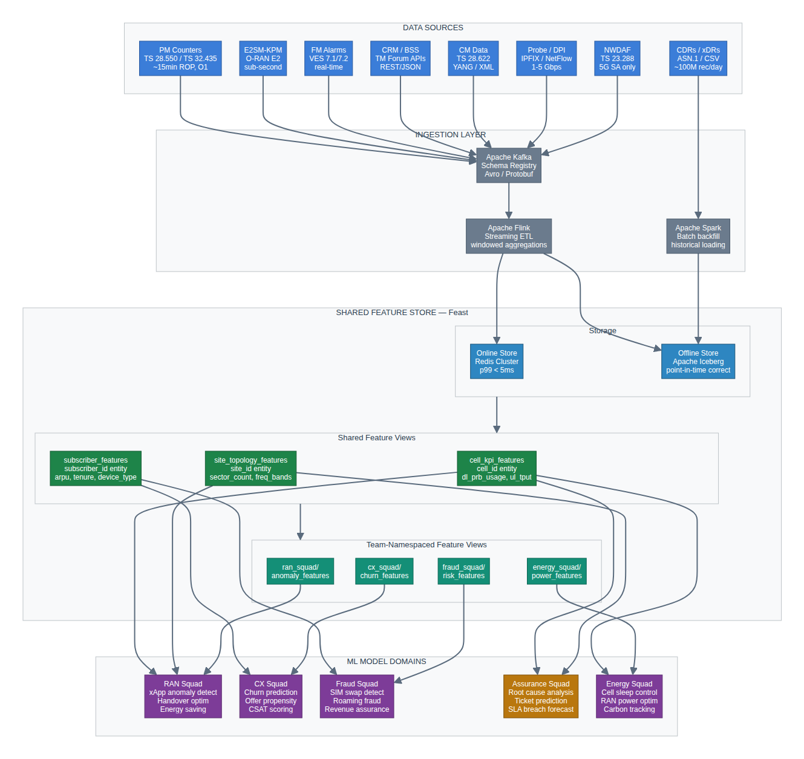
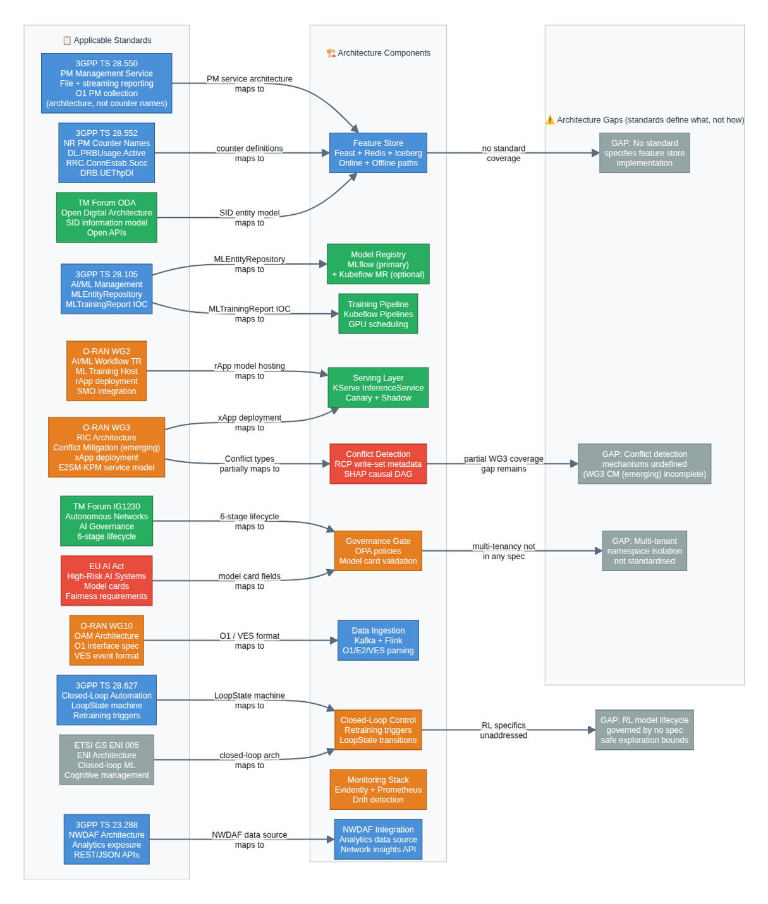
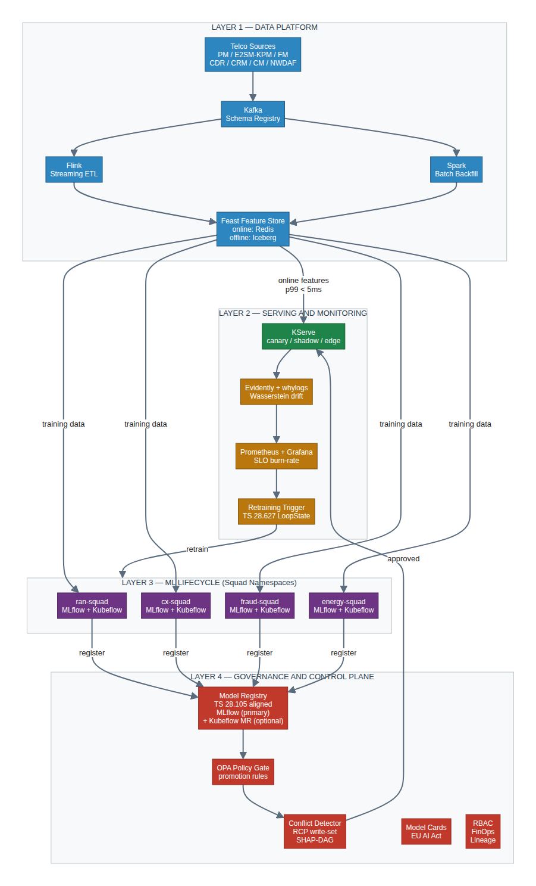
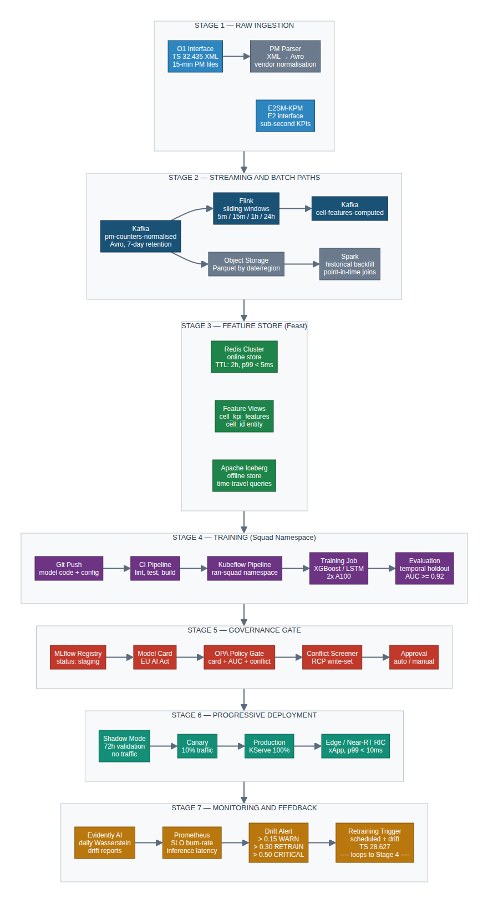
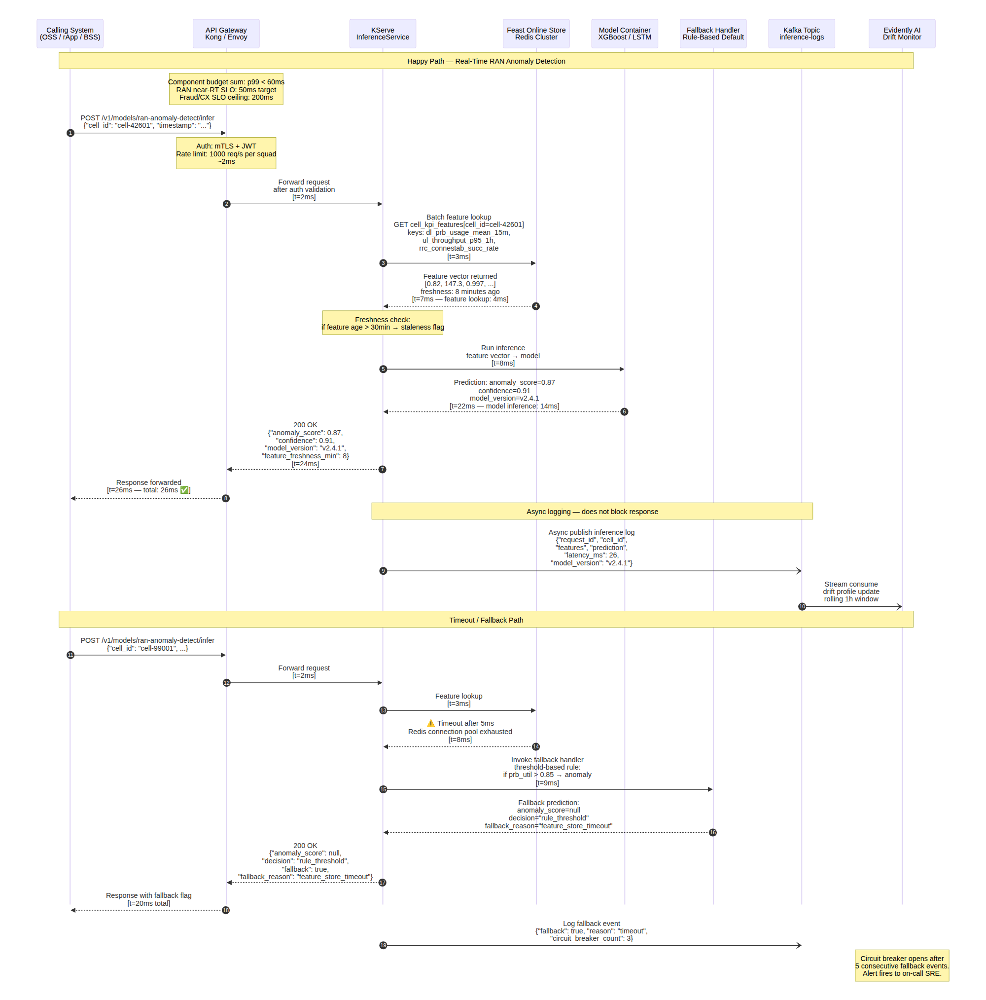
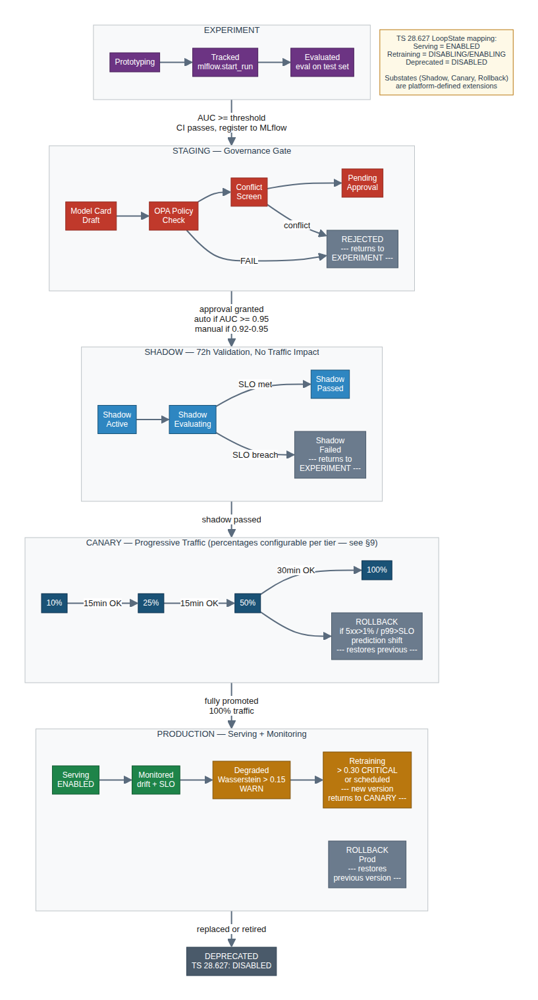
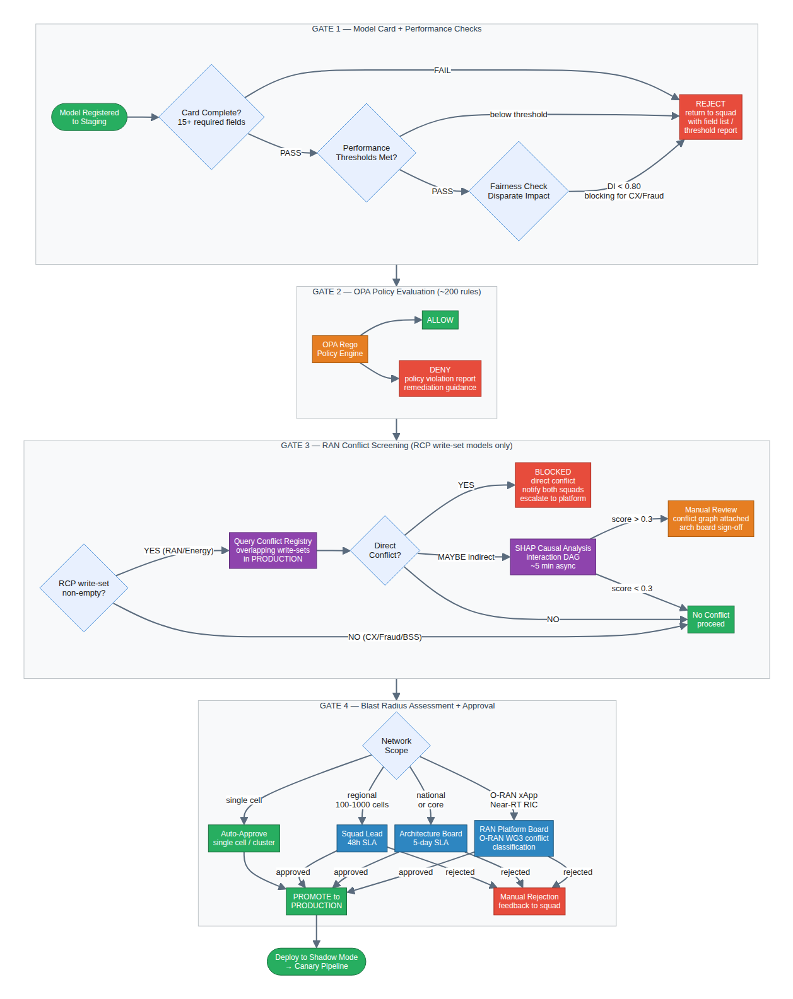
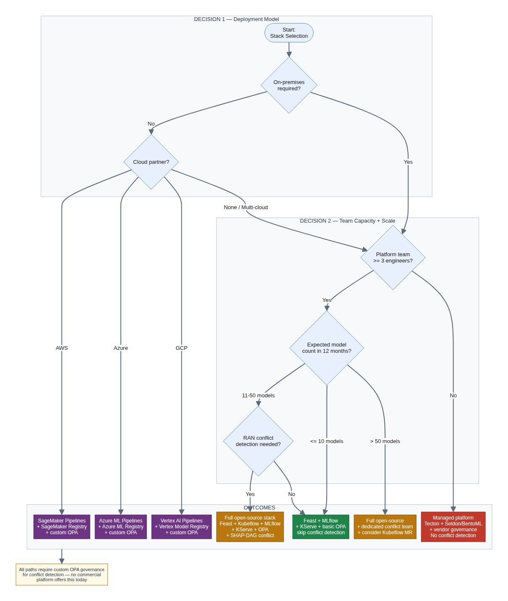
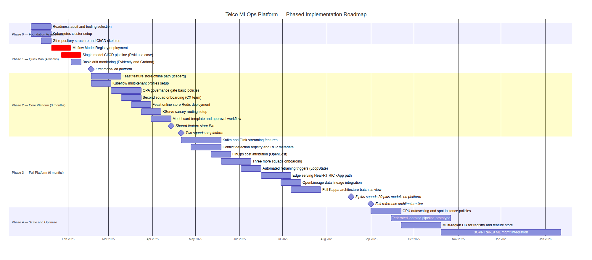

# Telco MLOps Reference Architecture: How Multi-Team, Multi-Model Organisations Ship ML at Scale Without Losing Control

**Author:** Chirag Shinde (chirag.m.shinde@gmail.com)

---

## Executive Summary

Telecommunications operators have no shortage of ML ambition. They have a shortage of execution infrastructure to match it. The pattern recurs across Tier-1 and Tier-2 operators alike: capable squads build capable models in isolation, each rebuilding the same feature pipelines, training infrastructure, and deployment scripts from scratch. Then the organisation tries to scale from five models to fifty, and the ad-hoc approach breaks: duplicated infrastructure multiplies maintenance costs, governance gaps produce ungoverned production deployments, and production incidents trace back to models nobody properly reviewed.

In telecommunications the problem is compounded by unique constraints — data volumes measured in billions of events per day, latency requirements from 10 milliseconds for near-real-time RAN control to sub-second for fraud screening, and the uncomfortable fact that a poorly governed network model can degrade service for millions of subscribers.

This whitepaper presents a reference architecture for operating ML at telco scale — specifically, for organisations running 20 or more models across 4–8 independent squads that need both team autonomy and platform-level governance.

**Three architectural pillars:**

1. **Streaming-first feature platform** — eliminates the training-serving skew responsible for silent model degradation.
2. **Namespace-isolated multi-tenant ML lifecycle** (Kubeflow + MLflow) — gives each squad independence without allowing shadow infrastructure to proliferate.
3. **Conflict-aware model registry** — detects when two AI-driven network control functions are on a collision course before either is promoted to production. Aligns to 3GPP TS 28.105 and is informed by O-RAN WG3 conflict mitigation working group activity (see §4 for maturity caveats).

**The problem is concrete:** when one xApp conserves energy by reducing transmit power while another simultaneously increases power to improve coverage, the result is a control oscillation that degrades service without triggering a classical fault alarm.

Every component is standards-traceable and implementable using open-source tooling. The architecture extends to reinforcement learning workloads (§11) and includes a companion platform testing strategy (§10). Operators who have publicly documented platform consolidation report model deployment velocity improvements in the range of 3–5× (see §8 (Evaluation and Operational Impact) for derivation).

The most important message for operators considering this investment: the bottleneck is not model quality. The bottleneck is the platform scaffolding that connects data to features, experiments to registered models, registered models to production serving, and production serving to the feedback loop that triggers retraining. Build that scaffolding once, correctly, and every team in the organisation benefits for every model they build thereafter.

---

## How to Read This Whitepaper

The Executive Summary and this reading guide are unnumbered preamble. Numbered sections §1–§18 begin with §1 (Business Case). At 18 sections, this document serves multiple audiences. Use the table below to find the shortest path for your role:

| Role | Recommended Sections | Reading Time |
|---|---|---|
| CFO / CTO | Executive Summary + §1 (Business Case) + §8 (Evaluation and Operational Impact) | ~20 min |
| Platform / MLOps architect | §4 (Background and Prior Art) through §10 (Platform Testing Strategy) | ~60 min |
| ML engineer | §5 (Proposed Approach) through §9 (Production Considerations) + companion code; §11 if deploying xApps using RL policies | ~45 min |
| NOC / Operations architect | §9 (Production Considerations) + §10 (Platform Testing Strategy) + §14 (Operational Observability) | ~30 min |
| AI/Data Leadership | Executive Summary + §8 (Evaluation and Operational Impact) + (optional) §11 (Reinforcement Learning Lifecycle Extensions) | ~25 min |
| Privacy / Compliance officer | §9 (Production Considerations) — Progressive Delivery subsection + §12 (Data Privacy Implementation) | ~20 min |

The companion code files (`01`–`05` plus `flink_feast_push_stub.py`) are self-contained and runnable via `make pipeline`. They implement the architecture described in §5–§9.

**Topics Covered:**
1. How to design a Kubernetes-native, standards-aligned MLOps platform that isolates team autonomy while enforcing governance across 50–200 models
2. How to build a streaming-first feature store that eliminates training-serving skew across RAN, CX, and fraud use cases sharing the same cell-level data
3. How to implement a conflict-aware model registry that detects when two AI-driven network control policies will fight each other before either reaches production

**Prerequisites:** ML fundamentals and model lifecycle; feature engineering for telco data; model serving and inference patterns; monitoring and observability; familiarity with Kubernetes, CI/CD pipelines, and containerised ML workflows

**Companion Code:** https://github.com/cs-cmyk/telco-mlops-reference-arch/code

---

## 1. Business Case

### The Cost of Fragmented ML Infrastructure

When an operator's RAN optimisation squad, CX analytics team, fraud detection unit, and network assurance group each build their own ML infrastructure independently, the waste is not immediately visible — it accumulates quietly. Each team maintains its own feature engineering jobs, its own model versioning conventions, its own deployment scripts, and its own monitoring dashboards. The duplication is not just infrastructure cost; it is also engineering time that cannot be spent on model improvements, and it produces a proliferation of undocumented production artefacts that nobody fully understands twelve months later.

Nokia's operator research puts 70–80% of data scientist time in data gathering and preparation, not modelling — a figure independently corroborated by multiple industry sources reviewed for this whitepaper.

**Worked example: opportunity cost of infrastructure reinvention.** Consider a Tier-2 operator with 30 ML engineers across its data squads at a fully-loaded cost of approximately A$220,000 per engineer per year. If 70% of their time is absorbed by infrastructure reinvention and data wrangling that a shared platform would handle once, the annual opportunity cost is approximately A$4.6M (30 × A$220K × 70%). This is not direct expenditure — it is model capacity that is never built.

> **Calibration notes:** Costs use Australian market rates (A$1 ≈ US$0.65 ≈ €0.60 at time of writing). Adjust for your geography; the ratios between line items are more meaningful than the absolute figures. The A$4.6M figure is a derived estimate — operators should calibrate against their own headcount and labour costs.

Beyond engineering opportunity cost, fragmented infrastructure produces specific operational failures. Models deployed without standardised validation gates are the source of a disproportionate share of production incidents at operators who have measured this. The AI Sweden consortium study found that all organisations successfully scaling MLOps had three things in common: a dedicated MLOps platform team, a common toolchain, and a well-defined deployment process. Operators lacking any of these had significantly higher rates of model-related production incidents and model abandonment after initial deployment.

### The Cost of Slow Model Deployment Velocity

Industry benchmarks suggest that the average time from a working prototype to a production ML deployment at an operator without a unified platform is six to twelve months. With a mature MLOps platform, comparable deployments at technology companies take two to six weeks. The difference matters enormously in telecommunications, where network conditions, subscriber behaviour, and traffic patterns shift continuously.

A churn prediction model that takes nine months to reach production may be trained on data that no longer reflects the subscriber base it will score. A RAN anomaly detection model deployed six months after prototype was built against a network configuration that has since been modified by a major software upgrade. Slow deployment velocity is not just inefficiency — it is a model quality problem in disguise.

To estimate the revenue opportunity: if a Tier-1 operator with 10 million postpaid subscribers reduces average monthly churn by 0.1 percentage points through faster, more accurate churn model iterations — a conservative assumption given published industry benchmarks — and average revenue per user is A$65 per month, the annual retention value is approximately A$7.8M. This is an ESTIMATED figure with significant sensitivity to the churn delta assumption; the point is directional, not a guarantee.

### Who Benefits

| Role | Current pain | Benefit from unified platform |
|---|---|---|
| ML engineer | Rebuilding feature pipelines for every project; no shared artefacts | Self-service onboarding; reusable feature views; CI/CD templates |
| Platform / MLOps architect | Managing 8 bespoke pipelines with inconsistent tooling | Single control plane; standardised interfaces; clear ownership model |
| Network automation architect | No visibility into what ML models control which RAN parameters | Conflict-aware registry with RAN Control Parameter declarations |
| AI & Data Leadership | Cannot report on model governance compliance; slow delivery | Governance dashboard; audit trail; measurable deployment velocity |
| CFO / CTO | Opaque ML infrastructure spend; no cost attribution by use case | FinOps tagging by squad and model; cost per inference visibility |

> **Note:** The ROI case for a unified MLOps platform depends heavily on the operator's current model count and team structure. The economics become compelling when there are 5 or more independent squads each building pipelines from scratch. Below that threshold, the platform overhead may outweigh the consolidation benefit, and a lighter-weight approach (shared MLflow registry only, for example) may be more appropriate.

### The Risk Dimension

Beyond efficiency, there is a governance risk that is specific to telecommunications. Models that directly control network parameters — energy saving xApps that put cells to sleep, mobility load balancing rApps that redirect traffic (see the RAN terminology callout in §2 for definitions) — carry a blast radius that is qualitatively different from a misfiring recommendation engine.

A poorly validated energy saving model deployed without shadow testing could degrade coverage for thousands of subscribers before the NOC detects the degradation. The EU AI Act's classification of AI systems that manage critical infrastructure places obligations on operators that an ad-hoc model deployment process cannot meet.

A governance-gated MLOps platform is not just an engineering convenience — for operators deploying AI in network control, it is a compliance prerequisite.

---

## 2. Problem Statement

> **RAN terminology used throughout this whitepaper:**
>
> | Abbreviation | Meaning |
> |---|---|
> | PM | Performance Management |
> | ROP | Result Output Period — the 15-minute measurement interval |
> | PRB | Physical Resource Block — the fundamental LTE/NR radio resource unit |
> | gNB | gNodeB — 5G NR base station |
> | HO | Handover |
> | CDR/xDR | Call/Extended Detail Record |
> | xApp | Near-RT RIC application (control loop latency 10 ms–1 s) |
> | rApp | Non-RT RIC application (control loop latency > 1 s) |
> | NOC | Network Operations Centre |
> | SMO | Service Management and Orchestration |
> | NSA | Non-Standalone — 5G NR secondary cell anchored to LTE EPC |
> | SA | Standalone — 5G NR with 5G Core |

### The Scaling Break Point

Telecommunications operators typically begin their ML journey with one or two high-value use cases — a churn model, a network anomaly detector — built by a small team that manages the entire stack themselves. This works well up to approximately five models across two teams. Beyond that threshold, ad-hoc approaches collapse under the weight of four compounding failure modes.

The core technical problem is **infrastructure fragmentation at the data layer**.

Consider a concrete example. The RAN optimisation squad and the CX analytics team both build feature pipelines consuming the same PM counter — `DL.PRBUsage.Active` (downlink Physical Resource Block utilisation, where PRBs are the fundamental LTE/NR radio resource allocation units) at 15-minute granularity from 10,000 gNodeBs (gNBs). But they produce subtly different feature definitions: one team aggregates hourly means, the other uses 15-minute last values. One handles missing counters with forward-fill, the other drops the record. Neither team knows the other has made a different choice.

When a model consuming these features is deployed, its online feature retrieval path uses yet another implementation. The result is **training-serving skew** — the model trains on one set of feature values but receives different values in production. Silent and systematic, this is the most common failure mode in deployed ML, and it is architecturally inevitable in a fragmented infrastructure.

### Why Telco Is Harder Than General Enterprise

Several characteristics make this problem more severe in telecommunications than in general enterprise ML:

**Data gravity.** Core telco datasets — PM counters, Call Detail Records (CDRs), signalling traces — are anchored on-premises by regulation, volume, and latency requirements. A feature store must meet the data where it lives, not the other way around.

**Latency tiers are extreme and heterogeneous.** The same operator may need inference in under 10 milliseconds for a near-real-time RAN xApp, under 200 milliseconds for a real-time fraud screen, and overnight for a capacity planning model. These are not just different serving configurations; they require fundamentally different infrastructure paths that must coexist on the same platform.

**Model blast radius is asymmetric.** A misconfigured recommendation model sends a wrong offer to a subset of subscribers. A misconfigured Handover (HO) parameter optimisation xApp can trigger a cascade of handover failures across a cluster of hundreds of cells. (Note: throughout this document, "cell cluster" means a geographic grouping of radio cells; "Kubernetes cluster" means compute infrastructure — context distinguishes which is intended.) The governance requirements for these model types are not comparable, and an MLOps platform that treats them identically will either over-govern low-risk models (slowing delivery) or under-govern high-risk ones (creating incidents).

**Vendor heterogeneity.** A typical Tier-1 operator runs radio access network equipment from two or three vendors, each with proprietary PM counter naming, collection frequency variations, and schema differences. Feature engineering logic that works on Ericsson `pmLteScellActNumSamples` counters must be re-engineered for Nokia or Huawei equivalents. The feature store must abstract this heterogeneity or every squad will solve it independently.

### Scope

This whitepaper addresses the MLOps **platform** problem: how to build the infrastructure and governance layer that connects data to deployed models across multiple teams. It does **not** prescribe specific model architectures for individual use cases (RAN anomaly detection, churn prediction, energy saving — these are covered in companion papers in this series). It addresses classical and gradient-boosted ML models as the primary workload, with extensions for Reinforcement Learning (RL) where the lifecycle differences are significant.

**Why LLMs are excluded.** This architecture does not cover Large Language Model (LLM) or foundation model fine-tuning pipelines. While the shared MLOps principles — versioning, reproducibility, monitoring, governance gates — still apply, the concrete implementations diverge at nearly every layer. The key differences:

- **Data pipeline.** This architecture consumes structured PM counters via point-in-time feature joins. LLM fine-tuning consumes unstructured text corpora requiring tokenisation, deduplication, and quality filtering — the feature store concept does not translate.
- **Training infrastructure.** The Random Forest in §7 trains on a single node in minutes. LLM fine-tuning (even parameter-efficient methods like LoRA on a 7B model) requires multi-GPU orchestration, gradient checkpointing, and distributed training frameworks (DeepSpeed, FSDP) — a fundamentally different compute profile.
- **Inference latency and serving.** KServe with a scikit-learn model returns a probability in under 10ms. LLM inference involves autoregressive token generation, KV-cache management, and continuous batching, with latency measured in seconds and serving infrastructure (vLLM, TGI, TensorRT-LLM) that shares no components with the sklearn/ONNX path described in §9.
- **Evaluation.** This architecture uses precision/recall/F1 on labelled test sets. LLM evaluation requires benchmarks (MMLU, HumanEval), human preference ratings, red-teaming, and domain-specific eval suites — there is no single "primary metric" equivalent.
- **Drift and governance.** Wasserstein distance on structured input features does not apply to LLMs, where drift means distribution shift in prompt patterns or output quality degradation. Governance adds safety evaluations, content filtering, and prompt injection testing — a different compliance surface from the OPA model card in §7.

Covering both paradigms in one architecture would either be too abstract to be actionable or would double the document length with constant branching. A companion paper addressing LLM-specific MLOps for telco applications — covering RAG pipelines over network documentation, LLM-assisted NOC operations, and foundation model fine-tuning on operator-specific corpora — is an extension of this paper which will be covered in a followup paper.

> **What This Architecture Cannot Solve.** This architecture assumes that data sources are accessible and that squads have domain-qualified ML engineers. Three categories of problem are explicitly out of scope:
>
> **Data quality at the source** is out of scope: misconfigured PM counters at the gNB, or incomplete CDR records from the mediation layer, cannot be fixed downstream. Garbage in, garbage out — platform maturity does not change this.
>
> **Insufficient domain expertise** is out of scope: the platform accelerates skilled teams by removing infrastructure friction, but it does not substitute for the RAN engineering knowledge needed to build a good handover optimisation model or the fraud domain expertise needed to design meaningful transaction features.
>
> **Organisational resistance** is out of scope: executive sponsorship and a named platform team owner are prerequisites, not outputs of this architecture. Operators who fund the infrastructure but do not empower the platform team to enforce governance standards will reproduce the fragmentation problem inside the new platform.

---

## 3. Data Requirements

Before specifying the architecture, we need to understand what data it must handle — both the sources and the volumes that determine infrastructure sizing.

### The Telco Data Landscape

> **Key architectural insight:** The six data sources below are a shared data asset requiring a unified entity model and governed feature store — not independent inputs to independent model squads. The architecture's value derives from this sharing: a single cell-level feature pipeline serves RAN optimisation, network assurance, and energy saving models simultaneously.

A multi-model MLOps platform at a mid-sized operator must ingest, transform, and serve features derived from at least six distinct data source categories, each with different schemas, collection protocols, and temporal characteristics. Understanding these sources — and the volume they produce at operator scale — is a prerequisite for any meaningful platform architecture discussion.

> **Terminology note:** This reference architecture assumes a mixed LTE/5G NSA or 5G SA deployment. Examples reference gNBs (5G NR base stations) as the primary network element; operators running LTE-only or NSA deployments should substitute eNB or en-gNB as appropriate. The architecture is technology-generation agnostic — the feature store and model registry work identically for LTE and NR counters, and model cards should declare which network element types are affected (e.g., `affected_network_elements: ["gNB"]` or `["gNB", "eNB"]` for models spanning both generations).


*Figure 1: Telco data landscape — data sources mapped to ML model categories, showing shared vs. team-specific flows through the feature store.*

**PM Counters (O1 interface, 3GPP TS 28.550 / legacy TS 32.435 XML).** Performance Measurement counters are the foundational data source for RAN and network assurance models.

**Scale.** At 15-minute Result Output Periods (ROPs), a 10,000-cell operator generates approximately 960,000 PM measurement records per day (10,000 cells × 96 ROPs), each containing 500–2,000 individual counter values. At the data-point level, this represents 480 million to 1.92 billion individual counter measurements per day — approximately 2–8 GB/day compressed when parsed from XML into columnar format, depending on counter cardinality and compression ratio.

**Specification landscape.** PM data collection is governed by multiple complementary specs (these are complementary, not sequential — TS 32.435 is not superseded by TS 28.550):

- **TS 32.435** — file transfer mechanism and naming conventions (the dominant collection method at most operators as of 2025, typically via a Bulk Data Management function landing XML in object storage)
- **TS 32.423** — XML schema and ASN.1 encoding
- **TS 32.436** — optional ASN.1 encoding for higher-throughput deployments (limited production uptake as of 2025)
- **TS 28.550** (Rel-17+) — O1 PM management service interface
- **TS 28.532** — YANG-based streaming PM notification path (for operators implementing streaming PM on Rel-17+ infrastructure, this is the primary streaming reference, not TS 28.550; aligns with the Kappa architecture — a streaming-first design pattern in which batch processing is treated as a materialised view of a bounded stream)
- **TS 28.552** — individual counter names and measurement formulas (e.g., `DL.PRBUsage.Active`, `RRC.ConnEstab.Succ`, `HO.ExecAtt`); TS 28.550 governs how data is collected and transported, not what individual counters measure

**Vendor normalisation.** Vendor implementations frequently deviate from the standard. Nokia and Ericsson use proprietary suffixes and counter aggregation methods that require per-vendor normalisation logic before features can be computed consistently.

> **Counter name mapping convention.** The companion code and feature store schema use snake_case equivalents of standard counter names, following Python/Parquet conventions. The mappings for counters used in this architecture are split into two categories:
>
> **3GPP TS 28.552 NR PM Counter Names** (definitions; TS 28.550 governs the PM service architecture, not individual counter names):
>
> | Standard Name | Platform Schema Name (flat snake_case) | Description |
> |---|---|---|
> | `DL.PRBUsage.Active` | `dl_prb_utilization` | Fraction of available DL PRBs in use, computed as DL.PRBUsage.Active / DL.PRBUsage.Total. The platform schema stores the resulting float in [0, 1]; normalisation to this fraction must occur in the O1 parser or Flink normalisation job before features are written to the store. The companion code (`01_synthetic_data.py`) generates `dl_prb_utilization` directly as a pre-computed fraction for simplicity. |
> | `DL.PRBUsage.Total` | `dl_prb_total` | Maximum available DL PRB count (denominator for utilization) |
> | `UL.PRBUsage.Active` | `ul_prb_utilization` | Mean active UL PRB count; same Total-denominator conversion applies |
> | `RRC.ConnEstab.Att` | `rrc_conn_estab_att` | RRC connection establishment attempts |
> | `RRC.ConnEstab.Succ` | `rrc_conn_estab_succ` | RRC connection establishment successes |
> | `HO.ExecAtt` | `ho_exec_att` | Handover execution attempts |
> | `HO.ExecSucc` | `ho_exec_succ` | Handover execution successes |
> | `DRB.UEThpDl` (TS 28.552, NR) | `dl_throughput_mbps` | DL user throughput volume in kbits per ROP interval; compute Mbps as (value_kbits ÷ 1000) ÷ ROP_duration_seconds (e.g., ÷ 900 for 15-min ROP). Aggregated across all 5QIs (the bare counter without QoS suffix); per-5QI subcounters are available in Rel-17+ deployments (specific counter naming varies by vendor; validate against TS 28.552 Rel-17 and your vendor's PM counter reference) and should be used for network-slice-aware models. † |
>
> **Derived KPIs from UE Measurement Reports** (not TS 28.552 PM counters; these are gNB-aggregated means of UE measurement quantities defined in TS 38.215 for NR and TS 36.214 for LTE, and appear in PM files as vendor-specific counter names):
>
> | Source Quantity | Platform Schema Name (flat snake_case) | Description |
> |---|---|---|
> | RSRP (TS 38.215, UE measurement) | `rsrp_mean_dbm` | Mean Reference Signal Received Power (dBm) |
> | CQI (TS 38.214, UE feedback) | `cqi_mean` | Mean Channel Quality Indicator |
> | RSRQ (TS 38.215, UE measurement) | `rsrq_mean_db` | Mean Reference Signal Received Quality (dB). See RSRQ implementation notes below. |
> | BLER (derived from TB error attempt counters) | `pdsch_bler` | PDSCH Block Error Rate — typically computed from `TB.ErrTotNbrDl` families in TS 28.552, which are vendor-specific in naming. The platform schema name `pdsch_bler` is a derived ratio, not a directly reported 3GPP PM counter. |
>
> Derived ratios (`ho_success_ratio`, `rrc_setup_success_ratio`, `dl_retx_ratio`) are computed in the feature engineering layer from the raw attempt/success counters and BLER. Operators should extend this mapping for their vendor-specific counter catalogue.

**RSRQ implementation notes (`rsrq_mean_db`):**

**Data source.** In production, use vendor-reported RSRQ directly from PM counter files — do not recompute from RSRP. The synthetic data generator (`01_synthetic_data.py`) uses an approximation that does not reflect real RSRQ physics (the synthetic formula has no relationship to the 3GPP definition N × RSRP / RSSI — models trained on synthetic RSRQ may fail to generalise to real data).

**Valid ranges:**

| Technology | Specification | Range |
|---|---|---|
| LTE RSRQ | TS 36.133 | −19.5 to −3 dB (0.5 dB steps) |
| NR SS-RSRQ | TS 38.133 | −43 to 20 dB (extended for NR's higher SINR operating points) |

> **Critical: LTE and NR RSRQ are incompatible.** LTE RSRQ and NR SS-RSRQ are distinct measurement quantities with different formulas and incompatible value ranges. Do not store them in the same feature column without a technology-type discriminator. For models handling both (e.g., NSA handover optimisation), create separate features (`lte_rsrq_db`, `nr_ss_rsrq_db`) or apply per-technology normalisation before combining.

> **NR CSI-RSRQ caveat.** NR deployments may expose two distinct RSRQ quantities: SS-RSRQ (from SSB) and CSI-RSRQ (from CSI-RS). These have different formulas, operating ranges, and vendor counter names. Confirm with your vendor which is exposed, and create separate feature columns (`nr_ss_rsrq_db`, `nr_csi_rsrq_db`) if both are present — do not aggregate them.
>
> † Counter names shown follow typical Ericsson/Nokia NR PM file conventions. Vendors deviate from 3GPP naming — validate against your vendor's PM counter reference manual before implementation.
>
> **Critical: volume vs. rate counter distinction.** Before applying any conversion formula, determine whether your vendor's DL throughput counter reports a *volume per ROP* (bytes or bits accumulated over the reporting interval) or a *pre-averaged throughput rate* (kbps/Mbps). Volume counters require division by ROP duration in seconds; rate counters do not. Applying the ÷ROP_duration step to an already-computed rate counter will understate throughput by 900× for 15-minute ROPs.
>
> **Vendor-specific units for DRB.UEThpDl:**
>
> | Vendor | Counter name | Unit | Conversion note |
> |---|---|---|---|
> | Nokia | ThpVolDl | kbytes (volume) | Multiply by 8 to get kbits before ÷ROP_duration_seconds |
> | Ericsson | pmRadioThpVolDl | kbits (volume) | Divide by ROP_duration_seconds directly |
> | Others (version-dependent) | varies | kbps or Mbps (rate) | **Do not** divide by ROP duration — value is already a rate |

**E2SM-KPM Streaming (O-RAN E2 interface).** The O-RAN E2 Service Model for KPI Monitoring (E2SM-KPM) provides near-real-time KPI streams from the Near-RT RAN Intelligent Controller (Near-RT RIC) at configurable reporting periods. This source is essential for latency-sensitive RAN optimisation models but is only available in O-RAN compliant deployments.

**Reporting period.** The `reportingPeriod` field encoding and permitted values vary by E2SM-KPM specification version (e.g., ENUMERATED with specific allowed values in v2.0/v3.0). Verify the ASN.1 definition in the version deployed on your Near-RT RIC (check specifications.o-ran.org under WG3 for current releases).

> **Practical constraint:** No production gNB as of 2025 implements sub-100ms reporting. The practical minimum is constrained by gNB firmware capabilities, Near-RT RIC loop granularity, and E2 backhaul latency — not by the specification encoding. Most commercial gNBs support no finer than 100–500ms granularity. Validate achievable reporting periods with your gNB vendor before architecture sizing.

> **Terminology:** An E2SM-KPM *indication* is one message per cell per reporting period, containing N KPM measurements. Volume estimates labelled "indications/day" count messages; "metric values/day" counts individual measurements (N × indications). Dimension Kafka partitions and storage on metric values, not indications.

**Volume varies by up to 50× depending on subscription configuration.** The key parameters are reporting interval, KPMs per subscription, and cell count. Representative sizing for a 1,000-cell deployment:

> | Reporting interval | KPMs/cell | Indications/day | Metric values/day | Notes |
> |---|---|---|---|---|
> | 5 s | 2 | 17.3M | 34.6M | Minimum useful subscription |
> | 1 s | 2 | 86.4M | 172.8M | Illustrative baseline (2 KPMs only) |
> | **5 s** | **50** | **17.3M** | **864M** | **⬅ CAPACITY PLANNING ROW — typical production subscription** |
> | 1 s | 50 | 86.4M | 4.32B | Full production at 1s — size Kafka for this |
> | 100 ms | 2 | 864M | 1.73B | Spec floor; not achievable in production as of 2025 |
>
> The 1s/2KPMs row is illustrative only; production subscriptions typically use 20–50 KPMs. For capacity planning, size on: `cell_count × kpms_per_subscription × (86400 ÷ reporting_interval_sec)` metric values/day.

Dimension the E2 ingestion Kafka cluster based on your specific KPM subscription configuration. Use 1-second as the design baseline unless the operator has validated Near-RT RIC capacity for sub-second rates. Sub-second reporting (100–500ms) should be restricted to controlled environments or small *cell cluster* pilots of ≤ 50 cells.

**UE-level reporting** (one indication per active UE per interval) multiplies volume by the average active UE count per cell. For capacity planning, use the busy-hour active UE count (typically 150–400 for dense urban macro cells) rather than 24-hour averages:

| Scenario | Interval | UEs/cell | Daily volume |
|---|---|---|---|
| Cell-level baseline | 1s | — | ~864M indications |
| UE-level (average load) | 1s | 50 | ~4.3B indications |
| UE-level (busy-hour peak) | 1s | 300 | ~26B indications |

> **Recommendation:** Restrict UE-level reporting to *cell cluster* pilots of ≤ 50 cells or increase the reporting interval to ≥ 5 seconds.

**Fault Management Alarms (VES Events, ONAP VES 7.2).** Alarm events from network elements arrive as Virtual Event Streaming (VES) events in ONAP VES 7.2 format (as referenced by O-RAN WG10 O1-Interface specification). VES 7.1 and 7.2 are both in active deployment — gNBs from different vendors and software vintages will emit different minor versions concurrently. Verify the specific minor version your network elements emit before configuring the VES parser schema.

**Volume.** Highly variable — typically 50,000–500,000 alarm events per day at operator scale, spiking during network incidents. These are critical features for assurance and root cause analysis models.

**Backward-compatible parsing.** Configure the VES Kafka consumer with schema validation set to backward-compatible mode, or implement version-aware deserialisation that handles both 7.1 and 7.2 structures. Key schema differences:

| Field | VES 7.1 | VES 7.2 | Parser guidance |
|---|---|---|---|
| `reportingEntityId` | Required | Optional | Treat as optional; do not fail on absence |
| `timeZoneOffset` | Absent | Added | Default to UTC or extract from `startEpochMicrosec` |
| `eventList` (batch delivery) | Not supported (one event per message) | Array wrapper enabling multiple events per HTTP POST | Check for `eventList` at top level and iterate if present; otherwise treat as single `event` object |

> **Silent data loss risk:** Failing to handle the `eventList` batch form silently drops all but the first alarm in each delivery.

**CDR/xDR (Call Detail Records / Extended Detail Records).** CDRs and their data-service equivalents (xDRs) provide subscriber-level session data used in CX, churn, and fraud models. A 10 million-subscriber operator generates approximately 500 million to 2 billion CDR/xDR events per day across voice, data, and SMS, depending on data session granularity and xDR generation policy. Operators using per-flow xDRs at DPI probes may see higher volumes. CDRs contain MSISDN, timestamps, cell identifiers, data volumes, and Quality of Service (QoS) indicators. They are privacy-sensitive under both GDPR and local telecommunications regulations; access control in the feature store must enforce subscriber data governance at the entity level.

**Configuration Management (CM, YANG models).** Network topology and configuration data — which cells belong to which site, which site to which *cell cluster*, neighbour relationships, antenna parameters — is essential context for RAN models. CM data is accessed via the O1 interface using YANG data models and changes infrequently but must be version-tracked, because a model trained on one topology configuration may behave unexpectedly after a neighbour list update.

**CRM/BSS (Batch API, nightly).** Customer Relationship Management and Business Support System data feeds CX and fraud models with subscriber attributes: contract type, tenure, device, plan, payment history, and interaction records. This is the only major telco ML data source that is inherently batch rather than streaming, arriving typically via nightly API exports or database replicas.

**NWDAF Analytics (3GPP TS 23.288, REST/JSON).** In 5G SA (standalone) deployments, the Network Data Analytics Function (NWDAF) exposes subscriber-level and network-slice-level analytics via the Nnwdaf service-based interface. NWDAF provides pre-aggregated analytics — load level information, QoS sustainability predictions, abnormal behaviour detection, and user data congestion analytics — that can feed the feature store as a higher-level data source, complementing raw PM counters. Where available, NWDAF reduces the feature engineering burden for subscriber-level network quality features, because the 5G Core has already performed the aggregation from raw counters to meaningful KPIs.

**Integration pattern.** NWDAF analytics arrive as JSON over REST, consumed by a lightweight adapter that writes to a dedicated Kafka topic (`nwdaf-analytics-normalised`). Standardise on the 3GPP Nnwdaf interface where available; use vendor adaptation layers elsewhere.

> **Deployment reality: most operators don't have NWDAF yet.** NWDAF as specified in TS 23.288 is only available in 5G SA deployments with a 5GC — it does not exist in NSA or LTE-only networks. As of Q1 2025, approximately 85–90% of commercial 5G deployments globally are NSA (non-standalone), anchored on an LTE EPC (source: GSMA Intelligence 5G Deployment Tracker, Q1 2025 data; consult gsma.com/intelligence for current ratios). SA adoption is accelerating, particularly in NE Asia and parts of Europe, where some operators already have production NWDAF availability.
>
> **What to do if you're NSA or hybrid:**
>
> - **Short term:** PM counters and E2SM-KPM remain your primary data sources. Omit the `nwdaf-analytics-normalised` Kafka topic from the initial architecture.
> - **Vendor alternative:** Operators running NSA may have equivalent analytics from their core vendor (e.g., Nokia AVA or Ericsson Expert Analytics proprietary REST APIs) that can be adapted to the same Kafka topic pattern with a vendor-specific adapter.
> - **Migration path:** Plan to add the NWDAF topic — or a vendor-adapter equivalent — as SA coverage expands.

### Multi-Team Access Patterns and Governance

The critical architectural insight is that multiple squads require overlapping subsets of these sources. The RAN squad's cell-level `DL.PRBUsage.Active` features are also needed by the CX team to correlate poor throughput with churn propensity. The fraud team needs CDR cell-level aggregates that overlap with RAN load features. Building these independently — as most operators currently do — produces the feature duplication and inconsistency described in the Problem Statement.

A shared feature store with clearly defined entity models (`cell_id`, `site_id`, `customer_id`, `imsi`) and team-namespaced feature views is the architectural solution. The governance requirement is equally important: when the RAN squad changes the definition of `dl_prb_usage_mean_15m`, downstream consumers in the CX team must be notified before the change is materialised. Feature schema evolution must be a first-class, governed operation — not a side effect of a pipeline change that nobody announced.

> **Note:** Data volume estimates in this section are based on a representative 10,000-cell, 10-million-subscriber operator. Actual volumes scale linearly with network size and will vary based on counter collection granularity, alarm rates, and CDR generation policies. Operators should instrument their ingestion pipelines to measure actual throughput before sizing feature store infrastructure.

---

## 4. Background and Prior Art

### What the Standards Say — and What They Leave Unspecified

Three major standards bodies have addressed ML lifecycle management in telecommunications. Understanding what they specify — and where they stop — is essential context for the reference architecture this whitepaper proposes.

**3GPP TS 28.105 (Management of AI/ML in the Management Plane).** Released in Rel-17 and substantially expanded in Rel-18, TS 28.105 is the most detailed normative specification for ML model management in telecommunications. Rel-19 extensions, expected to complete in 2025, add further detail on closed-loop AI management and cross-domain model sharing.

**What it defines.** An information model for ML entities: the `MLEntityRepository` IOC (Information Object Class) as the container for registered models, the `MLTrainingReport` IOC for capturing training provenance, and the `MLModelRepository` IOC for deployable artefacts. The specification prescribes a lifecycle covering data collection, model training, validation, deployment, monitoring, and update/retirement.

**What it does not define.** The engineering implementation — how to build the training infrastructure, how to implement the repository, or how to enforce governance gates. TS 28.105 defines the *what*; this whitepaper defines the *how*.

**O-RAN Alliance WG2 AI/ML Workflow.** The O-RAN WG2 AI/ML workflow specification defines the roles of the Non-RT RIC (Non-Real-Time RAN Intelligent Controller) as an ML Training Host, with rApps consuming model management services through the A1 interface for policy delivery and the O1 interface for data collection. WG3 specifications address xApp deployment on the Near-RT RIC, with the E2 interface providing the KPI data streams.

**WG3 conflict mitigation (emerging).** O-RAN WG3 has been developing conflict mitigation specifications, with early drafts circulated in 2024 that classify conflicts between AI-driven control functions:

- **Direct conflicts** — two xApps writing the same RAN Control Parameter with opposing values
- **Indirect conflicts** — xApps interacting through RAN behaviour rather than shared parameters
- **Implicit conflicts** — shared KPI targets with incompatible optimisation directions

The emerging specification acknowledges that no standardised detection or mitigation mechanisms currently exist at the platform level. This gap — between the classification of conflicts and their operational prevention — is one of the primary contributions of the reference architecture presented here.

> **Publication status caveat:** As of mid-2025, WG3 conflict mitigation work remains within O-RAN.WG3.RICARCH and working-group contribution papers; no standalone document number had been assigned. Before citing this work as normative, verify its publication status at specifications.o-ran.org under WG3.

> **Standards maturity note:** The conflict mitigation classification framework described in this architecture draws on O-RAN WG3 working drafts circulated in 2024. As of mid-2025, no normative O-RAN specification mandating specific conflict detection mechanisms has been published. The SHAP+DAG implementation described in §6 anticipates the eventual normative requirements and should be aligned with the final specification as it matures. Operators should treat this component as a design pattern informed by emerging standards work, not as a standards-conformant implementation.


*Figure 8: Standards traceability map — each architecture component mapped to its governing standard, with gaps identified.*

**TM Forum IG1230 and the Autonomous Networks Framework.** TM Forum's Autonomous Networks technical reports define a six-level maturity scale (L0 to L5) for network automation, from fully manual to fully autonomous. The AI management governance guidance in IG1230 and the Open Digital Architecture (ODA) AI/ML canvas prescribe governance stages and accountability frameworks that align well with the model card and approval workflow design in this whitepaper. TM Forum's ODA component model also provides a useful mapping between ML platform services and standardised API interfaces — relevant when BSS systems need to consume model outputs through TMF Open APIs.

**ETSI ENI (Experiential Networked Intelligence).** ETSI GS ENI 005 defines a system architecture for closed-loop AI in networks, with the Suggest–Decide–Act–Monitor cycle as the normative pattern. ENI's treatment of the closed-loop control plane is relevant to the retraining trigger design in this architecture, specifically the mapping from LoopState transitions (foundational concept from 3GPP TS 28.627 SON Policy NRM; for Rel-17+ autonomous network management, see TR 28.861 and the TS 28.531–533 management service suite) to automated model update workflows.

### Lessons from Big Tech ML Platforms

Three large-scale ML platforms from technology companies have been extensively documented and provide transferable lessons.

**Uber Michelangelo** pioneered the "ML platform as internal product" model: a self-service platform that standardised feature engineering (with a shared feature store as the central asset), model training, deployment, and monitoring across hundreds of teams. The key insight was that standardisation of the platform accelerated individual team velocity — by removing the need to reinvent infrastructure — while the shared feature store enabled cross-team feature reuse that compounded in value as the model count grew. Michelangelo's feature store concept shares the central design principles of the Feast-based approach used here — a shared entity model, dual online/offline stores, and point-in-time correct retrieval.

**Spotify Hendrix and LinkedIn Pro-ML** independently arrived at similar conclusions: the governance gate between experimentation and production deployment is the single most valuable platform component. Both systems implemented automated validation checks — model performance thresholds, data quality checks, lineage completeness — as mandatory promotion gates that could not be bypassed, combined with human approval workflows for models above a defined risk threshold. This pattern translates directly to the governance layer in the reference architecture.

**What does not transfer from Big Tech.** These platforms were designed for cloud-native, hyperscaler-hosted environments with near-infinite compute elasticity. Telecommunications operators face constraints that make direct adoption impossible: regulatory requirements that prohibit subscriber data from leaving the operator's infrastructure; on-premises or private cloud deployments with fixed GPU capacity; and — most importantly — models that directly control physical network infrastructure, where a deployment error has an immediate subscriber impact rather than a degraded recommendation quality. The blast radius asymmetry requires a more conservative progressive delivery approach than any Big Tech platform implements.

### MLOps Maturity in Telecommunications Today

Most operators remain in early-stage MLOps maturity. The AI Sweden consortium research found that all organisations successfully scaling MLOps had a dedicated MLOps platform team, a common toolchain, and a well-defined deployment process — and that these were rare. TM Forum's autonomous network surveys consistently find fewer than 5% of operators achieving Level 4 autonomy organisation-wide, though a larger minority — approximately 20% — report Level 4 achievement in specific, well-scoped domains. The gap between AI investment intent (89% of operators plan to increase AI spending, per multiple industry surveys) and ML deployment maturity is the defining operational challenge the reference architecture addresses.

Operators who have publicly documented successful platform consolidation — AT&T's consolidation of four fragmented management platforms into a single Ericsson Intelligent Automation Platform (EIAP) before deploying multi-model rApps; Telefónica's centralised AI Centre of Excellence providing governance while national teams retain execution autonomy; Vodafone's "Nucleus" data platform as the explicit prerequisite for multi-model deployment — share a consistent lesson: the platform investment must precede the model investment. Operators who try to scale models without the platform eventually pay the platform cost anyway, but at a higher price, after a production incident forces the issue.

> **Note:** 3GPP TS 28.105 Rel-19 completion status was under active development at the time of writing. Clause references in this whitepaper reflect the Rel-18 specification. Readers implementing against Rel-19 should verify normative changes in the SA5 working group outputs from 2025 3GPP plenary meetings.

| Standard | Lifecycle Stages Covered | Implementation Guidance | Conflict Management | Gap for This Whitepaper |
|---|---|---|---|---|
| 3GPP TS 28.105 Rel-18 | Data collection → training → validation → deployment → monitoring → retirement | Information model only; no engineering prescription | Not addressed | Engineering implementation of IOC-aligned registry |
| O-RAN WG2 AI/ML Workflow | Training host → model management → policy deployment via A1 | Functional architecture; no tooling specification | Not addressed | Practical KServe-based serving path for rApps |
| O-RAN WG3 Conflict Mitigation (emerging, verify publication status) | Conflict classification only | None | Taxonomy defined; no detection mechanism | Pre-deployment conflict screening using SHAP + DAG |
| TM Forum IG1230 / ODA | Governance stages; accountability framework | API interface model | Not addressed | Policy-as-code implementation of governance stages |
| ETSI ENI GS 005 | Closed-loop Suggest–Decide–Act–Monitor | Functional architecture | Not addressed | LoopState (TS 28.627 / TR 28.861) → retraining trigger integration |

These gaps — engineering implementation, tooling specification, and practical conflict management — define the design space this reference architecture fills.

## 5. Proposed Approach

### Philosophy: Platform as Product, Governance as Architecture

The central premise of this reference architecture is that governance cannot be bolted on after the fact. Every attempt to retrofit model governance onto a fragmented ML infrastructure — adding a shared registry after ten teams have already built independent ones, adding validation gates after models are already running in production — produces resistance, incomplete adoption, and a shadow-ML problem — models built outside the governed platform by teams who found workarounds — that becomes harder to see once an official registry exists to point at. The only approach that scales is making governance structural: the governed path must be the path of least resistance, not an obstacle to it.

This leads to a specific design philosophy: **self-service with structural guardrails**. Teams should be able to experiment freely within their namespaces — build features, train models, and promote to staging — without filing tickets or waiting for a platform team to act on their behalf.

But the platform's structural design makes governance unavoidable rather than bypassable. Production promotion requires a model card. RAN control deployment requires a declared RCP write-set (RAN Control Parameters — the individual radio configuration parameters an xApp or rApp writes, such as transmit power, sleep-mode eligibility flags, or handover thresholds). The shared feature store enforces schema versioning. Skipping any step means breaking the platform contract explicitly.

**The incentive design is decisive.** If the governed path requires filing a ticket and waiting three days, squads will find workarounds — and once they do, you have shadow infrastructure again, now hidden inside an official registry. The platform must make the governed path — completing a model card, running the CI pipeline, registering to the shared store — the path of least resistance.

### Architecture Approach Comparison

Three broad approaches exist for organising an MLOps platform across multiple teams. The table below evaluates each against the telco operator context.

| Approach | Description | Pros | Cons | Telco Verdict |
|---|---|---|---|---|
| **Fully Centralised** | One platform team builds and operates all models; squads are consumers of outputs | Maximum governance control; single toolchain | Bottleneck at scale; no domain knowledge in platform team; squads lose ownership | Fails above ~5 models; domain expertise cannot be centralised |
| **Fully Federated** | Each squad builds and operates its own ML infrastructure independently | Maximum squad autonomy; fastest initial velocity | Infrastructure duplication; no shared features; governance gaps; shadow ML proliferates | The current state at most operators — the problem this architecture solves |
| **Hybrid (Platform + Embedded Engineers)** | Central platform team provides shared infrastructure, governance, and standards; embedded ML engineers in each squad build models using the platform | Combines autonomy with governance; platform team focuses on infrastructure; squads own model logic | Requires organisational commitment to the platform team as a product team; initial investment before payoff | **Recommended for 20+ models across 4+ squads** |

The hybrid model mirrors the approach documented at AT&T (centralised EIAP platform with squad-level rApp development), Telefónica (centralised CoE with national team execution autonomy), and the Big Tech platforms reviewed in Section 4. The platform team's mandate is to make the right thing easy and the wrong thing structurally hard — not to control what models squads build.

### Key Architectural Decisions

**Why Kubernetes-native.** The platform runs on Kubernetes for three reasons: operators already deploy cloud-native network functions on it; the Kubeflow and KServe ecosystems provide the most mature multi-tenant ML infrastructure available for Kubernetes; and Kubernetes namespace isolation maps directly to squad-level governance. GPU resource quotas, RBAC, and network policies all operate natively at the Kubernetes layer. Operators on legacy virtualisation infrastructure will need an adaptation path; this is acknowledged in Section 15.

> **Terminology reminder:** "cell cluster" = geographic radio grouping; "Kubernetes cluster" = compute. See §2.

**O-RAN O-Cloud and GPU scheduling.** For operators deploying on O-RAN O-Cloud infrastructure, it is important to understand the boundary between O2 and Kubernetes responsibilities.

**What O2 covers.** The O2 interface (SMO to O-Cloud) governs cluster provisioning and infrastructure lifecycle. O2ims handles infrastructure management services; O2dms handles deployment management, including resource requirements declaration (CPU, memory, accelerator type) in deployment descriptors. The WG6 O2 specification portfolio is actively revised — refer to specifications.o-ran.org under "O2 Interface" for current document identifiers before citing in compliance documentation.

**What O2 does not cover.** GPU scheduling and quota management within a provisioned cluster are outside O2 scope, regardless of whether the cluster was provisioned via O2ims. Use Kubernetes-native mechanisms: NVIDIA Device Plugin for GPU access, ResourceQuota for capacity limits, and PriorityClass for scheduling priority. O2dms can declare what resources a deployment needs; the Kubernetes control plane decides how to schedule them.

**Why a streaming-first feature store.** The six telco data sources enumerated in Section 3 are predominantly streaming in nature. Building a batch-first feature platform and bolting on streaming as an afterthought architecturally mandates training-serving skew — you will have different feature computation logic for training (batch) and serving (streaming). The Kappa architecture, in which batch is treated as a bounded stream, eliminates this class of bug by design. Apache Flink computes features identically regardless of whether the upstream source is a historical replay or a live Kafka topic.

**Why OPA for governance policy.** Open Policy Agent (OPA) provides declarative, version-controlled policy-as-code that can be enforced at the Kubernetes admission controller layer, in CI/CD pipeline gates, and in API calls to the model registry. Policies written in Rego are auditable, testable, and can be updated without changing application code. For telco operators subject to EU AI Act obligations on AI systems managing critical infrastructure, having machine-readable, auditable governance policies is a compliance asset.

**Why a conflict-aware registry is non-negotiable for RAN models.** When two xApps each write to overlapping sets of RAN parameters — one optimising for energy saving by reducing transmit power on lightly loaded cells, another optimising Mobility Robustness Optimisation (MRO) by increasing transmit power to reduce handover failure rates — they will fight. Without pre-deployment conflict screening, this conflict only becomes visible as degraded network KPIs after both xApps are running. The conflict graph, described in detail in Section 6, makes this visible at registration time.


*Figure 2: High-level MLOps reference architecture — four layers from data ingestion through governance and compliance.*

> **Key takeaway:** The hybrid platform model is the only approach that scales beyond 20 models without collapsing into either a centralised bottleneck or a fragmented shadow-ML landscape. The platform team's job is not to build models — it is to make building, governing, and operating models dramatically easier for the squads that do.

---

## 6. System Design

### Layer 1: Streaming-First Data Platform

Raw telco data arrives through four primary interfaces.

**O1 PM file collection.** PM counter files are generated by O-RAN network functions (O-DU, O-CU-CP, O-CU-UP) and collected by the SMO via the O1 interface every 15 minutes, using the file-based PM reporting defined in 3GPP TS 32.435 (still the dominant collection method at most operators). On Rel-17+ infrastructure, the streaming PM reporting service defined in 3GPP TS 28.550 provides an alternative path aligned with the streaming-first architecture.

A lightweight file ingestion service performs three steps: (1) parses the PM files, (2) normalises vendor-specific counter names to the platform schema name (flat snake_case; see §3 counter mapping table and `FEATURE_NAMESPACE_CONVENTION.md`) — for example, Ericsson `pmRrcConnEstabSucc` and Nokia `rrcConnEstabSucc` both map to `rrc_conn_estab_succ`, and (3) writes normalised records to the Kafka topic `pm-counters-normalised`, partitioned by the cell element's YANG identity.

Counter normalisation demands more engineering effort than teams consistently anticipate. Name mapping is merely the first step; *semantic* normalisation — ensuring an Ericsson counter and a Nokia counter for the same KPI actually measure the same thing — requires per-vendor validation against reference cells.

**Where counter semantics diverge.** Counter semantics differ across vendors in ways that are not visible from the counter name alone:

- **Counting methodology.** One vendor may count RRC connection establishment attempts including re-establishments after failure; another counts only initial attempts.
- **Aggregation level.** One vendor may provide pre-aggregated counters (success rate as a percentage); another provides raw numerator and denominator counters that must be divided.
- **ROP boundary alignment.** Vendors may not close their 15-minute ROP windows at exactly the same clock boundary, producing apparent discrepancies in time-aligned joins.

**Validation approach.** Compare normalised counter values from different vendors on cells serving similar traffic profiles. Multi-vendor co-located cells provide the most direct comparison, but co-location is uncommon in practice. Alternatives include validating against vendor-independent measurements: drive test data, probe-based throughput measurements, or subscriber-reported QoE metrics.

**Governance implication.** The feature store's schema registry should version normalisation logic alongside feature definitions. A change to normalisation rules is semantically equivalent to a feature definition change — it must trigger downstream model revalidation and propagate the same consumer notifications described in the governance section below.

The remaining three data interfaces each map to a dedicated Kafka topic:

| Source | Kafka Topic | Notes |
|---|---|---|
| **E2SM-KPM streams** (Near-RT RIC, E2 interface) | `e2-kpm-raw` | Sub-second granularity; KPM sink connector writes directly |
| **VES alarm events** (O1 interface) | `alarms-ves-raw` | — |
| **CDR/xDR streams** (mediation layer) | `cdr-normalised` | Produced at session close; strip direct subscriber identifiers where downstream models do not require them |
| **NWDAF analytics** (5G SA only) | `nwdaf-analytics-normalised` | Provision only with confirmed 5G SA coverage (see §3 NWDAF caveat) |

> **NSA/LTE operators:** Omit `nwdaf-analytics-normalised` from the initial Kafka topic manifest. If using vendor analytics APIs, substitute a vendor-adapter topic (e.g., `ericsson-eea-analytics-raw`, `nokia-ava-analytics-raw`).

Apache Flink jobs consume from these Kafka topics and compute streaming feature views registered in Feast. The same Flink logic is used for both the live serving path and historical backfill, ensuring point-in-time correctness by design.

**Example: cell-level RAN features.** A Flink job consumes from `pm-counters-normalised` and performs tumbling-window aggregations over configurable intervals: 15 minutes (matching the ROP), 1 hour (trend features), and 24 hours (daily baselines). Results are written to both the online store (Redis, keyed by `cell_id`) and the offline store (Apache Iceberg tables partitioned by date and `cell_id` prefix).

**Online store TTL guidance.** TTL is configured per feature view, not platform-wide:

| Feature type | Recommended TTL | Rationale |
|---|---|---|
| RAN KPI features (near-real-time inference) | 2× ROP interval (e.g., 30 min for 15-min ROPs) | Ensures freshness while allowing for collection delays |
| Subscriber-level features (churn, fraud) | 24–48 hours | Lower update frequency, batch inference patterns |

The companion code uses TTL=30 minutes for the `cell_ran_features` FeatureView, matching this guidance.

CRM/BSS data, the only batch source, is ingested nightly via Airflow-orchestrated Spark jobs that write to Iceberg, with Feast materialisation then pushing relevant subscriber-level features to Redis for the online path.

The Schema Registry (Confluent-compatible, deployed on-premises) enforces Avro schemas for all Kafka topics. Schema evolution follows a backward-compatibility policy: adding optional fields is permitted without a version bump; removing or renaming fields requires a new schema version, a migration window, and automated notification to downstream feature view consumers. Great Expectations data contracts validate ingested data against expected ranges and null-rate thresholds at the Kafka consumer boundary, catching upstream data quality issues before they propagate to feature computation. Historical backfill jobs use Spark with dbt-style SQL transforms to recompute features over past time ranges, ensuring the offline store stays consistent with the streaming computation logic.

### Layer 2: Serving and Monitoring Infrastructure

**KServe** (CNCF incubating, Apache 2.0) is the serving runtime for all model types. Each squad deploys models as `InferenceService` resources in their Kubernetes namespace, with KServe managing the serving pods, autoscaling, and traffic routing.

**Two-timescale monitoring.** The monitoring stack combines two tools at different timescales, both feeding Prometheus:

| Tool | Timescale | What it detects | How it reports |
|---|---|---|---|
| **whylogs** | Near-real-time (every 10 min) | Acute data quality issues — nulls, out-of-range values, all-zero counters from upstream collection failures | In-process feature profiling → direct Prometheus metric push |
| **Evidently** | Daily (24-hour windows) | Slower distribution shifts using Wasserstein distance | Batch drift DAG → `push_to_gateway` |

whylogs profiles each inference request's feature vector in-process, publishing statistical profiles at configurable intervals (default: 10 minutes) — this enables early alerting without the overhead of storing every raw feature vector. Evidently runs as a daily Airflow DAG, detecting drift that accumulates over hours or days.

Four serving patterns are supported:

| Pattern | Latency Target | Primary Use Cases | Infrastructure Path |
|---|---|---|---|
| Embedded in Flink pipeline | < 10 ms | Near-RT RAN xApp features | ONNX model loaded directly in Flink operator |
| KServe real-time | 50–200 ms | Fraud screening, CX personalisation | KServe InferenceService, Redis feature retrieval |
| KServe batch | Minutes to hours | Capacity planning, next-best-offer | KServe batch inference, Iceberg feature retrieval |
| sidecar (Near-RT RIC) | 10–100 ms | xApp inference on Near-RT RIC | KServe ModelMesh or OCI container co-deployed with xApp |

**Drift monitoring** runs as a daily Airflow DAG per registered model. The DAG retrieves the prior 24-hour prediction and feature distributions from the monitoring store (PostgreSQL-backed), computes Wasserstein distance (earth mover's distance) for each feature using Evidently AI with hour-of-day stratification, and writes metric vectors to Prometheus. Grafana dashboards provide per-model SLO panels.

**Drift thresholds.** Thresholds assume features normalised to [0, 1] range before distance computation:

| Level | Wasserstein threshold | Action |
|---|---|---|
| WARN | 0.15 | Alert to squad channel |
| RETRAIN | 0.30 (sustained 2 consecutive days) | Triggers retraining pipeline via Kubeflow Pipelines API |
| CRITICAL | 0.50 | Immediate escalation |

The persistence window (default: 2 days for the RETRAIN threshold) filters transient distribution shifts — such as public holiday traffic patterns — that resolve without retraining.

> **Normalisation note:** The `DriftDetector` implementation normalises both reference and current distributions using the reference distribution's min-max range, so that current-distribution range shifts are fully reflected in the Wasserstein score. When using Evidently's `wasserstein` stattest directly, pre-normalise features using reference-distribution statistics or calibrate thresholds per-feature based on the raw distribution range.

**Why Wasserstein over PSI.** Population Stability Index (PSI) is the default drift metric in most MLOps platforms — and the wrong choice for telco PM counter data for two reasons:

1. **Binning sensitivity.** PSI discretises continuous distributions into bins. Small changes in bin boundaries produce large PSI swings on skewed distributions — and network data is heavily skewed (PRB utilisation is right-skewed during off-peak hours).
2. **Diurnal false positives.** Telco features exhibit strong diurnal patterns: a 3am traffic profile is fundamentally different from a 9am profile, and this is expected behaviour, not drift. PSI computed on unstratified 24-hour aggregates produces constant false alerts.

**Wasserstein distance** is more robust to both issues. It operates on the full distribution without binning and degrades gracefully when comparing distributions with different shapes. All drift thresholds in this architecture use Wasserstein distance on **hour-stratified reference distributions** — the 9am production distribution is compared against the 9am reference distribution, eliminating diurnal false positives.

### Layer 3: Multi-Tenant ML Lifecycle

**Kubeflow 1.9+** provides per-squad namespace isolation through Kubeflow Profiles, each with dedicated resource quotas (GPU hours, CPU, memory), Role-Based Access Control (RBAC), and isolated Jupyter notebook environments and pipeline runs. (The multi-tenant Profiles feature has been stable since Kubeflow 1.7; subsequent releases should be compatible.) The `ran-squad`, `cx-squad`, `fraud-squad`, `assurance-squad`, and `energy-squad` namespaces are provisioned by the platform team using a GitOps-managed Helm chart; adding a new squad is a single pull request.

**MLflow Tracking** runs as a shared service with per-squad experiment isolation enforced by experiment naming conventions (`{squad}/{project}/{experiment-name}`) and RBAC on the MLflow API. All training runs log parameters, metrics, and artefact paths to MLflow automatically via the platform's training base image, which injects the MLflow tracking URI and authentication token.

**The Shared Model Registry** is the governance checkpoint. It is implemented using MLflow Model Registry as the primary artifact and experiment store, designed to support the 3GPP TS 28.105 `MLEntityRepository` IOC information model. The registry stores models with the metadata fields defined in TS 28.105 (training report, model type, lifecycle stage); a complete conformance mapping to the TS 28.105 YANG models is out of scope for this whitepaper and should be validated by operators requiring full standards compliance.

> **Kubeflow Model Registry** is an optional addition for operators who need its KServe reconciliation loop for staging-to-production promotion workflows. The companion code uses MLflow exclusively. If you plan to adopt Kubeflow MR alongside MLflow, do so from the start — retrofitting the KServe reconciliation loop onto an existing MLflow-only registry requires re-registering all production model artifacts in Kubeflow MR format, which is non-trivial at 50+ model scale.

**Promotion and naming.** Promotion from a squad's MLflow experiment to the shared registry requires a complete model card (described below) and passes through an OPA admission policy check. The registry enforces a naming convention: `{squad}.{domain}.{use_case}.{version}` — for example, `ran.rrc.drop_prediction.v2.1.0`.

**Lifecycle states.** Registered models carry one of four states:

| State | Meaning |
|---|---|
| `Staging` | Registered, not approved for production traffic |
| `Approved` | Governance gate passed, approved for shadow or canary deployment |
| `Production` | Serving live traffic |
| `Deprecated` | Retired from active use |

### Layer 4: Conflict-Aware Governance

> The conflict detection design in this layer is informed by O-RAN WG3 working group activity but is not standards-conformant — no normative specification mandating specific detection mechanisms has been published (see §4 for maturity caveat).

Every model registered to a domain in the `ran` namespace must declare its **RCP write-set** — the set of RAN Control Parameters the model's output will write or recommend — and its **KPI dependency set** — the network KPIs the model is optimising. The platform stores these declarations as structured metadata in the model registry. At registration time, the governance gate queries the registry for all `Production` and `Approved` models in the `ran` namespace and computes overlap between the new model's RCP write-set and existing models' write-sets. A direct conflict (identical parameter, opposing optimisation direction) blocks registration and requires explicit resolution. An indirect conflict (overlapping KPI dependencies without shared parameters) generates a warning and requires reviewer acknowledgement.

The conflict graph is initialised at registration from the model card declarations, then enriched post-deployment using SHAP-based feature importance analysis. If two deployed models show high SHAP dependence on the same network state features, the graph edge weight is updated to reflect empirical interaction risk. This moves conflict management from a purely declarative exercise to a continuously updated risk model.

> **Caveat: correlation ≠ causal conflict.** SHAP enrichment identifies models with correlated input feature spaces — a signal of potential conflict risk, not proof of actual conflict. Two models highly dependent on DL PRB utilisation may not conflict if their output parameter write-sets are disjoint. The RCP write-set declaration remains the authoritative conflict signal; SHAP provides an additional risk indicator for *indirect* conflicts where actuation effects propagate through shared network state.

**SHAP enrichment pipeline.** Runs as a scheduled Airflow DAG that reads production inference logs from the monitoring store and loads model artefacts from the registry to compute SHAP dependence over a 7-day rolling sample.

- **Cadence:** Weekly, or triggered when the prediction score Wasserstein distance (computed by the daily drift DAG) exceeds the WARN threshold (0.15) for any model in the affected namespace — this leverages existing drift infrastructure without a separate trigger mechanism.
- **Output:** Conflict graph edge weights are updated in the registry database, not in the model artefacts themselves.

**Data lineage via OpenLineage.** Each Flink feature computation job and Kubeflow pipeline step emits OpenLineage events to a lineage backend (Marquez or compatible). Events capture: input datasets (Kafka topics, Iceberg tables), output datasets (Redis feature views, model artifacts), and the transformation logic version (Git SHA). This produces a complete provenance chain from raw PM counter file to production prediction, queryable via the Marquez API. The lineage trace is attached to the model card at registration time, satisfying the EU AI Act's data governance documentation requirement for high-risk models (see §12).


*Figure 3: End-to-end data flow — PM counter ingestion through feature store, training, governance gate, serving, and monitoring feedback loop.*


*Figure 4: Real-time inference sequence — request flow with latency budget annotations at each step.*


*Figure 5: Model promotion state machine — lifecycle from experiment through shadow, canary, production, and rollback paths.*


*Figure 6: Governance and conflict detection flow — four gates from model card validation through RAN conflict screening to blast-radius-based approval.*

> **Key takeaway:** The governance gate at the registry promotion boundary is the most operationally important component in the entire architecture. Everything before it is about making data and training excellent. Everything after it is about serving reliably. The gate is what ensures that only models that are understood, validated, and approved reach the network.

---

## 7. Implementation Walkthrough

> ⚠️ **Namespace convention:** The companion code uses flat snake_case feature names (`dl_prb_utilization`) throughout scripts 01–04. Script `05_production_patterns.py` uses a dotted namespace (`ran.kpi.dl_prb_utilisation`) for illustration purposes only and generates its own synthetic data — it does not consume artifacts from scripts 01–04. See `FEATURE_NAMESPACE_CONVENTION.md` in the companion code root for the canonical convention and migration guidance.

### Onboarding a New Squad to the Platform

When a new squad — say, an energy optimisation team deploying a sleep-mode optimisation rApp — joins the platform, they receive a project scaffold generated from a Cookiecutter template maintained by the platform team. This template is not a toy: it encodes the platform's conventions, CI/CD pipeline definitions, and integration points in a form the squad can immediately run.

**CODE-01: Project template** (`cookiecutter gh:operator/mlops-project-template`)

**Directory structure:**

```
project-root/
├── src/
│   ├── features/          # Feast feature view definitions
│   ├── training/          # Kubeflow pipeline DSL
│   ├── serving/           # KServe InferenceService YAML
│   └── monitoring/        # Drift detection config
├── model_card.yaml        # Pre-populated with required fields (see CODE-04)
├── .github/workflows/
│   └── ml-pipeline.yml    # CI/CD: triggers Kubeflow on push to main
└── Makefile               # Automation targets
```

**Makefile targets:** `make feast-apply`, `make train`, `make register`, `make deploy-canary`

**`model_card.yaml` required fields:** `squad`, `model_name`, `version`, `affected_network_elements`, `rcp_write_set`, `kpi_dependency_set`, `performance_thresholds`, `rollback_procedure`, `slo_targets`, `owner_contact`, `training_data_period`, `known_limitations`. See CODE-04 for a fully worked example.

### Feature Engineering with the Shared Feature Store

The following example shows how the RAN squad registers cell-level PM counter features in Feast. The critical point is that these feature views are **shared assets** — once the RAN squad registers `cell_ran_features`, the CX squad can consume `dl_prb_usage_mean_15m` from the same materialised view for their churn correlation model without building a separate pipeline.

**CODE-02: Feast feature store definition** (`02_feature_engineering.py`)

**Four components demonstrated:**

**(1) Entity definition**

- `cell_id` — STRING, 3GPP global cell identity (CGI format: MCC-MNC-LAC-CI)

**(2) Data sources**

| Source | Type | Notes |
|---|---|---|
| Offline | `FileSource` | Iceberg path |
| Online streaming | `PushSource` | Feast v0.30+ removed native `KafkaSource`; use `PushSource` with an external Flink job writing to Feast's push API |

**(3) FeatureView: `cell_ran_features`**

| Feature | Type | Description | Source counter |
|---|---|---|---|
| `dl_prb_usage_mean_15m` | FLOAT32 | Mean DL PRB usage over 15-min ROP | DL.PRBUsage.Active / DL.PRBUsage.Total |
| `ul_throughput_p95_1h` | FLOAT32 | 95th percentile UL user throughput (Mbps), 1-hour window | See vendor warning below |
| `rrc_conn_estab_success_rate_15m` | FLOAT32 | RRC connection establishment success rate | RRC.ConnEstab.Succ / RRC.ConnEstab.Att |
| `ho_intra_freq_success_rate_1h` | FLOAT32 | Intra-frequency handover success rate | HO.ExecSucc / HO.ExecAtt (intra-freq subset; counter name varies by vendor — see §3) |
| `alarm_count_critical_1h` | INT32 | Critical-severity VES alarms in preceding 1-hour window | VES alarm stream |

**(4) CLI commands:** `feast apply` and materialisation invocation.

> **Point-in-time correctness** is enforced by Feast's `get_historical_features` with `event_timestamp_column`.

> **Vendor unit warning (all throughput features):** Verify vendor counter semantic before materialisation — Nokia reports kbytes/ROP (×8 then ÷1000×ROP_sec); Ericsson reports kbits/ROP (÷1000×ROP_sec); some vendors report pre-averaged kbps/Mbps (do NOT divide by ROP_sec). See §3 counter mapping table.

> **Note:** The features materialised by CODE-02 are raw (unscaled) derived ratios. Scaling is applied only at training time (see `02_feature_engineering.py`). The drift monitoring pipeline always uses pre-scaling values — see the "Monitoring data spaces" callout in the drift monitoring subsection below.

### Training Pipeline Definition

The Kubeflow pipeline encodes the full training workflow as a directed acyclic graph (DAG) of containerised steps. Each step is a discrete function with typed inputs and outputs; Kubeflow handles scheduling, logging, and artefact passing. The conditional registration step is particularly important: it prevents low-quality models from polluting the registry by gating registration on offline evaluation thresholds.

**CODE-03: Kubeflow Pipelines DSL** (RAN sleep-mode optimisation model)

**Four pipeline components:**

| Step | Component | Description |
|---|---|---|
| 1 | `load_features` | Retrieves historical features from Feast offline store (`cell_ran_features`, 90-day training window) via `feast.get_historical_features()` |
| 2 | `train_model` | Trains XGBoost classifier predicting cell sleep eligibility; logs parameters and metrics to MLflow |
| 3 | `evaluate_model` | Computes AUC-ROC, F1, and business metric `estimated_energy_saving_percent` on a temporal holdout (last 14 days withheld from training) |
| 4 | `conditional_register` | Gated by `dsl.Condition(evaluation.outputs["auc_roc"] > 0.82)` — if passed, registers model in MLflow with stage `Staging` and attaches model card |

> **Critical: temporal split.** The holdout uses the most recent 14 days to simulate production deployment. Never use random splits for time-series network data — random splitting leaks future information into training and produces artificially inflated evaluation metrics.

### Model Card Generation

The model card is both a governance artefact and an operational document. It must contain enough information for a network operations engineer — not just an ML engineer — to understand what the model does, what it writes, and what to do if it misbehaves. The following example shows the model card structure for a RAN energy saving model, with telco-specific fields that generic model card frameworks omit.

**CODE-04: Model card example** (`ran.energy.sleep_eligibility.v1.0.0`)

**Example model card (YAML):**

```yaml
squad: ran-energy
model_name: cell_sleep_eligibility
version: 1.0.0
model_type: XGBoost Classifier
training_data_period: "2024-01-01 to 2024-09-30"

affected_network_elements: ["gNB", "eNB"]        # 3GPP NE types
rcp_write_set: ["NRCellDU.administrativeState"]   # YANG path — conflict screening key
kpi_dependency_set:
  - DL.PRBUsage.Active
  - RRU.PrbUsedDl
  - VOLTE.SessionSetup.SR

optimisation_direction: minimise_energy_consumption
conflict_risk_note: >
  May conflict with MRO xApps that increase Tx power on lightly loaded cells

performance_thresholds:
  auc_roc_min: 0.82
  estimated_energy_saving_min_percent: 3.0

slo_targets:
  p99_inference_latency_ms: 200
  availability_percent: 99.9

rollback_procedure: >
  Set KServe traffic weight to 0 via:
  kubectl patch inferenceservice cell-sleep-model
    -p '{"spec":{"predictor":{"canaryTrafficPercent":0}}}'
  NOC runbook ref: RAN-ML-RB-004

known_limitations: >
  Model trained on pre-5G SA topology; performance on SA-only cells
  not validated. Retraining required after major neighbour list changes.
```

**OPA governance gate:** An OPA Rego policy validates model card completeness as a promotion gate — denies registration if `rcp_write_set` is absent for models in the `ran` namespace. See CODE-08 for test examples.

### Serving Configuration with Canary Routing

KServe's `InferenceService` resource manages both the stable (production) and canary (shadow/testing) serving paths natively. The following configuration deploys the energy saving model with a 10% canary split, routing 10% of live inference requests to the new version while the stable version handles the remaining 90%.

**CODE-05: KServe InferenceService YAML** (`apiVersion: serving.kserve.io/v1beta1`)

**Key configuration elements:**

| Section | Field | Value | Purpose |
|---|---|---|---|
| `metadata` | `namespace` | `ran-energy` | Squad isolation |
| `metadata.annotations` | `mlops.operator.com/model-card-ref` | (model card URI) | Governance traceability |
| | `mlops.operator.com/squad` | `ran-energy` | Squad ownership |
| | `mlops.operator.com/cost-centre` | `ran-optimisation` | FinOps tagging |
| `spec.predictor.model` | `modelFormat.name` | `mlflow` | Model format |
| | `storageUri` | `s3://mlops-model-artifacts/ran/energy/sleep_eligibility/v1.0.0` | Stable model |
| `spec.predictor.resources` | `cpu` / `memory` | `"2"` / `"4Gi"` | Per-replica resources |
| `spec.predictor` | `minReplicas` / `maxReplicas` / `scaleTarget` | 2 / 8 / 100 req/s | Autoscaling bounds |
| `spec.predictor` | `canaryTrafficPercent` | `10` | 10% traffic to canary (v1.1.0) |

**Deployment commands:**
```bash
kubectl apply -f cell-sleep-model.yaml
kubectl get inferenceservice cell-sleep-model -n ran-energy
```

**Canary promotion workflow.** When canary metrics are satisfactory (AUC-ROC matches or exceeds stable for 48 consecutive hours, measured via async inference logging):

1. Update `spec.predictor.model.storageUri` to the canary model version
2. Remove the `canaryTrafficPercent` field — this replaces the stable predictor with the former canary

**Alternative:** Use Argo Rollouts with an `AnalysisTemplate` for automated promotion; the Argo controller manages traffic shift and rollback independently of KServe's native canary mechanism.

### Monitoring Configuration

Drift detection is configured per model at registration time. The monitoring DAG reads inference logs from the `inference-logs-ran-energy` Kafka topic, materialised to PostgreSQL every hour, and compares the current distribution against the reference distribution captured at the time of model promotion.

**CODE-06: Evidently drift report configuration** (`05_production_patterns.py`)

**Four components demonstrated:**

**(1) Column mapping.** `ColumnMapping` for the cell sleep model — target: `sleep_eligible_pred`, prediction: `sleep_eligible_prob`, numerical features: `dl_prb_usage_mean_15m`, `ul_throughput_p95_1h`, etc.

**(2) Drift report.** `Report` with `DataDriftTable(stattest="wasserstein")` and `TargetDriftPreset()`, using hour-of-day stratification on the reference dataset.

**(3) Prometheus export.** `push_to_gateway` call writing metrics with squad/model/version labels:
- `feature_wasserstein_{feature_name}` — per-feature drift score
- `prediction_drift_wasserstein` — prediction distribution drift

**(4) Alerting rule.** Prometheus alerting rule triggering on sustained drift:
```yaml
alert: ModelFeatureDrift
expr: feature_wasserstein_dl_prb_usage_mean_15m{squad="ran-energy"} > 0.30
for: 2d
annotations:
  summary: "DL PRB usage feature drift detected for RAN energy model — consider retraining"
```

> **Drift threshold ladder:** Wasserstein > 0.15 = warning; > 0.30 = triggers retraining pipeline via Kubeflow API webhook; > 0.50 = critical, immediate squad notification. PSI is not used — see §6 for rationale.

> **⚠ Threshold calibration — see §6 Layer 2 for the complete reference.** The 0.15/0.30/0.50 thresholds assume features normalised to [0, 1] using reference-distribution min-max. When using Evidently directly (CODE-06 path), pre-normalise both reference and current DataFrames before calling `Report.run()`:
>
> ```python
> import pandas as pd
> # Load pre-scaling reference statistics — NOT from feature_metadata.json,
> # which contains post-RobustScaler stats (reference_distribution_space:
> # "training_scaled"). Use the raw reference Parquet instead.
> raw_ref = pd.read_parquet("data/features_raw_reference.parquet")
> for col in numerical_features:
>     ref_min = raw_ref[col].min()
>     ref_range = raw_ref[col].max() - ref_min
>     if ref_range > 1e-9:
>         reference_df[col] = (reference_df[col] - ref_min) / ref_range
>         current_df[col] = (current_df[col] - ref_min) / ref_range
> # Then: Report(metrics=[DataDriftTable(stattest="wasserstein")]).run(...)
> ```
>
> **⚠️ The normalisation block above is REQUIRED when using Evidently's `wasserstein` stattest directly.** Without it, the 0.15/0.30/0.50 thresholds are meaningless for features with magnitude > 1. The `DriftDetector` class in `05_production_patterns.py` performs this normalisation internally.

**Why it matters.** Without this step, throughput features (~[0, 1000]) produce Wasserstein distances orders of magnitude larger than utilisation features (~[0, 1]), making the fixed thresholds meaningless. See `05_production_patterns.py` `DriftDetector.compute_drift_report()` for the full reference implementation.

**Data quality vs. drift routing.** Where Wasserstein scores spike above 2× the CRITICAL threshold in a single window (indicating extreme range violation rather than distributional shift), route the alert to the data quality channel rather than the model drift channel — fire a `data_quality_alert` metric when any feature's current p99 exceeds `ref_max × 1.5`.

> **Range drift vs. shape drift.** The reference-normalised Wasserstein approach is intentionally sensitive to range expansion (current values exceeding the reference distribution's max). This is desirable for detecting data quality issues — e.g., a counter suddenly reporting values 10× normal.
>
> **When this causes false alerts.** Features with legitimate range variation (PRB utilisation during stadium events, New Year's Eve traffic spikes) will trigger alerts even when the distribution shape is unchanged. Two mitigations:
>
> - **Wider reference window** — include known high-traffic events in the reference distribution so the range already accommodates them.
> - **Robust normalisation** — normalise against reference p5/p95 instead of min/max before computing Wasserstein distance.
>
> **Special case: fraud detection.** Reduce the drift persistence window from the default 2 days to 4–8 hours. A sustained shift in fraud feature distributions may indicate an active campaign where delayed retraining has direct revenue impact.

> **Monitoring data spaces — do not conflate these three feature spaces.**
>
> | Space | Contents | Example source |
> |---|---|---|
> | **Online serving** | Raw (unscaled) derived features | Redis/Feast |
> | **Training datasets** | RobustScaler-transformed features | `features_train.parquet` |
> | **Drift monitoring reference** | Raw (unscaled) derived features | `features_raw_reference.parquet` |
>
> Drift detection compares production *serving* distributions, not training distributions — so the reference must be in raw (unscaled) space. The `DriftDetector` in `05_production_patterns.py` is designed to receive raw production features.
>
> **What to feed `save_reference()`:** The pre-scaling *derived ratio columns* (`dl_prb_utilization`, `ho_success_ratio`, `rrc_setup_success_ratio`, etc.) computed in `02_feature_engineering.py` before `fit_and_apply_scaling()` is called. **Not** the RobustScaler-transformed training data, and **not** the raw integer counters (`dl_prb_usage_active`, `rrc_conn_estab_att`, etc.) from `data/pm_counters.parquet`. The reference distribution must match the feature schema the `DriftDetector` receives at serving time.

> **Key takeaway:** The project template is not bureaucracy — it is the platform's forcing function. Every squad that uses it automatically produces model cards, registers features in the shared store, and emits the monitoring signals the drift detection system needs. The cost of skipping the template is losing access to the shared feature store, the CI/CD automation, and the canary deployment infrastructure. Making the governed path the convenient path is the architectural objective.

---

## 8. Evaluation and Operational Impact

### Model Evaluation Framework

Evaluating individual models is not the platform's primary concern — that is the squad's responsibility. The platform's concern is evaluating the **promotion gates**: are the thresholds set correctly to let good models through while blocking inadequate ones? This requires a framework that goes beyond offline accuracy metrics.

**Evaluation methodology.** All time-series network models must use temporal holdout splits — the most recent 14 to 30 days of data withheld from training, regardless of how much historical data is available. Random splits on network KPI data are invalid: they allow the model to learn from future data points when predicting past ones, producing optimistic offline metrics that collapse in production. Cross-validation is appropriate only when implemented as sliding-window cross-validation with a minimum gap of one full ROP period (15 minutes) between training and validation sets.

**Platform-level promotion metrics.** The following table defines the standard evaluation thresholds used by the platform's OPA promotion gate. Squads can propose overrides through a formal exception process.

| Model Domain | Primary Offline Metric | Minimum Threshold | Staleness Gate | Production Validation Gate |
|---|---|---|---|---|
| RAN anomaly detection | F1 score on fault events | ≥ 0.80 | Retrain if > 60 days since last training | Shadow deployment ≥ 72 hours before canary |
| CX churn prediction | AUC-ROC | ≥ 0.78 | Retrain if subscriber base changes > 5% | A/B test with holdout group ≥ 14 days |
| Fraud detection | Precision at 5% recall | ≥ 0.85 | Retrain weekly or on Wasserstein > 0.30 | Shadow deployment ≥ 24 hours |
| Energy optimisation (xApp) | Estimated energy saving % on holdout cells | ≥ 3.0% above baseline | Retrain on network topology change | Shadow → canary on ≤ 50 cells before full *cell cluster* |
| Capacity planning | MAPE on 7-day ahead throughput | ≤ 12% | Retrain monthly | Offline backtesting ≥ 90 days before deployment |

**The F1 score is a modeller's metric. A NOC team needs its decomposition.** At F1=0.80, whether recall is 0.75 or 0.90 changes the daily operational picture entirely:

| Recall | Faults missed (out of 50/day) | Operational impact |
|---|---|---|
| 0.75 | 12.5 | Dangerous — one in four faults undetected |
| 0.90 | 5 | Manageable — targeted investigation budget |

In practice, these models are used as ranked lists for NOC attention prioritisation, not binary alarms. The operational threshold should be calibrated against the cost of a missed fault versus the cost of investigating a false positive.

**Primary metric varies by domain.** Different model types use different promotion gates:

- **Sleep eligibility model** (CODE-03, CODE-04): AUC-ROC ≥ 0.82, reflecting its binary classification structure where threshold-independent discrimination matters.
- **RAN anomaly detection**: F1, because these models are evaluated as ranked alert lists where precision-recall balance is the priority.

The platform records the full evaluation report — not just pass/fail — enabling post-deployment analysis of whether gate thresholds are well-calibrated.

### Operational Impact Assessment

The platform's operational value is measured not in model accuracy but in the metrics that reflect platform health and team productivity. The following comparison is based on the documented experiences of operators who have consolidated from fragmented ML infrastructure, including AT&T's EIAP consolidation and Telefónica's CoE model. Figures are presented as ranges reflecting the variance across operator sizes and starting points.

| Metric | Before Platform (Ad-hoc) | After Platform (12 months post-adoption) | Notes |
|---|---|---|---|
| Time from experiment to production deployment | 6–12 months | 6–10 weeks | Driven by elimination of bespoke pipeline build time and governance bottlenecks |
| Engineering time on infrastructure vs. modelling | ~70% infrastructure | ~35% infrastructure | Nokia-reported baseline; platform absorbs shared infrastructure work |
| Models with documented model cards | < 20% | > 95% | Structural gate; teams cannot register without a complete card |
| Production incidents attributable to ungoverned model deployments | Baseline | Estimated 60–80% reduction | ESTIMATED: based on operator self-reporting; not independently audited |
| Feature reuse across squads | Near zero | 40–60% of features consumed from shared views | Measured as percentage of total feature reads from shared vs. squad-owned views |
| Mean time to detect model drift | Days to weeks (when monitored at all) | < 24 hours | Automated daily Evidently runs; alert latency < 1 hour after breach |

> **Note:** The deployment velocity improvement (6–12 months to 6–10 weeks) is a derived estimate based on the documented components of the pre-platform timeline: 4–8 weeks for bespoke feature pipeline development, 6–10 weeks for manual governance review and approval, 4–8 weeks for deployment scripting and infrastructure provisioning, and 4–8 weeks for monitoring setup. The platform eliminates or radically accelerates each of these. Actual improvement will depend on the operator's starting maturity and the depth of platform adoption.

What the platform enables that was not possible before: a network assurance model can be retrained and redeployed within a working day when a major software upgrade changes KPI distributions. A new squad can onboard to the platform — get their first model into production — in four to six weeks rather than six months. Data & AI Leadership can pull a governance dashboard showing exactly how many models are in production, what their drift status is, and which ones are overdue for retraining.

> **Key takeaway:** The platform's ROI is not primarily in individual model performance improvements. It is in the compounding velocity gain — every model that every squad builds on the platform benefits from the shared feature store, the CI/CD automation, the governance gate, and the monitoring infrastructure that was built once and maintained centrally. The ROI grows with model count.

---

## 9. Production Considerations

### Progressive Delivery for Network-Impacting Models

Deployment risk is not uniform across model types, and your rollout strategy must encode that asymmetry from day one — not after the first production incident. A churn model that scores the wrong 5% of subscribers for a retention offer is recoverable: no subscriber is harmed, and the business cost is bounded by the offer value. An energy saving xApp that incorrectly classifies heavily loaded cells as sleep-eligible can reduce coverage for thousands of subscribers within minutes of activation. The platform enforces a tiered progressive delivery policy based on model domain.

**Tier 1 (Network control: RAN xApps, energy saving rApps).** The highest-risk tier — models that actuate RAN parameters. Mandatory progressive deployment:

1. **Shadow** — isolated cell cluster of ≤ 50 cells, minimum 72 hours, no live traffic exposure.
2. **Canary** — 5% of cells in one region, minimum 7 days, with automated KPI guardrails: if `DL.PRBUsage.Active` median increases by > 10% relative to control cells, automatic rollback is triggered.
3. **Full rollout** — only after human sign-off from the network operations engineering lead.

**Rollback SLA:** ≤ 5 minutes to 0% canary weight via `kubectl patch` (stops new canary inference requests).

> **Important: inference rollback ≠ network state rollback.** Stopping canary inference is fast (minutes). But for xApps that have already actuated network parameter changes, restoring prior network state depends on the xApp's rollback procedure and may require 1–3 additional control loop cycles: typically 1–3 seconds for Near-RT RIC xApps (1-second control loops), or 30–180 seconds for Non-RT RIC rApps (A1 policy delivery cycles). The rollback procedure must be documented in the model card's `rollback_procedure` field.

**Tier 2 (Subscriber-facing recommendations: churn, next-best-offer).** Shadow deployment for 24 hours; canary at 10% of eligible subscribers for 14 days; automated promotion if primary business metric (offer acceptance rate, churn rate in intervention cohort) meets or exceeds the champion model; human review optional.

**Tier 3 (Internal analytics: capacity planning, SLA prediction).** Canary not required; shadow for 48 hours to validate output schema; promote directly to production with automated rollback on schema validation failure.

### Multi-Region and Disaster Recovery

Operators running across multiple geographic regions should deploy the platform's control plane — the model registry, OPA policy service, and MLflow tracking server — in an active-passive configuration across two regions, with PostgreSQL replication and a Recovery Point Objective (RPO) of ≤ 15 minutes. The serving layer (KServe) is deployed independently per region; models are promoted region-by-region following the progressive delivery tiers, starting with the region carrying the lowest revenue risk. Feature stores are regional: the Redis online store is co-located with the serving infrastructure; the Iceberg offline store is replicated to object storage in each region.

### Security

All service-to-service communication within the platform uses mutual TLS (mTLS) enforced by the service mesh (Istio). Model artefacts stored in object storage are encrypted at rest with operator-managed keys. The ML container supply chain is governed by Sigstore Cosign image signing: all base images must be signed by the platform team's key, and the Kubernetes admission controller rejects unsigned images in production namespaces. Secrets (object storage credentials, MLflow API tokens, feature store connection strings) are managed by HashiCorp Vault, never stored in Git or Kubernetes ConfigMaps.

### Cost to Operate

The following cost breakdown is a derived estimate for a mid-size operator running approximately 50 models across 5 squads, using on-premises GPU infrastructure for training and Kubernetes on-premises for serving.

| Component | Estimated Annual Cost (A$) | Assumptions |
|---|---|---|
| GPU training infrastructure | A$240K–A$360K | 8 A100-equivalent GPUs shared across squads; 4-year amortisation ¹ |
| CPU serving infrastructure | A$180K–A$320K | 40 CPU cores for KServe pods; on-premises hardware amortised over 4 years |
| Feature store (Redis + Iceberg + object storage) | A$90K–A$150K | 500 GB Redis cluster; 50 TB Iceberg for ~18–24 months feature history ² |
| Monitoring stack (Prometheus, Grafana, PostgreSQL) | A$30K–A$60K | On-premises; mostly engineering time for initial setup and maintenance |
| Platform team staffing | A$1.1M–A$1.6M | 4–5 senior engineers at A$280K–A$320K fully-loaded; platform team serves all 5 squads |
| **Total** | **A$1.5M–A$2.3M/year** | |

> *A$1 ≈ US$0.65; see §1 (Business Case) for conversion context. Ratios between line items are more meaningful than absolute figures.*
>
> **¹ GPU cost derivation** (A100 PCIe 40/80GB class; DGX appliance TCO differs):
>
> | Component | Per GPU/year | 8 GPUs/year |
> |---|---|---|
> | Hardware | A$25K–A$35K | A$200K–A$280K |
> | Power, cooling, rack, maintenance | A$5K–A$10K | A$40K–A$80K |
>
> Operators with <4 squads can halve to 4 GPUs (A$120K–A$180K/year). Cloud alternative: AWS p4d.24xlarge reserved 1-year ≈ A$35K–A$45K/year per GPU; 3-year reserved ≈ A$25K–A$32K/year (cost-competitive with on-premises).
>
> **² Feature store derivation:**
> ~200 features × 10,000 cells × 96 ROPs/day × 4 bytes/float ≈ 2.5–3 TB/month before compression. Parquet/Iceberg 3–5× compression → ~50 TB for 18–24 months of offline store. Raw event storage (PM files, CDR streams, E2SM-KPM) resides in the telco data lake — add 5–20 TB/day at the scale described in §3.

The dominant cost of an MLOps platform is people, not infrastructure — typically by a factor of three to five.

**The business case in one table:**

| Line item | Annual cost | Notes |
|---|---|---|
| Platform team (4–5 engineers) | A$1.1M–A$1.6M | The single largest line item |
| Infrastructure (compute, storage, licences) | A$0.3M–A$0.5M | The smaller number |
| **Opportunity cost avoided** | **~A$5.8M** | 30 ML engineers × 70% infrastructure time × A$220K (see §1 worked example) |

The platform team enables 30 ML engineers across five squads to be productive without building their own infrastructure. Without it, those engineers would each spend approximately 70% of their time on infrastructure (per the Nokia benchmark), representing wasted senior engineering capacity that dwarfs the platform's cost.

> **Methodology note:** The 70% infrastructure time ratio is drawn from published industry research. Validate against your operator's own time-tracking data before using this framing in internal business cases.

**CODE-07: Production patterns** (`05_production_patterns.py`)

**Four production patterns demonstrated:**

**(a) Health check endpoint.** FastAPI endpoint for KServe custom predictor returning model status, version, feature store latency, and last retrain date (HTTP 200).

**(b) Circuit breaker.** Uses `tenacity` retry library wrapping KServe inference calls. On failure, falls back to a rule-based heuristic (e.g., `if dl_prb_usage_mean_15m < 0.15 then sleep_eligible=True`) and increments `model_inference_fallback_total{reason="circuit_open"}` in Prometheus.

**(c) Drift-triggered retraining.** Python webhook handler receives Prometheus alert JSON. When `feature_wasserstein > threshold`, calls Kubeflow Pipelines API to trigger retraining.

**(d) Retraining trigger configuration.** Per-model YAML thresholds combining scheduled and drift-triggered retraining:
```yaml
retrain_triggers:
  wasserstein_threshold: 0.30
  consecutive_breach_days: 2
  scheduled_retrain_cron: "0 2 * * 0"  # weekly
```

> **Namespace warning:** The companion code (`05_production_patterns.py`) uses a dotted feature namespace (`ran.kpi.*`) for illustration; scripts 01–04 use flat snake_case names (`dl_prb_utilization`). Connecting them directly without namespace alignment produces all-NaN feature vectors, triggering the circuit breaker on every request. See `FEATURE_NAMESPACE_CONVENTION.md` for migration guidance. A real deployment must use Feast-registered feature view names consistently across training and serving.

Note: Wasserstein distance is used throughout — see §6 for rationale over PSI.

> **Key takeaway:** The circuit breaker pattern is not optional for Tier-1 network-control models. If the inference service is unavailable or returns anomalous outputs, the xApp must fall back to a safe, deterministic rule rather than failing open. Build this into the serving layer from day one — not after the first incident.
>
> **Fallback rules operate on raw (unscaled) feature values.** This creates a subtle trap when the serving pipeline applies a scaler:
>
> | Scenario | What the fallback receives | Action needed |
> |---|---|---|
> | External scaler (applied before model) | Scaled features | Call `scaler.inverse_transform(x)` before fallback threshold checks |
> | sklearn Pipeline (scaler embedded) | Raw features (Pipeline handles scaling internally) | No inverse-transform needed |
>
> **Why this matters:** A threshold check like "flag anomaly if DL PRB utilisation > 0.95" will silently fail against RobustScaler-transformed values. A raw 95% utilisation transformed by `RobustScaler(quantile_range=(5, 95))` typically appears in the range [0.5, 2.0] depending on the reference distribution — the threshold comparison produces unpredictable results, silently defeating the circuit breaker.

### Day 2 Operations

**How this section relates to §14 (Operational Observability).** Readers planning production deployment should treat §14 as a companion to this section. The split principle:

- **This section (§9):** Decisions made at deployment time — progressive delivery tiers, DR configuration, security posture, cost structure.
- **§14:** The ongoing discipline required to keep the platform healthy once deployed — distributed tracing, SLO burn-rate alerting, error classification by component, on-call structure.

Platform upgrade procedures (Kubeflow and Flink version migrations), capacity planning as model count grows, and inter-team SLA definitions (e.g., 99.9% availability for the model registry, 99.95% for the online feature store) are deferred to the operator's platform runbook.

---
---

## 10. Platform Testing Strategy

### Why Platform Testing Is Different from Model Testing

Squads test their models — offline evaluation, holdout validation, A/B tests. That is expected, and the platform does not own it. The gap this section addresses is different: testing the *shared infrastructure* that every squad's models depend on. When the Flink feature computation job silently drops records under backpressure, when a Feast schema migration breaks a downstream feature view, when the Redis online store fails over and returns stale features for 30 seconds — these are platform failures, not model failures, and they require a dedicated testing strategy that no individual squad will build.

The testing strategy follows the platform's layered architecture. Each layer has distinct failure modes and requires different testing approaches. The table below uses Layer abbreviations (L1–L4) matching the four architecture layers in the System Design section: L1 = Layer 1 (Streaming-First Data Platform), L2 = Layer 2 (Serving and Monitoring), L3 = Layer 3 (Multi-Tenant ML Lifecycle), L4 = Layer 4 (Conflict-Aware Governance).

### Layer 1 Tests: Feature Store Pipeline Integrity

**Contract tests between feature producers and consumers.** When the RAN squad changes the computation logic for `dl_prb_usage_mean_15m` — say, switching from a simple mean to a trimmed mean that excludes outliers — downstream consumers in the CX squad must not silently receive semantically different feature values. Contract tests enforce this boundary.

The implementation pattern: each shared feature view in Feast has a corresponding contract test that runs in the CI/CD pipeline of the producing squad. The contract specifies the feature name, value type, expected range (e.g., `dl_prb_usage_mean_15m` must be a FLOAT32 in [0.0, 1.0]), statistical properties of the reference distribution (mean, variance, percentile bounds computed from the last 30 days of production data), and the Avro schema version. If a pipeline change causes the output to violate any contract clause, the CI build fails before the change reaches the shared Kafka topic.

Contract tests are registered in the Schema Registry alongside the Avro schema. The platform team maintains a contract validation library that squads import; squads do not write contract tests from scratch.

**End-to-end pipeline integration tests.** A nightly test suite replays a fixed 24-hour sample of anonymised PM counter files through the full ingestion path:

O1 file parsing → vendor normalisation → Kafka → Flink feature computation → Redis online store + Iceberg offline store

**What it validates:** Features materialised in Redis match features computed from the same raw data via the offline Iceberg path. This is the **training-serving skew detection test** — the single most important integration test in the platform.

**Failure criteria:** Divergence beyond a configurable epsilon (default: 0.001 for floating-point features) fails the nightly build and pages the platform on-call.

**Flink backpressure and late-data tests.** Flink streaming jobs must handle three adversarial conditions gracefully. The platform team maintains a test harness that injects these conditions into a staging Flink cluster using synthetic Kafka producers.

| Adversarial condition | Cause | Acceptance criteria |
|---|---|---|
| **Sustained backpressure** | Upstream Kafka partitions produce faster than the job can consume | No silent data loss — records must be buffered or back-pressure applied upstream |
| **Late-arriving PM files** | O1 file transfer delayed by Element Management Layer congestion | Late records routed to a side output and reconciled in the next offline materialisation cycle |
| **Mid-stream schema evolution** | New counter added to the Avro schema | Schema additions must not cause job restarts |

### Layer 2 Tests: Serving Infrastructure

**Inference latency load tests.** Each KServe InferenceService has a defined latency SLO (p99 < 200ms for fraud/CX, p99 < 10ms for embedded Flink patterns). Load tests run weekly against the staging cluster using Locust or k6, ramping from baseline traffic to 3× peak production load. The test measures p50, p95, p99, and max latency at each load level, and fails if the SLO is breached at 2× peak. Results are stored in the platform's test dashboard (Grafana) alongside historical trends, enabling the platform team to detect serving degradation before it reaches production.

**Feature store failover tests.** The Redis online store is a single point of failure for all real-time inference paths. The reference architecture assumes Redis Cluster (sharded, horizontally scalable) for production deployments above approximately 10,000 active cells; Redis Sentinel (single-shard HA) is appropriate for smaller deployments or dev/staging.

**Monthly failover acceptance criteria** (tested in staging):

- Redis failover completes within the configured timeout (default: 30 seconds)
- All KServe pods reconnect to the new primary without manual intervention
- Inference requests during the failover window receive circuit-breaker fallback responses (not errors)
- The fallback-to-recovery transition is logged in Prometheus as `model_inference_fallback_total{reason="redis_failover"}`

**Testing by topology:**

| Topology | Method | Validates |
|---|---|---|
| Redis Cluster | Chaos Mesh kills a primary shard node | Slot reassignment to replica |
| Redis Sentinel | Kill the primary process | Sentinel leader election + promotion |

**Canary deployment smoke tests.** When a canary InferenceService is deployed, an automated smoke test sends a fixed set of 100 representative inference requests (drawn from the model's test fixture, not live traffic) and validates: HTTP 200 responses, response schema conformance, inference latency within SLO, and prediction values within the expected output range. This catches deployment configuration errors (wrong model artefact URI, missing environment variables, incompatible ONNX runtime version) before any live traffic is routed to the canary.

### Layer 3 Tests: Multi-Tenant Lifecycle

**Namespace isolation tests.** A quarterly security test validates that a process running in the `cx-squad` namespace cannot read model artefacts, feature data, or experiment logs belonging to the `ran-squad` namespace. The test attempts cross-namespace access via the Kubernetes API, the MLflow tracking API, and direct object storage paths. Any successful cross-namespace read is a critical security finding that blocks the next platform release.

**Pipeline reproducibility tests.** For each squad's most recent production model, the platform runs a monthly reproducibility check: re-execute the Kubeflow pipeline with the same parameters and the same training data snapshot (retrieved from the Iceberg offline store using time-travel to the original training date). The test validates that the resulting model's evaluation metrics are within a configurable tolerance (default: 1% relative difference on the primary metric) of the original training run. Reproducibility failures indicate non-determinism in the training pipeline — a common source of silent model quality degradation.

### Layer 4 Tests: Governance Gate Validation

**OPA policy regression tests.** Every OPA Rego policy in the governance layer has a corresponding test suite written in Rego's native test framework (`opa test`). The test suite includes positive cases (well-formed model cards that should pass), negative cases (model cards missing required fields, RAN models without RCP write-set declarations), and edge cases (model cards with deprecated field formats from previous platform versions). Policy test suites run in CI on every change to the policy repository. A policy change that breaks an existing test cannot be merged.

**CODE-08: OPA Rego test suite** (`model_card_test.rego`)

**Two example test cases demonstrating the pattern:**

| Test | Setup | Assertion |
|---|---|---|
| `test_valid_ran_model_card_passes` | Model card with all required fields including `rcp_write_set: ["NRCellDU.administrativeState"]` | `count(deny) == 0` |
| `test_ran_model_missing_rcp_write_set_denied` | Model card in `ran` namespace with empty `rcp_write_set` | `deny["RAN models must declare rcp_write_set"]` |

**Run with:** `opa test policies/ -v` (the `-v` flag shows individual test pass/fail, piped to CI reporting).

> **Note:** A production test suite would contain approximately 25–30 test cases covering field presence, type validation, conflict screening input completeness, and backward compatibility with previous model card schema versions. The full Rego test suite is not included in the companion code; the two test cases above demonstrate the pattern.

**Conflict screening integration tests.** The conflict detection layer is tested against a fixed set of known conflict scenarios: two xApps with identical RCP write-sets and opposing optimisation directions (must block), two xApps with overlapping KPI dependency sets but disjoint RCP write-sets (must warn), and two xApps with no overlap (must pass). The test fixture includes the SHAP-based enrichment path, validating that empirical conflict edges are correctly added to the conflict graph when post-deployment feature importance data is available.

### Testing Cadence Summary

Not every test runs at the same frequency. The following table consolidates the full test inventory with its execution trigger, enabling the platform team to plan automation capacity.

| Test | Layer | Trigger | Cadence | Owner | On Failure |
|---|---|---|---|---|---|
| Feature contract tests | L1 | CI (producer squad push) | Every commit to a feature pipeline | Producing squad (library from platform) | Build-blocking |
| End-to-end pipeline integration | L1 | Scheduled | Nightly | Platform team | Pages platform on-call |
| Flink backpressure / late-data | L1 | Scheduled + pre-release | Weekly; mandatory before Flink version upgrade | Platform team | Release-blocking |
| Inference latency load test | L2 | Scheduled | Weekly | Platform team | Warning (P3) at 1.5× peak; blocking at 2× peak |
| Redis failover test | L2 | Scheduled | Monthly | Platform team | P1 if failover exceeds timeout |
| Canary smoke test | L2 | Event (canary deploy) | Every canary deployment | Platform automation | Blocks canary traffic routing |
| Namespace isolation test | L3 | Scheduled | Quarterly | Platform team + security | Critical (blocks next platform release) |
| Pipeline reproducibility test | L3 | Scheduled | Monthly per production model | Platform team | Warning to squad; P2 if > 5% metric divergence |
| OPA policy regression tests | L4 | CI (policy repo push) | Every commit to policy repo | Platform team | Build-blocking |
| Conflict screening integration | L4 | CI + scheduled | Every commit to conflict engine; weekly full suite | Platform team | Build-blocking (CI); P2 (scheduled) |

> L1–L4 map to the architecture layers defined in §6: L1 = Streaming-First Data Platform, L2 = Serving and Monitoring, L3 = Multi-Tenant ML Lifecycle, L4 = Conflict-Aware Governance.

**Automation footprint summary:**

| Category | Count |
|---|---|
| Scheduled jobs (Airflow DAGs / Kubernetes CronJobs) | 15–20 |
| CI-triggered test suites | 4 |
| Test fixture maintenance budget | 1 engineer-week per quarter |

Quarterly fixture maintenance includes: updating the 24-hour PM counter replay sample, refreshing reference distributions for contract tests, and adding new conflict scenarios as RAN models are registered.

> **Key takeaway:** Platform testing is not a squad responsibility — it is a platform team deliverable. The platform team should allocate approximately 20% of its engineering capacity to maintaining the test infrastructure described here. Squads test their models; the platform team tests the ground those models stand on.

---

## 11. Reinforcement Learning Lifecycle Extensions

> **Scope note:** This section covers the minimum RL lifecycle differences that a platform architect must understand to extend the reference architecture for RL-based xApps. A dedicated whitepaper on RL-based xApp lifecycle management — covering multi-agent RL, formal safety verification, and production reward engineering in depth — is planned for this series.

> **Offline RL Terminology Quick Reference**
>
> | Term | Full name | Description |
> |---|---|---|
> | **CQL** | Conservative Q-Learning | Penalises Q-values for out-of-distribution actions, preventing overestimation from logged data |
> | **BCQ** | Batch-Constrained Q-Learning | Restricts the learned policy to actions observed in the logged dataset, avoiding extrapolation to unseen actions |
> | **OPE** | Off-Policy Evaluation | Family of methods for estimating a new policy's performance using data from a different (behaviour) policy, without live deployment |
> | **IS** | Importance Sampling | OPE method that reweights logged rewards by the ratio of target-to-behaviour policy probabilities |
> | **WIS** | Weighted Importance Sampling | Self-normalised variant of IS with lower variance but potentially higher bias |
> | **DM** | Direct Method | OPE method that fits a reward model and evaluates the policy against it |
> | **DR** | Doubly Robust | Combines IS and DM; consistent if either the reward model or the importance weights are correct |

### Why RL Requires Separate Treatment

The reference architecture described in Sections 5–9 assumes a supervised learning lifecycle: a model is trained on historical data, evaluated on a holdout set, registered, deployed, monitored for drift, and retrained when the data distribution shifts. Reinforcement learning — increasingly used for RAN energy optimisation, mobility load balancing, and traffic steering xApps — breaks this lifecycle at every stage.

In reinforcement learning, the policy generates the actions that produce its own training data — there is no clean separation between training and serving. This single property breaks the supervised ML lifecycle at every stage:

- **Evaluation** — the policy's performance cannot be fully evaluated offline because the environment's response to the policy's actions is not available in historical data (the counterfactual problem).
- **Retraining** — not a discrete event; the policy may update continuously as it interacts with the network.
- **Lifecycle governance** — LoopState transitions (3GPP TS 28.627; see also TR 28.861 for the Rel-17+ autonomous network management framework) must accommodate continuous policy evolution, not just train→deploy→monitor cycles.

### Training Infrastructure Differences

**Environment simulation.** RL policies cannot be trained directly on a live network — the exploration phase, where the agent deliberately tries suboptimal actions to learn their consequences, would cause real subscriber impact. Training requires either a network simulator (e.g., ns-3 with O-RAN extensions, or a vendor-provided digital twin) or a logged-data approach using offline RL methods such as CQL or Decision Transformer (see terminology box above). For discrete RAN parameter optimization, the choice of offline RL algorithm depends on the action space size and logging policy diversity:

> | Action Space | Logging Policy | Recommended Starting Point | Rationale |
> |---|---|---|---|
> | Binary (sleep/wake) | Deterministic | Behaviour cloning or BCQ | CQL's conservatism penalty suppresses exploration of the single alternative action when logged data contains only one action per state |
> | Binary (sleep/wake) | Stochastic (randomised pilot) | CQL (α=0.5–1.0) or BCQ | Both viable; CQL has stronger theoretical guarantees when action coverage exists |
> | Discrete (3–10 actions, e.g., power levels) | Deterministic | CQL (α=1.0) + controlled exploration pilot | CQL's conservatism is appropriate here; α tuning matters |
> | Continuous (e.g., antenna tilt angle) | Any | Decision Transformer or CQL with action clipping | Larger action spaces benefit from CQL's conservatism; DT requires >100K episodes |

**Tuning CQL's conservatism hyperparameter (α).** α requires per-problem tuning: too high and the learned policy underperforms the logging policy; too low and the method degenerates to standard Q-learning with its associated overestimation risks.

**Validating α selection:** After training with a candidate α, compare the learned policy's estimated value (from OPE) against the logging policy's observed value:

| Symptom | Diagnosis | Action |
|---|---|---|
| Learned policy value *lower* than logging policy | α too high | Conservatism penalty is suppressing all improvement — reduce α |
| Zero action overlap with logging policy | α too low | Policy has escaped the support of logged data; OPE estimates unreliable — increase α |
| Estimated value exceeds logging policy by 5–15%, action overlap >30% | α well-tuned | Proceed to safety evaluation |

**Decision Transformer.** Requires substantially larger trajectory datasets (>100K episodes) and does not natively enforce safety constraints. Operators should augment it with action-space clipping when using it for network parameter control. The platform must support both CQL and DT paths.

For simulation-based training, the Kubeflow pipeline definition extends with an environment provisioning step: a containerised simulator is instantiated per training run, the RL agent interacts with it for a configured number of episodes, and the resulting policy checkpoint is logged to MLflow alongside the simulator configuration (topology, traffic model, channel model parameters). The simulator configuration is a first-class artefact in the model card — without it, the training run is not reproducible.

For offline RL, the feature store serves a different role: instead of providing features for a supervised model, it provides logged interaction tuples (state, action, reward, next_state) collected from a production policy's behaviour. The offline store must support trajectory-level queries — retrieving contiguous sequences of interactions for a given cell or cluster over a time window — not just point-in-time feature lookups. This requires an additional Iceberg table layout partitioned by episode or trajectory ID.

**Offline RL training data flow.** The practical path for most operators — who do not have a production-grade network simulator on day one — is offline RL trained on logged data from the current production policy (which may be a rule-based heuristic, not an ML model).

**Data pipeline:** Production policy actuation decisions and resulting network KPIs are logged as interaction tuples through three stages:

1. **Kafka ingestion** — tuples written to a dedicated topic (`rl-interactions-{squad}-{use_case}`)
2. **Flink processing** — consumes from Kafka, groups into trajectories (a contiguous sequence of interactions for a given cell cluster over a configurable episode window, typically 1–6 hours)
3. **Iceberg storage** — writes to an Iceberg table partitioned by `trajectory_id`

**Each interaction tuple contains:**

| Field | Description |
|---|---|
| `cell_id` | Cell identifier |
| `timestamp` | Time of the action |
| `state` | Feature vector from the online store at the moment of action |
| `action` | Parameter values written by the production policy |
| `reward` | Scalar reward computed from KPI values observed after the action took effect (with a configurable delay window for network response time) |
| `next_state` | Feature vector after the action's effect |

The trajectory table schema in Iceberg:

| Column | Type | Description |
|---|---|---|
| `trajectory_id` | STRING | Unique episode identifier (cell_cluster + start_timestamp) |
| `step_index` | INT32 | Sequential position within the trajectory |
| `cell_id` | STRING | 3GPP CGI of the cell |
| `timestamp` | TIMESTAMP | Time of the action |
| `state` | LIST<FLOAT32> | Feature vector at action time ¹ |
| `action` | LIST<FLOAT32> | RAN parameter values written ¹ |
| `reward` | FLOAT64 | Scalar reward value |
| `next_state` | LIST<FLOAT32> | Feature vector after action effect ¹ |
| `logging_policy_id` | STRING | Model/rule version that generated the action |
| `action_probability` | FLOAT64 | Probability the logging policy assigned to this action ² |
| `terminal` | BOOLEAN | True if this step ends the episode ³ |
| `action_distribution` | LIST<FLOAT32> (nullable) | Full softmax vector over the action space; NULL for deterministic policies ⁴ |

> ¹ Use native LIST<FLOAT32> from day one. JSON serialisation of state vectors (common in early RL deployments) prevents efficient columnar queries and should be avoided in production Iceberg/Parquet stores.
>
> ² Required for importance-weighted OPE. Record `action_probability=1.0` for deterministic policies for schema consistency and forward-compatibility when the logging policy transitions to a stochastic learned policy.
>
> ³ Required for correct advantage estimation in offline RL training — without it, algorithms may incorrectly bootstrap across episode boundaries. Examples: episode time limit reached, cell removed from service.
>
> ⁴ Required for IS-family OPE estimators when logging policy transitions to stochastic. Schema is forward-compatible: deterministic logging writes NULL; stochastic policies write the full softmax vector.

**Why `action_probability` matters.** This column is critical and commonly omitted. Without it, importance-weighted OPE estimators cannot be computed, and the operator is limited to less reliable direct method estimators. Rule-based logging policies should record `action_probability=1.0` for the chosen action — this establishes a consistent schema for the eventual transition from rule-based to learned policies, at which point IS-family estimators become applicable.

**OPE estimator viability by logging policy type:**

| Logging policy | IS / WIS / CWPDIS | Direct Method (DM) | Doubly Robust (DR) |
|---|---|---|---|
| **Deterministic** (rule-based) | Degenerate — weights are 1.0 or undefined, infinite variance | Only viable option, but limited ¹ | High variance — use as secondary cross-check only |
| **Stochastic** (learned, with action diversity) | Fully applicable | Applicable | Recommended — reduces bias vs. either alone |

> ¹ **DM limitation under deterministic logging:** DM estimators fit a Q-function to predict outcomes, then average under the target policy. But when training data contains only one action per state, the reward model must extrapolate to unseen actions. DM estimates in this regime measure the model's extrapolation quality, not the true policy value.

**The correct resolution:** controlled exploration — deploy a randomised policy on a small cell cluster (≤20 cells, 2–4 weeks; see bootstrapping subsection) to generate action diversity before meaningful OPE becomes feasible. Until action-diverse data exists, all OPE estimates should be treated as directional at best.

> **Worked example: OPE failure under deterministic logging.**
>
> **Setup:** 1,000 logged episodes. The rule-based policy always chose action A (sleep=OFF), so `action_probability=1.0` for every record. A candidate RL policy chooses action B (sleep=ON) 40% of the time.
>
> | Estimator | What happens | Result |
> |---|---|---|
> | **IS (importance sampling)** | For the 400 episodes where the candidate chooses B: weight = π_candidate(B\|s) / π_logging(B\|s) = 0.4 / 0.0 = **undefined**. For the 600 where it chooses A: weight = 0.6 / 1.0 = 0.6. | Estimate ignores 40% of the candidate's behaviour |
> | **DM (direct method)** | Extrapolates its Q-function to states where B was never observed | Measures model confidence, not policy quality |
>
> **Resolution:** Deploy a randomised pilot (70% A / 30% B) on ≤20 cells for 2 weeks to generate action-diverse logs before attempting OPE.

The trajectory table schema above uses `LIST<FLOAT32>` as the production type for `state`, `action`, and `next_state` columns. Implement this from day one for production RL deployments; the JSON prototype path is for development flexibility only. At 1-second control intervals on 1,000 cells, trajectory data grows at approximately 15–20 GB/day (10M steps ≈ 2.8 hours of data at this scale); plan Iceberg compaction jobs for daily execution to prevent small-file proliferation.

> **Implementation note:** The trajectory Iceberg table is accessed directly via Spark or DuckDB for offline RL training rather than through Feast's point-in-time retrieval API. Feast is designed for feature-per-entity lookups, not sequential trajectory retrieval. RL training jobs should query the Iceberg table directly using time-range filters on `trajectory_id`. Trajectory data ingestion follows the same columnar write pattern demonstrated in `02_feature_engineering.py` (Parquet format); in production, this would target an Iceberg table. An implementation example is planned for a future release of this companion code.

### Bootstrapping Without a Prior Policy

When no production policy exists — the squad is building its first RL model for a use case currently handled by static configuration — the "logging policy" is the static configuration itself. The interaction tuples record the static parameter values as the action (with `action_probability=1.0`) and the resulting KPIs as the reward.

**The problem:** This produces a narrow dataset where only one action is observed per state, severely limiting offline RL training.

**Two mitigations:**

| Approach | How it works | Requirements |
|---|---|---|
| **Controlled exploration** | Deploy a randomised policy on a small cell cluster (≤ 20 cells) for 2–4 weeks to collect action-diverse interactions | Operator willingness to accept bounded exploration risk |
| **Simulation-first** | Use simulation-based training for initial policy development; switch to offline RL once the learned policy is in production generating action-diverse logs | Access to a network simulator (even low-fidelity) |

**Reward function governance.** The reward function defines what the RL agent optimises, and in a network control context it encodes operator priorities: how much weight to give energy savings versus coverage quality versus handover success rate. A change to the reward function is at least as consequential as a change to the model architecture, and it must be governed accordingly. The model card for an RL model includes the reward function definition as a versioned artefact, and any change to the reward function triggers a full re-evaluation cycle — it cannot be updated independently of the policy.

**Reward function example: energy saving xApp.** Consider an RL policy that decides whether to put cells into sleep mode during low-traffic periods. The reward function balances three competing objectives:

`reward = w_energy × energy_saving_ratio − w_coverage × coverage_degradation_penalty − w_handover × handover_failure_penalty`

Where `energy_saving_ratio` is the fractional reduction in power consumption relative to the always-on baseline, `coverage_degradation_penalty` is 0 if RSRP at the cell edge remains above −110 dBm and increases linearly below that threshold, and `handover_failure_penalty` is 0 if inter-frequency handover success rate remains above 95% and increases sharply below 90%. The weights `w_energy`, `w_coverage`, and `w_handover` encode operator priorities.

**The governance risk — a single-number edit with production consequences.**

Changing `w_coverage` from 2.0 to 1.0 halves the penalty for coverage degradation. The cascade:

1. **In testing:** Appears as a modest energy KPI improvement with an acceptable coverage trade-off.
2. **In production:** During a rain fade event not present in training data, the policy keeps cells asleep that should have been activated. Subscribers in affected areas lose coverage.

**Required governance response:** The model card must record the weight vector alongside the reward function formula. The conflict screening gate must evaluate whether the new weight vector's implied coverage tolerance is compatible with the operator's coverage SLOs — not just whether the formula itself has changed.

**Reward hacking detection.** RL agents can learn to maximise the reward function in ways the designers did not anticipate — scoring well on the reward metric while causing real-world harm.

**Telco examples (energy saving xApp):**

- **Trough exploitation** — putting cells to sleep during brief traffic troughs within a 15-minute measurement window, maximising energy saving over the measurement period while degrading user experience between measurements.
- **Transition gaming** — triggering frequent cell state transitions to claim transitions as "savings" before the monitoring system registers the load spike.

**Mitigation: independent KPI guardrails.** Define guardrail metrics that are separate from the reward function and cannot be gamed:

- Minimum cell availability duration (cells must remain active for at least N minutes after activation, preventing rapid sleep/wake cycling)
- Subscriber complaint rate in affected areas
- E-UTRAN/NR session drop rate

**Trigger rule:** If these independent KPIs degrade while the reward metric improves, flag the policy for manual review and optionally trigger automatic rollback to the prior policy version.

### Evaluation Differences

**Offline evaluation is necessary but insufficient.** Offline Policy Evaluation (OPE) methods — importance-weighted estimators, doubly robust estimators, Fitted Q-Evaluation — provide an estimate of how a candidate policy would perform using logged data from the current production policy. The platform supports OPE as a promotion gate: a candidate policy must show estimated improvement over the production policy on the primary KPI (e.g., estimated energy saving percentage) with statistical significance (bootstrap confidence interval excluding zero improvement) before it can proceed to shadow deployment.

However, OPE estimates are unreliable when the candidate policy's behaviour diverges significantly from the logging policy — the distribution shift problem. The platform records the estimated behavioural divergence (measured as the maximum importance weight in the OPE calculation) alongside the performance estimate. When divergence exceeds a configured threshold, the OPE result is flagged as low-confidence and shadow deployment duration is automatically extended from the standard 72 hours to 14 days.

**Shadow deployment for RL is structurally different.**

| | Supervised model | RL policy |
|---|---|---|
| **What happens** | Mirror live inference requests to shadow model; compare outputs | Run candidate in parallel on same network state; log proposed actions without executing them |
| **Actuation** | Neither shadow nor production actuates differently | **Candidate never actuates** — it only observes and proposes |
| **Evaluation** | Compare shadow vs production predictions | Compare candidate's proposed actions to production's actual actions and resulting KPIs |

**Implementation:** The observe-but-don't-act pattern requires a modified KServe InferenceService configuration that logs predictions to the monitoring Kafka topic but does not forward them to the xApp's actuation interface.

### Conflict Detection for RL Policies

**Conflict registry adaptation for RL.** A supervised model's RCP write-set is static — declared at registration time and fixed thereafter. An RL policy's effective write-set is *dynamic*: the policy may learn to use different RAN parameters under different network conditions, and the range of values it produces may shift as the policy evolves.

**Two write-sets in the model card:**

| Write-set | Definition | Source |
|---|---|---|
| **Declared** | All parameters the policy *could* write | Developer declaration at registration |
| **Observed** | Parameters it *actually* wrote, with value range statistics | Shadow deployment telemetry |

**Conflict screening** runs against the *observed* write-set from the most recent shadow deployment period, not the static declaration. If the declared and observed sets diverge significantly — indicating the policy has learned to use parameters its developers did not anticipate — the gate issues a warning for manual review.

### Progressive Delivery Adaptation

The Tier 1 progressive delivery path (§9) applies to RL policies with one modification: the canary phase includes **action-space constraints** that limit the blast radius of exploratory actions.

**Example: energy saving policy.**

| Phase | Production action range | Canary constraint | Relaxation |
|---|---|---|---|
| Initial canary | [20, 46] dBm | [22, 44] dBm (10% tighter) | — |
| Each subsequent step | — | Relaxed by 5% of range | Automatic rollback if any KPI guardrail is breached |
| Full rollout | [20, 46] dBm | No constraint | — |

The constraint is relaxed incrementally over the canary period as confidence in the policy's behaviour grows. Any network KPI guardrail breach during a relaxation step triggers automatic rollback.

> **Key takeaway:** RL models are not exotic edge cases in telco ML — they are the natural model type for any closed-loop network optimisation problem. An MLOps platform that cannot support the RL lifecycle will force RAN optimisation squads to build their own infrastructure, recreating exactly the fragmentation the platform was built to prevent. The extensions described here are not optional for operators with active xApp programmes.

---

## 12. Data Privacy Implementation

### Privacy Is a Feature Store Design Problem

The whitepaper's feature store processes three categories of privacy-sensitive data: subscriber-level CDR/xDR records containing MSISDN, IMSI, and session-level browsing metadata; CRM data containing contract details, payment history, and interaction records; and cell-level PM counters which, while not directly subscriber-identifying, can be combined with CDR location data to reconstruct individual movement patterns. Privacy cannot be addressed as a post-hoc access control layer — it must be embedded in the feature store's entity model, materialisation logic, and access control architecture.

### Subscriber Identifier Management

The feature store handles subscriber identifiers through a three-level privacy scheme enforced at the Kafka ingestion boundary — before data reaches the feature computation layer. (These privacy levels are distinct from the progressive delivery tiers defined in §9, which address deployment risk.)

**Privacy Class A — Direct Identifier Removal.** MSISDN and IMSI are replaced with a platform-generated pseudonymous token (`subscriber_token`) using a keyed HMAC-SHA256 function. The mapping key is stored in HashiCorp Vault and is accessible only to the platform team's privacy officer role. The CDR Kafka consumer performs this replacement before writing to `cdr-normalised`; raw CDRs with direct identifiers never enter the feature store's Kafka topics.

**Privacy Class B — Quasi-Identifier Suppression for aggregated features.** Cell-level features derived from CDR aggregations (e.g., `cell_active_subscriber_count_15m`) are safe when cell populations are large, but become re-identification risks for low-traffic cells — a rural cell serving three subscribers at 3am effectively identifies those subscribers.

**Mechanism.** Flink feature computation jobs enforce a minimum k-anonymity threshold: if a cell-level CDR aggregation window contains fewer than k subscribers, the feature value is replaced with NULL rather than materialised. The k threshold is stored in the feature view's metadata and is auditable.

**Choosing k:**

| k value | Trade-off |
|---|---|
| k=5 | Minimal protection when combined with external location datasets |
| **k=10 (default)** | Balances data utility against re-identification risk for typical cell-level aggregations |
| k=20 | Suppresses too many low-traffic cell-hours for rural operators |

Operators should calibrate k against their specific re-identification threat model, considering the granularity of publicly available cell location databases in their geography.

> **Regulatory references:** ETSI TR 103 370 (anonymisation in smart grids — applicable k-anonymity methodology) and EDPB Opinion 05/2014 on anonymisation techniques.

**Privacy Class C — Output Perturbation (Differential Privacy) for published analytics.** When model outputs are surfaced in dashboards or reports visible to roles beyond the model-operating squad — for example, a churn risk score distribution shared with the marketing team — the platform applies calibrated Laplace noise to aggregated outputs before materialisation. The privacy budget (ε) is tracked per feature view per calendar quarter in the governance metadata store. This is relevant only for subscriber-level model outputs that leave the ML platform's access-controlled boundary; internal model training and serving do not require differential privacy because access is restricted to the operating squad.

### Feature Store Access Control

Feast's access control operates at the feature view level, enforced by OPA policies evaluated at feature retrieval time. The access control model has three dimensions.

**Squad-level access.** Each feature view has an owner squad and a consumer access list. The RAN squad owns `cell_ran_features`; the CX squad is listed as an approved consumer. Consumption by an unlisted squad is denied at the Feast API layer. Adding a new consumer requires a pull request to the feature view's metadata, reviewed by the owning squad — this is a lightweight but auditable governance step.

**Entity-level access.** Feature views containing subscriber-level entities (`subscriber_token`, `customer_id`) carry an additional access classification: `internal` (accessible only to the owning squad's training and serving pipelines) or `shared` (accessible to approved consumer squads). Subscriber-level features are classified as `internal` by default; sharing requires explicit reclassification with a documented justification stored in the feature view metadata. This prevents casual cross-team access to subscriber data while allowing governed sharing when there is a legitimate model requirement.

**Temporal access.** GDPR's right to erasure and data minimisation principles require that subscriber data not be retained beyond the period necessary for the stated purpose.

**Retention enforcement:**

| Store | Mechanism | Default |
|---|---|---|
| Online (Redis) | Configurable TTL per entity type | 90 days |
| Offline (Iceberg) | Automated partition expiry | Aligned with operator's data retention policy |

**Right to erasure workflow.** When a subscriber exercises their right to erasure, the platform team executes a deletion pipeline that: (1) removes the subscriber's token from both online and offline stores, (2) logs the deletion in the audit trail, and (3) propagates to training data automatically — the next retraining run for any model consuming that subscriber's features will exclude them, because `get_historical_features` returns no records for the deleted token.

### EU AI Act Compliance Mapping

For operators deploying AI systems that manage critical telecommunications infrastructure, the EU AI Act imposes specific obligations that the platform's privacy and governance architecture addresses.

**Risk classification.** The platform assigns `high_risk` as the EU AI Act default for any model whose outputs can influence network operations decisions. This is a conservative engineering default, not a legal determination — operators must establish a risk management system per EU AI Act Article 9 and conduct conformity assessment per Article 43 (referencing Annexes VI and VII as applicable) in consultation with their legal team before deploying to production.

**Classification guidance:**

| Model type | Default classification | Rationale |
|---|---|---|
| RAN parameter control (energy saving, mobility optimisation) | `high_risk` | Autonomous actuation on critical infrastructure |
| Detection/monitoring (anomaly detection → NOC alerts) | `high_risk` (conservative) | EU AI Act Annex III §5(b): AI systems monitoring or managing critical infrastructure may qualify as high-risk even without autonomous actuation, because they influence human decisions |
| Internal analytics (no operational impact) | `limited_risk` | No influence on network operations |

**Mandatory requirements triggered by `high_risk` classification:**

- **Human oversight** — the human approval gate in the Tier 1 progressive delivery path
- **Technical documentation** — the model card
- **Data governance** — feature store access controls and lineage tracking
- **Post-market monitoring** — drift detection and operational monitoring infrastructure

**Data governance documentation.** The OpenLineage integration described in §6 (Layer 4) produces a complete data lineage trace from raw data source to model prediction. For high-risk models, this lineage is exported as a structured document and stored alongside the model card in the registry — satisfying the Act's requirement for documentation of training data provenance.

**Conformity assessment support.** The platform does not perform conformity assessments — that is a legal and organisational responsibility — but it provides the technical evidence a conformity assessment requires: model cards with performance metrics and known limitations, data lineage traces, access control audit logs, drift monitoring history, and incident response records. The governance dashboard aggregates this evidence per model, enabling the operator's compliance team to assemble assessment documentation without requesting ad-hoc reports from each squad.

### Inference-Time Privacy: Model Inversion and Membership Inference

The privacy controls above protect data at rest and during training. A separate class of risk emerges at inference time: an adversary with access to a deployed model's prediction API can potentially extract information about the training data by observing the model's outputs.

**Membership inference attacks.** An attacker submits feature vectors for known subscribers and observes whether the model's prediction confidence is systematically higher for subscribers who were in the training data — exploiting the fact that models tend to be more confident on data they have seen during training. For a churn prediction model, this could reveal whether a specific subscriber was included in the training dataset, which in turn reveals that the subscriber existed in the operator's CRM during the training period. This is a privacy violation under GDPR even if no direct identifiers are exposed.

**Model inversion attacks.** An attacker makes repeated queries to the prediction API with systematically varied feature values, using the model's responses to reconstruct approximate feature values for specific entities. For a subscriber-level model, this could recover approximate values of sensitive features (payment history, data usage patterns) for a target subscriber.

The platform mitigates these risks through three inference-time controls:

First, **prediction output rounding**: subscriber-level model outputs are rounded to a configurable precision before being returned to the API caller. For classification models, prediction probabilities are rounded to one decimal place (0.1 increments); for regression models, outputs are rounded to the nearest integer or to a precision that does not exceed the business requirement. This reduces the information available to an attacker per query without materially affecting downstream business logic — a churn intervention decision does not require probability resolution finer than 10%.

Second, **per-entity query rate limiting**: the inference API enforces a maximum query rate per unique entity ID (e.g., `subscriber_token`) per rolling 24-hour window. The default limit is 10 queries per entity per day, which accommodates legitimate batch scoring and real-time decisioning but prevents the high-volume repeated querying that model inversion attacks require. Rate limit breaches are logged and flagged for the squad's security review.

Third, **differential privacy in training** (optional, for high-risk models): for models classified as high-risk under the EU AI Act, the platform supports DP-SGD (Differentially Private Stochastic Gradient Descent) as a training option, providing formal privacy guarantees on the training process itself.

**Applicability by model type:**

| Model type | DP mechanism | Examples |
|---|---|---|
| Gradient-based (PyTorch/TensorFlow) | DP-SGD | LSTM, deep RL policies |
| Tree-based | Alternative mechanisms required | XGBoost, Random Forest — use differentially private decision tree algorithms or output perturbation |

**Why DP-SGD is not the default.** It imposes a meaningful accuracy penalty — typically 2–5% reduction in primary metric for neural network architectures at useful privacy budgets. The decision to accept that trade-off is a squad-level judgement, not a platform default.

> **Practical note for this architecture:** The Tier 2 Random Forest and XGBoost models described in §7 are tree-based — DP-SGD does not apply to them. For these models, the primary privacy protections are the k-anonymity threshold (Privacy Class B) at the feature store layer and output perturbation (Privacy Class C) for published analytics. DP-SGD becomes relevant when deploying LSTM-based models (Tier 3) or RL policies (§11).

**Central DP-SGD threat model and ε guidance.**

**Threat model.** In central DP-SGD, the trusted data aggregator (the MLOps platform) applies noise during model training to limit information leakage from any single training record. The adversary has access to the trained model weights — through model sharing, federated deployment, or a security breach.

**ε recommendation for telco data:**

| Data type | Recommended ε | Rationale |
|---|---|---|
| CDR-derived features (location, communication patterns, financial information) | ε ≤ 2–4 | Potentially sensitive personal data under GDPR Article 9 |

> **Attribution:** The ε ≤ 2–4 recommendation is the authors' calibration informed by the NIST SP 800-226 framework (published February 2025) and CDR sensitivity classification — it is not a NIST-specified value. NIST SP 800-226 recommends selecting ε based on data sensitivity and acceptable privacy loss per individual. Operators should conduct a formal privacy risk assessment per NIST SP 800-226 and consult their Data Protection Authority before fixing ε.

> **Comparability note:** Apple's local DP deployments used per-feature, per-day ε ≈ 2–8 (Tang et al., 2017). Local DP and central DP protect against different adversaries (user-side randomisation vs. aggregator-side noise) — their ε values are not directly comparable. Do not use Apple/Google local DP budgets to justify central DP-SGD ε selection.

> **Inference-time composition caveat.**
>
> | Layer | Mechanism | Guarantee |
> |---|---|---|
> | **Training** | DP-SGD | Formal (ε, δ) per-training-record |
> | **Inference** | Output rounding, rate limiting | Heuristic only — not formally quantified |
>
> These do not compose formally. Total information leakage is bounded by ε_train + inference leakage, where the inference term lacks a formal bound. Operators requiring formal end-to-end privacy guarantees should evaluate PATE (Private Aggregation of Teacher Ensembles) or local DP at the prediction output layer.

> **Scope clarification:** DP-SGD provides per-training-record privacy guarantees. For cell-level aggregated features, the per-subscriber privacy guarantee comes from the k-anonymity threshold (Privacy Class B above), not DP-SGD.

**Privacy budget tracking.** When DP-SGD is used, the privacy budget (ε, δ) is recorded in the model card and tracked cumulatively across retraining cycles. Under basic composition, each cycle consumes the full ε budget, so cumulative loss grows linearly with retraining frequency.

**Budget management strategies for frequent retraining:**

| Strategy | How it works | Example |
|---|---|---|
| **Rényi DP composition** | Tighter cumulative bounds via advanced accounting | Use Opacus `PRVAccountant` for weekly-retrained models |
| **Quarterly ε budget** | Set a fixed per-quarter budget; divide across cycles | ε_quarter ≤ 8 ÷ 13 weekly cycles = ε_cycle ≈ 0.6 (meaningful accuracy penalty per run) |

The trade-off between retraining frequency and privacy budget consumption should be evaluated per model during the squad's planning cycle. DP-SGD implementation is available in Opacus (PyTorch) and TensorFlow Privacy; a companion code example is deferred to the privacy-focused extension of this series.

> **Clarification: output perturbation vs. DP-SGD.** These address different threat models — do not confuse them.
>
> | | Output perturbation (Privacy Class C) | DP-SGD |
> |---|---|---|
> | **Protects against** | Observers of dashboard outputs or published analytics | Observers of the *model weights themselves* |
> | **Guarantee** | External consumers cannot infer individual subscriber attributes from aggregated results | No individual training record can be recovered from the trained model |
> | **When to apply** | Any subscriber-level analytics that leave the platform boundary (most operators) | High-risk models where weights may be exposed (shared with third parties, federated infrastructure) |
>
> Apply both only when both threat models are relevant.

> **Key takeaway:** Privacy implementation in a telco feature store is not primarily an access control problem — it is a data engineering problem. The tokenisation, k-anonymity enforcement, and retention management described here must be built into the ingestion and materialisation pipelines, not layered on top. Operators who defer privacy engineering to "Phase 2" will find it architecturally impossible to retrofit without rebuilding the feature store.

---

## 13. Build-vs-Buy Analysis

> **Quick decision path:** Diagram 9 (Build-vs-Buy Decision Flowchart) in the companion diagrams provides a visual routing guide based on five decision variables: on-premises requirement, platform team size, cloud partnership, expected model count, and conflict detection need. Start there for a fast recommendation; the detailed analysis below supports the evaluation.


*Figure 9: Build-vs-buy decision flowchart — routing based on deployment model, team capacity, and conflict detection requirements.*

### Decision Framework

Build-vs-buy is not a single choice — it is a per-component decision made at different times as the platform matures. Every component in the reference architecture has both an open-source implementation (used throughout this whitepaper) and one or more commercial alternatives.

**Default position:**

| Component area | Default | Rationale |
|---|---|---|
| Governance (conflict detection) | Open-source | No commercial alternative offers conflict detection |
| Feature store, ML lifecycle | Open-source | Required when on-premises data residency is a constraint |
| Serving, monitoring | Commercial (when available) | Existing cloud partnership reduces operational burden |

**Five evaluation criteria per component:**

1. Operational maturity of the open-source option
2. Total cost of ownership including engineering time to operate
3. Vendor lock-in risk
4. Integration complexity with adjacent components
5. Alignment with the operator's existing technology partnerships

The following analysis evaluates each major platform component. Costs are estimated annual figures for a mid-size operator (50 models, 5 squads) and include both licensing and the engineering time to operate. All commercial pricing is based on publicly available information as of early 2025 and should be verified with vendors before procurement.

### Feature Store

| Criterion | Feast (Open Source) | Tecton | Hopsworks |
|---|---|---|---|
| Licence | Apache 2.0 | Commercial SaaS / on-prem | AGPL (community) / Commercial |
| Online store | Redis, DynamoDB (self-managed) — see licensing note below | Managed, sub-10ms p99 | Managed RonDB, sub-5ms p99 |
| Offline store | Iceberg, BigQuery, Redshift (self-managed) | Managed, integrated | Managed Hudi/Iceberg |
| Streaming features | Flink/Spark integration (you build) | Native streaming engine | Native streaming engine |
| Multi-tenancy | Namespace convention (you enforce) | Built-in project isolation | Built-in project isolation |
| Telco on-prem deployment | Yes (any Kubernetes) | Limited (primarily cloud) | Yes (on-prem available) |
| Estimated annual cost | A$50K–A$100K engineering time to operate | A$200K–A$500K licensing + A$50K integration | A$150K–A$350K licensing + A$40K integration |
| Key trade-off | Maximum flexibility; highest operational burden | Lowest operational burden; highest cost; cloud-centric | Strong on-prem story; AGPL community edition has limitations |

> **Redis licensing note:**
>
> | Component | Licence | Impact on this architecture |
> |---|---|---|
> | Redis server (base) | BSD-3-Clause | Feast online store uses only base commands — **not affected** by module licence change |
> | Redis Stack modules | AGPLv3 (since 2024) | Verify your deployment does not bundle these |
> | Valkey (Linux Foundation fork) | BSD-3-Clause | Unambiguously permissive alternative; Feast compatibility confirmed from Feast 0.35+ (earlier versions may need minor adapter patches) |
> | DragonflyDB v1.1.0+ | BSL 1.1 | Apply the same production-use licensing evaluation as described for Seldon Core below |

**Recommendation:** Feast for operators with strong platform engineering teams who require on-premises deployment and want to avoid vendor lock-in on the feature layer. Tecton for operators who are cloud-first and prefer managed infrastructure. Hopsworks for operators who want on-premises deployment with less operational burden than Feast but who accept commercial licensing.

### ML Lifecycle Platform

| Criterion | Kubeflow + MLflow (Open Source) | AWS SageMaker | Azure ML | Vertex AI (GCP) |
|---|---|---|---|---|
| Licence | Apache 2.0 | Commercial (AWS) | Commercial (Azure) | Commercial (GCP) |
| Multi-tenant isolation | Kubeflow Profiles (Kubernetes namespaces) | SageMaker Domains with user profiles | Workspaces with RBAC | Projects with IAM |
| Pipeline orchestration | Kubeflow Pipelines (Python DSL) | SageMaker Pipelines | Azure ML Pipelines | Vertex Pipelines |
| Experiment tracking | MLflow | SageMaker Experiments | Azure ML tracking | Vertex Experiments |
| On-premises deployment | Yes (any Kubernetes) | No (AWS only) | Azure Arc (limited) | Anthos (limited) |
| Model registry | Kubeflow Model Registry + MLflow | SageMaker Model Registry | Azure ML Registry | Vertex Model Registry |
| GPU cost model | Own hardware (A$30K–A$45K/year per A100 on-prem, including amortisation, power, cooling, and maintenance — see §9 cost table for derivation) | On-demand / reserved (A$35K–A$45K/year per equivalent) | Similar to AWS | Similar to AWS |
| Estimated annual platform cost | A$200K–A$350K engineering time | A$400K–A$800K compute + A$100K tooling | A$400K–A$750K compute + A$100K tooling | A$350K–A$700K compute + A$100K tooling |
| Key trade-off | Full control; highest operational burden; no lock-in | Integrated ecosystem; no on-prem; significant lock-in | Azure ecosystem integration; limited on-prem | Strong ML tooling; no on-prem at scale |

**Recommendation:** Kubeflow + MLflow for operators with regulatory requirements that mandate on-premises deployment of subscriber data processing, or operators who need to avoid hyperscaler lock-in. Cloud ML platforms for operators with a committed cloud strategy and no on-premises data residency constraints. The hybrid approach — training on-premises with Kubeflow, serving via a cloud ML platform's endpoint service — is possible but adds integration complexity that the platform team must maintain.

### Model Serving

**Licence alert:** Seldon Core v2+ moved to Business Source License 1.1 in early 2024. BSL prohibits production use without a commercial licence until four years after each release date (2023–2024 releases convert in 2027–2028 — beyond the typical platform investment horizon). KServe (Apache 2.0) is the recommended default for operators requiring permissive open-source licensing.

| Criterion | KServe (Open Source) | Seldon Core / Deploy | NVIDIA Triton | BentoML |
|---|---|---|---|---|
| Licence | Apache 2.0 | BSL 1.1 (Core v2+) — see licence alert above / Commercial (Deploy) | BSD-3-Clause | Apache 2.0 |
| Kubernetes-native | Yes (InferenceService CRD) | Yes (SeldonDeployment CRD) | Helm chart (not CRD-native) | Yes (BentoDeployment) |
| Canary routing | Native (traffic split on CRD) | Native (traffic split) | Requires Istio/service mesh config | Native |
| Multi-model serving | ModelMesh (shared GPU memory) | Multi-model serving | Concurrent model execution (optimised) | Adaptive batching |
| InferenceGraph (chained models) | Yes | Yes (pipeline graphs) | Ensemble models | Service composition |
| GPU optimisation | Basic (resource requests) | Basic | Advanced (dynamic batching, concurrent execution) | Adaptive batching |
| Estimated annual operating cost | A$30K–A$60K engineering time | A$80K–A$200K (Deploy licence) / A$40K (Core) | A$30K–A$50K engineering time | A$25K–A$45K engineering time |
| Key trade-off | Best Kubernetes integration; less GPU optimisation | Strongest enterprise features; commercial cost | Best GPU utilisation; weakest Kubernetes integration | Simplest developer experience; less mature at scale |

**Recommendation:** KServe for operators whose primary constraint is Kubernetes-native multi-tenant isolation and who do not require advanced GPU optimisation. NVIDIA Triton for operators with high-throughput, GPU-intensive inference workloads (e.g., deep learning-based RAN models) where inference cost is a dominant concern. Seldon Deploy for operators who want commercial support and are willing to pay for enterprise features.

### Governance and Policy

| Criterion | OPA + Custom (Open Source) | Collibra | Alation | Atlan |
|---|---|---|---|---|
| Policy-as-code | OPA Rego (native) | Workflow-based (GUI) | Workflow-based (GUI) | Workflow-based (GUI) |
| Model registry integration | Custom (you build the admission webhook) | API integration available | API integration available | API integration available |
| Conflict detection | Custom (you build the SHAP+DAG layer) | Not available | Not available | Not available |
| Kubernetes admission control | Native (Gatekeeper) | Not applicable | Not applicable | Not applicable |
| Estimated annual cost | A$60K–A$120K engineering time | A$200K–A$500K licensing | A$150K–A$400K licensing | A$100K–A$300K licensing |
| Key trade-off | Full customisation; highest build effort; conflict detection only available here | Enterprise data governance; no ML-specific conflict detection | Strong data catalogue; no ML-specific features | Modern UX; growing ML features; no conflict detection |

**Recommendation:** OPA + custom governance for any operator implementing the conflict-aware registry — no commercial governance platform currently offers RAN parameter conflict detection, making this the only viable path for the architecture's most novel component. Commercial data governance platforms complement OPA for the broader data catalogue and lineage requirements but do not replace the ML-specific governance layer.

### Migration Path

For operators who start with the open-source stack and later migrate to commercial alternatives, the architecture's interface boundaries are designed to minimise migration cost.

**Migration portability by component:**

| Open-source component | Commercial target | Migration path |
|---|---|---|
| Feast (feature retrieval) | Tecton | API-compatible for online serving |
| MLflow (model registry) | SageMaker, Azure ML | MLflow registry API supported as import source |
| KServe (serving) | Seldon | YAML translation (SeldonDeployment); model artefacts and container images are portable |
| **OPA (governance)** | **No direct equivalent** | Rego policies encode operator-specific logic — treat as a **long-lived asset** regardless of what other components are replaced |

### Operational Cost Scaling: Why the Decision Changes at 200 Models

The cost estimates above are calibrated for a 50-model, 5-squad deployment — the target scale for this reference architecture. The build-vs-buy calculus shifts materially as model count grows, and operators planning for long-term scale should understand where the inflection points are.

**Feature store.** Feast's operational burden scales roughly linearly with feature view count and online store write volume.

**Scaling profile:**

| Scale | Feature views | Operational cost | Recommendation |
|---|---|---|---|
| Small | ~30 (50 models) | Part-time platform engineer | Feast |
| Medium | ~100–150 | Crossover point | Evaluate managed alternatives |
| Large | ~120+ (200 models) | Dedicated engineer for schema migrations, materialisation failures, Redis memory, Iceberg compaction | Tecton or Hopsworks |

**The crossover math.** At 120+ feature views, managed alternatives (Tecton, Hopsworks) eliminate approximately 0.5–1.0 FTE of operational work via automated materialisation and compaction. At A$280K–A$320K fully-loaded cost per engineer, this begins to justify their licensing fees.

**ML lifecycle platform.** Kubeflow's operational burden does not scale linearly — it scales with concurrent pipeline runs and Kubeflow version upgrade frequency.

| Scale | Operational reality |
|---|---|
| ~50 models, weekly retraining | Pipeline scheduler handles load without tuning |
| ~200 models, daily retraining (drift-triggered) | Kubernetes scheduler, Argo Workflow controller, and MLflow tracking database all require manual capacity planning |
| **Crossover point: ~150–200 concurrent weekly pipeline runs** | Cloud ML platforms absorb this scaling work into managed infrastructure — evaluate migration at this threshold |

**Model serving.** KServe scales well to hundreds of InferenceServices because Kubernetes handles pod scheduling natively. The scaling challenge is GPU memory management: at 200 models, many of which share GPU nodes via KServe ModelMesh, the memory fragmentation and scheduling contention require active management. NVIDIA Triton's dynamic batching and concurrent model execution reduce per-model GPU cost by 30–50% at high model density, making it increasingly attractive as model count grows — but the migration from KServe to Triton requires repackaging every model artefact, which is a one-time cost proportional to model count.

| Component | Crossover Point (models / feature views) | Signal That Migration Should Be Evaluated |
|---|---|---|
| Feature store (Feast → Tecton/Hopsworks) | ~100–150 feature views | Platform team spending > 0.5 FTE on Feast operations; materialisation job failure rate > 2%/week |
| ML lifecycle (Kubeflow → cloud ML) | ~150–200 weekly pipeline runs | Pipeline queue wait time > 30 minutes; Argo controller restarts > 1/week |
| Model serving (KServe → Triton) | ~100+ GPU-served models | GPU utilisation < 40% despite model demand; p99 inference latency regression at high concurrency |
| Governance (OPA) | No crossover | OPA scales well; no commercial alternative offers conflict detection |

> **Governance migration note:** The governance layer (OPA + custom RAN parameter conflict detection) has no crossover point because no commercial platform currently offers conflict detection for overlapping RAN parameter control. Treat the Rego policies as a long-lived asset. If a commercial platform gains this capability in future, the OPA policies define the functional requirements your new platform must replicate before migration.

### Migration Risk Quantification

Migration costs are consistently underestimated because they are dominated by non-obvious engineering work, not licensing deltas. The following estimates are based on the accumulated artefacts a platform generates over 18 months of operation at the 50-model scale.

**Feature store migration (Feast → Tecton).**

**Artefacts requiring migration:**

| Artefact | Count | Migration effort |
|---|---|---|
| Feature view definitions (Python) | ~30 | 2–4 hours each (DSL translation + contract test adaptation) |
| Contract test suites | ~30 | Adapted alongside feature views |
| Flink feature computation jobs | ~15 | Minimal change (output target update) |
| Offline store (Iceberg) | 1 schema | Point Tecton at existing Iceberg tables |
| Online store | Full re-materialisation | Must rebuild entirely into Tecton's managed store |

**Hidden cost:** Every squad's training pipeline includes Feast-specific `get_historical_features` calls that must be updated to Tecton's equivalent API. At 50 models across 5 squads, this means ~50 pipeline modifications.

**Total estimated effort:** 3–4 engineer-months, plus a 2–4 week dual-running period where both feature stores are active.

**ML lifecycle migration (Kubeflow → SageMaker).**

**Artefacts requiring migration:**

| Artefact | Count | Migration notes |
|---|---|---|
| Kubeflow Pipeline definitions (Python DSL) | ~50 | **Largest effort.** Kubeflow's component/pipeline abstraction does not map cleanly to SageMaker's Processing/Training/Transform step model. Expect 1–2 days per non-trivial pipeline. |
| MLflow experiment configurations | ~50 | Configuration translation |
| Registered model versions | ~200 | Export from MLflow (tooling available); model card metadata must be manually mapped to SageMaker's card schema |
| OPA promotion gate policies | All | Must be reimplemented as SageMaker Pipeline conditions or Lambda functions |

**Total estimated effort:** 4–6 engineer-months, plus a 4–8 week dual-running period.

**Model serving migration (KServe → Seldon/Triton).** The most portable layer — model artefacts (ONNX, MLflow format) are container-image-portable.

**Migration work breakdown:**

| Task | Effort | Notes |
|---|---|---|
| YAML translation (InferenceService → SeldonDeployment / Triton config) | ~1–2 weeks at 50 models | Primary migration work |
| Canary routing | Included above | Must re-implement in target platform's traffic splitting mechanism |
| **Monitoring integration (hidden cost)** | Additional 1–2 weeks | All Prometheus alerting rules, Grafana dashboards, and the error classification system reference KServe-specific metric names |

The migration estimates above assume a clean cutover strategy. Operators who cannot tolerate the risk of a big-bang migration should budget an additional 30–50% for the dual-running period where both old and new systems operate simultaneously.

> **Key takeaway:** The build-vs-buy decision is not binary. The most practical approach for telco operators is: open-source for the governance layer (where no commercial alternative offers conflict detection), open-source for the feature store and ML lifecycle if on-premises deployment is required, and commercial for model serving and monitoring if the operator has an existing cloud partnership and the budget to support licensing. Evaluate per component, not as a monolithic platform choice.

---

## 14. Operational Observability

### Beyond Drift: Observing the Platform as a Production System

Drift monitoring (Section 6, Section 8) answers \"is the model still accurate?\" Operational observability answers a prior question: \"is the platform healthy enough to find out?\" A model can show zero drift while the inference path is intermittently returning 500 errors due to a Redis connection pool exhaustion that nobody is measuring. These are complementary concerns, and conflating them — as many MLOps implementations do — produces blind spots.

The observability strategy follows the four signals framework: latency, traffic, errors, and saturation — applied to each platform layer.

### Inference Path Observability

**Distributed tracing.** Every inference request receives an OpenTelemetry trace ID at the API gateway.

**Trace path:** API gateway → feature retrieval (Redis/Feast) → model inference (KServe pod) → response serialisation → async log to monitoring Kafka topic.

**Each span records:**

- Operation name, duration, status code
- Platform-specific attributes: `squad`, `model_name`, `model_version`, `feature_store_latency_ms`, `inference_latency_ms`

**Sampling and export:**

| Condition | Sampling rate | Export target |
|---|---|---|
| Normal traffic | 1% | Jaeger (open-source) or Grafana Tempo |
| Latency SLO breach or error | 100% | Same |

The platform team's on-call dashboard shows p50/p95/p99 latency broken down by span, enabling immediate identification of which component is causing a latency regression.

**Error classification.** Not all inference errors are equal. The platform distinguishes four error categories, each with a different alerting policy:

| Error Category | Examples | Alert Threshold | Escalation |
|---|---|---|---|
| Client error (4xx) | Malformed request, unknown entity ID | > 5% of requests per model per hour | Squad on-call (informational) |
| Feature store error | Redis timeout, Feast schema mismatch, stale feature (TTL expired) | > 0.1% of requests per model per 5 minutes | Platform on-call (P2) |
| Model error | KServe pod OOM, ONNX runtime failure, prediction out of valid range | Any occurrence | Squad on-call (P1) + platform on-call (P2) |
| Infrastructure error | Node failure, network partition, Istio sidecar crash | Any occurrence | Platform on-call (P1) |

Error category is determined by the responding component and encoded in the OpenTelemetry span attributes. Prometheus alerting rules are generated from this classification table, not written by hand per model.

### Feature Store Observability

**Online store SLOs.** The Redis online store has three SLOs monitored continuously:

Availability: 99.95% of feature retrieval requests return successfully (measured per 5-minute window). Latency: p99 feature retrieval latency < 10ms. Freshness: the time between the most recent Flink materialisation write and the current Redis value must be less than 2× the expected materialisation interval (e.g., < 30 minutes for a 15-minute ROP feature). Freshness is the most operationally important and least commonly monitored metric — a Redis instance can be available and fast while serving features that are hours stale due to a silent Flink job failure.

Freshness monitoring is implemented by a lightweight canary: every 5 minutes, the platform writes a synthetic feature value with the current timestamp to a dedicated canary entity in each feature view, then reads it back from Redis. The delta between write timestamp and read timestamp is exported to Prometheus as `feature_store_freshness_seconds{feature_view="..."}`. An alert fires if freshness exceeds the configured threshold for any feature view.

**Offline store health.** Iceberg table health is monitored via scheduled checks: partition count growth (detecting if new partitions are being created on schedule), snapshot count (detecting if compaction is running), and query latency on a standard feature retrieval query against the most recent partition. These metrics are less latency-sensitive than online store metrics but are critical for detecting silent failures in the offline materialisation path that would corrupt the next training run.

### Pipeline Observability

**Kubeflow pipeline failure alerting.** Every Kubeflow pipeline run emits a completion event to a platform Kafka topic (`platform-events-pipeline-runs`) with fields: `squad`, `pipeline_name`, `run_id`, `status` (succeeded/failed/timeout), `duration_seconds`, `failure_step` (if applicable), and `error_message`. A Flink consumer aggregates these events and alerts on: any pipeline failure (immediate notification to the squad), three consecutive failures of the same pipeline (escalation to platform on-call), and pipeline duration exceeding 2× the historical p95 (early warning of infrastructure degradation).

**Flink job health.** Flink's built-in metrics are exported to Prometheus via the Flink Prometheus reporter. The platform monitors: checkpoint duration and failure rate (checkpoint failures indicate backpressure or state backend issues), records-per-second throughput per source operator (detecting silent data loss when throughput drops without a corresponding reduction in upstream Kafka production), and consumer group lag (the difference between Kafka's latest offset and the Flink consumer's committed offset — lag growth indicates the job cannot keep up with production rate).

### On-Call Structure and Runbooks

The platform team maintains on-call rotation with a minimum of two engineers covering the operator's primary business hours. Escalation follows a two-tier model: Tier 1 (squad on-call) handles model-specific issues; Tier 2 (platform on-call) handles shared infrastructure issues. The boundary is defined by error classification: if the error category in the OpenTelemetry span is `feature_store_error` or `infrastructure_error`, it routes to platform on-call; if it is `model_error`, it routes to the squad.

Runbooks are stored in the platform's Git repository alongside the infrastructure code (not in a separate wiki).

**Standard runbook template:** symptom description → diagnostic commands → resolution steps → rollback procedure → post-incident review trigger.

**Minimum required runbooks:**

- Redis cluster failover
- Flink job restart after checkpoint failure
- KServe pod crash loop
- Kafka topic partition reassignment
- MLflow tracking server database recovery
- **All models in circuit-breaker fallback** — indicates a platform-level failure affecting all real-time inference paths simultaneously; requires coordination between the platform team and all squad on-calls

### SLO Burn-Rate Alerting

Threshold-based alerts ("p99 latency > 200ms") fire on instantaneous breaches and produce two failure modes: false alerts during brief transient spikes that resolve without intervention, and missed slow-burn degradations where a metric stays just under the threshold while the monthly error budget is being consumed at an unsustainable rate. Both are common in ML platform operations — a brief Redis GC pause triggers a latency alert that resolves before anyone investigates, while a gradual increase in Flink consumer lag goes undetected because it never crosses the absolute threshold.

SLO burn-rate alerting replaces absolute thresholds with error budget consumption rate. Instead of asking "is the metric above the threshold right now?", it asks: **at the current rate of failures, how long before this month's error budget is exhausted?**

**How it works:**

1. **Define** a monthly error budget for each SLO (e.g., 99.95% availability = 21.9 minutes of allowed downtime per month)
2. **Compute** the current consumption rate over a sliding window
3. **Alert** when the rate implies the budget will be exhausted before the month ends

**Implementation options:** Sloth, Google's SLO generator, or hand-crafted Prometheus recording rules.

The platform defines burn-rate alerts for three critical SLOs:

| SLO | Monthly Error Budget | Fast Burn Alert (1h window) | Slow Burn Alert (6h window) |
|---|---|---|---|
| Online feature store availability (99.95%) | 21.9 minutes downtime | Consuming budget at > 14.4× sustainable rate | Consuming budget at > 6× sustainable rate |
| Inference path p99 latency (< 200ms) | 0.05% of requests may exceed 200ms | > 0.72% of requests exceeding 200ms in last hour | > 0.3% of requests exceeding 200ms in last 6 hours |
| Feature freshness (< 2× materialisation interval) | 0.1% of feature reads may be stale | > 1.44% of reads returning stale features in last hour | > 0.6% of reads returning stale features in last 6 hours |

| Alert type | Window | Priority | Indicates |
|---|---|---|---|
| **Fast burn** | 1-hour, high multiplier | P1 | Acute incident — budget exhausted within hours |
| **Slow burn** | 6-hour, lower multiplier | P2 | Gradual degradation — budget exhausted within days |

The combination eliminates two common alerting failures: brief spikes consume negligible budget and don't trigger slow-burn alerts (no false positives), while gradual deterioration is caught by the 6-hour window before the monthly budget is consumed (no missed slow degradation).

Burn-rate dashboards are displayed alongside the per-model drift monitoring dashboards in Grafana, giving the platform team a single view of both model health and infrastructure health.

**Two complementary detection timescales:**

| System | Data source | Detects | Timescale |
|---|---|---|---|
| SLO burn-rate alerting | Continuously-scraped Prometheus metrics (inference latency, availability, feature freshness) | Infrastructure degradation | Minutes |
| Wasserstein drift detection (§6) | Daily batch computation | Data distribution shifts | 24-hour windows |

**Budget threshold rule:** The remaining error budget for each SLO is displayed as a percentage. When any SLO drops below 30% remaining budget with more than a week remaining in the month, the platform team schedules a capacity review.

> **Key takeaway:** The most dangerous failure mode in a shared ML platform is a silent one — the feature store serving stale data, a Flink job dropping records without error, a Kafka consumer falling behind without alerting. Operational observability must be designed to make silent failures loud. The freshness canary, the throughput monitoring, and the consumer lag alerts described here are specifically targeted at the failure modes that telco platform teams encounter most frequently in production.

---

## 15. Limitations

Every reference architecture is a snapshot. This one reflects the state of open-source MLOps tooling and emerging O-RAN/3GPP specifications as of mid-2025; readers implementing against later releases should verify the specific clause numbers and tool versions cited throughout. The boundaries are worth understanding before committing to an implementation path.

### Known Limitations

**Kubernetes-first assumption.** The entire architecture assumes Kubernetes as the container orchestration substrate. Operators running on VMware vSphere or OpenStack without a Kubernetes layer face a parallel infrastructure migration — that work must precede, not accompany, the MLOps platform build. The adaptation path exists — Kubeflow can be replaced with Airflow on bare-metal, and KServe can be replaced with a custom FastAPI serving layer — but the multi-tenant isolation guarantees weaken considerably without Kubernetes namespace primitives.

**Feature store consistency trade-offs are unresolved.** The Kappa architecture with Redis as the online store provides eventual consistency between the offline Iceberg tables and the online Redis layer during high-write periods. For RAN control models where a stale feature value could produce a harmful actuation, the consistency window (typically under five seconds with Redis Streams) may be insufficient. Operators deploying models in the near-real-time RAN control path should evaluate strong-consistency alternatives — including local feature computation within the xApp sidecar — and accept the trade-off of losing cross-model feature reuse.

**Model-to-model dependency management is nascent.** The conflict-aware registry described in Section 6 screens for parameter-level conflicts between independently operating models, but it does not manage data-level model chains — for example, a traffic forecast model whose output is consumed as a feature by an energy optimisation model. If the upstream model drifts, the downstream model will silently degrade. A full model dependency graph with propagated drift alerts is the correct solution; tooling for this at production scale is not yet mature.

**Spatial z-score leave-one-out alignment.** The `02_feature_engineering.py` spatial z-score computation uses leave-one-out peer statistics (excluding the target cell from its own cluster mean/std). Production Flink jobs implementing the same feature MUST replicate this leave-one-out formula exactly — if the serving computation uses inclusive cluster statistics instead, models will experience immediate drift alerts on deployment due to systematically different z-score magnitudes. The leave-one-out formula is documented inline in the companion code.

**Federated learning and foundation model fine-tuning are out of scope.** This architecture is designed for classical ML and deep learning models with discrete training and serving phases.

**Why federated learning requires a different architecture.** Federated learning — where training is distributed across operator nodes without centralising raw data, increasingly relevant for cross-border subscriber data constraints — breaks the model registry design in several ways:

- Versioning a global model plus N local adapters (not a single artefact)
- Tracking aggregation strategy metadata
- Running distributed drift detection without a central data view

Foundation model fine-tuning pipelines introduce similar lifecycle complexity. Both are the subject of active standardisation (3GPP Rel-19 AI/ML management) and are deferred to a follow-on architecture document.

### Future Work

**Most pressing extensions:**

1. **3GPP Rel-19 AI/ML management alignment** — integrate with the Rel-19 framework as its Stage-3 specifications finalise.
2. **Multi-agent RL and RL governance** — extend the RL lifecycle patterns in §11 to cover multi-agent deployments and align with formal O-RAN standardisation of RL-specific governance as it emerges.
3. **Federated learning MLOps lifecycle** — develop a tested pattern for operators subject to strict data localisation requirements.

**Standards alignment note:** The O-RAN WG3 conflict mitigation work is the current baseline for the conflict detection layer. As the specification matures and reaches formal publication, the custom SHAP-plus-DAG implementation described here should be aligned with standards-conformant tooling as it becomes available.

> **Key takeaway:** The most significant unresolved problem in this architecture is not technical — it is organisational. The platform succeeds only if the platform team is funded and staffed as a permanent product team, not as a project that delivers infrastructure and then disbands. Operators who treat the MLOps platform as a capital project rather than an operational capability will face the same fragmentation problem again within 18 months.

---

### Frequently Asked Questions

**"We already use SageMaker / Vertex AI. Why would we adopt this?"**
You may not need to replace your ML lifecycle tool. The architecture is tool-agnostic at each layer — SageMaker can substitute for Kubeflow, and Vertex AI for the training pipeline. The value is in the *integration pattern*: the shared feature store, the conflict-aware governance gate, and the LoopState-aligned deployment lifecycle. If your current platform provides these, extend it; if not, this architecture shows what to add. See §13 (Build-vs-Buy) for crossover analysis.

**"Our data is in Hadoop HDFS, not Kafka."**
The Kappa (streaming-first) architecture assumes Kafka, but the offline feature store (Iceberg) can sit on HDFS-backed object storage. A batch ingestion adapter that reads PM files from HDFS and writes to the `pm-counters-normalised` Kafka topic is a one-week engineering task. See §5 Layer 1 for the ingestion architecture.

**"We only have 2–3 models. Is this overkill?"**
Yes — for now. The platform pays for itself at approximately 5 models across 2+ teams (see §1 Business Case for the threshold analysis and §2 Problem Statement for the failure modes that emerge at scale). If you expect to stay below this threshold for 18+ months, a simpler approach (single-team MLflow + manual deployment) is more appropriate.

**"Our vendor (Ericsson / Nokia / Huawei) already provides an ML platform."**
Vendor platforms (e.g., Ericsson Expert Analytics, Nokia AVA) provide pre-built analytics and increasingly support custom model deployment. Evaluate whether they support three capabilities:

- Multi-model conflict detection across vendor boundaries
- Custom feature engineering on raw PM counters
- Model lifecycle governance aligned with your regulatory requirements

If all three are met, the vendor platform may be sufficient. If not, this architecture can coexist — the vendor platform feeds normalised data into the shared feature store via adapters. See §3 NWDAF caveat for vendor-specific adapter patterns.

**"We don't have O-RAN infrastructure. Does this apply?"**
The architecture works on any 3GPP-compliant RAN. O-RAN adds the E2SM-KPM streaming interface and the Near-RT RIC deployment target, but the core MLOps patterns (feature store, model registry, drift monitoring, governance) are RAN-vendor-agnostic. Non-O-RAN operators lose E2SM-KPM as a data source and deploy models as standalone microservices rather than xApps/rApps. See §3 Data Requirements for the four data source paths.

**"How do we staff the platform team?"**
4–5 senior engineers serving all squads, funded as a permanent product team (not a project). The dominant cost is people, not infrastructure — see §9 cost table. The platform team's role is maintaining the shared infrastructure so that ML squads spend their time on models, not plumbing. See §16 Phase 1 for the recommended hiring sequence.

---

## 16. Getting Started: Implementation Roadmap

### Readiness Assessment Checklist

Before committing to a phased implementation, assess honestly against the following criteria. These are yes/no questions; vague answers indicate gaps that will surface as blockers.

**Data readiness**
- [ ] Do you have a documented inventory of all PM counter families available from your network elements, including collection interval and schema version per vendor?
- [ ] Can you stream O1 PM files to a central ingestion point within 15 minutes of ROP close, for at least 80% of network elements?
- [ ] Do you have CDR/xDR data accessible outside the mediation layer, in a format suitable for Kafka ingestion?
- [ ] Is there a data catalogue entry for each data source listing ownership, schema, and known quality issues?

**Infrastructure readiness**
- [ ] Do you have a Kubernetes cluster (or cloud-managed equivalent) with at least 4 GPU-equipped nodes available for ML training workloads?
- [ ] Do you have a Kafka deployment (on-premises or managed) with sufficient topic capacity and schema registry support?
- [ ] Do you have object storage (S3-compatible) for Iceberg offline tables and model artefacts?
- [ ] Is there a GitOps-capable CI/CD pipeline (GitLab CI, GitHub Actions, Tekton) available to the ML teams?

**Organisational readiness**
- [ ] Is there a named platform team owner — a person, not a committee — with authority to make tooling decisions and headcount to staff the platform?
- [ ] Have the squad leads from at least two model teams agreed in writing to adopt the platform for their next model deployment?
- [ ] Is there executive sponsorship at VP level or above, with a committed budget for the first 12 months?
- [ ] Is there a defined governance authority (a model review board or equivalent) with named membership and a stated SLA for reviewing promotion requests?

If any of the four organisational readiness items cannot be ticked, stop — these are binary prerequisites that infrastructure investment cannot substitute. If fewer than 8 of the 12 total can be ticked, assess the blocking gaps before starting Phase 1. The blocking items — almost always data readiness and organisational commitment — should be addressed before any infrastructure work begins.

---

### Phased Implementation Plan


*Figure 7: Phased implementation roadmap — from foundation assessment through full platform maturity.*

#### Phase 1 — Foundation and Quick Win (Weeks 1–4)

**Goal:** Prove the pattern with a single model on a minimal platform slice. Demonstrate that the governed path is faster than the ad-hoc alternative.

**Deliverables:**
- MLflow Tracking Server deployed on Kubernetes with namespace isolation for two squads
- A single model's training pipeline migrated to a Kubeflow Pipeline definition (Python DSL)
- MLflow Model Registry with a basic model card template and two-stage promotion workflow (staging → production)
- Basic drift monitoring for the migrated model using Evidently AI scheduled reports written to Prometheus
- A working CI/CD pipeline: Git push → training run → evaluation → conditional model registration

**Investment:** Estimated two platform engineers full-time for four weeks. No GPU infrastructure required at this phase if a cloud burst account is available for training.

**Success criterion:** The pilot model can be retrained, evaluated, registered, deployed, and monitored for drift — end-to-end in under four hours from a Git merge, compared to the current manual baseline (measure this before starting).

---

#### Phase 2 — Shared Feature Store and Second Team (Weeks 5–12)

**Goal:** Extend the platform to shared data infrastructure and onboard a second squad, demonstrating cross-team feature reuse.

**Deliverables:**
- Kafka topics for PM counter and CDR ingestion operational
- Apache Flink streaming feature jobs for at least three shared feature views (cell-level, site-level, subscriber-level)
- Feast feature store with online (Redis) and offline (Iceberg) stores operational
- Second squad (e.g., CX) onboarded: their model training pipeline consuming shared cell-level features from the feature store
- Schema Registry enforcing backward-compatibility contracts on all shared feature topics
- OPA policy gates active on model registry promotion: model card completeness check, performance threshold gate

**Investment:** Estimated two platform engineers plus one data engineer full-time for eight weeks. One dedicated squad liaison from the second team for 50% of their time.

**Success criterion:** The CX squad's churn model training pipeline consumes at least two features originally built by the RAN squad, with no bespoke data pipeline code in the CX squad's repository.

---

#### Phase 3 — Governance Layer and Full Multi-Team (Weeks 13–26)

**Goal:** Bring all model-operating squads onto the platform and activate the conflict-aware registry for RAN control models.

**Deliverables:**
- Conflict-aware model registry activated (two stages): Weeks 13–15 — RCP write-set declarations required for all RAN models + static overlap detection at registration time; Weeks 16–20 — SHAP-based empirical conflict graph enrichment integrated into CI/CD pipeline for RAN squad models
- KServe InferenceService serving at least three models in production with canary routing active
- FinOps cost attribution dashboard showing per-squad GPU hours, inference costs, and feature store read costs
- All model-operating squads (target: 4–6) onboarded with dedicated Kubernetes namespaces
- Retraining automation active: Wasserstein distance threshold breach triggers Kubeflow Pipeline rerun

**Investment:** Estimated three platform engineers full-time for the duration. One squad liaison per team at 25% time. Total platform team at Phase 3 completion: three to four FTEs ongoing.

**Success criterion:** Median time from experiment to production across all squads is under 10 business days, measured over a rolling 90-day window.

**TM Forum Autonomous Networks mapping:** For operators tracking progress against the TM Forum AN L0–L5 maturity framework, Phase 1 completion broadly corresponds to AN Level 2 (conditional automation) for the targeted model domains; Phase 3 completion to Level 3 (conditional autonomous), where closed-loop operation is possible within platform-governed boundaries for approved model types.

---

---

## 17. Coursebook Cross-Reference

### Prerequisite Reading (Complete Before This Whitepaper)

| Coursebook Chapter | Relevance to This Whitepaper |
|---|---|
| Statistics and Probability Foundations | Required for understanding drift detection metrics (Wasserstein distance and its properties relative to PSI for network feature distributions — see §6 drift monitoring rationale) |
| Classical ML: Regression and Classification | Required for understanding model evaluation metrics and the validation gate criteria in the model registry |
| Model Evaluation and Validation | Directly applies to the promotion gate design — temporal train/test splits, AUC thresholds, and champion/challenger methodology |
| Feature Engineering | The single most important prerequisite — point-in-time correctness, leakage prevention, and windowed aggregation patterns all appear in the feature store design |
| Time Series Analysis | Required for PM counter feature engineering — stationarity, seasonality decomposition, and windowed statistics over 15-minute ROPs |
| MLOps Core (full sequence) | Experiment tracking, pipeline orchestration, feature stores, model registry, CI/CD — this whitepaper assumes all of these as foundations and extends them to the multi-team context |
| Production Systems and Serving | Required for understanding KServe InferenceService, canary routing, and the latency budget analysis in Section 6 |

### Where This Whitepaper Extends Beyond the Coursebook

The coursebook covers single-team, single-model MLOps pipelines. This whitepaper's contributions beyond the coursebook are: multi-tenant namespace isolation and governance; cross-team feature sharing with producer/consumer contracts; conflict-aware model registry design for AI-driven network control; FinOps cost attribution for ML platforms; and the integration of 3GPP TS 28.105 and O-RAN WG3 specifications into a production MLOps architecture. None of these topics appear in standard MLOps curricula.

### Suggested Paired Exercises

- Extend the coursebook's Feast feature store lab to add a second team namespace and a shared feature view with schema versioning
- Modify the coursebook's MLflow model registration exercise to add a model card template with the RCP write-set fields described in Section 6
- Build the OPA policy from Section 7 (CODE-04) and write a unit test suite that verifies it rejects models with incomplete model cards

---

## 18. Further Reading

### Operator Case Studies and Industry References

The AT&T (EIAP consolidation), Telefónica (AI Centre of Excellence with national team autonomy), and Vodafone ("Nucleus" data platform) case studies are discussed in detail in Section 4 (Background and Prior Art), where they provide the empirical grounding for the hybrid platform model and the Layer 1-first implementation sequence. Readers seeking the full case study analysis should refer to that section.

**TM Forum Catalyst Projects — Autonomous Networks AI Governance (Project C-24.0.615 and related).** The TM Forum Catalyst programme has produced practitioner-authored governance frameworks and proof-of-concept implementations for AI lifecycle management at operators. These are the most accessible entry point for operators seeking TM Forum IG1230-aligned governance tooling.

---

### Academic and Systems Papers

**Sculley, D. et al. (2015). "Hidden Technical Debt in Machine Learning Systems." *Advances in Neural Information Processing Systems 28 (NeurIPS 2015).*** The foundational paper on why ML systems accumulate technical debt faster than conventional software. The "changing anything changes everything" (CACE) principle is directly relevant to the feature store contract design in this architecture.

**Polyzotis, N. et al. (2018). "Data Lifecycle Challenges in Production ML: A Survey." *ACM SIGMOD Record, 47(2), 17–28.*** Systematic treatment of data validation, schema evolution, and training-serving skew — the three data platform problems this architecture is primarily designed to solve.

**Shankar, S. et al. (2022). "Operationalizing Machine Learning: An Interview Study." *arXiv:2209.09125*.** Empirical study of ML deployment practices across 18 organisations. Identifies the gap between model development and production operations that the governance layer in this architecture addresses.

**Wadud, M. A. H. et al. (2024). "QACM: QoS-Aware xApp Conflict Mitigation in Open RAN." *IEEE Transactions on Green Communications and Networking, 8(3), 978–993*.** The theoretical foundation for the conflict graph design in the model registry. Required reading before implementing the RCP write-set screening gate.

**Sharma, P. et al. (2025). "Towards xApp Conflict Evaluation with Explainable Machine Learning and Causal Inference in O-RAN." *IEEE Conference on Network Function Virtualization and Software Defined Networks (NFV-SDN) 2025*.** Provides the practical mechanism for generating conflict edges in the registry from SHAP feature importance analysis. Companion to the Wadud paper above.

**Amodei, D. et al. (2016). "Concrete Problems in AI Safety." *arXiv:1606.06565*.** Foundational treatment of reward hacking and specification gaming — directly relevant to the RL governance patterns in §11 (reward function governance, reward hacking detection).

**Kumar, A. et al. (2020). "Conservative Q-Learning for Offline Reinforcement Learning." *Advances in Neural Information Processing Systems 33 (NeurIPS 2020)*.** Required reading for operators implementing offline RL for xApp policy training (§11). CQL penalises Q-values for out-of-distribution actions, making it well-suited to discrete RAN parameter optimisation where logged data coverage is limited.

---

### Standards Documents

| Document | Relevance |
|---|---|
| **3GPP TS 28.105** (Rel-18/19) — Management of Artificial Intelligence/Machine Learning (AI/ML) for mobile networks | Normative definition of MLEntityRepository, MLTrainingReport, and the seven-stage AI/ML lifecycle. Maps to the model registry design in Section 6. |
| **O-RAN.WG2.AIML-v01.00** — AI/ML Workflow Description and Requirements | Defines the Non-RT RIC training host, SMO model management, and A1 policy-based model deployment. Maps to the rApp serving path. |
| **O-RAN.WG3.RICARCH** — Near-RT RIC Architecture | Defines xApp ML model hosting, the E2 interface for KPM data, and the conflict mitigation role. Maps to the xApp serving path and conflict detection layer. |
| **O-RAN WG3 Conflict Mitigation** (working group activity within O-RAN.WG3.RICARCH; no standalone normative specification published as of mid-2025 — verify current status at specifications.o-ran.org) | The RICARCH specification acknowledges conflict mitigation as a required capability and provides a taxonomy of conflict types (direct, indirect, implicit). The detection and mitigation mechanisms described in this whitepaper are original architectural contributions that anticipate the eventual normative requirements. |
| **TM Forum IG1230** — AI Management and Governance in Autonomous Networks | Governance lifecycle stages and accountability framework. Maps to the model card template and promotion gate design. |
| **3GPP TS 28.550** (Rel-17+) — Management and orchestration; Performance Management services | PM *service architecture* specification defining both file-based and streaming-based PM data reporting interfaces. TS 28.550 does not define individual counter names — it governs how PM data is collected and transported. Required for the file ingestion service in Layer 1. |
| **3GPP TS 28.552** — Management and orchestration; 5G NR Performance Measurements | Defines NR PM *counter names*, formulas, and granularity periods for gNBs (e.g., `DL.PRBUsage.Active`, `RRC.ConnEstab.Succ`, `DRB.UEThpDl` — Rel-15 baseline; Rel-17+ adds per-5QI subcounters for slice-aware models; the specific counter naming pattern varies by vendor and should be validated against TS 28.552 Rel-17 and your vendor's PM counter reference manual). This is the authoritative source for counter semantics used in the §3 counter name mapping table. |
| **3GPP TS 28.627** — Self-Organizing Networks (SON) Policy Network Resource Model; **TR 28.861** — Study on autonomous network management | TS 28.627 defines the foundational LoopState machine (ENABLING, ENABLED, DISABLING, DISABLED) that the retraining trigger and circuit breaker logic honour by analogy. TR 28.861 and the TS 28.531–533 management service suite extend this for Rel-17+ autonomous network management. The LoopState concept is applied by analogy to the ML retraining trigger design in this architecture, not cited as a normative ML-specific requirement. Earlier drafts incorrectly cited TS 28.567 (intent-driven management) and then TS 28.535 (communication service assurance management services). |
| **ETSI GS ENI 005** — Experiential Networked Intelligence; System Architecture | Provides the closed-loop intelligence framework that contextualises the monitoring-to-retraining feedback loop. |

---

### Open Source Projects

| Project | Purpose | Licence | URL |
|---|---|---|---|
| **Apache Flink** | Streaming feature computation (Layer 1 core) | Apache 2.0 | flink.apache.org |
| **Feast** | Feature store entity model, online/offline materialisation | Apache 2.0 | feast.dev |
| **Apache Iceberg** | Offline feature store table format with time-travel queries | Apache 2.0 | iceberg.apache.org |
| **Kubeflow 1.9+** | Multi-tenant ML platform on Kubernetes, Pipeline DSL, model registry. Tested against 1.11; multi-tenant Profiles feature stable since 1.7. | Apache 2.0 | kubeflow.org |
| **MLflow** | Experiment tracking, model versioning, artefact management | Apache 2.0 | mlflow.org |
| **KServe** | Kubernetes-native model serving, canary routing, InferenceGraph | Apache 2.0 | kserve.github.io |
| **Evidently AI** | Data drift detection, model monitoring reports | Apache 2.0 | evidentlyai.com |
| **Open Policy Agent (OPA)** | Policy-as-code governance gates, Rego policy language | Apache 2.0 | openpolicyagent.org |
| **OpenLineage** | Data and model lineage tracking across pipeline steps | Apache 2.0 | openlineage.io |
| **OpenCost** | Kubernetes-native cost attribution per namespace/squad | Apache 2.0 | opencost.io |
| **ONNX** | Cross-platform model packaging for serving portability | MIT | onnx.ai |

---

